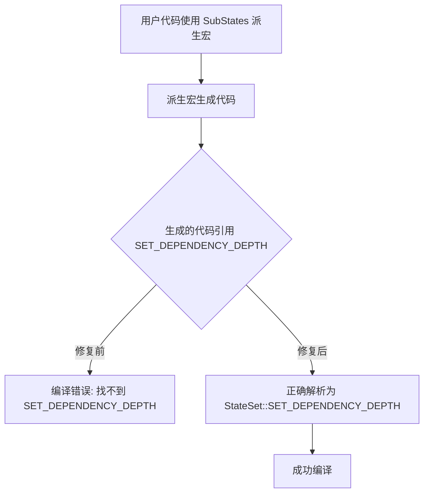

+++
title = "#22929 Fix missing import in SubStates derive macro (#22892)"
date = "2026-02-17T00:00:00"
draft = false
template = "pull_request_page.html"
in_search_index = false

[extra]
current_language = "zh-cn"
available_languages = {"en" = { name = "English", url = "/pull_request/bevy/2026-02/pr-22929-en-20260217" }, "zh-cn" = { name = "中文", url = "/pull_request/bevy/2026-02/pr-22929-zh-cn-20260217" }}
+++

# Fix missing import in SubStates derive macro (#22892)

## 基本信息
- **标题**: Fix missing import in SubStates derive macro (#22892)
- **PR链接**: https://github.com/bevyengine/bevy/pull/22929
- **作者**: Cr0a3
- **状态**: 已合并
- **标签**: C-Bug, S-Ready-For-Final-Review, X-Uncontroversial, D-Straightforward, D-Macros, A-States
- **创建时间**: 2026-02-12T19:00:39Z
- **合并时间**: 2026-02-17T00:26:23Z
- **合并者**: alice-i-cecile

## 描述翻译
### 目标
你好，这个PR修复了 #22892

### 解决方案
我修复了"缺失导入"的错误，通过在处理宏生成的代码中硬编码导入。

### 测试
issue中给出的代码示例现在可以正常编译。

## 这个PR的故事

这个PR解决了一个在Bevy引擎的`SubStates`派生宏中出现的具体编译错误。问题本质上是由于生成的代码中缺少必要的trait约束，导致Rust编译器无法找到`SET_DEPENDENCY_DEPTH`常量。

### 问题与背景

在Bevy的状态系统中，`SubStates`是一个派生宏，允许开发者定义子状态。当开发者尝试使用这个宏时，issue #22892报告了一个编译错误。错误的根本原因是宏生成的代码中尝试访问一个关联常量，但没有指定这个常量定义在哪个trait中。

具体来说，在生成的代码中，`<Self as #trait_path>::SourceStates::SET_DEPENDENCY_DEPTH`这样的表达式假设`SourceStates`类型可以直接访问`SET_DEPENDENCY_DEPTH`常量。然而，实际上`SET_DEPENDENCY_DEPTH`是定义在`StateSet` trait中的关联常量。如果没有明确指定trait路径，Rust编译器无法解析这个引用。

这是一个典型的Rust trait系统问题：当访问关联项（associated item）时，如果类型实现了多个包含同名项的不同trait，或者关联项不是该类型的直接成员，就需要完全限定路径。

### 解决方案

修复方法是修改宏生成的代码，为`SourceStates`类型添加明确的trait约束。具体来说，将`::SET_DEPENDENCY_DEPTH`改为`as #state_set_trait_path>::SET_DEPENDENCY_DEPTH`，其中`#state_set_trait_path`是在宏中已经可用的trait路径。

这个修复确保了编译器能够正确解析`SET_DEPENDENCY_DEPTH`常量的定义位置。通过在宏内部硬编码正确的trait路径，我们避免了用户需要手动导入trait的问题。

### 实现细节

修复只涉及一行代码的修改。关键变化是从直接访问关联常量改为通过完全限定路径访问：

```rust
// 之前：缺少trait约束，导致编译错误
const DEPENDENCY_DEPTH: usize = <Self as #trait_path>::SourceStates::SET_DEPENDENCY_DEPTH + 1;

// 之后：添加了明确的trait约束
const DEPENDENCY_DEPTH: usize = <<Self as #trait_path>::SourceStates as #state_set_trait_path>::SET_DEPENDENCY_DEPTH + 1;
```

这个修改利用了宏中已经可用的`#state_set_trait_path`变量，该变量指向`StateSet` trait。通过`as #state_set_trait_path`部分，我们明确告诉编译器`SET_DEPENDENCY_DEPTH`常量来自哪个trait。

### 技术洞察

这个修复展示了处理宏中一个常见模式：当生成引用其他trait中定义的项的代码时，必须确保这些项的路径是完全限定的。在Rust中，这通常意味着需要：

1. 确保相关trait在作用域中
2. 使用完全限定路径访问关联项

在派生宏中，由于生成的代码将在用户crate的上下文中编译，宏作者需要特别小心确保所有必要的trait都被正确引用。这个PR通过硬编码正确的trait路径解决了问题，这是处理宏中依赖项的常见方法。

### 影响

这个修复的直接影响是：
1. 解决了issue #22892中报告的编译错误
2. 使`SubStates`派生宏能够正确生成代码
3. 保持了API的向后兼容性

从更广泛的角度看，这个修复强调了在编写过程宏时，正确处理trait路径和关联项的重要性。虽然改动很小，但它解决了用户实际遇到的障碍，使`SubStates`功能能够正常工作。

## 可视化表示



## 关键文件修改

### `crates/bevy_state/macros/src/states.rs`
**修改说明**: 修复`SubStates`派生宏中缺失的trait约束，解决编译错误。

**代码修改**:
```rust
// 修改前:
const DEPENDENCY_DEPTH: usize = <Self as #trait_path>::SourceStates::SET_DEPENDENCY_DEPTH + 1;

// 修改后:
const DEPENDENCY_DEPTH: usize = <<Self as #trait_path>::SourceStates as #state_set_trait_path>::SET_DEPENDENCY_DEPTH + 1;
```

**与PR目的的关系**: 这是PR的唯一修改，直接解决了issue中报告的编译错误。通过为`SourceStates`类型添加`as #state_set_trait_path`约束，确保编译器能够正确解析`SET_DEPENDENCY_DEPTH`常量的来源。

## 完整代码差异
```diff
diff --git a/crates/bevy_state/macros/src/states.rs b/crates/bevy_state/macros/src/states.rs
index 841cb3ee426ad..416ae4a9f80ec 100644
--- a/crates/bevy_state/macros/src/states.rs
+++ b/crates/bevy_state/macros/src/states.rs
@@ -124,7 +124,7 @@ pub fn derive_substates(input: TokenStream) -> TokenStream {
         }
 
         impl #impl_generics #state_trait_path for #struct_name #ty_generics #where_clause {
-            const DEPENDENCY_DEPTH : usize = <Self as #trait_path>::SourceStates::SET_DEPENDENCY_DEPTH + 1;
+            const DEPENDENCY_DEPTH : usize = <<Self as #trait_path>::SourceStates as #state_set_trait_path>::SET_DEPENDENCY_DEPTH + 1;
         }
 
         impl #impl_generics #state_mutation_trait_path for #struct_name #ty_generics #where_clause {
```

## 扩展阅读

对于想要了解更多相关概念的读者，建议参考：

1. **Rust官方文档 - 关联项**:
   - https://doc.rust-lang.org/book/ch19-03-advanced-traits.html#specifying-placeholder-types-in-trait-definitions-with-associated-types

2. **Rust官方文档 - 完全限定语法**:
   - https://doc.rust-lang.org/book/ch19-03-advanced-traits.html#fully-qualified-syntax-for-disambiguation-calling-methods-with-the-same-name

3. **Bevy状态系统文档**:
   - https://bevyengine.org/learn/advanced-topics/state/

4. **Rust过程宏指南**:
   - https://doc.rust-lang.org/proc_macro/index.html

5. **相关issue和PR讨论**:
   - 原始issue: #22892
   - 这个PR: #22929