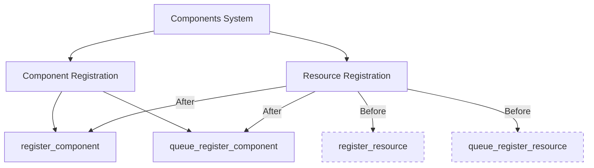

+++
title = "#22930 Remove component/resource redundancies"
date = "2026-02-13T00:00:00"
draft = false
template = "pull_request_page.html"
in_search_index = true

[taxonomies]
list_display = ["show"]

[extra]
current_language = "en"
available_languages = {"en" = { name = "English", url = "/pull_request/bevy/2026-02/pr-22930-en-20260213" }, "zh-cn" = { name = "中文", url = "/pull_request/bevy/2026-02/pr-22930-zh-cn-20260213" }}
labels = ["A-ECS", "C-Code-Quality"]
+++

# Title: Remove component/resource redundancies

## Basic Information
- **Title**: Remove component/resource redundancies
- **PR Link**: https://github.com/bevyengine/bevy/pull/22930
- **Author**: cart
- **Status**: MERGED
- **Labels**: A-ECS, C-Code-Quality
- **Created**: 2026-02-12T22:37:17Z
- **Merged**: 2026-02-13T02:21:26Z
- **Merged By**: cart

## Description Translation
Part of #19731
Follow-up to #22919 and #20934

This consolidates some of our component registration internals and removes some resource / component redundancies there.

## The Story of This Pull Request

This PR addresses technical debt in Bevy's ECS system by unifying the internal handling of components and resources. In Bevy's architecture, resources are essentially components with special storage requirements, but the codebase had accumulated duplicate code paths for handling these two concepts separately. The PR systematically removes these redundancies while maintaining backward compatibility through deprecation warnings.

The core issue was that the ECS system maintained separate registration methods and lookup functions for resources and components, even though both ultimately share the same underlying component ID system. This duplication added complexity, increased maintenance burden, and could lead to inconsistencies. For example, there were methods like `Components::resource_id()` and `Components::component_id()` that performed essentially the same lookup operation but with different names and internal implementations.

The solution approach was straightforward: since resources are just components in Bevy's implementation, the code should treat them uniformly. The implementation involved deprecating resource-specific methods in favor of their component equivalents, updating internal registration logic to use common code paths, and adjusting call sites throughout the codebase to use the unified API.

Looking at the implementation details, several key changes stand out. In `component/info.rs`, the documentation was updated to clarify that `ComponentId` applies to both components and resources. Multiple resource-specific methods were deprecated, with their implementations redirected to the component versions:

```rust
// Before:
pub fn valid_resource_id<T: Resource>(&self) -> Option<ComponentId> {
    self.get_valid_resource_id(TypeId::of::<T>())
}

// After:
#[deprecated(since = "0.19.0", note = "use valid_component_id")]
pub fn valid_resource_id<T: Resource>(&self) -> Option<ComponentId> {
    self.get_valid_id(TypeId::of::<T>())
}
```

In `component/register.rs`, the registration system was simplified by removing the distinction between component and resource registration. The `register_arbitrary_resource` method was eliminated entirely since it duplicated the functionality of `register_arbitrary_component`. The `queue_register_resource` method was deprecated and now simply calls `queue_register_component`:

```rust
#[deprecated(since = "0.19.0", note = "use queue_register_component")]
pub fn queue_register_resource<T: Resource>(&self) -> ComponentId {
    self.queue_register_component::<T>()
}
```

The PR also addressed function pointer types in the registration system. Previously, registration functions were stored as `Box<dyn FnOnce(...)>`, but this was changed to use simple function pointers (`fn(...)`), reducing heap allocations and improving performance for a common use case.

Throughout the codebase, numerous call sites were updated to use the component-oriented API. For example, in `world/mod.rs`, methods like `resource_id()` were deprecated and their implementations redirected to `component_id()`. This pattern was consistently applied across multiple modules including `query/mod.rs`, `system/mod.rs`, `world/filtered_resource.rs`, and others.

The impact of these changes is primarily improved code maintainability and reduced cognitive overhead for developers working on the ECS system. By eliminating duplicate code paths, the system becomes easier to understand, debug, and extend. The performance impact is minimal but positive due to the removal of unnecessary abstractions and heap allocations in the registration system.

From an engineering perspective, this PR demonstrates a common pattern in mature codebases: identifying and eliminating duplication that emerges as architectural understanding evolves. The gradual approach with deprecation warnings ensures existing code continues to work while guiding developers toward the new, unified API.

## Visual Representation



## Key Files Changed

### `crates/bevy_ecs/src/component/info.rs` (+8/-6)
This file contains the core definitions for component IDs and metadata. The changes clarify that `ComponentId` applies to both components and resources, and deprecates resource-specific lookup methods in favor of their component equivalents.

Key changes:
```rust
// Updated documentation to include resources
- /// Given a type `T` which implements [`Component`], the `ComponentId` for `T` can be retrieved
- /// from a `World` using [`World::component_id()`](crate::world::World::component_id) or via [`Components::component_id()`].
- /// Access to the `ComponentId` for a [`Resource`] is available via [`Components::resource_id()`].
+ /// Given a type `T` which implements [`Component`] (including [`Resource`]), the `ComponentId` for `T` can be retrieved
+ /// from a `World` using [`World::component_id()`](crate::world::World::component_id) or via [`Components::component_id()`].

// Deprecated resource-specific methods
#[deprecated(since = "0.19.0", note = "use valid_component_id")]
pub fn valid_resource_id<T: Resource>(&self) -> Option<ComponentId> {
    self.get_valid_id(TypeId::of::<T>())
}
```

### `crates/bevy_ecs/src/component/register.rs` (+19/-61)
This file handles component registration. The changes remove duplicate registration paths for resources and components, simplifying the code by using function pointers instead of boxed closures.

Key changes:
```rust
// Changed from boxed closures to function pointers
- pub(super) registrator: Box<dyn FnOnce(&mut ComponentsRegistrator, ComponentId, ComponentDescriptor)>,
+ pub(super) registrator: fn(&mut ComponentsRegistrator, ComponentId, ComponentDescriptor),

// Deprecated queue_register_resource in favor of queue_register_component
#[deprecated(since = "0.19.0", note = "use queue_register_component")]
pub fn queue_register_resource<T: Resource>(&self) -> ComponentId {
    self.queue_register_component::<T>()
}
```

### `crates/bevy_ecs/src/world/mod.rs` (+12/-11)
This file contains the World API. The changes deprecate resource-specific ID methods and update internal implementations to use component methods.

Key changes:
```rust
// Deprecated World::resource_id in favor of component_id
#[deprecated(since = "0.19.0", note = "use component_id")]
pub fn resource_id<T: Resource>(&self) -> Option<ComponentId> {
    self.components.get_id(TypeId::of::<T>())
}

// Updated internal implementations to use component methods
- let resource_id = self.resource_id::<R>()?;
+ let resource_id = self.component_id::<R>()?;
```

### `crates/bevy_ecs/src/world/filtered_resource.rs` (+5/-5)
This file handles filtered resource access. The changes update resource ID lookups to use component methods.

Key changes:
```rust
// Updated from resource_id to component_id
- let component_id = self.world.components().resource_id::<R>();
+ let component_id = self.world.components().component_id::<R>();
```

### `crates/bevy_ecs/src/lib.rs` (+2/-8)
Updated test code to use the new unified API, demonstrating the migration pattern.

Key changes:
```rust
// Updated test to use get_id instead of get_resource_id
- let resource_id = world.components().get_resource_id(TypeId::of::<Num>()).unwrap();
+ let resource_id = world.components().get_id(TypeId::of::<Num>()).unwrap();
```

## Further Reading

1. **Bevy ECS Documentation**: https://bevyengine.org/learn/ecs/
2. **Component vs Resource in Bevy**: Understanding the architectural decision to implement resources as components
3. **Rust Deprecation Patterns**: Best practices for API evolution in Rust libraries
4. **Function Pointers vs Trait Objects**: Performance characteristics and use cases in systems programming
5. **Code Duplication Elimination**: Refactoring techniques for removing redundant code paths in large codebases

# Full Code Diff
*(Provided in the original request, not repeated here for brevity)*