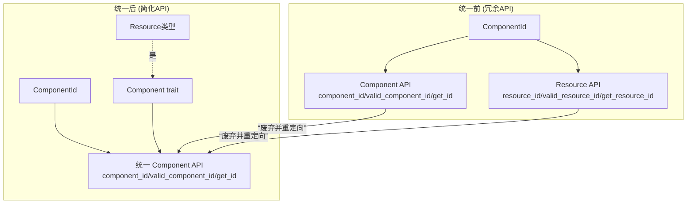

+++
title = "#22930 Remove component/resource redundancies"
date = "2026-02-13T00:00:00"
draft = false
template = "pull_request_page.html"
in_search_index = false

[extra]
current_language = "zh-cn"
available_languages = {"en" = { name = "English", url = "/pull_request/bevy/2026-02/pr-22930-en-20260213" }, "zh-cn" = { name = "中文", url = "/pull_request/bevy/2026-02/pr-22930-zh-cn-20260213" }}
+++

# Remove component/resource redundancies

## 基本信息
- **标题**: Remove component/resource redundancies
- **PR链接**: https://github.com/bevyengine/bevy/pull/22930
- **作者**: cart
- **状态**: 已合并
- **标签**: A-ECS, C-Code-Quality
- **创建时间**: 2026-02-12T22:37:17Z
- **合并时间**: 2026-02-13T02:21:26Z
- **合并者**: cart

## 描述翻译
属于 #19731 的一部分
是 #22919 和 #20934 的后续工作

这整合了我们的一些组件注册内部逻辑，并消除了其中存在的一些资源/组件冗余。

## 这个Pull Request的故事

这个PR是Bevy引擎Entity Component System（ECS）核心代码库持续清理和统一工作的一部分。其目标是解决组件和资源在底层标识与注册API上的历史性冗余。

**问题的根源**

在Bevy ECS中，资源和组件在概念和实现上有着紧密的联系。简单来说，一个`Resource`就是一种特殊的`Component`，它被存储在一个特定的、全局的Entity上，而不是与许多Entity关联。从实现角度看，`Resource` trait是`Component` trait的子trait。这意味着所有`Resource`类型在运行时都被系统视为`Component`，并共享相同的底层标识符——`ComponentId`。

尽管存在这种内在的统一，但在Bevy 0.19版本之前的API中，资源和组件却有两套平行的接口。例如，要获取一个类型的`ComponentId`，你可以调用`Components::component_id()`（针对组件）或`Components::resource_id()`（针对资源）。同样，也存在`valid_component_id`和`valid_resource_id`、`get_id`和`get_resource_id`等成对的方法。这种重复不仅增加了API的复杂性，也增加了维护负担，并且可能使新用户感到困惑。

**解决方案：统一API**

这个PR的主要策略是废弃所有专门用于资源的、重复的标识符获取和注册方法，并引导用户使用统一的组件API。由于`Resource`就是`Component`，用`component_id()`来获取资源的ID是完全合理且正确的。这样做简化了心智模型：你只需要考虑“组件ID”，而不用再区分“组件ID”和“资源ID”。

具体的做法是：
1.  **标记废弃**：将所有专门的资源方法（如`resource_id`、`valid_resource_id`）标记为`#[deprecated]`，并指向其对应的通用组件方法。
2.  **内部重构**：更新引擎内部所有调用这些废弃方法的地方，改为使用统一的组件方法。
3.  **清理注册逻辑**：统一组件和资源的注册路径，移除为资源定制的冗余注册函数。

让我们看一个核心的修改，它反映了这种哲学上的转变。在 `crates/bevy_ecs/src/component/info.rs` 中，`ComponentId` 的文档被更新，明确指出它同样适用于 `Resource`：

```rust
-/// Given a type `T` which implements [`Component`], the `ComponentId` for `T` can be retrieved
+/// Given a type `T` which implements [`Component`] (including [`Resource`]), the `ComponentId` for `T` can be retrieved
 /// from a `World` using [`World::component_id()`](crate::world::World::component_id) or via [`Components::component_id()`].
-/// Access to the `ComponentId` for a [`Resource`] is available via [`Components::resource_id()`].
```

这个文档变更清晰地传达了新的统一概念。

**实现细节与简化**

这个PR不仅改变了公开API，也清理了内部实现。最大的改动发生在 `crates/bevy_ecs/src/component/register.rs` 中。之前，组件的排队注册和资源的排队注册有不同的内部函数（`register_arbitrary_component` 和 `register_arbitrary_resource`）。实际上，它们的逻辑几乎相同，都是将一个注册任务推入队列。

PR删除了`register_arbitrary_resource`函数，并将其所有调用替换为对`register_arbitrary_component`的调用。此外，它还将注册回调函数的类型从 `Box<dyn FnOnce(...)>` 简化为了简单的函数指针 (`fn(...)`)。这是一个重要的内部优化，因为它消除了动态分配和trait对象带来的开销，使得回调更轻量、更高效。

```rust
-    pub(super) registrator: Box<dyn FnOnce(&mut ComponentsRegistrator, ComponentId, ComponentDescriptor)>,
+    pub(super) registrator: fn(&mut ComponentsRegistrator, ComponentId, ComponentDescriptor),
```

类似地，`queue_register_resource`方法被简单重定向到`queue_register_component`：
```rust
    #[inline]
    #[deprecated(since = "0.19.0", note = "use queue_register_component")]
    pub fn queue_register_resource<T: Resource>(&self) -> ComponentId {
        self.queue_register_component::<T>()
    }
```

**影响与意义**

这个PR的影响是广泛的，但又是渐进式的。它通过废弃API而非立即移除，为现有用户提供了平滑的迁移路径。开发者会收到编译警告，提示他们将`resource_id()`改为`component_id()`。这种更改通常是机械式的，但能使代码与Bevy ECS更统一的心智模型保持一致。

从代码库健康度来看，这次修改带来了多重好处：
1.  **减少认知负荷**：开发者现在只需记住一套用于获取ID的方法。
2.  **减少代码体积**：删除了大量重复的函数实现和文档。
3.  **提高内部一致性**：简化了注册机制的内部状态机。
4.  **为未来铺路**：这是迈向更统一、更灵活的ECS核心的又一步（如 #19731 所规划）。

这次清理也凸显了一个重要的软件工程原则：当底层抽象统一时，应尽可能在API层面也反映这种统一，以避免不必要的概念重复和“陷阱门”（trap doors）。

## 可视化表示



## 关键文件变更

1.  **`crates/bevy_ecs/src/component/info.rs`** (+8/-6)
    *   **变更描述**：更新了`ComponentId`的文档，明确指出它也适用于`Resource`。将多个专门用于资源的方法标记为废弃，并重定向到其对应的通用组件方法。
    *   **关键代码片段**：
        ```rust
        // 文档更新，反映ComponentId对资源和组件的统一适用性
        /// Given a type `T` which implements [`Component`] (including [`Resource`]), the `ComponentId` for `T` can be retrieved
        
        // 方法废弃示例
        #[deprecated(since = "0.19.0", note = "use get_valid_id")]
        pub fn get_valid_resource_id(&self, type_id: TypeId) -> Option<ComponentId> {
            self.indices.get(&type_id).copied()
        }
        
        #[deprecated(since = "0.19.0", note = "use valid_component_id")]
        pub fn valid_resource_id<T: Resource>(&self) -> Option<ComponentId> {
            self.get_valid_id(TypeId::of::<T>()) // 直接调用通用方法
        }
        ```
    *   **与PR目标的关联**：这是统一API概念的核心体现，通过文档和方法重定向引导用户使用单一接口。

2.  **`crates/bevy_ecs/src/component/register.rs`** (+19/-61)
    *   **变更描述**：大幅简化了排队注册的内部机制。删除了专门处理资源的`register_arbitrary_resource`函数，统一使用`register_arbitrary_component`。将回调类型从`Box<dyn FnOnce>`优化为函数指针(`fn`)。废弃了`queue_register_resource`方法。
    *   **关键代码片段**：
        ```rust
        // 回调类型从堆分配的trait对象简化为函数指针
        -    pub(super) registrator: Box<dyn FnOnce(&mut ComponentsRegistrator, ComponentId, ComponentDescriptor)>,
        +    pub(super) registrator: fn(&mut ComponentsRegistrator, ComponentId, ComponentDescriptor),
        
        // 删除冗余的注册函数，统一入口
        -    unsafe fn register_arbitrary_resource(...) { ... }
        // 所有调用点改为使用 register_arbitrary_component
        ```
    *   **与PR目标的关联**：这是消除内部冗余、统一注册流程和进行性能微优化的关键。

3.  **`crates/bevy_ecs/src/world/mod.rs`** (+12/-11)
    *   **变更描述**：更新`World`的方法，使其内部实现也使用统一的组件标识符API。例如，`World::resource_id()`被标记为废弃并重定向到`component_id()`。
    *   **关键代码片段**：
        ```rust
        #[deprecated(since = "0.19.0", note = "use component_id")]
        pub fn resource_id<T: Resource>(&self) -> Option<ComponentId> {
            self.components.get_id(TypeId::of::<T>()) // 使用通用的 get_id
        }
        
        // 内部使用也改为统一方法
        pub fn remove_resource<R: Resource>(&mut self) -> Option<R> {
            - let resource_id = self.resource_id::<R>()?;
            + let resource_id = self.component_id::<R>()?; // 使用 component_id
        }
        ```
    *   **与PR目标的关联**：确保`World`这一主要用户接口也与新的统一API保持一致。

4.  **`crates/bevy_ecs/src/world/filtered_resource.rs`** (+5/-5)
    *   **变更描述**：将`FilteredResources`和`FilteredResourcesMut`中检查资源访问权限的方法调用从`resource_id`/`valid_resource_id`更新为`component_id`/`valid_component_id`。
    *   **与PR目标的关联**：更新特定模块以使用新的统一API，保持整个代码库的一致性。

5.  **`release-content/migration-guides/resources_as_components.md`**
    *   **变更描述**：更新了迁移指南，记录了所有被废弃的API及其替代方法。这是帮助用户从旧API过渡的关键文档。
    *   **与PR目标的关联**：提供正式的用户 facing 文档，说明如何迁移代码以适配此PR引入的变更。

## 进一步阅读

*   **PR #19731**: [RFC: Unify Resources and Components](https://github.com/bevyengine/bevy/pull/19731) - 这项长期工作的总纲，阐述了统一资源和组件的愿景。
*   **PR #22919**: 本PR的直接前驱，可能包含相关的底层重构。
*   **PR #20934**: 另一个相关的清理或统一工作。
*   **Bevy官方文档 - ECS部分**：了解Bevy ECS的核心概念，包括`Component`、`Resource`和`World`。