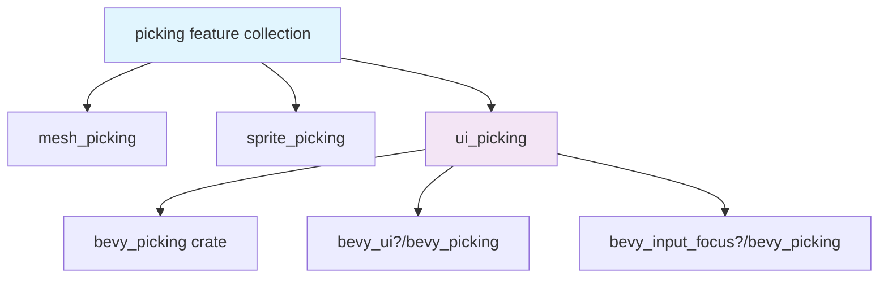

+++
title = "#22933 Condense bevy_picking (input focus) feature into bevy_ui_picking feature"
date = "2026-02-17T00:00:00"
draft = false
template = "pull_request_page.html"
in_search_index = true

[taxonomies]
list_display = ["show"]

[extra]
current_language = "en"
available_languages = {"en" = { name = "English", url = "/pull_request/bevy/2026-02/pr-22933-en-20260217" }, "zh-cn" = { name = "中文", url = "/pull_request/bevy/2026-02/pr-22933-zh-cn-20260217" }}
labels = ["A-UI", "C-Usability", "M-Migration-Guide", "X-Contentious", "D-Straightforward", "A-Picking"]
+++

# Title: Condense bevy_picking (input focus) feature into bevy_ui_picking feature

## Basic Information
- **Title**: Condense bevy_picking (input focus) feature into bevy_ui_picking feature
- **PR Link**: https://github.com/bevyengine/bevy/pull/22933
- **Author**: alice-i-cecile
- **Status**: MERGED
- **Labels**: A-UI, C-Usability, S-Ready-For-Final-Review, M-Migration-Guide, X-Contentious, D-Straightforward, A-Picking
- **Created**: 2026-02-13T01:36:56Z
- **Merged**: 2026-02-17T01:47:20Z
- **Merged By**: alice-i-cecile

## Description Translation

# Objective

The feature flags "bevy_picking" and "picking" have the same description despite fulfilling different goals. This is very confusing!

Fixes #22931.

The status quo before this PR.

> - picking is a feature collection in bevy, which enables ["bevy_picking", "mesh_picking", "sprite_picking", "ui_picking"].
> - the ui feature collection enables picking itself
> - bevy_picking is defined in bevy, which defers to ["bevy_internal/bevy_picking"]
> - in bevy_internal, this toggles bevy_picking = ["dep:bevy_picking", "bevy_input_focus?/bevy_picking"]
> - this then toggles the bevy_picking dependency (apparently that works as if it were a feature?) in bevy_input_focus
> - which is ultimately used to enable mouse / virtual cursor based input focus selection
> - @viridia is concerned about making this mandatory because of worries about observer overhead

## Solution

Condense bevy_picking at the bevy_internal level into bevy_ui_picking. There's no way someone wants general UI picking but not input focus picking. This fixes the redundancy, and groups functionality more reasonably, while still making it possible to avoid UI picking as a whole off if you're concerned for whatever reason.

Users who want even more granularity than that can of course compose the various Bevy crates however they please.

## Alternative

1. Keep this feature around, renaming it to `input_focus_picking`.
2. Enable that feature inside of `ui_picking`.

This adds another niche feature flag at the top level, but makes it easier for users who want to use `bevy_input_focus` without `bevy_ui`. I have never met such a user, but maybe they exist!

## The Story of This Pull Request

This PR addresses a confusing feature flag situation in Bevy's picking system. The core issue was that the `bevy_picking` feature flag and the `picking` feature collection had identical descriptions but served different purposes, creating confusion for developers trying to understand and use the picking functionality.

Before this change, the feature hierarchy was complex and redundant. The `picking` collection enabled four features: `bevy_picking`, `mesh_picking`, `sprite_picking`, and `ui_picking`. However, `bevy_picking` itself didn't provide general picking functionality - it specifically enabled mouse/virtual cursor input focus selection through the `bevy_input_focus` crate. This distinction wasn't clear from the feature descriptions.

The developer recognized that this confusion needed resolution. The `bevy_picking` feature was essentially a specialized component that only made sense in the context of UI picking - specifically for input focus selection. It didn't make logical sense for someone to want UI picking capabilities but not input focus picking, since input focus is a fundamental aspect of UI interaction.

The solution implemented consolidates the `bevy_picking` functionality into the `bevy_ui_picking` feature. This approach simplifies the feature structure by eliminating the redundant top-level `bevy_picking` feature while maintaining the same functionality. The `ui_picking` feature now includes the input focus picking capability directly:

```toml
# From crates/bevy_internal/Cargo.toml
ui_picking = [
  "bevy_picking",
  "bevy_ui?/bevy_picking",
  "bevy_input_focus?/bevy_picking",
]
```

This change required updates in multiple places. The root `Cargo.toml` no longer lists `bevy_picking` as a standalone feature or as part of the `picking` collection. Examples that previously depended on `bevy_picking` were updated to use `ui_picking` instead, since they needed UI interaction capabilities.

The technical implementation demonstrates an understanding of Cargo's feature system. The `?` syntax in `bevy_input_focus?/bevy_picking` means the `bevy_picking` feature from `bevy_input_focus` is only enabled if the `bevy_input_focus` dependency itself is enabled (through the `?` conditional). This maintains flexibility while reducing complexity.

An alternative approach considered was renaming `bevy_picking` to `input_focus_picking` and keeping it as a separate feature. This would have made the purpose clearer but would have added another niche feature flag. The chosen approach simplifies the API surface while preserving the necessary functionality.

The PR also includes a migration guide that clearly explains the change and provides guidance for users who might have unusual requirements, such as wanting input focus picking without UI picking. These users can add `bevy_input_focus` as a separate dependency and enable its `bevy_picking` feature directly.

The changes are relatively small but address a significant usability issue. By consolidating related features and eliminating redundancy, the PR makes Bevy's picking system more intuitive and maintainable. The fact that this was labeled as "contentious" suggests there were different perspectives on the best approach, but the final solution represents a reasonable balance between simplicity and flexibility.

## Visual Representation



## Key Files Changed

### `Cargo.toml` (+3/-6)
This file contains the root-level feature definitions for the Bevy crate.

```toml
# Before:
picking = ["bevy_picking", "mesh_picking", "sprite_picking", "ui_picking"]
# ... 
# Provides picking functionality
bevy_picking = ["bevy_internal/bevy_picking"]

# After:
picking = ["mesh_picking", "sprite_picking", "ui_picking"]
# (bevy_picking feature definition removed)
```

The `picking` feature collection no longer includes `bevy_picking`, and the standalone `bevy_picking` feature is completely removed. Two examples are updated to use `ui_picking` instead of `bevy_picking` since they need UI interaction capabilities.

### `crates/bevy_internal/Cargo.toml` (+5/-4)
This file defines the internal feature structure.

```toml
# Before:
# Provides picking functionality
bevy_picking = ["dep:bevy_picking", "bevy_input_focus?/bevy_picking"]

# Provides a UI picking backend
ui_picking = ["bevy_picking", "bevy_ui?/bevy_picking"]

# After:
# (bevy_picking feature removed entirely)

# Provides a UI picking backend
ui_picking = [
  "bevy_picking",
  "bevy_ui?/bevy_picking",
  "bevy_input_focus?/bevy_picking",
]
```

The `bevy_picking` feature is removed, and its functionality (specifically the `bevy_input_focus?/bevy_picking` dependency) is moved into the `ui_picking` feature.

### `docs/cargo_features.md` (+1/-2)
Documentation updates to reflect the changes.

```markdown
# Before:
|picking|Enables picking functionality. **Feature set:** `bevy_picking`, `mesh_picking`, `sprite_picking`, `ui_picking`.|

# After:
|picking|Enables picking functionality. **Feature set:** `mesh_picking`, `sprite_picking`, `ui_picking`.|
```

The documentation is updated to remove references to the `bevy_picking` feature in both the picking collection description and the individual feature list.

### `release-content/migration-guides/bevy_picking_feature.md` (+12/-0)
A new migration guide explains the change and provides guidance for users.

```markdown
---
title: "`bevy_picking` feature flag removed"
pull_requests: [22933]
---

The `bevy/bevy_picking` feature flag has been removed. This previously enabled picking functionality in `bevy_input_focus`,
allowing users to select elements to focus using their mouse.

This is now exposed as part of the existing `bevy/bevy_ui_picking` feature, which is itself part of the `ui` feature collection.
In most cases, you should add the `ui` feature collection to your project if you are using `bevy_ui`.

If you want to enable `bevy_input_focus`'s picking functionality, but do *not* want to use `bevy_ui`, add a separate dependency to the same version of `bevy_input_focus` in your project and enable the optional `bevy_picking` feature there.
```

This guide provides clear instructions for users affected by the change, including edge cases where someone might want input focus picking without UI picking.

## Further Reading

1. [Cargo Features Documentation](https://doc.rust-lang.org/cargo/reference/features.html) - Official Rust documentation on Cargo's feature system
2. [Bevy's Feature Flags Guide](https://bevyengine.org/learn/quick-start/features/) - Bevy's official documentation on using feature flags
3. [Conditional Feature Dependencies in Cargo](https://doc.rust-lang.org/cargo/reference/features.html#dependency-features) - How to use the `?` syntax for conditional feature dependencies
4. [Bevy Picking System](https://github.com/bevyengine/bevy/tree/main/crates/bevy_picking) - The bevy_picking crate repository for understanding the underlying implementation