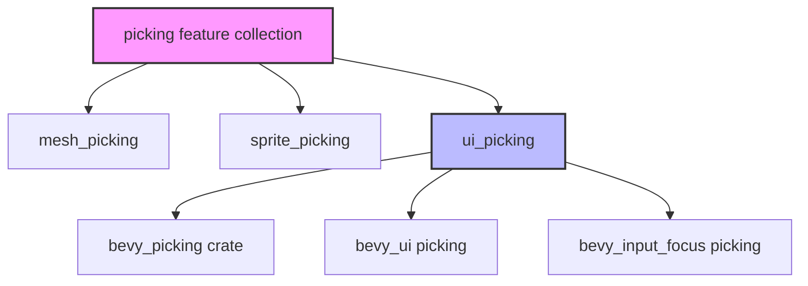

+++
title = "#22933 Condense bevy_picking (input focus) feature into bevy_ui_picking feature"
date = "2026-02-17T00:00:00"
draft = false
template = "pull_request_page.html"
in_search_index = false

[extra]
current_language = "zh-cn"
available_languages = {"en" = { name = "English", url = "/pull_request/bevy/2026-02/pr-22933-en-20260217" }, "zh-cn" = { name = "中文", url = "/pull_request/bevy/2026-02/pr-22933-zh-cn-20260217" }}
labels = ["A-UI", "C-Usability", "M-Migration-Guide", "X-Contentious", "D-Straightforward", "A-Picking"]
+++

# Condense bevy_picking (input focus) feature into bevy_ui_picking feature

## Basic Information
- **Title**: Condense bevy_picking (input focus) feature into bevy_ui_picking feature
- **PR Link**: https://github.com/bevyengine/bevy/pull/22933
- **Author**: alice-i-cecile
- **Status**: MERGED
- **Labels**: A-UI, C-Usability, S-Ready-For-Final-Review, M-Migration-Guide, X-Contentious, D-Straightforward, A-Picking
- **Created**: 2026-02-13T01:36:56Z
- **Merged**: 2026-02-17T01:47:20Z
- **Merged By**: alice-i-cecile

## Description Translation
这个PR解决了特性标记"bevy_picking"和"picking"描述相同但功能不同的问题，这非常令人困惑！

修复 #22931。

在本次PR之前的状态：
- picking是bevy中的一个特性集合，启用["bevy_picking", "mesh_picking", "sprite_picking", "ui_picking"]
- ui特性集合启用了picking本身
- bevy_picking在bevy中定义，委托到["bevy_internal/bevy_picking"]
- 在bevy_internal中，这切换了bevy_picking = ["dep:bevy_picking", "bevy_input_focus?/bevy_picking"]
- 然后这切换了bevy_picking依赖（看起来像是特性？）在bevy_input_focus中
- 最终用于启用基于鼠标/虚拟光标输入焦点选择
- @viridia担心因为观察者开销的问题而使其成为必需

解决方案：
在bevy_internal层级将bevy_picking压缩到bevy_ui_picking中。没有人会想要通用的UI选取功能但不想要输入焦点选取功能。这修复了冗余问题，更合理地分组功能，同时仍然允许出于任何原因避免整个UI选取功能。

需要更细粒度控制的用户可以按需组合各种Bevy crate。

替代方案：
1. 保留此特性，将其重命名为`input_focus_picking`
2. 在`ui_picking`中启用该特性

这会在顶层添加另一个小众特性标记，但使想要使用`bevy_input_focus`而不使用`bevy_ui`的用户更容易。我从未见过这样的用户，但也许他们存在！

## The Story of This Pull Request

这个PR的核心问题是Bevy中picking功能相关的特性标记存在混淆和冗余。在现有的架构中，有两个名为"picking"的实体：一个是特性集合（feature collection），另一个是具体的特性（feature）。虽然它们的描述相同，但功能却不同，这给开发者带来了理解和使用上的困难。

问题的根源在于特性依赖链的复杂性。在顶层，`picking`特性集合包含了四个组件：`bevy_picking`、`mesh_picking`、`sprite_picking`和`ui_picking`。但`bevy_picking`本身并不是一个具体的实现，而是一个转发到内部模块的标记。在`bevy_internal`中，`bevy_picking`特性实际上控制的是`bevy_input_focus` crate中的鼠标/虚拟光标输入焦点选择功能。这种多层间接导致功能边界不清晰。

从工程角度看，这里存在一个设计上的不一致性：`bevy_picking`特性实际上控制的是输入焦点功能，但用户可能期望它控制的是通用的picking功能。同时，`ui_picking`特性已经包含了UI元素的picking功能，将输入焦点picking功能合并到其中是逻辑上更合理的，因为UI picking自然需要处理输入焦点。

开发者采取了一个直接而实用的解决方案：将`bevy_picking`特性从顶层移除，并将其功能整合到`ui_picking`特性中。这样做有以下几个技术理由：

1. **功能逻辑分组**：UI picking和输入焦点picking在功能上是紧密相关的。当用户需要UI picking时，几乎总是需要输入焦点功能。
2. **简化特性树**：减少特性数量可以降低认知负担和维护成本。
3. **保持灵活性**：如果用户确实需要输入焦点功能而不需要UI，仍然可以通过直接依赖`bevy_input_focus` crate并启用其`bevy_picking`特性来实现。

这个重构涉及多个层面的修改。在顶层`Cargo.toml`中，`picking`特性集合不再包含`bevy_picking`，因为该特性被移除了。同时，相关的示例需要更新其特性依赖。在`bevy_internal/Cargo.toml`中，`bevy_picking`特性的定义被完全移除，其功能被整合到`ui_picking`特性中：

```toml
# Before:
bevy_picking = ["dep:bevy_picking", "bevy_input_focus?/bevy_picking"]
ui_picking = ["bevy_picking", "bevy_ui?/bevy_picking"]

# After:
ui_picking = [
  "bevy_picking",
  "bevy_ui?/bevy_picking",
  "bevy_input_focus?/bevy_picking",
]
```

这种修改使得`ui_picking`特性现在不仅包含了基本的picking功能和UI相关的picking，还包含了输入焦点功能。这反映了这些功能在实际使用中的紧密耦合关系。

文档也需要相应更新。特性文档现在正确反映了`picking`特性集合只包含三个具体的picking后端，而不是四个。同时，为了帮助用户迁移，添加了一个迁移指南，明确说明了`bevy_picking`特性被移除，并指导用户如何迁移他们的代码。

从技术实现的角度看，这个PR展示了几个重要的工程实践：
1. **特性设计的清晰性原则**：每个特性应该有明确的、单一的责任
2. **减少不必要的抽象层**：当间接层不提供实际价值时，应该考虑简化
3. **向后兼容性处理**：通过迁移指南帮助用户理解变化并适应

这个改变也引发了一个关于权衡的讨论：是保持更细粒度的控制（保留`bevy_picking`作为独立特性）还是提供更简化的体验（将其合并到`ui_picking`中）。最终决策选择了简化，这反映了Bevy项目在易用性和灵活性之间的平衡考虑。对于确实需要更细粒度控制的用户，仍然可以通过直接依赖相关crate来实现他们的需求。

## Visual Representation



## Key Files Changed

### 1. `Cargo.toml` (+3/-6)
这个文件包含了顶层的特性定义和示例的配置。主要修改包括：
- 从`picking`特性集合中移除了`bevy_picking`
- 移除了`bevy_picking`特性的定义
- 更新了两个示例的`required-features`，从`bevy_picking`改为`ui_picking`

```toml
# Before:
picking = ["bevy_picking", "mesh_picking", "sprite_picking", "ui_picking"]

# Provides picking functionality
bevy_picking = ["bevy_internal/bevy_picking"]

# After:
picking = ["mesh_picking", "sprite_picking", "ui_picking"]
```

```toml
# Before example configuration:
required-features = ["bevy_picking", "sprite_picking"]

# After example configuration:
required-features = ["ui_picking", "sprite_picking"]
```

### 2. `crates/bevy_internal/Cargo.toml` (+5/-4)
这是核心的修改文件，重新组织了picking特性的依赖关系：
- 移除了`bevy_picking`特性的定义
- 在`ui_picking`特性中添加了`bevy_input_focus?/bevy_picking`依赖

```toml
# Before:
# Provides picking functionality
bevy_picking = ["dep:bevy_picking", "bevy_input_focus?/bevy_picking"]

# Provides a UI picking backend
ui_picking = ["bevy_picking", "bevy_ui?/bevy_picking"]

# After:
# Provides a UI picking backend
ui_picking = [
  "bevy_picking",
  "bevy_ui?/bevy_picking",
  "bevy_input_focus?/bevy_picking",
]
```

### 3. `docs/cargo_features.md` (+1/-2)
更新了特性文档以反映新的结构：
- 更新了`picking`特性集合的描述，移除了`bevy_picking`
- 从特性列表中移除了`bevy_picking`条目

```markdown
# Before:
|picking|Enables picking functionality. **Feature set:** `bevy_picking`, `mesh_picking`, `sprite_picking`, `ui_picking`.|

# After:
|picking|Enables picking functionality. **Feature set:** `mesh_picking`, `sprite_picking`, `ui_picking`.|
```

### 4. `release-content/migration-guides/bevy_picking_feature.md` (+12/-0)
新增了迁移指南，帮助用户适应这个变化：

```markdown
---
title: "`bevy_picking` feature flag removed"
pull_requests: [22933]
---

The `bevy/bevy_picking` feature flag has been removed. This previously enabled picking functionality in `bevy_input_focus`,
allowing users to select elements to focus using their mouse.

This is now exposed as part of the existing `bevy/bevy_ui_picking` feature, which is itself part of the `ui` feature collection.
In most cases, you should add the `ui` feature collection to your project if you are using `bevy_ui`.

If you want to enable `bevy_input_focus`'s picking functionality, but do *not* want to use `bevy_ui`, add a separate dependency to the same version of `bevy_input_focus` in your project and enable the optional `bevy_picking` feature there.
```

## Further Reading

1. [Cargo Features Documentation](https://doc.rust-lang.org/cargo/reference/features.html) - 了解Cargo特性系统的工作原理
2. [Bevy Picking System](https://github.com/bevyengine/bevy/tree/main/crates/bevy_picking) - 了解Bevy的picking系统实现
3. [Feature Flag Best Practices](https://martinfowler.com/articles/feature-toggles.html) - Martin Fowler关于特性标记的经典文章
4. [Bevy Cargo Features Guide](https://bevyengine.org/learn/quick-start/features/) - Bevy官方关于特性使用的指南