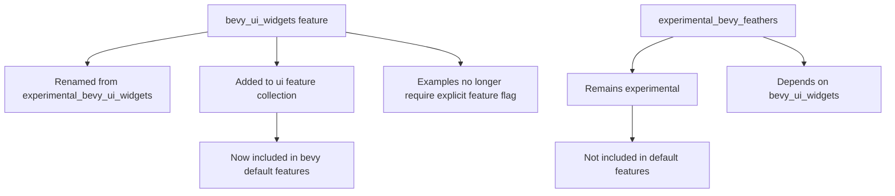

+++
title = "#22934 Remove `experimental` designation from `bevy_ui_widgets` feature flag"
date = "2026-02-18T00:00:00"
draft = false
template = "pull_request_page.html"
in_search_index = true

[taxonomies]
list_display = ["show"]

[extra]
current_language = "en"
available_languages = {"en" = { name = "English", url = "/pull_request/bevy/2026-02/pr-22934-en-20260218" }, "zh-cn" = { name = "中文", url = "/pull_request/bevy/2026-02/pr-22934-zh-cn-20260218" }}
labels = ["A-UI", "X-Blessed", "D-Straightforward"]
+++

# Title

## Basic Information
- **Title**: Remove `experimental` designation from `bevy_ui_widgets` feature flag
- **PR Link**: https://github.com/bevyengine/bevy/pull/22934
- **Author**: alice-i-cecile
- **Status**: MERGED
- **Labels**: A-UI, S-Ready-For-Final-Review, X-Blessed, D-Straightforward
- **Created**: 2026-02-13T02:11:37Z
- **Merged**: 2026-02-18T21:51:41Z
- **Merged By**: alice-i-cecile

## Description Translation

# Objective

`bevy_ui_widgets is still incomplete and unstable, but the utility of the `experimental` designation is questionable:

1. Running examples with required non-default features suck. This is frustrating for UI examples, and hampers adoption in our other examples even when real UI-based controls would be more elegant.
2. These widgets have proven useful to end users in practice, even in 0.19.
3. These widgets have seen a number of small bug fixes and improvements since their initial release.
4. It's not clear that this label is effective for slowing adoption, or if slowing adoption is currently desirable. Users don't have a ton of other great options: writing their own widgets will waste work *and* still need to be rewritten with BSN.
5. Bevy as a whole is still quite experimental. Unlike e.g. ghost nodes, there's no indication that we are considering wholly reverting these features.

## Solution

Amended based on review feedback:

> The `experimental_ui_widgets`  feature have been renamed to `ui_widgets`.
>
> The `ui_widgets` feature has been added to the `ui` feature collection (and thus `bevy`'s default features) for ease of use.

Previous solution, from the original migration guide:

> The `experimental_ui_widgets` and `experimental_bevy_feathers` features have been renamed to `ui_widgets` and `bevy_feathers` respectively.
>
> The `ui_widgets` feature has been added to the `ui` feature collection (and thus `bevy`'s default features) for ease of use.
> The `bevy_feathers` feature remains off by default: it is primarily intended for use in dev tools, and should typically not be included in shipped end-user applications. As a result, it needs to be easy to enable and disable conditionally. This would be very challenging if it were a default feature or in a popular feature collection.
> 
> These crates remain immature, and subject to heavy breaking changes, even relative to Bevy's pre-1.0 standards.
> However, they are useful enough to see wider adoption, and this changes substantially improves the user experience when setting up new projects and running Bevy examples.

## The Story of This Pull Request

This PR addresses a friction point in the Bevy UI ecosystem: the `bevy_ui_widgets` crate was marked as experimental, which created unnecessary hurdles for developers trying to use or explore UI functionality. The core issue was practical - having to explicitly enable a non-default feature just to run examples or use basic UI widgets was creating a barrier to adoption for a feature that had proven its value in practice.

The problem stemmed from a mismatch between the feature's maturity label and its actual usage. Despite being labeled "experimental," the `bevy_ui_widgets` crate had already received multiple bug fixes and improvements since its initial release. More importantly, developers were finding it useful in real projects, even in the 0.19 release cycle. The "experimental" designation was intended to warn users about potential instability, but in practice, it was mainly creating friction without effectively communicating the feature's actual state.

The solution approach was straightforward: remove the "experimental" prefix from the feature name and make it part of the default UI feature collection. This involved several coordinated changes across the codebase. First, in `Cargo.toml`, the feature was renamed from `experimental_bevy_ui_widgets` to `bevy_ui_widgets`. Second, this feature was added to the `ui` feature collection, which automatically includes it when users enable the UI features. Third, all examples that previously required the experimental feature flag were updated to remove that requirement.

Here's a key change in `Cargo.toml` showing the feature definition update:

```toml
# Before:
# Experimental headless widget collection for Bevy UI.
experimental_bevy_ui_widgets = ["bevy_internal/bevy_ui_widgets"]

# After:
# Headless widget collection for Bevy UI.
bevy_ui_widgets = ["bevy_internal/bevy_ui_widgets"]
```

Another important change was adding the widget feature to the UI feature collection:

```toml
ui = [
  "scene",
  "audio",
  "picking",
+ "bevy_ui_widgets",
]
```

The implementation also required updating the documentation to reflect the change. The `docs/cargo_features.md` file was updated to list `bevy_ui_widgets` instead of `experimental_bevy_ui_widgets`. This ensures that developers looking at the feature documentation see the correct feature name.

A technical insight here is the distinction between `bevy_ui_widgets` and `experimental_bevy_feathers`. While both were previously marked as experimental, the PR makes different decisions for each. The widgets feature is promoted to a regular feature included by default with UI, while the feathers feature remains experimental and optional. This reflects their different use cases: `bevy_ui_widgets` provides core UI components that are generally useful, while `bevy_feathers` is more specialized for developer tooling and shouldn't be included in most shipped applications.

The impact of this change is significant for developer experience. Previously, running UI examples required explicit feature enabling:

```bash
cargo run --example vertical_slider --features experimental_bevy_ui_widgets
```

Now, these examples run without any special flags:

```bash
cargo run --example vertical_slider
```

This change acknowledges that while the UI widgets are still subject to breaking changes (like much of Bevy pre-1.0), they're mature enough to be part of the standard development workflow. The migration guide added in this PR clearly communicates that the crate remains immature and subject to changes, but the improved accessibility justifies the change.

## Visual Representation



## Key Files Changed

### `Cargo.toml` (+4/-11)
This file contains the core changes to feature definitions and example configurations.

**Key changes:**
1. The `ui` feature collection now includes `bevy_ui_widgets`
2. The feature `experimental_bevy_ui_widgets` was renamed to `bevy_ui_widgets`
3. The `experimental_bevy_feathers` feature now depends on `bevy_ui_widgets` instead of `experimental_bevy_ui_widgets`
4. Several examples had their `required-features` entries removed since the widget feature is now included by default

```toml
# Before in feature definitions:
experimental_bevy_ui_widgets = ["bevy_internal/bevy_ui_widgets"]

# After in feature definitions:
bevy_ui_widgets = ["bevy_internal/bevy_ui_widgets"]
```

```toml
# Before in experimental_bevy_feathers:
experimental_bevy_feathers = [
  "bevy_internal/bevy_feathers",
  "experimental_bevy_ui_widgets",
]

# After in experimental_bevy_feathers:
experimental_bevy_feathers = ["bevy_internal/bevy_feathers", "bevy_ui_widgets"]
```

### `release-content/migration-guides/non_experimental_ui.md` (+12/-0)
A new migration guide was created to document this change for users upgrading their projects.

```markdown
---
title: "`experimental_ui_widgets` feature is no longer experimental"
pull_requests: [22934]
---

The `experimental_bevy_ui_widgets` feature has been renamed to `bevy_ui_widgets`.

The `bevy_ui_widgets` feature has been added to the `ui` feature collection (and thus `bevy`'s default features) for ease of use.

This crate remains immature, and is subject to heavy breaking changes, even relative to Bevy's pre-1.0 standards.
However, it is useful enough to see wider adoption, and this changes substantially improves the user experience when setting up new projects
and running Bevy examples.
```

### `docs/cargo_features.md` (+1/-1)
Updated the feature documentation to reflect the renamed feature.

```markdown
# Before:
|experimental_bevy_ui_widgets|Experimental headless widget collection for Bevy UI.|

# After:
|bevy_ui_widgets|Headless widget collection for Bevy UI.|
```

## Further Reading

1. [Bevy Features Documentation](https://bevyengine.org/learn/quick-start/features/) - Understanding Bevy's feature system
2. [Cargo Features Guide](https://doc.rust-lang.org/cargo/reference/features.html) - Official Rust documentation on Cargo features
3. [Bevy UI Book](https://bevyengine.org/learn/quick-start/ui/) - Getting started with Bevy UI
4. [Semantic Versioning in Rust](https://doc.rust-lang.org/cargo/reference/semver.html) - How Rust handles breaking changes and versioning