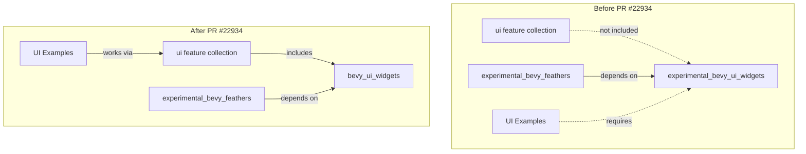

+++
title = "#22934 Remove `experimental` designation from `bevy_ui_widgets` feature flag"
date = "2026-02-18T00:00:00"
draft = false
template = "pull_request_page.html"
in_search_index = false

[extra]
current_language = "zh-cn"
available_languages = {"en" = { name = "English", url = "/pull_request/bevy/2026-02/pr-22934-en-20260218" }, "zh-cn" = { name = "中文", url = "/pull_request/bevy/2026-02/pr-22934-zh-cn-20260218" }}
+++

# Title

## 基本信息
- **标题**: Remove `experimental` designation from `bevy_ui_widgets` feature flag
- **PR链接**: https://github.com/bevyengine/bevy/pull/22934
- **作者**: alice-i-cecile
- **状态**: 已合并
- **标签**: A-UI, S-Ready-For-Final-Review, X-Blessed, D-Straightforward
- **创建时间**: 2026-02-13T02:11:37Z
- **合并时间**: 2026-02-18T21:51:41Z
- **合并人**: alice-i-cecile

## 描述翻译

# 目标 (Objective)

`bevy_ui_widgets` 功能仍然不完整且不稳定，但“experimental”（实验性）标签的效用值得商榷：

1.  运行需要非默认功能（non-default features）的示例很麻烦。这对于UI示例来说令人沮丧，并且阻碍了在其他示例中的采用，即使使用基于UI的真实控件会更优雅。
2.  实践证明，这些部件（widgets）对最终用户是有用的，即使在 0.19 版本中也是如此。
3.  这些部件自最初发布以来，已经经历了一些小型的错误修复和改进。
4.  目前尚不清楚这个标签在减缓采用方面是否有效，或者减缓采用是否是目前可取的。用户并没有很多其他很好的选择：编写自己的部件会浪费工作量，并且仍然需要使用 BSN（Bevy Scene Nodes）进行重写。
5.  Bevy 作为一个整体仍然处于相当实验性的阶段。与例如幽灵节点（ghost nodes）不同，没有迹象表明我们考虑完全撤销这些功能。

## 解决方案 (Solution)

根据审查反馈修改如下：

> `experimental_ui_widgets` 功能已更名为 `ui_widgets`。
>
> 为便于使用，`ui_widgets` 功能已被添加到 `ui` 功能集合中（因此也成为 `bevy` 的默认功能）。

来自原始迁移指南的先前解决方案：

> `experimental_ui_widgets` 和 `experimental_bevy_feathers` 功能已分别重命名为 `ui_widgets` 和 `bevy_feathers`。
>
> 为便于使用，`ui_widgets` 功能已被添加到 `ui` 功能集合中（因此也成为 `bevy` 的默认功能）。
> `bevy_feathers` 功能默认仍处于关闭状态：它主要用于开发工具，通常不应包含在发布的最终用户应用程序中。因此，需要能够有条件地轻松启用和禁用它。如果它是一个默认功能或属于一个流行的功能集合，这将非常具有挑战性。
>
> 这些 crate 仍然不成熟，并且容易发生重大的破坏性变更，即使相对于 Bevy 1.0 版本前的标准也是如此。
> 然而，它们非常有用，值得更广泛的采用，并且这一更改显著改善了设置新项目和运行 Bevy 示例时的用户体验。

# 本次 Pull Request 的解析

本次 PR 的核心是关于一个功能标志（feature flag）的语义变更和配置调整，其目的是在管理功能稳定性和改善开发者体验之间找到平衡点。Bevy 使用 Cargo 的功能标志来模块化其庞大的生态系统，允许用户选择性地启用特定组件。`bevy_ui_widgets` 模块是一组“无头”（headless）UI 部件（如按钮、滑块、复选框的逻辑后端），是构建交互式 UI 的基础。在引入时，它被标记为“experimental”，这是一个强烈的警告信号，意味着 API 不稳定且可能随时发生破坏性变更。

然而，随着时间推移，这个“实验性”标签在实践中带来了一些问题。主要矛盾在于：虽然代码本身仍处于不稳定状态，但标签带来的使用障碍却显得过重。开发者在运行包含这些部件的 UI 示例时，必须显式地指定 `--features experimental_bevy_ui_widgets`，这个过程繁琐且容易遗忘。这不仅仅是便利性问题，它直接影响了功能的可见性和采用率——如果每次尝试都需要额外的步骤，开发者可能会直接放弃使用，转而寻找其他方案或自己实现。与此同时，社区反馈表明，尽管有风险，这些部件在 Bevy 0.19 中已经被证明是实用的，并且也收到了一些错误修复，其核心价值得到了验证。

因此，PR 作者提出了一个务实的折中方案：移除“experimental”标签，但保留文档中的不稳定警告。这不是宣布该模块已经稳定，而是一次用户体验优化。具体实现分为三个层面：

首先，在项目的根 `Cargo.toml` 中，将功能标志从 `experimental_bevy_ui_widgets` 重命名为 `bevy_ui_widgets`。同时，将这个功能添加到 `ui` 功能集合中。这个改动是关键，因为它意味着任何启用了默认 `bevy` 功能（其中包含了 `ui`）的用户，现在将自动获得 `bevy_ui_widgets` 功能。这一行简单的添加，消除了开发者手动启用功能的主要障碍。

```toml
# 在 Cargo.toml 中
ui = [
  # ... 其他功能
  "bevy_ui_widgets", # 新增行
]
```

其次，移除了多个示例中显式的 `required-features = ["experimental_bevy_ui_widgets"]` 配置。由于 `bevy_ui_widgets` 现在是 `ui` 集合（进而也是默认功能）的一部分，这些示例现在可以直接运行，无需额外参数。这极大地简化了测试和学习流程。

```toml
# 例如，在 examples/ui/widgets/standard_widgets.rs 的配置中
# 之前：
# required-features = ["experimental_bevy_ui_widgets"]
# 之后：
# （该行被删除）
```

第三，同步更新了相关文档和依赖关系。功能列表文档 (`docs/cargo_features.md`) 相应更新，反映了新的功能名称并删除了旧的实验性条目。同时，`experimental_bevy_feathers`（一个基于这些部件的高级UI工具包）的依赖项也从旧的实验性名称更新为新的名称。

值得注意的是，PR 明确区分了 `bevy_ui_widgets` 和 `bevy_feathers` 的处理方式。`bevy_ui_widgets` 被提升为默认启用，因为它提供了基础构件，适合广泛使用。而 `bevy_feathers` 仍然保持其“experimental”标签且默认关闭，因为它定位为开发工具，不适合包含在最终应用中，需要保持易于按需启用的特性。

为了确保现有用户平滑过渡，PR 还包含了一个迁移指南 (`non_experimental_ui.md`)。该指南清晰地说明了变更内容，并坦诚地指出：虽然移除了“experimental”标签，但该模块“仍然不成熟，并且容易发生重大的破坏性变更”。这种透明性至关重要，它在降低使用门槛的同时，并没有削弱对用户的警告。

总的来说，这是一个典型的工程决策案例：基于实际使用反馈和社区需求，调整一项策略的“强度”。移除“experimental”标签并不是功能成熟度上的飞跃，而是一次对开发者摩擦系数的主动优化。它承认了警告标签的双重性——既能防止用户依赖不稳定API，也可能阻碍有用的功能被充分探索和验证。通过将功能集成到默认集合并保留文档警告，Bevy 团队在促进采用和明确管理期望之间找到了一个更优的平衡点。

## 可视化关系



## 关键文件变更

1.  **`Cargo.toml` (+4/-11)**
    *   **变更描述与原因**：这是本次PR的核心配置文件修改。主要做了三件事：(1) 将 `experimental_bevy_ui_widgets` 功能重命名为 `bevy_ui_widgets`；(2) 将 `bevy_ui_widgets` 添加到 `ui` 功能集合中，使其对大多数用户默认启用；(3) 移除多个UI示例中显式的 `required-features` 配置，因为这些示例现在可以通过默认功能集正常运行。
    *   **关键代码片段**：
        ```toml
        # 功能定义重命名
        # 之前：
        # experimental_bevy_ui_widgets = ["bevy_internal/bevy_ui_widgets"]
        # 之后：
        bevy_ui_widgets = ["bevy_internal/bevy_ui_widgets"]

        # 添加到 ui 集合
        ui = [
          # ... 其他功能
          "bevy_ui_widgets", # 新增
        ]

        # 更新 experimental_bevy_feathers 的依赖
        # 之前：
        # experimental_bevy_feathers = ["bevy_internal/bevy_feathers", "experimental_bevy_ui_widgets"]
        # 之后：
        experimental_bevy_feathers = ["bevy_internal/bevy_feathers", "bevy_ui_widgets"]
        ```
    *   **与PR目的的关系**：直接实现了“移除实验性标签并默认启用”的核心目标，简化了用户配置。

2.  **`release-content/migration-guides/non_experimental_ui.md` (+12/-0)**
    *   **变更描述与原因**：这是一个新建的迁移指南文档，用于在版本发布时告知用户此项变更。它解释了功能名称的变化，说明了新功能被加入默认集合，并明确指出了该模块虽然标签移除但依然不稳定的现状。
    *   **关键代码片段**：
        ```markdown
        ---
        title: "`experimental_ui_widgets` feature is no longer experimental"
        pull_requests: [22934]
        ---

        The `experimental_bevy_ui_widgets` feature has been renamed to `bevy_ui_widgets`.

        The `bevy_ui_widgets` feature has been added to the `ui` feature collection (and thus `bevy`'s default features) for ease of use.

        This crate remains immature, and is subject to heavy breaking changes, even relative to Bevy's pre-1.0 standards.
        However, it is useful enough to see wider adoption, and this changes substantially improves the user experience when setting up new projects
        and running Bevy examples.
        ```
    *   **与PR目的的关系**：提供了透明的沟通和用户指引，是负责任的项目管理实践，确保了变更不会让用户感到意外。

3.  **`docs/cargo_features.md` (+1/-1)**
    *   **变更描述与原因**：更新了项目功能列表文档，以反映功能名称的变化并保持文档准确性。
    *   **关键代码片段**：
        ```markdown
        # 之前：
        |experimental_bevy_ui_widgets|Experimental headless widget collection for Bevy UI.|
        # 之后：
        |bevy_ui_widgets|Headless widget collection for Bevy UI.|
        ```
    *   **与PR目的的关系**：维护了文档与代码实现的一致性，是本次重命名变更的必要配套工作。

## 延伸阅读

1.  **Cargo Features 官方文档**: 了解 Cargo 功能标志的工作原理、默认功能、特性集合等概念。
    *   链接: [The Cargo Book - Features](https://doc.rust-lang.org/cargo/reference/features.html)

2.  **Bevy UI 官方示例**: 查看使用了 `bevy_ui_widgets` 的具体示例，了解这些部件如何被用于构建交互界面。
    *   链接: [Bevy UI Examples](https://github.com/bevyengine/bevy/tree/latest/examples/ui) (例如 `standard_widgets.rs`)

3.  **语义化版本控制 (SemVer)** 与 **稳定性承诺**: 思考在预发布（0.x）版本中，如何像 Bevy 这样管理功能和 API 的稳定性预期。
    *   链接: [Semantic Versioning 2.0.0](https://semver.org/)

# 完整代码差异

```diff
diff --git a/Cargo.toml b/Cargo.toml
index 6a29986917ebd..2f87d20ff0c9b 100644
--- a/Cargo.toml
+++ b/Cargo.toml
@@ -164,6 +164,7 @@ ui = [
   "scene",
   "audio",
   "picking",
+  "bevy_ui_widgets",
 ]
 
 # COLLECTION: Enable this feature during development to improve the development experience. This adds features like asset hot-reloading and debugging tools. This should not be enabled for published apps!
@@ -403,14 +404,11 @@ bevy_log = ["bevy_internal/bevy_log"]
 # Enable input focus subsystem
 bevy_input_focus = ["bevy_internal/bevy_input_focus"]
 
-# Experimental headless widget collection for Bevy UI.
-experimental_bevy_ui_widgets = ["bevy_internal/bevy_ui_widgets"]
+# Headless widget collection for Bevy UI.
+bevy_ui_widgets = ["bevy_internal/bevy_ui_widgets"]
 
 # Feathers widget collection.
-experimental_bevy_feathers = [
-  "bevy_internal/bevy_feathers",
-  "experimental_bevy_ui_widgets",
-]
+experimental_bevy_feathers = ["bevy_internal/bevy_feathers", "bevy_ui_widgets"]
 
 # Enable passthrough loading for SPIR-V shaders (Only supported on Vulkan, shader capabilities and extensions must agree with the platform implementation)
 spirv_shader_passthrough = ["bevy_internal/spirv_shader_passthrough"]
@@ -3857,7 +3855,6 @@ name = "vertical_slider"
 path = "examples/ui/widgets/vertical_slider.rs"
 # Causes an ICE on docs.rs
 doc-scrape-examples = false
-required-features = ["experimental_bevy_ui_widgets"]
 
 [package.metadata.example.vertical_slider]
 name = "Vertical Slider"
@@ -5272,7 +5269,6 @@ name = "testbed_full_ui"
 path = "examples/testbed/full_ui.rs"
 # Causes an ICE on docs.rs
 doc-scrape-examples = false
-required-features = ["experimental_bevy_ui_widgets"]
 
 [package.metadata.example.testbed_full_ui]
 hidden = true
@@ -5418,7 +5414,6 @@ name = "standard_widgets"
 path = "examples/ui/widgets/standard_widgets.rs"
 # Causes an ICE on docs.rs
 doc-scrape-examples = false
-required-features = ["experimental_bevy_ui_widgets"]
 
 [package.metadata.example.standard_widgets]
 name = "Standard Widgets"
@@ -5431,7 +5426,6 @@ name = "standard_widgets_observers"
 path = "examples/ui/widgets/standard_widgets_observers.rs"
 # Causes an ICE on docs.rs
 doc-scrape-examples = false
-required-features = ["experimental_bevy_ui_widgets"]
 
 [package.metadata.example.standard_widgets_observers]
 name = "Standard Widgets (w/Observers)"
@@ -5444,7 +5438,6 @@ name = "scrollbars"
 path = "examples/ui/scroll_and_overflow/scrollbars.rs"
 # Causes an ICE on docs.rs
 doc-scrape-examples = false
-required-features = ["experimental_bevy_ui_widgets"]
 
 [package.metadata.example.scrollbars]
 name = "Scrollbars"
diff --git a/docs/cargo_features.md b/docs/cargo_features.md
index abc5c9ac0f861..16ef5610d6563 100644
--- a/docs/cargo_features.md
+++ b/docs/cargo_features.md
@@ -101,6 +101,7 @@ This is the complete `bevy` cargo feature list, without "profiles" or "collectio
 |bevy_ui|A custom ECS-driven UI framework|
 |bevy_ui_debug|Provides a debug overlay for bevy UI|
 |bevy_ui_render|Provides rendering functionality for bevy_ui|
+|bevy_ui_widgets|Headless widget collection for Bevy UI.|
 |bevy_window|Windowing layer|
 |bevy_winit|winit window and input backend|
 |bluenoise_texture|Include spatio-temporal blue noise KTX2 file used by generated environment maps, Solari and atmosphere|
@@ -117,7 +118,6 @@ This is the complete `bevy` cargo feature list, without "profiles" or "collectio
 |dynamic_linking|Force dynamic linking, which improves iterative compile times|
 |embedded_watcher|Enables watching in memory asset providers for Bevy Asset hot-reloading|
 |experimental_bevy_feathers|Feathers widget collection.|
-|experimental_bevy_ui_widgets|Experimental headless widget collection for Bevy UI.|
 |experimental_pbr_pcss|Enable support for PCSS, at the risk of blowing past the global, per-shader sampler limit on older/lower-end GPUs|
 |exr|EXR image format support|
 |ff|Farbfeld image format support|
diff --git a/release-content/migration-guides/non_experimental_ui.md b/release-content/migration-guides/non_experimental_ui.md
new file mode 100644
index 0000000000000..a480e566d33bb
--- /dev/null
+++ b/release-content/migration-guides/non_experimental_ui.md
@@ -0,0 +1,12 @@
+---
+title: "`experimental_ui_widgets` feature is no longer experimental"
+pull_requests: [22934]
+---
+
+The `experimental_bevy_ui_widgets` feature has been renamed to `bevy_ui_widgets`.
+
+The `bevy_ui_widgets` feature has been added to the `ui` feature collection (and thus `bevy`'s default features) for ease of use.
+
+This crate remains immature, and is subject to heavy breaking changes, even relative to Bevy's pre-1.0 standards.
+However, it is useful enough to see wider adoption, and this changes substantially improves the user experience when setting up new projects
+and running Bevy examples.
```