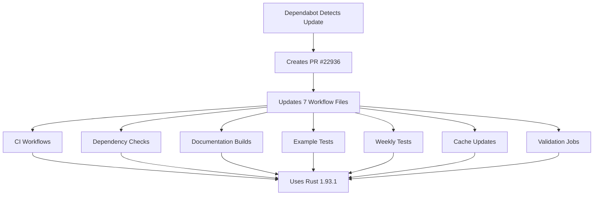

+++
title = "#22936 Bump dtolnay/rust-toolchain from f7ccc83f9ed1e5b9c81d8a67d7ad1a747e22a561 to efa25f7f19611383d5b0ccf2d1c8914531636bf9"
date = "2026-02-18T00:00:00"
draft = false
template = "pull_request_page.html"
in_search_index = true

[taxonomies]
list_display = ["show"]

[extra]
current_language = "en"
available_languages = {"en" = { name = "English", url = "/pull_request/bevy/2026-02/pr-22936-en-20260218" }, "zh-cn" = { name = "中文", url = "/pull_request/bevy/2026-02/pr-22936-zh-cn-20260218" }}
labels = ["A-Build-System", "C-Dependencies"]
+++

# Title: Bump dtolnay/rust-toolchain from f7ccc83f9ed1e5b9c81d8a67d7ad1a747e22a561 to efa25f7f19611383d5b0ccf2d1c8914531636bf9

## Basic Information
- **Title**: Bump dtolnay/rust-toolchain from f7ccc83f9ed1e5b9c81d8a67d7ad1a747e22a561 to efa25f7f19611383d5b0ccf2d1c8914531636bf9
- **PR Link**: https://github.com/bevyengine/bevy/pull/22936
- **Author**: app/dependabot
- **Status**: MERGED
- **Labels**: A-Build-System, C-Dependencies, S-Needs-Review
- **Created**: 2026-02-13T06:54:02Z
- **Merged**: 2026-02-18T12:50:53Z
- **Merged By**: mockersf

## Description Translation
Bumps [dtolnay/rust-toolchain](https://github.com/dtolnay/rust-toolchain) from f7ccc83f9ed1e5b9c81d8a67d7ad1a747e22a561 to efa25f7f19611383d5b0ccf2d1c8914531636bf9.
<details>
<summary>Commits</summary>
<ul>
<li><a href="https://github.com/dtolnay/rust-toolchain/commit/efa25f7f19611383d5b0ccf2d1c8914531636bf9"><code>efa25f7</code></a> Add 1.93.1 patch release</li>
<li>See full diff in <a href="https://github.com/dtolnay/rust-toolchain/compare/f7ccc83f9ed1e5b9c81d8a67d7ad1a747e22a561...efa25f7f19611383d5b0ccf2d1c8914531636bf9">compare view</a></li>
</ul>
</details>
<br />


Dependabot will resolve any conflicts with this PR as long as you don't alter it yourself. You can also trigger a rebase manually by commenting `@dependabot rebase`.

[//]: # (dependabot-automerge-start)
[//]: # (dependabot-automerge-end)

---

<details>
<summary>Dependabot commands and options</summary>
<br />

You can trigger Dependabot actions by commenting on this PR:
- `@dependabot rebase` will rebase this PR
- `@dependabot recreate` will recreate this PR, overwriting any edits that have been made to it
- `@dependabot show <dependency name> ignore conditions` will show all of the ignore conditions of the specified dependency
- `@dependabot ignore this major version` will close this PR and stop Dependabot creating any more for this major version (unless you reopen the PR or upgrade to it yourself)
- `@dependabot ignore this minor version` will close this PR and stop Dependabot creating any more for this minor version (unless you reopen the PR or upgrade to it yourself)
- `@dependabot ignore this dependency` will close this PR and stop Dependabot creating any more for this dependency (unless you reopen the PR or upgrade to it yourself)


</details>

## The Story of This Pull Request

This PR represents a routine but essential maintenance update in Bevy's continuous integration pipeline. The problem was straightforward: the project's GitHub Actions workflows were pinned to a specific commit of the `dtolnay/rust-toolchain` action that didn't include the latest Rust 1.93.1 patch release. While this doesn't represent a critical bug or feature gap, keeping CI tooling current ensures access to the latest compiler fixes and improvements.

The solution approach was equally straightforward: update the reference from commit `f7ccc83f9ed1e5b9c81d8a67d7ad1a747e22a561` to `efa25f7f19611383d5b0ccf2d1c8914531636bf9`. The dtolnay/rust-toolchain action is a popular GitHub Action for setting up Rust toolchains in CI environments, and this update specifically adds support for Rust 1.93.1.

From an implementation perspective, this change required updating seven different workflow files across the `.github/workflows/` directory. Each file contained one or more references to the rust-toolchain action that needed updating. The pattern was consistent across all files: find instances of `dtolnay/rust-toolchain@f7ccc83f9ed1e5b9c81d8a67d7ad1a747e22a561` and replace them with `dtolnay/rust-toolchain@efa25f7f19611383d5b0ccf2d1c8914531636bf9`.

Technically, this update is important because it ensures that Bevy's CI system uses the latest patch release of the Rust toolchain. Patch releases typically include critical bug fixes, security updates, and sometimes performance improvements. While the changes in Rust 1.93.1 might not be immediately visible to Bevy developers, using the latest patch version helps prevent subtle bugs that might have been fixed in the compiler.

The impact of this change is primarily in the CI/CD pipeline. All future CI runs will use Rust 1.93.1 instead of whatever previous version was pinned. This could potentially affect build times, compiler diagnostics, and the detection of certain classes of bugs. Since this is a patch release update (from 1.93.0 to 1.93.1), breaking changes are not expected, but it's still good practice to test with the latest compiler versions.

A key insight from this PR is the importance of dependency management in modern software projects. While this change appears simple on the surface—just updating a hash reference—it touches multiple critical workflows including continuous integration, dependency validation, documentation builds, and weekly testing. This demonstrates how even minor toolchain updates can have broad implications across a project's development infrastructure.

The PR also showcases the value of automated dependency management tools like Dependabot. Without such automation, maintaining current dependencies across multiple workflow files would be tedious and error-prone. Dependabot detected the available update, created the PR with all necessary changes, and provided clear instructions for managing the update process.

## Visual Representation



## Key Files Changed

The PR updates seven GitHub Actions workflow files to use the newer version of the dtolnay/rust-toolchain action:

### `.github/workflows/ci.yml` (+15/-15)
This is the main continuous integration workflow that runs tests, lints, and builds for various platforms. The update ensures all CI jobs use Rust 1.93.1.

```yaml
# Before:
- uses: dtolnay/rust-toolchain@f7ccc83f9ed1e5b9c81d8a67d7ad1a747e22a561

# After:
- uses: dtolnay/rust-toolchain@efa25f7f19611383d5b0ccf2d1c8914531636bf9
```

### `.github/workflows/validation-jobs.yml` (+6/-6)
This workflow handles various validation tasks. The update affects jobs that check for dead links, run Miri (Rust's experimental interpreter), and validate WebAssembly builds.

```yaml
# Before:
- uses: dtolnay/rust-toolchain@f7ccc83f9ed1e5b9c81d8a67d7ad1a747e22a561

# After:
- uses: dtolnay/rust-toolchain@efa25f7f19611383d5b0ccf2d1c8914531636bf9
```

### `.github/workflows/dependencies.yml` (+4/-4)
This workflow runs cargo-deny to check for dependency issues including licenses, security vulnerabilities, and banned crates.

```yaml
# Before:
- uses: dtolnay/rust-toolchain@f7ccc83f9ed1e5b9c81d8a67d7ad1a747e22a561

# After:
- uses: dtolnay/rust-toolchain@efa25f7f19611383d5b0ccf2d1c8914531636bf9
```

### `.github/workflows/example-run.yml` (+3/-3)
This workflow runs Bevy's examples to ensure they compile and execute correctly.

```yaml
# Before:
- uses: dtolnay/rust-toolchain@f7ccc83f9ed1e5b9c81d8a67d7ad1a747e22a561

# After:
- uses: dtolnay/rust-toolchain@efa25f7f19611383d5b0ccf2d1c8914531636bf9
```

### `.github/workflows/weekly.yml` (+3/-3)
This workflow runs weekly tests using the beta Rust toolchain to catch potential issues before they reach stable.

```yaml
# Before:
- uses: dtolnay/rust-toolchain@f7ccc83f9ed1e5b9c81d8a67d7ad1a747e22a561

# After:
- uses: dtolnay/rust-toolchain@efa25f7f19611383d5b0ccf2d1c8914531636bf9
```

### `.github/workflows/docs.yml` (+1/-1)
This workflow builds the documentation using nightly Rust features.

```yaml
# Before:
- uses: dtolnay/rust-toolchain@f7ccc83f9ed1e5b9c81d8a67d7ad1a747e22a561

# After:
- uses: dtolnay/rust-toolchain@efa25f7f19611383d5b0ccf2d1c8914531636bf9
```

### `.github/workflows/update-caches.yml` (+2/-2)
This workflow updates CI cache entries to improve build performance.

```yaml
# Before:
- uses: dtolnay/rust-toolchain@f7ccc83f9ed1e5b9c81d8a67d7ad1a747e22a561

# After:
- uses: dtolnay/rust-toolchain@efa25f7f19611383d5b0ccf2d1c8914531636bf9
```

## Further Reading

1. **dtolnay/rust-toolchain GitHub Action**: https://github.com/dtolnay/rust-toolchain
2. **Rust 1.93.1 Release Notes**: https://blog.rust-lang.org/2026/02/13/Rust-1.93.1.html
3. **GitHub Actions Documentation**: https://docs.github.com/en/actions
4. **Dependabot Documentation**: https://docs.github.com/en/code-security/dependabot
5. **Rust's Release Channels**: https://rust-lang.github.io/rfcs/0507-release-channels.html