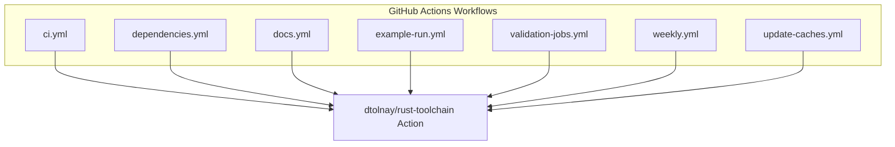

+++
title = "#22936 Bump dtolnay/rust-toolchain from f7ccc83f9ed1e5b9c81d8a67d7ad1a747e22a561 to efa25f7f19611383d5b0ccf2d1c8914531636bf9"
date = "2026-02-18T00:00:00"
draft = false
template = "pull_request_page.html"
in_search_index = false

[extra]
current_language = "zh-cn"
available_languages = {"en" = { name = "English", url = "/pull_request/bevy/2026-02/pr-22936-en-20260218" }, "zh-cn" = { name = "中文", url = "/pull_request/bevy/2026-02/pr-22936-zh-cn-20260218" }}
+++

# Bump dtolnay/rust-toolchain from f7ccc83f9ed1e5b9c81d8a67d7ad1a747e22a561 to efa25f7f19611383d5b0ccf2d1c8914531636bf9

## 基本信息
- **标题**: Bump dtolnay/rust-toolchain from f7ccc83f9ed1e5b9c81d8a67d7ad1a747e22a561 to efa25f7f19611383d5b0ccf2d1c8914531636bf9
- **PR链接**: https://github.com/bevyengine/bevy/pull/22936
- **作者**: app/dependabot
- **状态**: 已合并
- **标签**: A-Build-System, C-Dependencies, S-Needs-Review
- **创建时间**: 2026-02-13T06:54:02Z
- **合并时间**: 2026-02-18T12:50:53Z
- **合并者**: mockersf

## 描述翻译
将 [dtolnay/rust-toolchain](https://github.com/dtolnay/rust-toolchain) 从 f7ccc83f9ed1e5b9c81d8a67d7ad1a747e22a561 更新至 efa25f7f19611383d5b0ccf2d1c8914531636bf9。
<details>
<summary>提交记录</summary>
<ul>
<li><a href="https://github.com/dtolnay/rust-toolchain/commit/efa25f7f19611383d5b0ccf2d1c8914531636bf9"><code>efa25f7</code></a> 添加 1.93.1 补丁版本</li>
<li>查看完整差异请访问 <a href="https://github.com/dtolnay/rust-toolchain/compare/f7ccc83f9ed1e5b9c81d8a67d7ad1a747e22a561...efa25f7f19611383d5b0ccf2d1c8914531636bf9">比较视图</a></li>
</ul>
</details>
<br />

只要您不自行修改此 PR，Dependabot 将解决所有冲突。您也可以通过评论 `@dependabot rebase` 手动触发变基。

[//]: # (dependabot-automerge-start)
[//]: # (dependabot-automerge-end)

---

<details>
<summary>Dependabot 命令和选项</summary>
<br />

您可以通过评论此 PR 来触发 Dependabot 操作：
- `@dependabot rebase` 将变基此 PR
- `@dependabot recreate` 将重新创建此 PR，覆盖对其所做的任何编辑
- `@dependabot show <dependency name> ignore conditions` 将显示指定依赖项的所有忽略条件
- `@dependabot ignore this major version` 将关闭此 PR 并停止 Dependabot 为此主要版本创建更多 PR（除非您重新打开该 PR 或自行升级）
- `@dependabot ignore this minor version` 将关闭此 PR 并停止 Dependabot 为此次要版本创建更多 PR（除非您重新打开该 PR 或自行升级）
- `@dependabot ignore this dependency` 将关闭此 PR 并停止 Dependabot 为此依赖项创建更多 PR（除非您重新打开该 PR 或自行升级）

</details>

## 此 Pull Request 的故事

此 PR 是一个由 Dependabot 自动创建的依赖项更新。其核心是更新 Bevy 项目 CI/CD 工作流中使用的 Rust 工具链版本，从提交哈希 `f7ccc83f9ed1e5b9c81d8a67d7ad1a747e22a561` 更新到 `efa25f7f19611383d5b0ccf2d1c8914531636bf9`。根据提交记录，新版本添加了 Rust 1.93.1 的补丁更新。对于像 Bevy 这样的大型 Rust 项目，保持 CI 环境中工具链的更新至关重要，因为它确保了构建和测试的可靠性，并能尽早发现与新编译器版本的兼容性问题。

这个问题本身并不复杂。项目使用 `dtolnay/rust-toolchain` 这个 GitHub Action 来管理 CI 环境中的 Rust 工具链。该 Action 本身会更新，提供新的 Rust 版本（包括稳定版、测试版和 nightly 版本）以及必要的组件。为了确保 CI 流水线使用最新的、包含错误修复和性能改进的工具链，需要定期更新对该 Action 的引用。依赖项过时可能会导致 CI 使用旧版本的编译器，从而可能错过重要的安全补丁或语言特性优化。

解决方案非常直接：将所有引用该 Action 的工作流文件中的版本哈希更新为最新的提交哈希。这个 PR 展示了现代软件开发中依赖项管理的自动化实践。Dependabot 自动检测到新版本并创建更新 PR，项目维护者只需审查并合并。这种自动化减少了手动跟踪依赖项版本的工作量，并有助于保持项目依赖项的健康状态。

从技术实现上看，此 PR 修改了 `.github/workflows/` 目录下的 7 个 YAML 文件，共 15 处改动。所有改动模式一致：将 `uses: dtolnay/rust-toolchain@f7ccc83f9ed1e5b9c81d8a67d7ad1a747e22a561` 替换为 `uses: dtolnay/rust-toolchain@efa25f7f19611383d5b0ccf2d1c8914531636bf9`。这些改动覆盖了 CI 流水线的多个方面，包括主 CI 任务、依赖项检查、文档生成、示例运行、缓存更新、验证任务和每周任务。

此次更新的影响是积极的。合并后，Bevy 项目的所有 CI 任务（包括 Linux、macOS、Windows 平台上的构建、测试、代码格式检查、Clippy 分析、Miri 检查、WASM 编译、MSRV（最低支持 Rust 版本）检查等）都将使用更新后的 Rust 工具链。这有助于确保项目与 Rust 生态的最新进展保持同步，并可能因编译器优化而获得性能提升。对于开源项目，使用较新的工具链也有助于吸引贡献者，因为他们通常在使用较新的 Rust 版本进行开发。

这个 PR 也体现了良好的工程实践：即使是这样简单的依赖项更新，也经过了标签分类（A-Build-System, C-Dependencies）和人工审查（由 mockersf 合并）。这确保了变更不会破坏现有工作流。在复杂的项目中，即使是工具链的微小更新也可能因编译器行为变化或新增的警告/错误而意外破坏构建。因此，即使是由机器人创建的 PR，进行人工审查也是必要的。

## 可视化表示



## 关键文件更改

以下为此次 PR 中修改的关键文件列表：

- `.github/workflows/ci.yml` (+15/-15)
- `.github/workflows/validation-jobs.yml` (+6/-6)
- `.github/workflows/dependencies.yml` (+4/-4)
- `.github/workflows/example-run.yml` (+3/-3)
- `.github/workflows/weekly.yml` (+3/-3)
- `.github/workflows/docs.yml` (+1/-1)
- `.github/workflows/update-caches.yml` (+2/-2)

以下为部分关键文件的详细修改说明：

**1. `.github/workflows/ci.yml`**
此文件定义了主 CI 工作流，包含多个作业（jobs），如测试、检查、Miri 检查、不同目标的构建等。此次更新将该文件中所有 15 处对 `dtolnay/rust-toolchain` 的引用更新到新版本。这确保了所有 CI 作业都使用最新的 Rust 工具链。

```yaml
# 文件: .github/workflows/ci.yml
# 修改前:
      - uses: dtolnay/rust-toolchain@f7ccc83f9ed1e5b9c81d8a67d7ad1a747e22a561
        with:
          toolchain: stable

# 修改后:
      - uses: dtolnay/rust-toolchain@efa25f7f19611383d5b0ccf2d1c8914531636bf9
        with:
          toolchain: stable
```

**2. `.github/workflows/validation-jobs.yml`**
此文件包含一些验证任务，例如检查是否存在不应被命名的配置项、检查 Web 示例等。更新其中的 6 处引用，确保这些验证任务也使用新工具链。

```yaml
# 文件: .github/workflows/validation-jobs.yml
# 修改前:
      - uses: dtolnay/rust-toolchain@f7ccc83f9ed1e5b9c81d8a67d7ad1a747e22a561
        with:
          toolchain: stable

# 修改后:
      - uses: dtolnay/rust-toolchain@efa25f7f19611383d5b0ccf2d1c8914531636bf9
        with:
          toolchain: stable
```

**3. `.github/workflows/dependencies.yml`**
此工作流使用 cargo-deny 检查依赖项的安全性、许可证等问题。更新其中的 4 处引用，确保依赖项检查任务使用更新的工具链，这有助于发现可能影响依赖项解析的编译器相关问题。

```yaml
# 文件: .github/workflows/dependencies.yml
# 修改前:
      - uses: dtolnay/rust-toolchain@f7ccc83f9ed1e5b9c81d8a67d7ad1a747e22a561
        with:
          toolchain: stable

# 修改后:
      - uses: dtolnay/rust-toolchain@efa25f7f19611383d5b0ccf2d1c8914531636bf9
        with:
          toolchain: stable
```

## 进一步阅读

对于希望了解更多相关概念的读者，可以参考以下资源：

1. **GitHub Actions 官方文档**：了解如何创建工作流和使用 actions。
   - [GitHub Actions Documentation](https://docs.github.com/en/actions)

2. **dtolnay/rust-toolchain 仓库**：了解此 Action 的具体功能和配置选项。
   - [dtolnay/rust-toolchain on GitHub](https://github.com/dtolnay/rust-toolchain)

3. **Dependabot 文档**：了解如何配置和使用 Dependabot 自动更新依赖项。
   - [Dependabot Documentation](https://docs.github.com/en/code-security/dependabot)

4. **Rust 发布说明**：了解 Rust 1.93.1 版本的具体变更和修复。
   - [Rust Blog](https://blog.rust-lang.org/) (查看相应版本发布文章)

5. **语义化版本控制 (SemVer)**：理解依赖版本管理的原则。
   - [Semantic Versioning](https://semver.org/)

# 完整代码差异

diff --git a/.github/workflows/ci.yml b/.github/workflows/ci.yml
index 2a08b4d1ceea7..4a6a926340f5c 100644
--- a/.github/workflows/ci.yml
+++ b/.github/workflows/ci.yml
@@ -49,7 +49,7 @@ jobs:
             ~/.cargo/registry/cache/
             ~/.cargo/git/db/
             target/
-      - uses: dtolnay/rust-toolchain@f7ccc83f9ed1e5b9c81d8a67d7ad1a747e22a561
+      - uses: dtolnay/rust-toolchain@efa25f7f19611383d5b0ccf2d1c8914531636bf9
         with:
           toolchain: stable
       - name: Install Linux dependencies
@@ -81,7 +81,7 @@ jobs:
             ~/.cargo/registry/cache/
             ~/.cargo/git/db/
             target/
-      - uses: dtolnay/rust-toolchain@f7ccc83f9ed1e5b9c81d8a67d7ad1a747e22a561
+      - uses: dtolnay/rust-toolchain@efa25f7f19611383d5b0ccf2d1c8914531636bf9
         with:
           toolchain: stable
           components: rustfmt, clippy
@@ -117,7 +117,7 @@ jobs:
             ~/.cargo/registry/cache/
             ~/.cargo/git/db/
             target/
-      - uses: dtolnay/rust-toolchain@f7ccc83f9ed1e5b9c81d8a67d7ad1a747e22a561
+      - uses: dtolnay/rust-toolchain@efa25f7f19611383d5b0ccf2d1c8914531636bf9
         with:
           toolchain: ${{ env.NIGHTLY_TOOLCHAIN }}
           components: miri
@@ -155,7 +155,7 @@ jobs:
             ~/.cargo/registry/cache/
             ~/.cargo/git/db/
             target/
-      - uses: dtolnay/rust-toolchain@f7ccc83f9ed1e5b9c81d8a67d7ad1a747e22a561
+      - uses: dtolnay/rust-toolchain@efa25f7f19611383d5b0ccf2d1c8914531636bf9
         with:
           toolchain: stable
       - name: Install Linux dependencies
@@ -186,7 +186,7 @@ jobs:
             ~/.cargo/registry/cache/
             ~/.cargo/git/db/
             target/
-      - uses: dtolnay/rust-toolchain@f7ccc83f9ed1e5b9c81d8a67d7ad1a747e22a561
+      - uses: dtolnay/rust-toolchain@efa25f7f19611383d5b0ccf2d1c8914531636bf9
         with:
           toolchain: stable
           targets: x86_64-unknown-none
@@ -222,7 +222,7 @@ jobs:
             ~/.cargo/registry/cache/
             ~/.cargo/git/db/
             target/
-      - uses: dtolnay/rust-toolchain@f7ccc83f9ed1e5b9c81d8a67d7ad1a747e22a561
+      - uses: dtolnay/rust-toolchain@efa25f7f19611383d5b0ccf2d1c8914531636bf9
         with:
           toolchain: stable
           targets: thumbv6m-none-eabi
@@ -253,7 +253,7 @@ jobs:
             ~/.cargo/registry/cache/
             ~/.cargo/git/db/
             target/
-      - uses: dtolnay/rust-toolchain@f7ccc83f9ed1e5b9c81d8a67d7ad1a747e22a561
+      - uses: dtolnay/rust-toolchain@efa25f7f19611383d5b0ccf2d1c8914531636bf9
         with:
           toolchain: stable
           targets: x86_64-unknown-none
@@ -284,7 +284,7 @@ jobs:
             ~/.cargo/registry/cache/
             ~/.cargo/git/db/
             target/
-      - uses: dtolnay/rust-toolchain@f7ccc83f9ed1e5b9c81d8a67d7ad1a747e22a561
+      - uses: dtolnay/rust-toolchain@efa25f7f19611383d5b0ccf2d1c8914531636bf9
         with:
           toolchain: stable
           target: wasm32-unknown-unknown
@@ -315,7 +315,7 @@ jobs:
             ~/.cargo/registry/cache/
             ~/.cargo/git/db/
             target/
-      - uses: dtolnay/rust-toolchain@f7ccc83f9ed1e5b9c81d8a67d7ad1a747e22a561
+      - uses: dtolnay/rust-toolchain@efa25f7f19611383d5b0ccf2d1c8914531636bf9
         with:
           toolchain: ${{ env.NIGHTLY_TOOLCHAIN }}
           targets: wasm32-unknown-unknown
@@ -405,7 +405,7 @@ jobs:
             ~/.cargo/registry/cache/
             ~/.cargo/git/db/
             target/
-      - uses: dtolnay/rust-toolchain@f7ccc83f9ed1e5b9c81d8a67d7ad1a747e22a561
+      - uses: dtolnay/rust-toolchain@efa25f7f19611383d5b0ccf2d1c8914531636bf9
         with:
           toolchain: stable
       - name: Install Linux dependencies
@@ -435,7 +435,7 @@ jobs:
       - uses: actions/checkout@de0fac2e4500dabe0009e67214ff5f5447ce83dd # v6.0.2
         with:
           persist-credentials: false
-      - uses: dtolnay/rust-toolchain@f7ccc83f9ed1e5b9c81d8a67d7ad1a747e22a561
+      - uses: dtolnay/rust-toolchain@efa25f7f19611383d5b0ccf2d1c8914531636bf9
         with:
           toolchain: stable
       - name: check for missing metadata
@@ -474,7 +474,7 @@ jobs:
       - uses: actions/checkout@de0fac2e4500dabe0009e67214ff5f5447ce83dd # v6.0.2
         with:
           persist-credentials: false
-      - uses: dtolnay/rust-toolchain@f7ccc83f9ed1e5b9c81d8a67d7ad1a747e22a561
+      - uses: dtolnay/rust-toolchain@efa25f7f19611383d5b0ccf2d1c8914531636bf9
         with:
           toolchain: stable
       - name: check for missing features
@@ -513,7 +513,7 @@ jobs:
       - uses: actions/checkout@de0fac2e4500dabe0009e67214ff5f5447ce83dd # v6.0.2
         with:
           persist-credentials: false
-      - uses: dtolnay/rust-toolchain@f7ccc83f9ed1e5b9c81d8a67d7ad1a747e22a561
+      - uses: dtolnay/rust-toolchain@efa25f7f19611383d5b0ccf2d1c8914531636bf9
         with:
           toolchain: stable
       - name: get MSRV
@@ -521,7 +521,7 @@ jobs:
         run: |
           msrv=`cargo metadata --no-deps --format-version 1 | jq --raw-output '.packages[] | select(.name=="bevy") | .rust_version'`
           echo "msrv=$msrv" >> $GITHUB_OUTPUT
-      - uses: dtolnay/rust-toolchain@f7ccc83f9ed1e5b9c81d8a67d7ad1a747e22a561
+      - uses: dtolnay/rust-toolchain@efa25f7f19611383d5b0ccf2d1c8914531636bf9
         with:
           toolchain: ${{ steps.msrv.outputs.msrv }}
       - uses: actions/cache/restore@cdf6c1fa76f9f475f3d7449005a359c84ca0f306 # v5.0.3
@@ -585,7 +585,7 @@ jobs:
       - uses: actions/checkout@de0fac2e4500dabe0009e67214ff5f5447ce83dd # v6.0.2
         with:
           persist-credentials: false
-      - uses: dtolnay/rust-toolchain@f7ccc83f9ed1e5b9c81d8a67d7ad1a747e22a561
+      - uses: dtolnay/rust-toolchain@efa25f7f19611383d5b0ccf2d1c8914531636bf9
         with:
           toolchain: stable
       - name: Check Release Content
diff --git a/.github/workflows/dependencies.yml b/.github/workflows/dependencies.yml
index 8315702db97e1..08383cf11f82f 100644
--- a/.github/workflows/dependencies.yml
+++ b/.github/workflows/dependencies.yml
@@ -29,7 +29,7 @@ jobs:
       - uses: actions/checkout@de0fac2e4500dabe0009e67214ff5f5447ce83dd # v6.0.2
         with:
           persist-credentials: false
-      - uses: dtolnay/rust-toolchain@f7ccc83f9ed1e5b9c81d8a67d7ad1a747e22a561
+      - uses: dtolnay/rust-toolchain@efa25f7f19611383d5b0ccf2d1c8914531636bf9
         with:
           toolchain: stable
       - name: Install cargo-deny
@@ -43,7 +43,7 @@ jobs:
       - uses: actions/checkout@de0fac2e4500dabe0009e67214ff5f5447ce83dd # v6.0.2
         with:
           persist-credentials: false
-      - uses: dtolnay/rust-toolchain@f7ccc83f9ed1e5b9c81d8a67d7ad1a747e22a561
+      - uses: dtolnay/rust-toolchain@efa25f7f19611383d5b0ccf2d1c8914531636bf9
         with:
           toolchain: stable
       - name: Install cargo-deny
@@ -57,7 +57,7 @@ jobs:
       - uses: actions/checkout@de0fac2e4500dabe0009e67214ff5f5447ce83dd # v6.0.2
         with:
           persist-credentials: false
-      - uses: dtolnay/rust-toolchain@f7ccc83f9ed1e5b9c81d8a67d7ad1a747e22a561
+      - uses: dtolnay/rust-toolchain@efa25f7f19611383d5b0ccf2d1c8914531636bf9
         with:
           toolchain: stable
       - name: Install cargo-deny
@@ -71,7 +71,7 @@ jobs:
       - uses: actions/checkout@de0fac2e4500dabe0009e67214ff5f5447ce83dd # v6.0.2
         with:
           persist-credentials: false
-      - uses: dtolnay/rust-toolchain@f7ccc83f9ed1e5b9c81d8a67d7ad1a747e22a561
+      - uses: dtolnay/rust-toolchain@efa25f7f19611383d5b0ccf2d1c8914531636bf9
         with:
           toolchain: stable
       - name: Install cargo-deny
diff --git a/.github/workflows/docs.yml b/.github/workflows/docs.yml
index 1aab6d328e476..0cd72d193ecdb 100644
--- a/.github/workflows/docs.yml
+++ b/.github/workflows/docs.yml
@@ -39,7 +39,7 @@ jobs:
         with:
           persist-credentials: false
 
-      - uses: dtolnay/rust-toolchain@f7ccc83f9ed1e5b9c81d8a67d7ad1a747e22a561
+      - uses: dtolnay/rust-toolchain@efa25f7f19611383d5b0ccf2d1c8914531636bf9
         with:
           toolchain: ${{ env.NIGHTLY_TOOLCHAIN }}
 
diff --git a/.github/workflows/example-run.yml b/.github/workflows/example-run.yml
index 2fcc7c943ce37..09a214d62ea84 100644
--- a/.github/workflows/example-run.yml
+++ b/.github/workflows/example-run.yml
@@ -26,7 +26,7 @@ jobs:
       - uses: actions/checkout@de0fac2e4500dabe0009e67214ff5f5447ce83dd # v6.0.2
         with:
           persist-credentials: false
-      - uses: dtolnay/rust-toolchain@f7ccc83f9ed1e5b9c81d8a67d7ad1a747e22a561
+      - uses: dtolnay/rust-toolchain@efa25f7f19611383d5b0ccf2d1c8914531636bf9
         with:
           toolchain: stable
       - name: Disable audio
@@ -109,7 +109,7 @@ jobs:
         run: |
           sudo add-apt-repository ppa:kisak/turtle -y
           sudo apt-get install --no-install-recommends libxkbcommon-x11-0 xvfb libgl1-mesa-dri libxcb-xfixes0-dev mesa-vulkan-drivers
-      - uses: dtolnay/rust-toolchain@f7ccc83f9ed1e5b9c81d8a67d7ad1a747e22a561
+      - uses: dtolnay/rust-toolchain@efa25f7f19611383d5b0ccf2d1c8914531636bf9
         with:
           toolchain: stable
       - uses: actions/cache/restore@cdf6c1fa76f9f475f3d7449005a359c84ca0f306 # v5.0.3
@@ -177,7 +177,7 @@ jobs:
       - uses: actions/checkout@de0fac2e4500dabe0009e67214ff5f5447ce83dd # v6.0.2
         with:
           persist-credentials: false
-      - uses: dtolnay/rust-toolchain@f7ccc83f9ed1e5b9c81d8a67d7ad1a747e22a561
+      - uses: dtolnay/rust-toolchain@efa25f7f19611383d5b0ccf2d1c8914531636bf9
         with:
           toolchain: stable
       - uses: actions/cache/restore@cdf6c1fa76f9f475f3d7449005a359c84ca0f306 # v5.0.3
diff --git a/.github/workflows/update-caches.yml b/.github/workflows/update-caches.yml
index 6647b1906604c..5ad060ee652db 100644
--- a/.github/workflows/update-caches.yml
+++ b/.github/workflows/update-caches.yml
@@ -32,7 +32,7 @@ jobs:
       - uses: actions/checkout@de0fac2e4500dabe0009e67214ff5f5447ce83dd # v6.0.2
         with:
           persist-credentials: false
-      - uses: dtolnay/rust-toolchain@f7ccc83f9ed1e5b9c81d8a67d7ad1a747e22a561
+      - uses: dtolnay/rust-toolchain@efa25f7f19611383d5b0ccf2d1c8914531636bf9
         with:
           toolchain: stable
       - name: get MSRV
@@ -106,7 +106,7 @@ jobs:
 
       - name: Setup Rust
         id: rust
-        uses: dtolnay/rust-toolchain@f7ccc83f9ed1e5b9c81d8a67d7ad1a747e22a561
+        uses: dtolnay/rust-toolchain@efa25f7f19611383d5b0ccf2d1c8914531636bf9
         with:
           toolchain: ${{ matrix.toolchain }}
           target: ${{ matrix.target }}
diff --git a/.github/workflows/validation-jobs.yml b/.github/workflows/validation-jobs.yml
index fbe8eb3f531a4..8abe8c2a3758b 100644
--- a/.github/workflows/validation-jobs.yml
+++ b/.github/workflows/validation-jobs.yml
@@ -33,7 +33,7 @@ jobs:
         with:
           persist-credentials: false
 
-      - uses: dtolnay/rust-toolchain@f7ccc83f9ed1e5b9c81d8a67d7ad1a747e22a561
+      - uses: dtolnay/rust-toolchain@efa25f7f19611383d5b0ccf2d1c8914531636bf9
         with:
           toolchain: stable
 
@@ -67,7 +67,7 @@ jobs:
         with:
           persist-credentials: false
 
-      - uses: dtolnay/rust-toolchain@f7ccc83f9ed1e5b9c81d8a67d7ad1a747e22a561
+      - uses: dtolnay/rust-toolchain@efa25f7f19611383d5b0ccf2d1c8914531636bf9
         with:
           toolchain: stable
 
@@ -113,7 +113,7 @@ jobs:
         with:
           persist-credentials: false
 
-      - uses: dtolnay/rust-toolchain@f7ccc83f9ed1e5b9c81d8a67d7ad1a747e22a561
+      - uses: dtolnay/rust-toolchain@efa25f7f19611383d5b0ccf2d1c8914531636bf9
         with:
           target: wasm32-unknown-unknown
           toolchain: stable
@@ -175,7 +175,7 @@ jobs:
       - uses: actions/checkout@de0fac2e4500dabe0009e67214ff5f5447ce83dd # v6.0.2
         with:
           persist-credentials: false
-      - uses: dtolnay/rust-toolchain@f7ccc83f9ed1e5b9c81d8a67d7ad1a747e22a561
+      - uses: dtolnay/rust-toolchain@efa25f7f19611383d5b0ccf2d1c8914531636bf9
         with:
           toolchain: stable
       - name: Install Linux dependencies
@@ -207,7 +207,7 @@ jobs:
       - uses: actions/checkout@de0fac2e4500dabe0009e67214ff5f5447ce83dd # v6.0.2
         with:
           persist-credentials: false
-      - uses: dtolnay/rust-toolchain@f7ccc83f9ed1e5b9c81d8a67d7ad1a747e22a561
+      - uses: dtolnay/rust-toolchain@efa25f7f19611383d5b0ccf2d1c8914531636bf9
         with:
           toolchain: ${{ env.NIGHTLY_TOOLCHAIN }}
       - uses: actions/cache/restore@cdf6c1fa76f9f475f3d7449005a359c84ca0f306 # v5.0.3
@@ -239,7 +239,7 @@ jobs:
       - uses: actions/checkout@de0fac2e4500dabe0009e67214ff5f5447ce83dd # v6.0.2
         with:
           persist-credentials: false
-      - uses: dtolnay/rust-toolchain@f7ccc83f9ed1e5b9c81d8a67d7ad1a747e22a561
+      - uses: dtolnay/rust-toolchain@efa25f7f19611383d5b0ccf2d1c891453