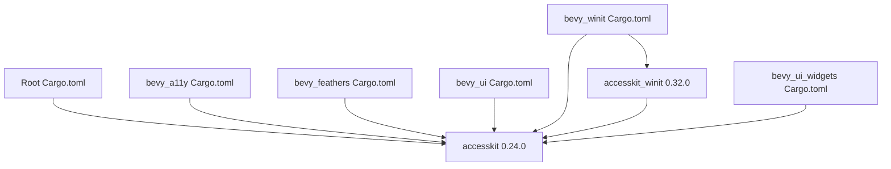

+++
title = "#22937 Bump the accesskit group with 2 updates"
date = "2026-02-16T00:00:00"
draft = false
template = "pull_request_page.html"
in_search_index = true

[taxonomies]
list_display = ["show"]

[extra]
current_language = "en"
available_languages = {"en" = { name = "English", url = "/pull_request/bevy/2026-02/pr-22937-en-20260216" }, "zh-cn" = { name = "中文", url = "/pull_request/bevy/2026-02/pr-22937-zh-cn-20260216" }}
labels = ["C-Dependencies"]
+++

# Bump the accesskit group with 2 updates

## Basic Information
- **Title**: Bump the accesskit group with 2 updates
- **PR Link**: https://github.com/bevyengine/bevy/pull/22937
- **Author**: app/dependabot
- **Status**: MERGED
- **Labels**: C-Dependencies
- **Created**: 2026-02-13T06:54:33Z
- **Merged**: 2026-02-16T19:10:07Z
- **Merged By**: alice-i-cecile

## Description Translation
Updates the requirements on [accesskit](https://github.com/AccessKit/accesskit) and [accesskit_winit](https://github.com/AccessKit/accesskit) to permit the latest version.
Updates `accesskit` to 0.24.0
<details>
<summary>Release notes</summary>
<p><em>Sourced from <a href="https://github.com/AccessKit/accesskit/releases">accesskit's releases</a>.</em></p>
<blockquote>
<h2>accesskit_windows: v0.24.0</h2>
<h2><a href="https://github.com/AccessKit/accesskit/compare/accesskit_windows-v0.23.2...accesskit_windows-v0.24.0">0.24.0</a> (2024-10-31)</h2>
<h3>⚠ BREAKING CHANGES</h3>
<ul>
<li>Rename <code>name</code> to <code>label</code> and use <code>value</code> for label content (<a href="https://redirect.github.com/AccessKit/accesskit/issues/475">#475</a>)</li>
<li>Rename <code>NodeBuilder</code> to <code>Node</code> and the old <code>Node</code> to <code>FrozenNode</code> (<a href="https://redirect.github.com/AccessKit/accesskit/issues/476">#476</a>)</li>
<li>Rename <code>Role::InlineTextBox</code> to <code>TextRun</code> (<a href="https://redirect.github.com/AccessKit/accesskit/issues/473">#473</a>)</li>
<li>Drop <code>DefaultActionVerb</code> (<a href="https://redirect.github.com/AccessKit/accesskit/issues/472">#472</a>)</li>
<li>Make the core crate no-std (<a href="https://redirect.github.com/AccessKit/accesskit/issues/468">#468</a>)</li>
</ul>
<h3>Features</h3>
<ul>
<li>Make the core crate no-std (<a href="https://redirect.github.com/AccessKit/accesskit/issues/468">#468</a>) (<a href="https://github.com/AccessKit/accesskit/commit/2fa0d3f5b2b7ac11ef1751c133706f29e548bd6d">2fa0d3f</a>)</li>
</ul>
<h3>Code Refactoring</h3>
<ul>
<li>Drop <code>DefaultActionVerb</code> (<a href="https://redirect.github.com/AccessKit/accesskit/issues/472">#472</a>) (<a href="https://github.com/AccessKit/accesskit/commit/ef3b0038224459094f650368412650bc3b69526b">ef3b003</a>)</li>
<li>Rename <code>name</code> to <code>label</code> and use <code>value</code> for label content (<a href="https://redirect.github.com/AccessKit/accesskit/issues/475">#475</a>) (<a href="https://github.com/AccessKit/accesskit/commit/e0053a5399929e8e0d4f07aa18de604ed8766ace">e0053a5</a>)</li>
<li>Rename <code>NodeBuilder</code> to <code>Node</code> and the old <code>Node</code> to <code>FrozenNode</code> (<a href="https://redirect.github.com/AccessKit/accesskit/issues/476">#476</a>) (<a href="https://github.com/AccessKit/accesskit/commit/7d8910e35f7bc0543724cc124941a3bd0304bcc0">7d8910e</a>)</li>
<li>Rename <code>Role::InlineTextBox</code> to <code>TextRun</code> (<a href="https://redirect.github.com/AccessKit/accesskit/issues/473">#473</a>) (<a href="https://github.com/AccessKit/accesskit/commit/29fa34125a811bd3a0f9da579a9f35c9da90bf29">29fa341</a>)</li>
</ul>
<h3>Dependencies</h3>
<ul>
<li>The following workspace dependencies were updated
<ul>
<li>dependencies
<ul>
<li>accesskit bumped from 0.16.3 to 0.17.0</li>
<li>accesskit_consumer bumped from 0.24.3 to 0.25.0</li>
</ul>
</li>
</ul>
</li>
</ul>
</blockquote>
</details>
<details>
<summary>Commits</summary>
<ul>
<li><a href="https://github.com/AccessKit/accesskit/commit/528fba56534d06551d8ce8c28cb444bd18ed1cfc"><code>528fba5</code></a> chore: release main (<a href="https://redirect.github.com/AccessKit/accesskit/issues/685">#685</a>)</li>
<li><a href="https://github.com/AccessKit/accesskit/commit/b27f7ed7e39d7561f4f03c1fd4a411a75c305330"><code>b27f7ed</code></a> deps: Update windows-rs to 0.62 (<a href="https://redirect.github.com/AccessKit/accesskit/issues/682">#682</a>)</li>
<li><a href="https://github.com/AccessKit/accesskit/commit/f8c22cbb53ce6b1859adeff3c0b7154ad9e1f25e"><code>f8c22cb</code></a> fix!: Update minimum supported Rust version to 1.85 (<a href="https://redirect.github.com/AccessKit/accesskit/issues/683">#683</a>)</li>
<li><a href="https://github.com/AccessKit/accesskit/commit/a2269bbfdeb3f193e13e753e04f4ba0d1afde68c"><code>a2269bb</code></a> chore: release main (<a href="https://redirect.github.com/AccessKit/accesskit/issues/680">#680</a>)</li>
<li><a href="https://github.com/AccessKit/accesskit/commit/13a37d144e2fafceaf26e7645f6acc679ccb2f34"><code>13a37d1</code></a> fix: Emit initial focus event for active descendant node (<a href="https://redirect.github.com/AccessKit/accesskit/issues/681">#681</a>)</li>
<li><a href="https://github.com/AccessKit/accesskit/commit/98f9342a420df32c18d567dc7c4ea2522b241ec9"><code>98f9342</code></a> fix: Use proper bundle key for Android URL property (<a href="https://redirect.github.com/AccessKit/accesskit/issues/679">#679</a>)</li>
<li><a href="https://github.com/AccessKit/accesskit/commit/828979e5f668bc8c4ceba018d417956a5c69b2bd"><code>828979e</code></a> fix: Fix next word and line at the end of text runs (<a href="https://redirect.github.com/AccessKit/accesskit/issues/678">#678</a>)</li>
<li>See full diff in <a href="https://github.com/AccessKit/accesskit/compare/accesskit-v0.23.0...accesskit-v0.24.0">compare view</a></li>
</ul>
</details>
<br />

Updates `accesskit_winit` to 0.32.0
<details>
<summary>Release notes</summary>
<p><em>Sourced from <a href="https://github.com/AccessKit/accesskit/releases">accesskit_winit's releases</a>.</em></p>
<blockquote>
<h2>accesskit_winit: v0.32.0</h2>
<h2><a href="https://github.com/AccessKit/accesskit/compare/accesskit_winit-v0.31.1...accesskit_winit-v0.32.0">0.32.0</a> (2026-02-01)</h2>
<h3>⚠ BREAKING CHANGES</h3>
<ul>
<li>Update minimum supported Rust version to 1.85 (<a href="https://redirect.github.com/AccessKit/accesskit/issues/683">#683</a>)</li>
</ul>
<h3>Bug Fixes</h3>
<ul>
<li>Update minimum supported Rust version to 1.85 (<a href="https://redirect.github.com/AccessKit/accesskit/issues/683">#683</a>) (<a href="https://github.com/AccessKit/accesskit/commit/f8c22cbb53ce6b1859adeff3c0b7154ad9e1f25e">f8c22cb</a>)</li>
</ul>
<h3>Dependencies</h3>
<ul>
<li>The following workspace dependencies were updated
<ul>
<li>dependencies
<ul>
<li>accesskit bumped from 0.23.0 to 0.24.0</li>
<li>accesskit_windows bumped from 0.31.1 to 0.32.0</li>
<li>accesskit_macos bumped from 0.24.1 to 0.25.0</li>
<li>accesskit_unix bumped from 0.19.1 to 0.20.0</li>
<li>accesskit_android bumped from 0.6.1 to 0.7.0</li>
</ul>
</li>
</ul>
</li>
</ul>
</blockquote>
</details>
<details>
<summary>Commits</summary>
<ul>
<li><a href="https://github.com/AccessKit/accesskit/commit/528fba56534d06551d8ce8c28cb444bd18ed1cfc"><code>528fba5</code></a> chore: release main (<a href="https://redirect.github.com/AccessKit/accesskit/issues/685">#685</a>)</li>
<li><a href="https://github.com/AccessKit/accesskit/commit/b27f7ed7e39d7561f4f03c1fd4a411a75c305330"><code>b27f7ed</code></a> deps: Update windows-rs to 0.62 (<a href="https://redirect.github.com/AccessKit/accesskit/issues/682">#682</a>)</li>
<li><a href="https://github.com/AccessKit/accesskit/commit/f8c22cbb53ce6b1859adeff3c0b7154ad9e1f25e"><code>f8c22cb</code></a> fix!: Update minimum supported Rust version to 1.85 (<a href="https://redirect.github.com/AccessKit/accesskit/issues/683">#683</a>)</li>
<li><a href="https://github.com/AccessKit/accesskit/commit/a2269bbfdeb3f193e13e753e04f4ba0d1afde68c"><code>a2269bb</code></a> chore: release main (<a href="https://redirect.github.com/AccessKit/accesskit/issues/680">#680</a>)</li>
<li><a href="https://github.com/AccessKit/accesskit/commit/13a37d144e2fafceaf26e7645f6acc679ccb2f34"><code>13a37d1</code></a> fix: Emit initial focus event for active descendant node (<a href="https://redirect.github.com/AccessKit/accesskit/issues/681">#681</a>)</li>
<li><a href="https://github.com/AccessKit/accesskit/commit/98f9342a420df32c18d567dc7c4ea2522b241ec9"><code>98f9342</code></a> fix: Use proper bundle key for Android URL property (<a href="https://redirect.github.com/AccessKit/accesskit/issues/679">#679</a>)</li>
<li><a href="https://github.com/AccessKit/accesskit/commit/828979e5f668bc8c4ceba018d417956a5c69b2bd"><code>828979e</code></a> fix: Fix next word and line at the end of text runs (<a href="https://redirect.github.com/AccessKit/accesskit/issues/678">#678</a>)</li>
<li>See full diff in <a href="https://github.com/AccessKit/accesskit/compare/accesskit_winit-v0.31.0...accesskit_winit-v0.32.0">compare view</a></li>
</ul>
</details>
<br />


Dependabot will resolve any conflicts with this PR as long as you don't alter it yourself. You can also trigger a rebase manually by commenting `@dependabot rebase`.

[//]: # (dependabot-automerge-start)
[//]: # (dependabot-automerge-end)

---

<details>
<summary>Dependabot commands and options</summary>
<br />

You can trigger Dependabot actions by commenting on this PR:
- `@dependabot rebase` will rebase this PR
- `@dependabot recreate` will recreate this PR, overwriting any edits that have been made to it
- `@dependabot show <dependency name> ignore conditions` will show all of the ignore conditions of the specified dependency
- `@dependabot ignore <dependency name> major version` will close this group update PR and stop Dependabot creating any more for the specific dependency's major version (unless you unignore this specific dependency's major version or upgrade to it yourself)
- `@dependabot ignore <dependency name> minor version` will close this group update PR and stop Dependabot creating any more for the specific dependency's minor version (unless you unignore this specific dependency's minor version or upgrade to it yourself)
- `@dependabot ignore <dependency name>` will close this group update PR and stop Dependabot creating any more for the specific dependency (unless you unignore this specific dependency or upgrade to it yourself)
- `@dependabot unignore <dependency name>` will remove all of the ignore conditions of the specified dependency
- `@dependabot unignore <dependency name> <ignore condition>` will remove the ignore condition of the specified dependency and ignore conditions


</details>

## The Story of This Pull Request

This PR is a routine dependency update managed by Dependabot, focused on keeping Bevy's accessibility infrastructure current. The update addresses two related crates in the AccessKit ecosystem: the core `accesskit` library and its `accesskit_winit` integration. While the changes appear minimal on the surface—just version number bumps in Cargo.toml files—the underlying updates contain significant breaking changes that require careful consideration.

The primary motivation for this update is straightforward: maintaining compatibility with the latest versions of dependencies ensures access to bug fixes, performance improvements, and new features. In this case, `accesskit` 0.24.0 introduces several API-breaking changes, including renaming `name` to `label`, restructuring node-related types, and making the core crate no-std compatible. Simultaneously, `accesskit_winit` 0.32.0 raises the minimum supported Rust version to 1.85.

The implementation approach is what you'd expect for a dependency update: simple version number changes across multiple Cargo.toml files. Dependabot automatically identifies which files reference these dependencies and updates them accordingly. This includes the root Cargo.toml and several crate-specific configuration files that directly or transitively depend on the updated packages.

Looking at the technical details of the update, `accesskit` 0.24.0 includes several important changes. The rename from `name` to `label` better aligns with accessibility terminology standards, where "label" refers to the human-readable text that identifies an element. The restructuring of `NodeBuilder` to `Node` and the old `Node` to `FrozenNode` clarifies the API's ownership model and immutability guarantees. The change from `Role::InlineTextBox` to `TextRun` provides more accurate semantic labeling for text elements in accessibility trees.

A particularly significant change is making the core crate no-std compatible. This allows `accesskit` to be used in embedded or resource-constrained environments where the Rust standard library isn't available. For Bevy, which does use std, this change doesn't directly affect functionality but demonstrates the library's commitment to broader platform support.

The `accesskit_winit` update to 0.32.0 is more straightforward, primarily bumping the minimum supported Rust version to 1.85. This aligns with `accesskit`'s own MSRV increase and ensures consistency across the ecosystem. The update also includes transitive dependency updates to other platform-specific AccessKit crates like `accesskit_windows`, `accesskit_macos`, `accesskit_unix`, and `accesskit_android`.

The impact of this update is measured but important. By keeping dependencies current, Bevy maintains compatibility with the broader Rust ecosystem and avoids accumulating technical debt. The breaking changes in `accesskit` 0.24.0 likely required corresponding code changes in Bevy's accessibility implementation, though those changes aren't part of this PR. This separation—dependency updates via Dependabot, followed by code adaptation by maintainers—is a common pattern in large projects.

From an engineering perspective, this PR demonstrates the value of automated dependency management. Dependabot identifies outdated dependencies, creates targeted update PRs, and provides detailed release notes to help maintainers understand what's changing. The merging of this PR indicates that Bevy's maintainers have either already adapted their code to the breaking API changes or plan to do so in the near future.

## Visual Representation



## Key Files Changed

### `Cargo.toml`
This is the root workspace configuration file. The change updates the global dependency specification for `accesskit` from version 0.23 to 0.24.

```toml
# Before:
accesskit = "0.23"

# After:
accesskit = "0.24"
```

### `crates/bevy_a11y/Cargo.toml`
This crate handles Bevy's accessibility system integration. It updates its direct dependency on `accesskit` to version 0.24.

```toml
# Before:
accesskit = { version = "0.23", default-features = false }

# After:
accesskit = { version = "0.24", default-features = false }
```

### `crates/bevy_feathers/Cargo.toml`
This is Bevy's experimental declarative UI system. It updates its `accesskit` dependency to version 0.24.

```toml
# Before:
accesskit = "0.23"

# After:
accesskit = "0.24"
```

### `crates/bevy_ui/Cargo.toml`
This is Bevy's primary UI system. It updates its `accesskit` dependency to version 0.24.

```toml
# Before:
accesskit = "0.23"

# After:
accesskit = "0.24"
```

### `crates/bevy_winit/Cargo.toml`
This crate provides windowing system integration via winit. It updates both `accesskit` to version 0.24 and `accesskit_winit` to version 0.32.

```toml
# Before:
accesskit_winit = { version = "0.31", default-features = false, features = [
  "rwh_06",
] }
accesskit = "0.23"

# After:
accesskit_winit = { version = "0.32", default-features = false, features = [
  "rwh_06",
] }
accesskit = "0.24"
```

### `crates/bevy_ui_widgets/Cargo.toml`
This crate contains UI widget implementations. It updates its `accesskit` dependency to version 0.24.

```toml
# Before:
accesskit = "0.23"

# After:
accesskit = "0.24"
```

## Further Reading

1. [AccessKit GitHub Repository](https://github.com/AccessKit/accesskit) - The main repository for the AccessKit accessibility library
2. [AccessKit Documentation](https://docs.rs/accesskit/) - API documentation for the AccessKit crate
3. [Rust Accessibility Working Group](https://github.com/rust-lang/wg-accessibility) - Community efforts around accessibility in Rust
4. [Dependabot Documentation](https://docs.github.com/en/code-security/dependabot) - How GitHub's Dependabot manages dependency updates
5. [Semantic Versioning](https://semver.org/) - Understanding version numbers and breaking changes in dependency management

# Full Code Diff
diff --git a/Cargo.toml b/Cargo.toml
index b9358f62f9d5f..c216b686e2ca2 100644
--- a/Cargo.toml
+++ b/Cargo.toml
@@ -758,7 +758,7 @@ argh = "0.1.12"
 thiserror = "2.0"
 event-listener = "5.3.0"
 anyhow = "1"
-accesskit = "0.23"
+accesskit = "0.24"
 nonmax = "0.5"
 gltf = "1.4"
 
diff --git a/crates/bevy_a11y/Cargo.toml b/crates/bevy_a11y/Cargo.toml
index 36b0ee00741e5..1b551588c5dc1 100644
--- a/crates/bevy_a11y/Cargo.toml
+++ b/crates/bevy_a11y/Cargo.toml
@@ -46,7 +46,7 @@ bevy_ecs = { path = "../bevy_ecs", version = "0.19.0-dev", default-features = fa
 bevy_reflect = { path = "../bevy_reflect", version = "0.19.0-dev", default-features = false, optional = true }
 
 # other
-accesskit = { version = "0.23", default-features = false }
+accesskit = { version = "0.24", default-features = false }
 serde = { version = "1", default-features = false, features = [
   "alloc",
 ], optional = true }
diff --git a/crates/bevy_feathers/Cargo.toml b/crates/bevy_feathers/Cargo.toml
index 0247e9690fc9e..5cd73c946acca 100644
--- a/crates/bevy_feathers/Cargo.toml
+++ b/crates/bevy_feathers/Cargo.toml
@@ -35,7 +35,7 @@ bevy_derive = { path = "../bevy_derive", version = "0.19.0-dev" }
 smol_str = { version = "0.2", default-features = false }
 
 # other
-accesskit = "0.23"
+accesskit = "0.24"
 
 [features]
 default = []
diff --git a/crates/bevy_ui/Cargo.toml b/crates/bevy_ui/Cargo.toml
index 8518861ed9143..5ee404dfad752 100644
--- a/crates/bevy_ui/Cargo.toml
+++ b/crates/bevy_ui/Cargo.toml
@@ -49,7 +49,7 @@ uuid = { version = "1.1", features = ["v4"], optional = true }
 thiserror = { version = "2", default-features = false }
 derive_more = { version = "2", default-features = false, features = ["from"] }
 smallvec = { version = "1", default-features = false }
-accesskit = "0.23"
+accesskit = "0.24"
 tracing = { version = "0.1", default-features = false, features = ["std"] }
 
 [dev-dependencies]
diff --git a/crates/bevy_ui_widgets/Cargo.toml b/crates/bevy_ui_widgets/Cargo.toml
index 0e5093b3561c0..7ad76257c13df 100644
--- a/crates/bevy_ui_widgets/Cargo.toml
+++ b/crates/bevy_ui_widgets/Cargo.toml
@@ -23,7 +23,7 @@ bevy_reflect = { path = "../bevy_reflect", version = "0.19.0-dev" }
 bevy_ui = { path = "../bevy_ui", version = "0.19.0-dev" }
 
 # other
-accesskit = "0.23"
+accesskit = "0.24"
 
 [features]
 default = []
diff --git a/crates/bevy_winit/Cargo.toml b/crates/bevy_winit/Cargo.toml
index 5b7416b2eb581..850480dca8210 100644
--- a/crates/bevy_winit/Cargo.toml
+++ b/crates/bevy_winit/Cargo.toml
@@ -64,12 +64,12 @@ bytemuck = { version = "1.5", optional = true }
 # other
 # feature rwh_06 refers to window_raw_handle@v0.6
 winit = { version = "0.30", default-features = false, features = ["rwh_06"] }
-accesskit_winit = { version = "0.31", default-features = false, features = [
+accesskit_winit = { version = "0.32", default-features = false, features = [
   "rwh_06",
 ] }
 approx = { version = "0.5", default-features = false }
 cfg-if = "1.0"
-accesskit = "0.23"
+accesskit = "0.24"
 tracing = { version = "0.1", default-features = false, features = ["std"] }
 
 [target.'cfg(target_os = "android")'.dependencies]