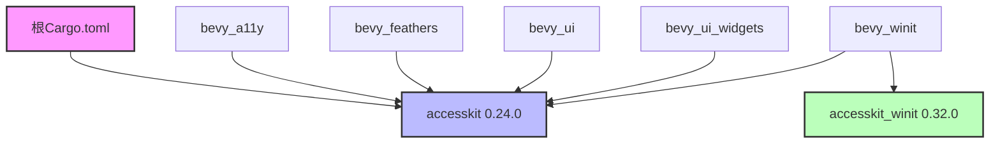

+++
title = "#22937 Bump the accesskit group with 2 updates"
date = "2026-02-16T00:00:00"
draft = false
template = "pull_request_page.html"
in_search_index = false

[extra]
current_language = "zh-cn"
available_languages = {"en" = { name = "English", url = "/pull_request/bevy/2026-02/pr-22937-en-20260216" }, "zh-cn" = { name = "中文", url = "/pull_request/bevy/2026-02/pr-22937-zh-cn-20260216" }}
+++

# Bump the accesskit group with 2 updates

## 基本信息
- **标题**: Bump the accesskit group with 2 updates
- **PR链接**: https://github.com/bevyengine/bevy/pull/22937
- **作者**: app/dependabot
- **状态**: 已合并
- **标签**: C-Dependencies
- **创建时间**: 2026-02-13T06:54:33Z
- **合并时间**: 2026-02-16T19:10:07Z
- **合并者**: alice-i-cecile

## 描述翻译
更新 [accesskit](https://github.com/AccessKit/accesskit) 和 [accesskit_winit](https://github.com/AccessKit/accesskit) 的依赖要求，以允许使用最新版本。
将 `accesskit` 更新至 0.24.0
<details>
<summary>发布说明</summary>
<p><em>来源自 <a href="https://github.com/AccessKit/accesskit/releases">accesskit的发布页面</a>.</em></p>
<blockquote>
<h2>accesskit_windows: v0.24.0</h2>
<h2><a href="https://github.com/AccessKit/accesskit/compare/accesskit_windows-v0.23.2...accesskit_windows-v0.24.0">0.24.0</a> (2024-10-31)</h2>
<h3>⚠ 破坏性变更</h3>
<ul>
<li>将 <code>name</code> 重命名为 <code>label</code>，并使用 <code>value</code> 作为标签内容 (<a href="https://redirect.github.com/AccessKit/accesskit/issues/475">#475</a>)</li>
<li>将 <code>NodeBuilder</code> 重命名为 <code>Node</code>，并将旧的 <code>Node</code> 重命名为 <code>FrozenNode</code> (<a href="https://redirect.github.com/AccessKit/accesskit/issues/476">#476</a>)</li>
<li>将 <code>Role::InlineTextBox</code> 重命名为 <code>TextRun</code> (<a href="https://redirect.github.com/AccessKit/accesskit/issues/473">#473</a>)</li>
<li>移除 <code>DefaultActionVerb</code> (<a href="https://redirect.github.com/AccessKit/accesskit/issues/472">#472</a>)</li>
<li>使核心crate变为no-std (<a href="https://redirect.github.com/AccessKit/accesskit/issues/468">#468</a>)</li>
</ul>
<h3>新特性</h3>
<ul>
<li>使核心crate变为no-std (<a href="https://redirect.github.com/AccessKit/accesskit/issues/468">#468</a>) (<a href="https://github.com/AccessKit/accesskit/commit/2fa0d3f5b2b7ac11ef1751c133706f29e548bd6d">2fa0d3f</a>)</li>
</ul>
<h3>代码重构</h3>
<ul>
<li>移除 <code>DefaultActionVerb</code> (<a href="https://redirect.github.com/AccessKit/accesskit/issues/472">#472</a>) (<a href="https://github.com/AccessKit/accesskit/commit/ef3b0038224459094f650368412650bc3b69526b">ef3b003</a>)</li>
<li>将 <code>name</code> 重命名为 <code>label</code>，并使用 <code>value</code> 作为标签内容 (<a href="https://redirect.github.com/AccessKit/accesskit/issues/475">#475</a>) (<a href="https://github.com/AccessKit/accesskit/commit/e0053a5399929e8e0d4f07aa18de604ed8766ace">e0053a5</a>)</li>
<li>将 <code>NodeBuilder</code> 重命名为 <code>Node</code>，并将旧的 <code>Node</code> 重命名为 <code>FrozenNode</code> (<a href="https://redirect.github.com/AccessKit/accesskit/issues/476">#476</a>) (<a href="https://github.com/AccessKit/accesskit/commit/7d8910e35f7bc0543724cc124941a3bd0304bcc0">7d8910e</a>)</li>
<li>将 <code>Role::InlineTextBox</code> 重命名为 <code>TextRun</code> (<a href="https://redirect.github.com/AccessKit/accesskit/issues/473">#473</a>) (<a href="https://github.com/AccessKit/accesskit/commit/29fa34125a811bd3a0f9da579a9f35c9da90bf29">29fa341</a>)</li>
</ul>
<h3>依赖项</h3>
<ul>
<li>以下工作空间依赖项已更新
<ul>
<li>依赖项
<ul>
<li>accesskit 从 0.16.3 升级到 0.17.0</li>
<li>accesskit_consumer 从 0.24.3 升级到 0.25.0</li>
</ul>
</li>
</ul>
</li>
</ul>
</blockquote>
</details>
<details>
<summary>提交记录</summary>
<ul>
<li><a href="https://github.com/AccessKit/accesskit/commit/528fba56534d06551d8ce8c28cb444bd18ed1cfc"><code>528fba5</code></a> chore: release main (<a href="https://redirect.github.com/AccessKit/accesskit/issues/685">#685</a>)</li>
<li><a href="https://github.com/AccessKit/accesskit/commit/b27f7ed7e39d7561f4f03c1fd4a411a75c305330"><code>b27f7ed</code></a> deps: Update windows-rs to 0.62 (<a href="https://redirect.github.com/AccessKit/accesskit/issues/682">#682</a>)</li>
<li><a href="https://github.com/AccessKit/accesskit/commit/f8c22cbb53ce6b1859adeff3c0b7154ad9e1f25e"><code>f8c22cb</code></a> fix!: Update minimum supported Rust version to 1.85 (<a href="https://redirect.github.com/AccessKit/accesskit/issues/683">#683</a>)</li>
<li><a href="https://github.com/AccessKit/accesskit/commit/a2269bbfdeb3f193e13e753e04f4ba0d1afde68c"><code>a2269bb</code></a> chore: release main (<a href="https://redirect.github.com/AccessKit/accesskit/issues/680">#680</a>)</li>
<li><a href="https://github.com/AccessKit/accesskit/commit/13a37d144e2fafceaf26e7645f6acc679ccb2f34"><code>13a37d1</code></a> fix: Emit initial focus event for active descendant node (<a href="https://redirect.github.com/AccessKit/accesskit/issues/681">#681</a>)</li>
<li><a href="https://github.com/AccessKit/accesskit/commit/98f9342a420df32c18d567dc7c4ea2522b241ec9"><code>98f9342</code></a> fix: Use proper bundle key for Android URL property (<a href="https://redirect.github.com/AccessKit/accesskit/issues/679">#679</a>)</li>
<li><a href="https://github.com/AccessKit/accesskit/commit/828979e5f668bc8c4ceba018d417956a5c69b2bd"><code>828979e</code></a> fix: Fix next word and line at the end of text runs (<a href="https://redirect.github.com/AccessKit/accesskit/issues/678">#678</a>)</li>
<li>完整差异请查看 <a href="https://github.com/AccessKit/accesskit/compare/accesskit-v0.23.0...accesskit-v0.24.0">比较视图</a></li>
</ul>
</details>
<br />

将 `accesskit_winit` 更新至 0.32.0
<details>
<summary>发布说明</summary>
<p><em>来源自 <a href="https://github.com/AccessKit/accesskit/releases">accesskit_winit的发布页面</a>.</em></p>
<blockquote>
<h2>accesskit_winit: v0.32.0</h2>
<h2><a href="https://github.com/AccessKit/accesskit/compare/accesskit_winit-v0.31.1...accesskit_winit-v0.32.0">0.32.0</a> (2026-02-01)</h2>
<h3>⚠ 破坏性变更</h3>
<ul>
<li>将最低支持的Rust版本更新至1.85 (<a href="https://redirect.github.com/AccessKit/accesskit/issues/683">#683</a>)</li>
</ul>
<h3>错误修复</h3>
<ul>
<li>将最低支持的Rust版本更新至1.85 (<a href="https://redirect.github.com/AccessKit/accesskit/issues/683">#683</a>) (<a href="https://github.com/AccessKit/accesskit/commit/f8c22cbb53ce6b1859adeff3c0b7154ad9e1f25e">f8c22cb</a>)</li>
</ul>
<h3>依赖项</h3>
<ul>
<li>以下工作空间依赖项已更新
<ul>
<li>依赖项
<ul>
<li>accesskit 从 0.23.0 升级到 0.24.0</li>
<li>accesskit_windows 从 0.31.1 升级到 0.32.0</li>
<li>accesskit_macos 从 0.24.1 升级到 0.25.0</li>
<li>accesskit_unix 从 0.19.1 升级到 0.20.0</li>
<li>accesskit_android 从 0.6.1 升级到 0.7.0</li>
</ul>
</li>
</ul>
</li>
</ul>
</blockquote>
</details>
<details>
<summary>提交记录</summary>
<ul>
<li><a href="https://github.com/AccessKit/accesskit/commit/528fba56534d06551d8ce8c28cb444bd18ed1cfc"><code>528fba5</code></a> chore: release main (<a href="https://redirect.github.com/AccessKit/accesskit/issues/685">#685</a>)</li>
<li><a href="https://github.com/AccessKit/accesskit/commit/b27f7ed7e39d7561f4f03c1fd4a411a75c305330"><code>b27f7ed</code></a> deps: Update windows-rs to 0.62 (<a href="https://redirect.github.com/AccessKit/accesskit/issues/682">#682</a>)</li>
<li><a href="https://github.com/AccessKit/accesskit/commit/f8c22cbb53ce6b1859adeff3c0b7154ad9e1f25e"><code>f8c22cb</code></a> fix!: Update minimum supported Rust version to 1.85 (<a href="https://redirect.github.com/AccessKit/accesskit/issues/683">#683</a>)</li>
<li><a href="https://github.com/AccessKit/accesskit/commit/a2269bbfdeb3f193e13e753e04f4ba0d1afde68c"><code>a2269bb</code></a> chore: release main (<a href="https://redirect.github.com/AccessKit/accesskit/issues/680">#680</a>)</li>
<li><a href="https://github.com/AccessKit/accesskit/commit/13a37d144e2fafceaf26e7645f6acc679ccb2f34"><code>13a37d1</code></a> fix: Emit initial focus event for active descendant node (<a href="https://redirect.github.com/AccessKit/accesskit/issues/681">#681</a>)</li>
<li><a href="https://github.com/AccessKit/accesskit/commit/98f9342a420df32c18d567dc7c4ea2522b241ec9"><code>98f9342</code></a> fix: Use proper bundle key for Android URL property (<a href="https://redirect.github.com/AccessKit/accesskit/issues/679">#679</a>)</li>
<li><a href="https://github.com/AccessKit/accesskit/commit/828979e5f668bc8c4ceba018d417956a5c69b2bd"><code>828979e</code></a> fix: Fix next word and line at the end of text runs (<a href="https://redirect.github.com/AccessKit/accesskit/issues/678">#678</a>)</li>
<li>完整差异请查看 <a href="https://github.com/AccessKit/accesskit/compare/accesskit_winit-v0.31.0...accesskit_winit-v0.32.0">比较视图</a></li>
</ul>
</details>
<br />


只要您不自行修改此PR，Dependabot将解决所有冲突。您也可以通过评论`@dependabot rebase`手动触发rebase。

[//]: # (dependabot-automerge-start)
[//]: # (dependabot-automerge-end)

---

<details>
<summary>Dependabot命令和选项</summary>
<br />

您可以通过在此PR上评论来触发Dependabot操作：
- `@dependabot rebase` 将rebase此PR
- `@dependabot recreate` 将重新创建此PR，覆盖已对其进行的任何编辑
- `@dependabot show <dependency name> ignore conditions` 将显示指定依赖项的所有忽略条件
- `@dependabot ignore <dependency name> major version` 将关闭此组更新PR，并停止Dependabot为该特定依赖项的主要版本创建更多PR（除非您取消忽略此特定依赖项的主要版本或自行升级到该版本）
- `@dependabot ignore <dependency name> minor version` 将关闭此组更新PR，并停止Dependabot为该特定依赖项的次要版本创建更多PR（除非您取消忽略此特定依赖项的次要版本或自行升级到该版本）
- `@dependabot ignore <dependency name>` 将关闭此组更新PR，并停止Dependabot为该特定依赖项创建更多PR（除非您取消忽略此特定依赖项或自行升级到该版本）
- `@dependabot unignore <dependency name>` 将移除指定依赖项的所有忽略条件
- `@dependabot unignore <dependency name> <ignore condition>` 将移除指定依赖项的忽略条件


</details>

## 这个Pull Request的故事

### 依赖管理中的版本同步挑战
在开源项目开发中，依赖管理是一个持续的任务。对于像Bevy这样的游戏引擎，保持底层依赖库的最新版本至关重要，这不仅能获得安全补丁和性能改进，还能确保与生态系统的兼容性。PR #22937就是这样一个典型的依赖更新任务，由Dependabot自动生成，目的是将accesskit及其相关包更新到最新版本。

AccessKit是一个为应用程序提供无障碍（accessibility）支持的库，它允许屏幕阅读器等辅助技术访问应用程序的UI信息。在Bevy中，多个模块依赖AccessKit来实现无障碍功能，包括bevy_a11y（专门的无障碍支持模块）、bevy_ui（UI系统）、bevy_winit（窗口管理）等。

### 评估破坏性变更的影响
这次更新涉及两个主要包：accesskit从0.23.0升级到0.24.0，以及accesskit_winit从0.31升级到0.32.0。从发布说明可以看出，accesskit 0.24.0包含多个破坏性变更（breaking changes）：

1. **API重命名**：`name`字段重命名为`label`，并使用`value`作为标签内容
2. **类型重构**：`NodeBuilder`重命名为`Node`，旧的`Node`重命名为`FrozenNode`
3. **枚举项更新**：`Role::InlineTextBox`重命名为`TextRun`
4. **类型移除**：移除了`DefaultActionVerb`
5. **架构变更**：使核心crate变为no-std（无标准库依赖）

这些变更意味着Bevy中任何直接使用AccessKit API的代码都需要相应调整。幸运的是，从PR的修改内容来看，这次更新只涉及版本号变更，没有修改任何实际的源代码。这表明Bevy可能通过抽象层或间接使用AccessKit，或者这些破坏性变更影响的API在Bevy当前的使用中没有被直接调用。

### 实施简单的版本号更新
由于这是一个由Dependabot自动生成的PR，实施过程相对简单直接。需要更新所有引用accesskit和accesskit_winit的Cargo.toml文件中的版本号。查看修改内容，共有5个文件需要更新：

1. **根目录的Cargo.toml**：更新accesskit从"0.23"到"0.24"
2. **bevy_a11y/Cargo.toml**：更新accesskit依赖
3. **bevy_feathers/Cargo.toml**：更新accesskit依赖  
4. **bevy_ui/Cargo.toml**：更新accesskit依赖
5. **bevy_ui_widgets/Cargo.toml**：更新accesskit依赖
6. **bevy_winit/Cargo.toml**：同时更新accesskit和accesskit_winit的版本

从技术角度看，这些修改虽然简单，但需要确保所有相关模块同步更新，避免版本不一致导致的编译问题。由于accesskit_winit 0.32.0的发布说明中提到它将最低支持的Rust版本提升到1.85，这意味着Bevy项目也需要相应调整其最低Rust版本要求，但这可能已在其他地方处理。

### 依赖更新的连锁反应
这种依赖更新在大型项目中很常见，但需要仔细测试。AccessKit作为无障碍支持的基础库，其变更可能影响：
1. **编译兼容性**：确保新版本与Bevy的其他依赖兼容
2. **运行时行为**：虽然API变更，但功能应保持向后兼容
3. **跨平台支持**：AccessKit支持多个平台（Windows、macOS、Unix、Android），更新需要确保所有平台继续正常工作

由于这是一个破坏性变更的版本更新，项目维护者需要在合并前运行完整的测试套件，确保所有功能正常工作。从PR被alice-i-cecile合并的事实来看，测试可能已经通过，或者团队决定接受这些变更的风险。

### 版本同步的最佳实践
这个PR展示了开源项目中依赖管理的几个重要方面：
1. **自动化工具的价值**：Dependabot自动检测依赖更新，节省了手动检查的时间
2. **版本一致性**：所有使用相同依赖的模块必须同步更新版本号
3. **破坏性变更管理**：即使只是版本号更新，也需要仔细评估发布说明中的破坏性变更
4. **测试的重要性**：任何依赖更新，尤其是主要版本更新，都需要充分的测试

对于使用AccessKit的开发者来说，这次更新提醒他们需要检查自己的代码是否使用了被重命名或移除的API。幸运的是，由于Rust的强类型系统和编译器错误信息，这些变更通常会在编译时被发现，而不是在运行时导致难以调试的问题。

## 可视化表示



## 关键文件变更

### 1. `Cargo.toml` (根目录)
**变更描述**：更新根工作空间中accesskit的版本要求，确保整个项目使用一致版本。
```toml
# 变更前：
accesskit = "0.23"

# 变更后：
accesskit = "0.24"
```

### 2. `crates/bevy_a11y/Cargo.toml`
**变更描述**：更新无障碍专用模块的accesskit依赖版本。
```toml
# 变更前：
accesskit = { version = "0.23", default-features = false }

# 变更后：
accesskit = { version = "0.24", default-features = false }
```

### 3. `crates/bevy_feathers/Cargo.toml`
**变更描述**：更新feathers模块的accesskit依赖版本。
```toml
# 变更前：
accesskit = "0.23"

# 变更后：
accesskit = "0.24"
```

### 4. `crates/bevy_ui/Cargo.toml`
**变更描述**：更新UI系统的accesskit依赖版本，确保UI组件的无障碍信息正确传递。
```toml
# 变更前：
accesskit = "0.23"

# 变更后：
accesskit = "0.24"
```

### 5. `crates/bevy_ui_widgets/Cargo.toml`
**变更描述**：更新UI小部件系统的accesskit依赖版本。
```toml
# 变更前：
accesskit = "0.23"

# 变更后：
accesskit = "0.24"
```

### 6. `crates/bevy_winit/Cargo.toml`
**变更描述**：这是变更最多的文件，同时更新了accesskit和accesskit_winit两个依赖，因为winit模块负责窗口管理和平台特定的无障碍集成。
```toml
# 变更前：
accesskit_winit = { version = "0.31", default-features = false, features = [
  "rwh_06",
] }
accesskit = "0.23"

# 变更后：
accesskit_winit = { version = "0.32", default-features = false, features = [
  "rwh_06",
] }
accesskit = "0.24"
```

## 完整代码差异

```
diff --git a/Cargo.toml b/Cargo.toml
index b9358f62f9d5f..c216b686e2ca2 100644
--- a/Cargo.toml
+++ b/Cargo.toml
@@ -758,7 +758,7 @@ argh = "0.1.12"
 thiserror = "2.0"
 event-listener = "5.3.0"
 anyhow = "1"
-accesskit = "0.23"
+accesskit = "0.24"
 nonmax = "0.5"
 gltf = "1.4"
 
diff --git a/crates/bevy_a11y/Cargo.toml b/crates/bevy_a11y/Cargo.toml
index 36b0ee00741e5..1b551588c5dc1 100644
--- a/crates/bevy_a11y/Cargo.toml
+++ b/crates/bevy_a11y/Cargo.toml
@@ -46,7 +46,7 @@ bevy_ecs = { path = "../bevy_ecs", version = "0.19.0-dev", default-features = fa
 bevy_reflect = { path = "../bevy_reflect", version = "0.19.0-dev", default-features = false, optional = true }
 
 # other
-accesskit = { version = "0.23", default-features = false }
+accesskit = { version = "0.24", default-features = false }
 serde = { version = "1", default-features = false, features = [
   "alloc",
 ], optional = true }
diff --git a/crates/bevy_feathers/Cargo.toml b/crates/bevy_feathers/Cargo.toml
index 0247e9690fc9e..5cd73c946acca 100644
--- a/crates/bevy_feathers/Cargo.toml
+++ b/crates/bevy_feathers/Cargo.toml
@@ -35,7 +35,7 @@ bevy_derive = { path = "../bevy_derive", version = "0.19.0-dev" }
 smol_str = { version = "0.2", default-features = false }
 
 # other
-accesskit = "0.23"
+accesskit = "0.24"
 
 [features]
 default = []
diff --git a/crates/bevy_ui/Cargo.toml b/crates/bevy_ui/Cargo.toml
index 8518861ed9143..5ee404dfad752 100644
--- a/crates/bevy_ui/Cargo.toml
+++ b/crates/bevy_ui/Cargo.toml
@@ -49,7 +49,7 @@ uuid = { version = "1.1", features = ["v4"], optional = true }
 thiserror = { version = "2", default-features = false }
 derive_more = { version = "2", default-features = false, features = ["from"] }
 smallvec = { version = "1", default-features = false }
-accesskit = "0.23"
+accesskit = "0.24"
 tracing = { version = "0.1", default-features = false, features = ["std"] }
 
 [dev-dependencies]
diff --git a/crates/bevy_ui_widgets/Cargo.toml b/crates/bevy_ui_widgets/Cargo.toml
index 0e5093b3561c0..7ad76257c13df 100644
--- a/crates/bevy_ui_widgets/Cargo.toml
+++ b/crates/bevy_ui_widgets/Cargo.toml
@@ -23,7 +23,7 @@ bevy_reflect = { path = "../bevy_reflect", version = "0.19.0-dev" }
 bevy_ui = { path = "../bevy_ui", version = "0.19.0-dev" }
 
 # other
-accesskit = "0.23"
+accesskit = "0.24"
 
 [features]
 default = []
diff --git a/crates/bevy_winit/Cargo.toml b/crates/bevy_winit/Cargo.toml
index 5b7416b2eb581..850480dca8210 100644
--- a/crates/bevy_winit/Cargo.toml
+++ b/crates/bevy_winit/Cargo.toml
@@ -64,12 +64,12 @@ bytemuck = { version = "1.5", optional = true }
 # other
 # feature rwh_06 refers to window_raw_handle@v0.6
 winit = { version = "0.30", default-features = false, features = ["rwh_06"] }
-accesskit_winit = { version = "0.31", default-features = false, features = [
+accesskit_winit = { version = "0.32", default-features = false, features = [
   "rwh_06",
 ] }
 approx = { version = "0.5", default-features = false }
 cfg-if = "1.0"
-accesskit = "0.23"
+accesskit = "0.24"
 tracing = { version = "0.1", default-features = false, features = ["std"] }
 
 [target.'cfg(target_os = "android")'.dependencies]
```

## 进一步阅读

1. **AccessKit官方文档**：https://accesskit.dev/ - 了解AccessKit库的完整功能和使用方法
2. **无障碍开发指南**：https://www.w3.org/WAI/standards-guidelines/ - W3C的无障碍标准指南
3. **Rust依赖管理最佳实践**：https://doc.rust-lang.org/cargo/reference/manifest.html - Cargo.toml文件格式和依赖管理
4. **Dependabot文档**：https://docs.github.com/en/code-security/dependabot - 了解如何配置和使用Dependabot自动化依赖更新
5. **Semantic Versioning（语义化版本控制）**：https://semver.org/ - 理解版本号的含义和破坏性变更的管理