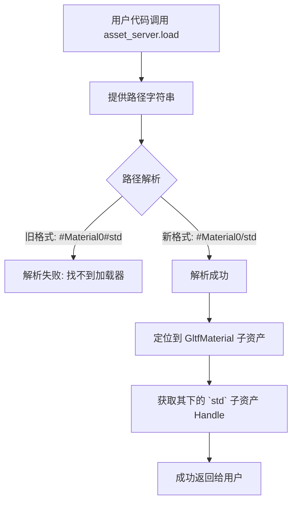

+++
title = "#22943 Pbr GltfExtensionHandler: hashes to slashes"
date = "2026-02-17T00:00:00"
draft = false
template = "pull_request_page.html"
in_search_index = false

[extra]
current_language = "zh-cn"
available_languages = {"en" = { name = "English", url = "/pull_request/bevy/2026-02/pr-22943-en-20260217" }, "zh-cn" = { name = "中文", url = "/pull_request/bevy/2026-02/pr-22943-zh-cn-20260217" }}
labels = ["C-Bug", "A-Assets", "C-Usability", "M-Migration-Guide", "A-glTF"]
+++

# Title
Pbr GltfExtensionHandler: hashes to slashes

## Basic Information
- **Title**: Pbr GltfExtensionHandler: hashes to slashes
- **PR Link**: https://github.com/bevyengine/bevy/pull/22943
- **Author**: ChristopherBiscardi
- **Status**: MERGED
- **Labels**: C-Bug, A-Assets, C-Usability, S-Ready-For-Final-Review, M-Migration-Guide, A-glTF
- **Created**: 2026-02-13T18:52:53Z
- **Merged**: 2026-02-17T19:28:05Z
- **Merged By**: alice-i-cecile

## Description Translation
### 目标
资产服务器无法很好地处理包含多个 `#` 的路径，这导致用户尝试加载新样式的标准材质（在 `GltfMaterial`/pbr 反转之后）时出现以下错误：

```rust
let handle: Handle<StandardMaterial> = 
    asset_server.load("models/animated/Fox.glb#Material0#std");
```

并失败，错误信息如下：

> 2026-02-13T18:39:46.765922Z ERROR bevy_asset::server: Could not find an asset loader matching: Loader Name: None; Asset Type: Some(TypeId(0x84f48d0a22ca9da8cd205decd68dcefa)); Extension: None; Path: Some("models/animated/Fox.glb#Material0#std");

### 解决方案
根据 @andriyDev 的建议，改用斜杠可以修复此路径问题。

```rust
let handle: Handle<StandardMaterial> = 
    asset_server.load("models/animated/Fox.glb#Material0/std");
```

### 测试
使用 gltf 动画狐狸示例，按上述方式加载材质，并将其应用到 100x100x100 立方体上：


---
由于路径是资产服务器的唯一真实来源，迁移指南使用路径，并且当前没有用于新标准材质处理的 `GltfAssetLabel`。（这应该在另一个 PR 中修复）。

## The Story of This Pull Request

这个PR解决了一个在Bevy 0.19版本中引入的glTF材质加载的回归问题（regression）。问题的核心是资产路径（asset path）的解析规则与新的材质系统架构不匹配。

**问题根源在于资产路径的语法。** 在Bevy中，`#` 字符用于分隔主资产文件与其内部的子资产（sub-asset）。例如，`"model.glb#Mesh0"` 指向 `model.glb` 文件中的第一个网格。在0.18版本，一个glTF材质可以直接通过 `#Material0` 加载为 `StandardMaterial`。然而，在0.19版本，为了实现渲染逻辑与glTF数据加载的解耦，引入了一个中间层 `GltfMaterial` 来精确表示glTF文件中的原始材质数据。相应的，为了获取由这些数据转换而来的、实际用于渲染的 `StandardMaterial`，系统需要一个新的标识符。

最初的实现方案是简单地追加 `#std` 来生成这个新标识符。这导致了形如 `"model.glb#Material0#std"` 的路径。**这里出现了问题：资产服务器将第二个 `#` 也解释为子资产分隔符**，它试图将 `Material0#std` 整体识别为一个子资产标签，但系统中并未注册这样的标签，因此加载失败，并报告找不到匹配的资产加载器。

解决方案直接而有效：**将子资产层级分隔符从 `#` 改为 `/`**。在Bevy的资产路径系统中，`/` 用于表示更深层级的嵌套关系。因此，将路径改为 `"model.glb#Material0/std"` 后，资产服务器能够正确解析：首先找到 `model.glb#Material0` 对应的 `GltfMaterial` 资产，然后在其下找到名为 `std` 的子资产，即我们需要的 `StandardMaterial`。这个改动得到了核心贡献者 @andriyDev 的建议支持。

从实现角度看，改动非常集中。在 `crates/bevy_pbr/src/gltf.rs` 文件中，`GltfExtensionHandlerPbr` 这个扩展处理器的实现被修改。它的职责之一就是在加载glTF时，为每个原始材质生成对应的 `StandardMaterial` 并作为子资产注册。修改涉及四处对 `std_label` 的构造，将格式字符串从 `format!("{}#std", ...)` 统一改为 `format!("{}/std", ...)`。这确保了无论在创建默认材质、注册材质实体还是后续查询时，生成的路径标签都使用新的、正确的语法。

```rust
// 关键修改示例（来自 diff）：
// 之前：
let std_label = format!("{}#std", material_label);
// 之后：
let std_label = format!("{}/std", material_label);
```

这个修复不仅解决了代码中的bug，也及时更新了面向用户的文档。PR 同时修改了 `release-content/migration-guides/gltf_pbr.md`，在迁移指南中明确展示了0.18和0.19版本加载材质的不同方式，并给出了使用 `/std` 后缀的正确代码示例。这对于用户平滑升级至关重要，避免了因API变更而导致的困惑和错误。

从工程角度看，这个PR揭示了资产路径设计中的一个重要约束：`#` 作为顶级子资产分隔符具有唯一性。当需要表达多级资产依赖时，应使用 `/` 来构建层级。这是一个对现有系统约定的正确应用，而非引入新机制。同时，它也凸显了在修改核心数据流（如引入`GltfMaterial`中间层）时，需要全面考虑其对上层API（这里是资产路径字符串）的影响，并及时更新所有相关部分，包括内部代码和外部文档。

## Visual Representation



## Key Files Changed

### `crates/bevy_pbr/src/gltf.rs`
**修改原因**：修复 `GltfExtensionHandlerPbr` 处理器生成的 `StandardMaterial` 子资产路径标签，使其符合资产服务器的解析规则。

**关键修改**：
```rust
// 在 `on_root`, `on_material`, `add_material_to_entity` 等方法中：
// 之前（错误）：
let std_label = format!("{}#std", GltfAssetLabel::DefaultMaterial); // 及其他标签
// 之后（正确）：
let std_label = format!("{}/std", GltfAssetLabel::DefaultMaterial); // 及其他标签
```
**关系**：这是本次修复的核心代码变更，直接解决了资产加载失败的问题。

### `release-content/migration-guides/gltf_pbr.md`
**修改原因**：更新用户文档，反映从 Bevy 0.18 到 0.19 在 glTF 材质加载方式上的突破性变更（breaking change），并展示正确的用法。

**关键修改**：
```markdown
// 新增的迁移说明和示例：
In 0.18, loading a material sub-asset would return a `Handle<StandardMaterial>`.

```rs
let handle: Handle<StandardMaterial> = asset_server.load("models/animated/Fox.glb#Material0");
```

In 0.19, loading a material sub-asset loads a `GltfMaterial` to accurately represent the data in the glTF file.
To load the `StandardMaterial`, use the `/std` suffix when the `bevy_pbr` feature is turned on (the feature is on by default).

```rs
let handle: Handle<GltfMaterial> = asset_server.load("models/animated/Fox.glb#Material0");
let handle_std: Handle<StandardMaterial> = asset_server.load("models/animated/Fox.glb#Material0/std");
```
```
**关系**：此修改与代码修复配套，确保了用户能够根据官方指南正确使用新的API，避免遇到相同的错误。

## Further Reading
1.  **Bevy 资产系统文档**：了解资产路径 (`AssetPath`) 的语法、子资产标签以及加载机制。
2.  **PR #22569**: 本次修复所应对的、最初引入 `GltfMaterial` 与 pbr 反转的主要PR，了解架构变更的完整上下文。
3.  **glTF 2.0 规范**: 理解 `GltfMaterial` 所要精确表示的原始材质数据格式。
4.  **Bevy 迁移指南 (Migration Guides)**: 学习如何应对不同版本间的突破性变更。

# Full Code Diff
diff --git a/crates/bevy_pbr/src/gltf.rs b/crates/bevy_pbr/src/gltf.rs
index e44d6a08d931e..9923a8d74a079 100644
--- a/crates/bevy_pbr/src/gltf.rs
+++ b/crates/bevy_pbr/src/gltf.rs
@@ -103,7 +103,7 @@ impl GltfExtensionHandler for GltfExtensionHandlerPbr {
     fn on_root(&mut self, load_context: &mut LoadContext<'_>, _gltf: &gltf::Gltf) {
         // create the `StandardMaterial` for the glTF `DefaultMaterial` so
         // it can be accessed when meshes don't have materials.
-        let std_label = format!("{}#std", GltfAssetLabel::DefaultMaterial);
+        let std_label = format!("{}/std", GltfAssetLabel::DefaultMaterial);
 
         load_context.add_labeled_asset(
             std_label,
@@ -119,7 +119,7 @@ impl GltfExtensionHandler for GltfExtensionHandlerPbr {
         material_asset: &GltfMaterial,
         material_label: &str,
     ) {
-        let std_label = format!("{}#std", material_label);
+        let std_label = format!("{}/std", material_label);
 
         load_context.add_labeled_asset(
             std_label,
@@ -136,7 +136,7 @@ impl GltfExtensionHandler for GltfExtensionHandlerPbr {
         entity: &mut EntityWorldMut,
         material_label: &str,
     ) {
-        let std_label = format!("{}#std", material_label);
+        let std_label = format!("{}/std", material_label);
         let handle = load_context.get_label_handle::<StandardMaterial>(std_label);
 
         entity.insert(MeshMaterial3d(handle));
diff --git a/release-content/migration-guides/gltf_pbr.md b/release-content/migration-guides/gltf_pbr.md
index cdcbbaf20abc6..a051a192fab85 100644
--- a/release-content/migration-guides/gltf_pbr.md
+++ b/release-content/migration-guides/gltf_pbr.md
@@ -5,6 +5,20 @@ pull_requests: [22569]
 
 Previously, `bevy_gltf` depended on `bevy_pbr`. This meant scene definition was tightly coupled to rendering. This dependency has been inverted, to allow `bevy_gltf` to function without any of the rendering stack present.
 
+In 0.18, loading a material sub-asset would return a `Handle<StandardMaterial>`.
+
+```rs
+let handle: Handle<StandardMaterial> = asset_server.load("models/animated/Fox.glb#Material0");
+```
+
+In 0.19, loading a material sub-asset loads a `GltfMaterial` to accurately represent the data in the glTF file.
+To load the `StandardMaterial`, use the `/std` suffix when the `bevy_pbr` feature is turned on (the feature is on by default).
+
+```rs
+let handle: Handle<GltfMaterial> = asset_server.load("models/animated/Fox.glb#Material0");
+let handle_std: Handle<StandardMaterial> = asset_server.load("models/animated/Fox.glb#Material0/std");
+```
+
 You can disable PBR rendering by initializing `PbrPlugin` as so:
 
 ```rs
```