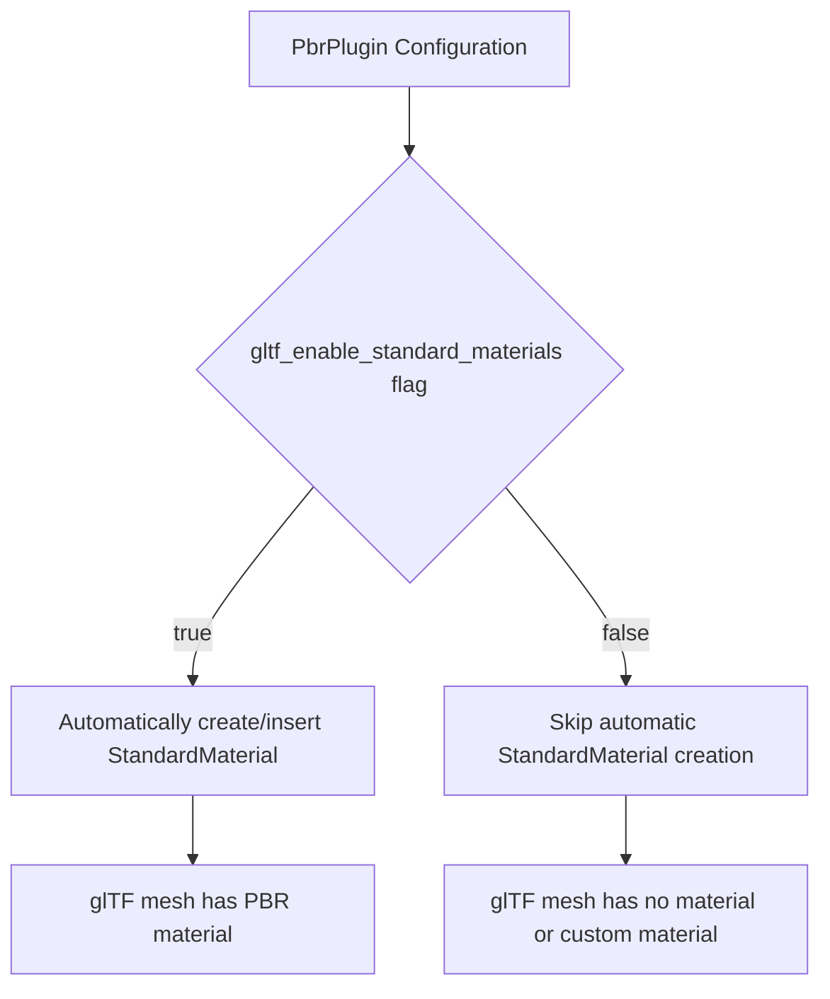

+++
title = "#22944 rename gltf_render_enabled to gltf_enable_standard_materials"
date = "2026-02-18T00:00:00"
draft = false
template = "pull_request_page.html"
in_search_index = true

[taxonomies]
list_display = ["show"]

[extra]
current_language = "en"
available_languages = {"en" = { name = "English", url = "/pull_request/bevy/2026-02/pr-22944-en-20260218" }, "zh-cn" = { name = "中文", url = "/pull_request/bevy/2026-02/pr-22944-zh-cn-20260218" }}
labels = ["D-Trivial", "A-Rendering", "M-Migration-Guide", "A-glTF"]
+++

# Title
## rename gltf_render_enabled to gltf_enable_standard_materials

## Basic Information
- **Title**: rename gltf_render_enabled to gltf_enable_standard_materials
- **PR Link**: https://github.com/bevyengine/bevy/pull/22944
- **Author**: ChristopherBiscardi
- **Status**: MERGED
- **Labels**: D-Trivial, A-Rendering, S-Ready-For-Final-Review, M-Migration-Guide, A-glTF
- **Created**: 2026-02-13T19:41:27Z
- **Merged**: 2026-02-18T01:09:10Z
- **Merged By**: alice-i-cecile

## Description Translation

# Objective

We currently describe the new `gltf_render_enabled` flag as "disabling PBR rendering", which is much broader than what it does in practice. In its current form it controls the construction and insertion of `StandardMaterial`s on entities, but does not affect the PBR rendering functionality of the application, or of glTF assets. (A user could still create their own `StandardMaterial`s or `StandardMaterial` extensions and insert them on the required meshes).

## Solution

Rename the flag to more accurately depict what it does in practice, which is enable/disable the automatic construction and insertion of `StandardMaterial`s when a glTF file is loading.

## Testing

There's only one example that turns this off, `gltf_extension_mesh_2d`, which continues to run as expected.


## The Story of This Pull Request

This pull request addresses a naming inconsistency in Bevy's PBR plugin configuration. The developer identified that the `gltf_render_enabled` flag in the `PbrPlugin` struct had a misleading name. The name suggested it controlled whether PBR rendering was enabled for glTF assets, but in practice, its scope was much narrower.

The actual behavior of the flag is to control whether `StandardMaterial` components are automatically constructed and inserted onto entities when a glTF file is loaded. This is a specific part of the glTF asset loading pipeline. Even with this flag set to `false`, PBR rendering itself remains fully functional. Users could still manually create and attach `StandardMaterial` components to meshes, or use alternative materials. The flag only affects the default material assignment during the glTF import process.

The solution was straightforward: rename the field to `gltf_enable_standard_materials`. This new name directly describes the flag's function—it enables or disables the automatic creation and insertion of standard materials for glTF assets. The change involved updating the field name in three places: the struct definition and its default value in the `PbrPlugin`, the conditional logic that uses it, and the single example that explicitly sets it to `false`.

From an engineering perspective, this is a classic example of improving code clarity through precise naming. Accurate naming reduces cognitive load for developers reading the code and prevents misunderstandings about the system's behavior. The fix also required updating the migration guide, ensuring users upgrading their projects would be aware of the renamed field.

The implementation was minimal and surgical. The core logic remained unchanged; only the identifier was updated to better reflect its intent. The example `gltf_extension_mesh_2d` was updated and served as the test case, confirming the change didn't break existing functionality.

## Visual Representation



## Key Files Changed

### 1. `crates/bevy_pbr/src/lib.rs`
**What changed:** The field `gltf_render_enabled` in the `PbrPlugin` struct was renamed to `gltf_enable_standard_materials`. The associated documentation comment and default value were updated accordingly. The conditional check that uses this flag was also updated.

**Why:** To give the configuration flag a name that accurately describes its specific function.

**Code Snippet:**
```rust
// File: crates/bevy_pbr/src/lib.rs
// Before:
pub struct PbrPlugin {
    // ...
    /// Renders GLTFs with PBR.
    pub gltf_render_enabled: bool,
}

impl Default for PbrPlugin {
    fn default() -> Self {
        Self {
            // ...
            gltf_render_enabled: true,
        }
    }
}

impl Plugin for PbrPlugin {
    fn build(&self, app: &mut App) {
        // ...
        if self.gltf_render_enabled {
            gltf::add_gltf(app);
        }
    }
}

// After:
pub struct PbrPlugin {
    // ...
    /// Builds and inserts `StandardMaterial` when loading glTF files
    pub gltf_enable_standard_materials: bool,
}

impl Default for PbrPlugin {
    fn default() -> Self {
        Self {
            // ...
            gltf_enable_standard_materials: true,
        }
    }
}

impl Plugin for PbrPlugin {
    fn build(&self, app: &mut App) {
        // ...
        if self.gltf_enable_standard_materials {
            gltf::add_gltf(app);
        }
    }
}
```

### 2. `examples/gltf/gltf_extension_mesh_2d.rs`
**What changed:** The example that disables the automatic standard material creation was updated to use the new field name.

**Why:** To keep the example code functional and in sync with the API change.

**Code Snippet:**
```rust
// File: examples/gltf/gltf_extension_mesh_2d.rs
// Before:
.set(PbrPlugin {
    gltf_render_enabled: false,
    ..Default::default()
})

// After:
.set(PbrPlugin {
    gltf_enable_standard_materials: false,
    ..Default::default()
})
```

### 3. `release-content/migration-guides/gltf_pbr.md`
**What changed:** The migration guide documentation was updated to show the new field name.

**Why:** To provide correct instructions for users migrating their code after the rename.

**Code Snippet:**
```markdown
// File: release-content/migration-guides/gltf_pbr.md
// Before:
PbrPlugin {
    gltf_render_enabled: false,
    ..Default::default()
}

// After:
PbrPlugin {
    gltf_enable_standard_materials: false,
    ..Default::default()
}
```

## Further Reading

1. Bevy's official documentation on [PBR (Physically Based Rendering)](https://bevyengine.org/learn/book/3d-rendering/pbr/)
2. The glTF specification and how materials are defined: [Khronos glTF 2.0 Specification](https://github.com/KhronosGroup/glTF/tree/main/specification/2.0#materials)
3. Bevy's asset loading system and the `AssetServer`: [Bevy Assets](https://bevyengine.org/learn/book/assets/)
4. Principles of clean code and meaningful naming: *Clean Code* by Robert C. Martin, specifically the chapter on "Meaningful Names"

# Full Code Diff
```diff
diff --git a/crates/bevy_pbr/src/lib.rs b/crates/bevy_pbr/src/lib.rs
index ed8a993fee4e2..4ef2fb6c030d8 100644
--- a/crates/bevy_pbr/src/lib.rs
+++ b/crates/bevy_pbr/src/lib.rs
@@ -139,8 +139,8 @@ pub struct PbrPlugin {
     pub use_gpu_instance_buffer_builder: bool,
     /// Debugging flags that can optionally be set when constructing the renderer.
     pub debug_flags: RenderDebugFlags,
-    /// Renders GLTFs with PBR.
-    pub gltf_render_enabled: bool,
+    /// Builds and inserts `StandardMaterial` when loading glTF files
+    pub gltf_enable_standard_materials: bool,
 }
 
 impl Default for PbrPlugin {
@@ -150,7 +150,7 @@ impl Default for PbrPlugin {
             add_default_deferred_lighting_plugin: true,
             use_gpu_instance_buffer_builder: true,
             debug_flags: RenderDebugFlags::default(),
-            gltf_render_enabled: true,
+            gltf_enable_standard_materials: true,
         }
     }
 }
@@ -224,7 +224,7 @@ impl Plugin for PbrPlugin {
             ))
             .add_plugins((ScatteringMediumPlugin, AtmospherePlugin));
 
-        if self.gltf_render_enabled {
+        if self.gltf_enable_standard_materials {
             gltf::add_gltf(app);
         }
 
diff --git a/examples/gltf/gltf_extension_mesh_2d.rs b/examples/gltf/gltf_extension_mesh_2d.rs
index 11cdd792b6bf7..d1eb8ec578f65 100644
--- a/examples/gltf/gltf_extension_mesh_2d.rs
+++ b/examples/gltf/gltf_extension_mesh_2d.rs
@@ -44,7 +44,7 @@ fn main() {
                         .add_custom_vertex_attribute("_BARYCENTRIC", ATTRIBUTE_BARYCENTRIC),
                 )
                 .set(PbrPlugin {
-                    gltf_render_enabled: false,
+                    gltf_enable_standard_materials: false,
                     ..Default::default()
                 }),
             GltfToMesh2dPlugin,
diff --git a/release-content/migration-guides/gltf_pbr.md b/release-content/migration-guides/gltf_pbr.md
index a051a192fab85..0547aec98e90b 100644
--- a/release-content/migration-guides/gltf_pbr.md
+++ b/release-content/migration-guides/gltf_pbr.md
@@ -23,7 +23,7 @@ You can disable PBR rendering by initializing `PbrPlugin` as so:
 
 ```rs
 PbrPlugin {
-    gltf_render_enabled: false,
+    gltf_enable_standard_materials: false,
     ..Default::default()
 }
 ```
```