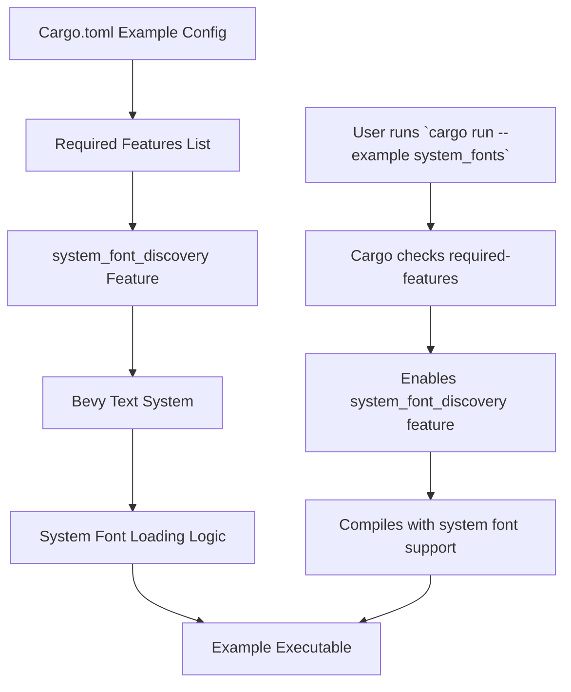

+++
title = "#22946 Fix text examples post parley migration: system_fonts & generic_font_families"
date = "2026-02-14T00:00:00"
draft = false
template = "pull_request_page.html"
in_search_index = true

[taxonomies]
list_display = ["show"]

[extra]
current_language = "en"
available_languages = {"en" = { name = "English", url = "/pull_request/bevy/2026-02/pr-22946-en-20260214" }, "zh-cn" = { name = "中文", url = "/pull_request/bevy/2026-02/pr-22946-zh-cn-20260214" }}
labels = ["D-Trivial", "C-Examples", "A-Text"]
+++

# Title
## Fix text examples post parley migration: system_fonts & generic_font_families

## Basic Information
- **Title**: Fix text examples post parley migration: system_fonts & generic_font_families
- **PR Link**: https://github.com/bevyengine/bevy/pull/22946
- **Author**: kfc35
- **Status**: MERGED
- **Labels**: D-Trivial, C-Examples, S-Ready-For-Final-Review, A-Text
- **Created**: 2026-02-14T02:30:40Z
- **Merged**: 2026-02-14T17:25:51Z
- **Merged By**: alice-i-cecile

## Description Translation
**Objective**
- Fixes #22940

**Solution**
- Require the new feature `system_font_discovery` for the examples, which was added during the parley migration to explicitly enable loading fonts from the system.

**Testing**
`cargo run --example system_fonts --features="system_font_discovery"` works correctly ~~(although I should note that chinese characters do not show up correctly, don't know if that's an issue on the bevy side)~~ the text is ok if it's using the font, but not if it's not, and I guess that makes sense


`cargo run --example generic_font_families --features="system_font_discovery"` works correctly


## The Story of This Pull Request

This PR addresses a straightforward but important configuration issue in the Bevy game engine's example system. The core problem was that two text rendering examples—`system_fonts` and `generic_font_families`—stopped working after a significant text system refactoring known as the "parley migration."

The root cause was a feature flag mismatch. During the parley migration, the team introduced a new Cargo feature called `system_font_discovery` to gate the functionality for loading fonts from the operating system. This is a common pattern in Rust projects for conditional compilation, allowing users to opt into certain functionality that may have platform-specific dependencies or increase compilation time. However, the example configurations in `Cargo.toml` were not updated to declare their dependency on this new feature.

The developer, kfc35, diagnosed the issue correctly. When users attempted to run the examples with the standard command `cargo run --example system_fonts`, the necessary code for finding system fonts was not compiled, causing the examples to fail. The solution was purely additive and non-breaking: update the metadata for each example in the workspace's `Cargo.toml` file to specify the `required-features` key.

The implementation involved adding a single line to each example's configuration block:
```toml
required-features = ["system_font_discovery"]
```

This line instructs Cargo that when building this specific example target, it must enable the listed features for the package. This ensures the `bevy` crate is compiled with the `system_font_discovery` feature flag active, making the necessary APIs and system font loading logic available.

This fix highlights an important aspect of managing a large Rust workspace with many examples and optional features. When core functionality is moved behind a feature flag, all dependent targets must be audited and updated. The change is minimal but essential for maintaining a working examples directory, which is critical for developer onboarding and documentation.

The testing approach was practical: the developer ran both examples with the required feature flag and verified they rendered correctly, even noting and then reasoning through an observation about Chinese character rendering. This demonstrates good validation practice—not just checking that the code compiles, but that it produces the expected visual output.

## Visual Representation



## Key Files Changed

**File: `Cargo.toml`**
- **Change Description**: Added `required-features = ["system_font_discovery"]` to the configuration blocks for the `generic_font_families` and `system_fonts` examples. This ensures the examples are only built when the necessary feature flag is enabled.
- **Code Snippets**:
  ```toml
  # For the generic_font_families example
  [[example]]
  name = "generic_font_families"
  path = "examples/ui/text/generic_font_families.rs"
  # Causes an ICE on docs.rs
  doc-scrape-examples = false
  required-features = ["system_font_discovery"]  # <- Added line
  
  # For the system_fonts example  
  [[example]]
  name = "system_fonts"
  path = "examples/ui/text/system_fonts.rs"
  doc-scrape-examples = true
  required-features = ["system_font_discovery"]  # <- Added line
  ```
- **Relationship to PR Purpose**: These are the only changes needed. They explicitly declare the examples' dependency on the `system_font_discovery` feature that was introduced during the parley migration, fixing the compilation and runtime errors users encountered.

## Further Reading

1. **Cargo Features Documentation**: The official Rust book section on [Cargo Features](https://doc.rust-lang.org/cargo/reference/features.html) explains the feature system used in this fix.
2. **Bevy's Text System Migration**: For context on the parley migration mentioned in the PR, see the related Bevy PRs and discussions about updating the text rendering backend.
3. **Bevy Examples Guide**: The [Bevy Examples](https://github.com/bevyengine/bevy/tree/main/examples#examples) README provides an overview of how to run examples and the role they play in the project.
4. **Conditional Compilation in Rust**: The Rust reference on [Conditional Compilation](https://doc.rust-lang.org/reference/conditional-compilation.html) covers `cfg` attributes and feature flags at the language level.