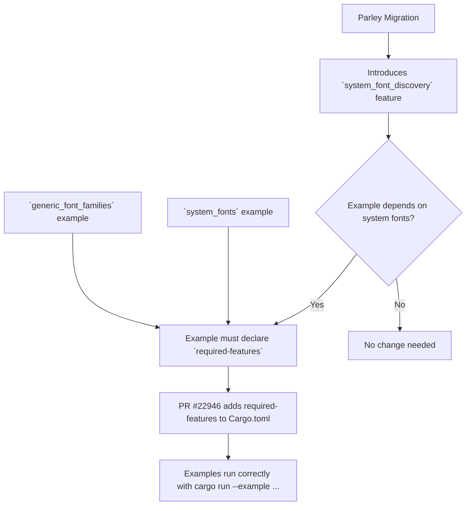

+++
title = "#22946 Fix text examples post parley migration: system_fonts & generic_font_families"
date = "2026-02-14T00:00:00"
draft = false
template = "pull_request_page.html"
in_search_index = false

[extra]
current_language = "zh-cn"
available_languages = {"en" = { name = "English", url = "/pull_request/bevy/2026-02/pr-22946-en-20260214" }, "zh-cn" = { name = "中文", url = "/pull_request/bevy/2026-02/pr-22946-zh-cn-20260214" }}
+++

# Title

## 基本信息
- **标题**: Fix text examples post parley migration: system_fonts & generic_font_families
- **PR 链接**: https://github.com/bevyengine/bevy/pull/22946
- **作者**: kfc35
- **状态**: 已合并
- **标签**: D-Trivial, C-Examples, S-Ready-For-Final-Review, A-Text
- **创建时间**: 2026-02-14T02:30:40Z
- **合并时间**: 2026-02-14T17:25:51Z
- **合并者**: alice-i-cecile

## 描述翻译
### Objective
- 修复 #22940

### Solution
- 为示例添加新特性 `system_font_discovery` 的要求。该特性是在 parley 迁移期间添加的，用于显式启用从系统加载字体。

### Testing
`cargo run --example system_fonts --features="system_font_discovery"` 能正确工作 ~~（不过我注意到中文字符没有正确显示，不知道这是否是 bevy 端的问题）~~ 如果文本使用了该字体，则显示正常，否则不正常，我想这是合理的


`cargo run --example generic_font_families --features="system_font_discovery"` 能正确工作


## 关于此Pull Request的故事

这个问题始于 Bevy 引擎进行的一次底层字体系统升级，即迁移到 Parley 文本布局引擎。作为这次重构的一部分，加载系统字体的功能被移动到了一个名为 `system_font_discovery` 的可选特性（feature）之后。这是一个合理的架构决策：将系统字体访问这种可能涉及平台特定操作、隐私考虑或增加二进制体积的功能，设为可选依赖，允许用户根据需要启用。

然而，这次迁移引入了一个小但明显的疏漏：两个专门用于展示相关功能的示例程序（`system_fonts` 和 `generic_font_families`）没有更新其依赖声明。这两个示例的核心目的就是演示如何查找和使用系统字体或通用字体族，因此它们本质上依赖于 `system_font_discovery` 特性。如果没有明确声明这个依赖，在默认构建配置下运行这些示例会导致失败，因为它们尝试调用依赖于未启用特性的代码路径。

用户 `kfc35` 发现了这个问题（记录在 issue #22940 中），并提交了这个 PR 进行修复。解决方案非常直接：修改示例的配置文件，显式声明它们所需要的特性。

具体实现是在项目的根 `Cargo.toml` 文件中，为两个示例的配置块（`[[example]]`）添加了 `required-features` 字段。这个字段是 Cargo 的一个标准配置项，用于指定运行该示例所必须启用的 crate 特性。通过将其值设置为 `["system_font_discovery"]`，就确保了当用户尝试构建或运行这些示例时，必要的特性会被自动启用。

```toml
# 对于 generic_font_families 示例的修改
required-features = ["system_font_discovery"]

# 对于 system_fonts 示例的修改
required-features = ["system_font_discovery"]
```

这个修复虽然代码改动量很小（仅两行添加），但它解决了示例与库实际功能之间的不一致性，恢复了示例的可用性和文档价值。它也符合 Cargo 的最佳实践——清晰地声明依赖关系。作者在测试中注意到中文字符的显示取决于字体是否被正确找到，这实际上印证了示例工作的核心机制：它正在尝试并演示从系统发现字体的过程。

从工程角度看，这个 PR 提醒我们，在进行重大的底层重构（如更换文本渲染引擎）后，必须仔细检查所有上层接口和用例，包括示例、测试和文档。特性的引入或变更会影响到所有使用该功能的代码，确保配置文件的同步是维护工作的重要一环。

## 视觉表示



## 关键更改文件

### `Cargo.toml`
1.  **更改描述及原因**：此文件是 Rust 项目的清单文件。在此 PR 中，为两个示例（`generic_font_families` 和 `system_fonts`）的配置块添加了 `required-features = ["system_font_discovery"]` 声明。原因是在迁移到 Parley 文本引擎后，从系统加载字体的功能被封装在 `system_font_discovery` 特性之后，而这两个示例的功能直接依赖于此特性。必须显式声明此依赖，否则示例在默认构建下无法运行。
2.  **代码片段**：
    ```toml
    # File: Cargo.toml
    # 修改前 (generic_font_families 示例配置附近):
    [[example]]
    name = "generic_font_families"
    path = "examples/ui/text/generic_font_families.rs"
    # Causes an ICE on docs.rs
    doc-scrape-examples = false
    # 此处缺少 required-features 声明

    # 修改后:
    [[example]]
    name = "generic_font_families"
    path = "examples/ui/text/generic_font_families.rs"
    # Causes an ICE on docs.rs
    doc-scrape-examples = false
    required-features = ["system_font_discovery"] # <-- 新增行

    # ---

    # 修改前 (system_fonts 示例配置附近):
    [[example]]
    name = "system_fonts"
    path = "examples/ui/text/system_fonts.rs"
    doc-scrape-examples = true
    # 此处缺少 required-features 声明

    # 修改后:
    [[example]]
    name = "system_fonts"
    path = "examples/ui/text/system_fonts.rs"
    doc-scrape-examples = true
    required-features = ["system_font_discovery"] # <-- 新增行
    ```
3.  **与 PR 目标的关联**：这些更改直接实现了 PR 的目标——修复在 Parley 迁移后因特性依赖缺失而损坏的文本示例。通过在正确的位置添加两行配置，确保了构建工具（Cargo）能理解运行这些示例的前提条件。

## 延伸阅读

1.  **Cargo 文档 - `required-features`**:
    *   [The Cargo Book: The required-features field](https://doc.rust-lang.org/cargo/reference/cargo-targets.html#the-required-features-field)
    *   解释 `required-features` 字段的作用，以及它如何控制示例、测试和基准测试的运行。

2.  **Rust 特性（Features）指南**:
    *   [The Cargo Book: Features](https://doc.rust-lang.org/cargo/reference/features.html)
    *   深入了解 Cargo 特性的定义、使用、条件编译以及如何管理可选依赖。

3.  **Bevy 引擎中的文本与字体**:
    *   [Bevy 官方文档](https://docs.rs/bevy/latest/bevy/) (查看 `text`, `ui` 模块)
    *   PR 描述中提到的 “parley migration” 可能对应 Bevy 仓库中较大的文本系统重构，可以查阅相关 PR 或提交历史了解上下文。

4.  **关于 Parley**:
    *   Parley 是 Bevy 选用的一个新的文本布局和整形引擎。虽然其自身文档可能不多，但可以通过 Bevy 的相关讨论和代码了解其集成方式。

# Full Code Diff
diff --git a/Cargo.toml b/Cargo.toml
index fbd64aefa94b4..27fc4002ec383 100644
--- a/Cargo.toml
+++ b/Cargo.toml
@@ -3957,6 +3957,7 @@ name = "generic_font_families"
 path = "examples/ui/text/generic_font_families.rs"
 # Causes an ICE on docs.rs
 doc-scrape-examples = false
+required-features = ["system_font_discovery"]
 
 [package.metadata.example.generic_font_families]
 name = "Generic Font Families"
@@ -5446,6 +5447,7 @@ wasm = true
 name = "system_fonts"
 path = "examples/ui/text/system_fonts.rs"
 doc-scrape-examples = true
+required-features = ["system_font_discovery"]
 
 [package.metadata.example.system_fonts]
 name = "System Fonts"