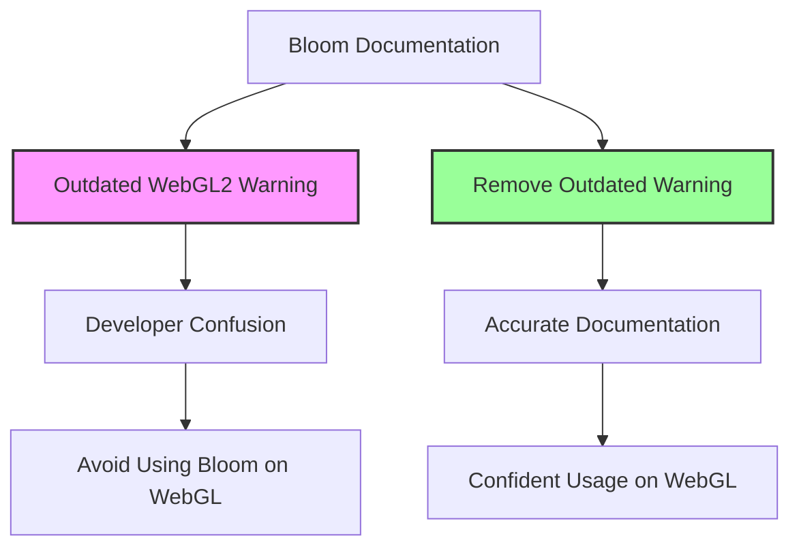

+++
title = "#22948 Remove outdated Bloom WebGL2 note"
date = "2026-02-17T00:00:00"
draft = false
template = "pull_request_page.html"
in_search_index = true

[taxonomies]
list_display = ["show"]

[extra]
current_language = "en"
available_languages = {"en" = { name = "English", url = "/pull_request/bevy/2026-02/pr-22948-en-20260217" }, "zh-cn" = { name = "中文", url = "/pull_request/bevy/2026-02/pr-22948-zh-cn-20260217" }}
labels = ["C-Docs", "D-Trivial", "A-Rendering"]
+++

# Title

## Basic Information
- **Title**: Remove outdated Bloom WebGL2 note
- **PR Link**: https://github.com/bevyengine/bevy/pull/22948
- **Author**: Runi-c
- **Status**: MERGED
- **Labels**: C-Docs, D-Trivial, A-Rendering, S-Ready-For-Final-Review
- **Created**: 2026-02-14T05:06:55Z
- **Merged**: 2026-02-17T19:30:16Z
- **Merged By**: alice-i-cecile

## Description Translation
# Objective

There's a very scary-looking note in the `Bloom` docs that seems to be outdated since https://bevy.org/examples/2d-rendering/bloom-2d/ works fine on webgl. Unclear if there's still a compatibility concern here.

## Solution

> Alice 🌹 — 9:59 PM
> Can you make a PR to remove it?
> We can get more testing there

## Testing

The 2D and 3D examples work on WebGL

## The Story of This Pull Request

This pull request addresses a documentation issue in the Bevy game engine. The problem was straightforward: the documentation for the `Bloom` post-processing effect contained an outdated warning stating that Bloom was incompatible with WebGL2. This warning no longer reflected the actual state of the codebase, as demonstrated by the fact that the official Bloom examples worked correctly on WebGL.

The core issue was that outdated documentation can mislead developers and create unnecessary confusion. When developers see a warning like "Bloom is currently not compatible with WebGL2," they might avoid using the feature entirely on web platforms, or spend time investigating workarounds for a problem that doesn't exist. This creates friction in the development process and reduces the accessibility of Bevy's features.

The solution approach was simple and direct: remove the inaccurate warning from the documentation. The developer recognized that the note appeared to be outdated based on empirical testing of the examples. Rather than attempting to verify every edge case or investigate the historical reason for the warning, the approach was to remove the inaccurate statement and allow real-world usage to determine if any actual compatibility issues remained.

The implementation involved a minimal change to the codebase. The warning was located in the `BloomSettings` struct documentation within the `bevy_post_process` crate. Removing two lines of documentation eliminated the misleading information while preserving all the functional code and other documentation.

```rust
// Before:
/// # Usage Notes
///
/// **Bloom is currently not compatible with WebGL2.**
///
/// Often used in conjunction with `bevy_pbr::StandardMaterial::emissive` for 3d meshes.

// After:
/// # Usage Notes
///
/// Often used in conjunction with `bevy_pbr::StandardMaterial::emissive` for 3d meshes.
```

This change exemplifies a common pattern in software maintenance: documentation should accurately reflect the current state of the codebase. When features are improved or compatibility issues are resolved, the documentation must be updated accordingly. The alternative approach of leaving outdated warnings creates technical debt in the form of misinformation that can propagate through the community and affect downstream projects.

The technical insight here is about the importance of accurate documentation in open-source projects. Warnings about platform compatibility are particularly important because they directly affect developers' platform targeting decisions. However, when such warnings become outdated, they can do more harm than good by discouraging usage of features that actually work correctly.

The impact of this change is primarily about improving developer experience. By removing the outdated warning, Bevy developers targeting WebGL platforms can now confidently use the Bloom effect without being misled by documentation that no longer applies. This aligns with Bevy's goal of being an accessible game engine that works well across multiple platforms.

The PR also demonstrates good practices for handling documentation updates: when encountering potentially outdated documentation, verify the current behavior through testing, then either update or remove the inaccurate information. The comment from the maintainer ("We can get more testing there") suggests a pragmatic approach: removing the warning will encourage more developers to try Bloom on WebGL, providing broader real-world testing and validation.

## Visual Representation



## Key Files Changed

### `crates/bevy_post_process/src/bloom/settings.rs` (+0/-2)

This file contains the `BloomSettings` struct which configures the Bloom post-processing effect. The only change was removing two lines of documentation that contained an outdated warning about WebGL2 incompatibility.

**Key modification:**
```rust
// Before the change (lines 18-20):
/// # Usage Notes
///
/// **Bloom is currently not compatible with WebGL2.**

// After the change:
/// # Usage Notes
///
```

The change removes the warning that was likely added when Bloom had actual compatibility issues with WebGL2 but was never updated when those issues were resolved. This documentation change directly supports the PR's objective of eliminating misleading information about platform compatibility.

## Further Reading

1. [Bevy Bloom Examples](https://bevyengine.org/examples/post-processing/bloom/) - Official examples demonstrating Bloom effects in Bevy
2. [Bevy Post-Processing Documentation](https://docs.rs/bevy/latest/bevy/post_process/index.html) - API documentation for Bevy's post-processing system
3. [WebGL in Bevy](https://bevyengine.org/learn/quick-start/platforms/web/) - Guide to using Bevy with WebGL targets
4. [Rust Documentation Best Practices](https://doc.rust-lang.org/rustdoc/how-to-write-documentation.html) - Guidelines for writing effective documentation in Rust projects

# Full Code Diff
diff --git a/crates/bevy_post_process/src/bloom/settings.rs b/crates/bevy_post_process/src/bloom/settings.rs
index 272f853bd356a..9d42ea641a00c 100644
--- a/crates/bevy_post_process/src/bloom/settings.rs
+++ b/crates/bevy_post_process/src/bloom/settings.rs
@@ -18,8 +18,6 @@ use bevy_render::{extract_component::ExtractComponent, sync_component::SyncCompo
 ///
 /// # Usage Notes
 ///
-/// **Bloom is currently not compatible with WebGL2.**
-///
 /// Often used in conjunction with `bevy_pbr::StandardMaterial::emissive` for 3d meshes.
 ///
 /// Bloom is best used alongside a tonemapping function that desaturates bright colors,