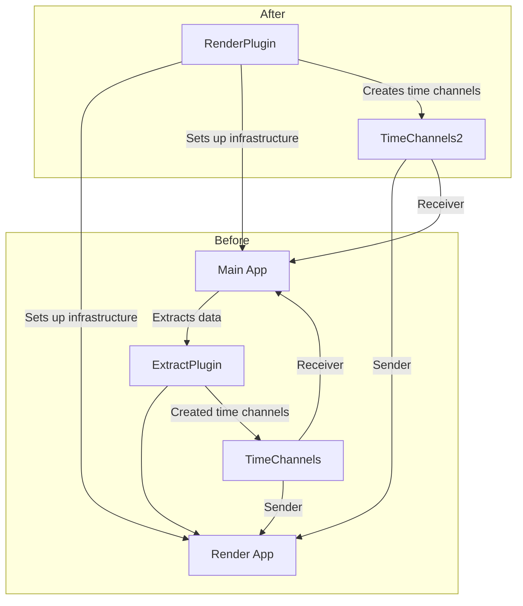

+++
title = "#22950 Move render time from extract to render"
date = "2026-02-17T00:00:00"
draft = false
template = "pull_request_page.html"
in_search_index = true

[taxonomies]
list_display = ["show"]

[extra]
current_language = "en"
available_languages = {"en" = { name = "English", url = "/pull_request/bevy/2026-02/pr-22950-en-20260217" }, "zh-cn" = { name = "中文", url = "/pull_request/bevy/2026-02/pr-22950-zh-cn-20260217" }}
labels = ["D-Trivial", "A-Rendering"]
+++

# Title

## Basic Information
- **Title**: Move render time from extract to render
- **PR Link**: https://github.com/bevyengine/bevy/pull/22950
- **Author**: Zeophlite
- **Status**: MERGED
- **Labels**: D-Trivial, A-Rendering, S-Ready-For-Final-Review
- **Created**: 2026-02-14T06:09:04Z
- **Merged**: 2026-02-17T02:49:51Z
- **Merged By**: alice-i-cecile

## Description Translation

# Objective

- Move render time from extract to render

## Solution

- Move it

## Testing

- `cargo run --example animated_mesh` , but I think 

## The Story of This Pull Request

This PR represents a straightforward but meaningful architectural cleanup in Bevy's render system. The core issue was a misplacement of timing-related resource initialization in the codebase's plugin structure. Specifically, the code responsible for creating and setting up time synchronization channels between Bevy's main world and render world was located in the wrong plugin.

In Bevy's rendering architecture, there are two separate worlds: the main world (where application logic runs) and the render world (where rendering systems execute). These worlds operate in parallel, and they need to synchronize certain data, including timing information. The `bevy_time::create_time_channels()` function creates a sender-receiver pair that facilitates this synchronization.

The problem was that this channel creation and resource insertion was happening in the `ExtractPlugin`, which is primarily responsible for extracting data from the main world to the render world. However, the render time channels are not strictly part of the extraction process—they're a foundational infrastructure component for the entire render system.

Looking at the implementation, we see that before this change, the `ExtractPlugin` was creating the time channels and inserting the sender into the render app and the receiver into the main app. This worked functionally, but it violated the architectural separation of concerns. The `ExtractPlugin` should focus on data extraction, not on setting up core render infrastructure.

The solution implemented here moves the time channel initialization from the `ExtractPlugin` to the `RenderPlugin`, which is the central plugin responsible for configuring the entire render system. This is a more logical placement because:
1. Time synchronization is a cross-cutting concern for the entire render system, not just extraction
2. The `RenderPlugin` is already responsible for setting up other render infrastructure
3. This keeps the `ExtractPlugin` focused on its single responsibility

From a technical perspective, this change doesn't alter behavior—the same resources are created and inserted into the same places. However, it improves code organization by placing infrastructure setup in the appropriate plugin. This makes the codebase easier to understand and maintain, as developers looking for render infrastructure setup will naturally check the `RenderPlugin` first.

The testing approach mentioned in the PR description (`cargo run --example animated_mesh`) is minimal but appropriate. Since this is a refactoring that doesn't change observable behavior, running an example that uses the render system should be sufficient to verify that the time synchronization still works correctly.

This change exemplifies a common pattern in plugin-based architectures: continually refining the separation of responsibilities between plugins to maintain clean architectural boundaries. While small, such refactorings accumulate to create a more maintainable and understandable codebase.

## Visual Representation



## Key Files Changed

### `crates/bevy_render/src/extract_plugin.rs`
This file contained the `ExtractPlugin` which was previously responsible for creating and inserting the time channels. The change removes this responsibility, keeping the plugin focused solely on data extraction.

**Code change:**
```rust
// Before:
impl Plugin for ExtractPlugin {
    fn build(&self, app: &mut App) {
        let render_app = app.get_sub_app_mut(RenderApp).unwrap();
        
        // ... extraction setup code ...
        
        let (sender, receiver) = bevy_time::create_time_channels();
        render_app.insert_resource(sender);
        app.insert_resource(receiver);
        app.insert_sub_app(RenderApp, render_app);
    }
}

// After:
impl Plugin for ExtractPlugin {
    fn build(&self, app: &mut App) {
        let render_app = app.get_sub_app_mut(RenderApp).unwrap();
        
        // ... extraction setup code (time channel creation removed) ...
        
        app.insert_sub_app(RenderApp, render_app);
    }
}
```

### `crates/bevy_render/src/lib.rs`
This file contains the `RenderPlugin` which now takes responsibility for creating and inserting the time channels. This is a more appropriate location since the `RenderPlugin` handles overall render system configuration.

**Code change:**
```rust
// Before:
impl Plugin for RenderPlugin {
    fn build(&self, app: &mut App) {
        // ... render setup code ...
        
        // No time channel creation here
    }
}

// After:
impl Plugin for RenderPlugin {
    fn build(&self, app: &mut App) {
        // ... render setup code ...
        
        let (sender, receiver) = bevy_time::create_time_channels();
        app.insert_resource(receiver);
        
        if let Some(render_app) = app.get_sub_app_mut(RenderApp) {
            // ... other render app setup ...
            render_app.insert_resource(sender);
            // ... more setup ...
        }
    }
}
```

The key change is that `bevy_time::create_time_channels()` is now called in the `RenderPlugin`, with the receiver inserted into the main app and the sender inserted into the render app, exactly as before but from a different location.

## Further Reading

1. **Bevy ECS and Plugin Architecture**: The official Bevy book covers plugin architecture and the ECS system in detail: https://bevyengine.org/learn/book/plugins/
2. **Bevy Render Graph**: Understanding Bevy's render graph architecture provides context for why separate main and render worlds exist: https://bevyengine.org/learn/book/render/
3. **Resource Management in Bevy**: The Bevy cheatbook has a section on resources which explains how resources like the time channels work: https://bevy-cheatbook.github.io/programming/res.html
4. **Sender-Receiver Pattern**: While not Bevy-specific, understanding channel-based communication patterns helps understand the time synchronization approach: https://doc.rust-lang.org/book/ch16-02-message-passing.html

# Full Code Diff
```
diff --git a/crates/bevy_render/src/extract_plugin.rs b/crates/bevy_render/src/extract_plugin.rs
index 79db16580c45b..458848ab0ac53 100644
--- a/crates/bevy_render/src/extract_plugin.rs
+++ b/crates/bevy_render/src/extract_plugin.rs
@@ -70,9 +70,6 @@ impl Plugin for ExtractPlugin {
             extract(main_world, render_world);
         });
 
-        let (sender, receiver) = bevy_time::create_time_channels();
-        render_app.insert_resource(sender);
-        app.insert_resource(receiver);
         app.insert_sub_app(RenderApp, render_app);
     }
 }
diff --git a/crates/bevy_render/src/lib.rs b/crates/bevy_render/src/lib.rs
index 3a75044bcdd22..2cc2de3390982 100644
--- a/crates/bevy_render/src/lib.rs
+++ b/crates/bevy_render/src/lib.rs
@@ -295,12 +295,16 @@ impl Plugin for RenderPlugin {
             diagnostic::RenderDiagnosticsPlugin,
         ));
 
+        let (sender, receiver) = bevy_time::create_time_channels();
+        app.insert_resource(receiver);
+
         let asset_server = app.world().resource::<AssetServer>().clone();
         app.init_resource::<RenderAssetBytesPerFrame>()
             .init_resource::<RenderErrorHandler>();
         if let Some(render_app) = app.get_sub_app_mut(RenderApp) {
             render_app.init_resource::<RenderAssetBytesPerFrameLimiter>();
             render_app.init_resource::<renderer::PendingCommandBuffers>();
+            render_app.insert_resource(sender);
             render_app.insert_resource(asset_server);
             render_app.insert_resource(RenderState::Initializing);
             render_app.add_systems(
```