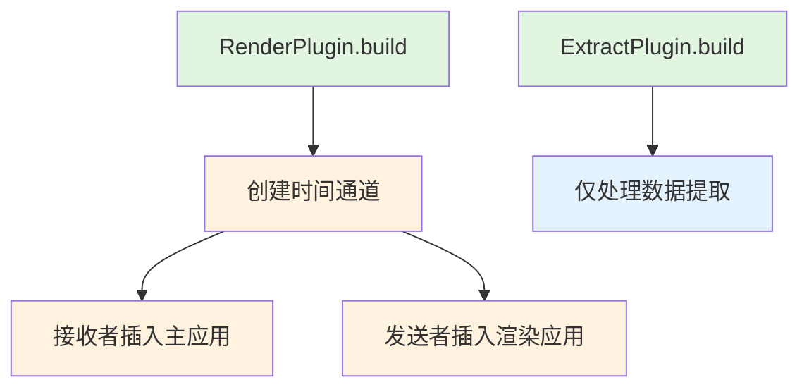

+++
title = "#22950 Move render time from extract to render"
date = "2026-02-17T00:00:00"
draft = false
template = "pull_request_page.html"
in_search_index = false

[extra]
current_language = "zh-cn"
available_languages = {"en" = { name = "English", url = "/pull_request/bevy/2026-02/pr-22950-en-20260217" }, "zh-cn" = { name = "中文", url = "/pull_request/bevy/2026-02/pr-22950-zh-cn-20260217" }}
labels = ["D-Trivial", "A-Rendering"]
+++

# Title
Move render time from extract to render

## Basic Information
- **Title**: Move render time from extract to render
- **PR Link**: https://github.com/bevyengine/bevy/pull/22950
- **Author**: Zeophlite
- **Status**: MERGED
- **Labels**: D-Trivial, A-Rendering, S-Ready-For-Final-Review
- **Created**: 2026-02-14T06:09:04Z
- **Merged**: 2026-02-17T02:49:51Z
- **Merged By**: alice-i-cecile

## Description Translation

# 目标

- 将渲染时间从提取阶段移动到渲染阶段

## 解决方案

- 移动它

## 测试

- `cargo run --example animated_mesh` ，但我想

## The Story of This Pull Request

这个PR解决了一个简单的架构整理问题，涉及Bevy渲染管道中时间通道资源的初始化位置。虽然改动很小，但体现了对Bevy插件系统和渲染架构的正确理解。

在Bevy的渲染系统中，存在一个关键的设计模式：主应用（main app）和渲染应用（render app）的分离。这两个应用运行在不同的调度器上，通过特定的机制进行通信。时间通道（time channels）就是这种通信机制的一部分，用于在主应用和渲染应用之间同步时间数据。

在PR修改之前，时间通道的创建和资源插入是在`ExtractPlugin`中完成的。`ExtractPlugin`负责管理提取阶段（extract phase），这是渲染管道的初始阶段，负责从主世界（main world）提取数据到渲染世界（render world）。然而，从架构角度来看，时间通道的初始化更适合放在`RenderPlugin`中，因为`RenderPlugin`是整个渲染系统的主要入口点，负责设置渲染应用和主应用之间的整体通信结构。

具体来说，代码中的`create_time_channels()`函数创建了一个发送者（sender）和接收者（receiver）对。按照设计模式，发送者应该插入到渲染应用中，而接收者插入到主应用中。这样，渲染应用可以通过发送者发送时间更新，主应用可以通过接收者接收这些更新。

在原来的实现中，这个逻辑放在了`ExtractPlugin`的`build`方法中：
```rust
let (sender, receiver) = bevy_time::create_time_channels();
render_app.insert_resource(sender);
app.insert_resource(receiver);
```

这种放置虽然功能上能工作，但在架构上不够清晰。`ExtractPlugin`的主要职责是管理数据提取，而不是设置应用间的通信基础设施。将这部分代码移到`RenderPlugin`中使得职责划分更加明确：`RenderPlugin`负责整个渲染系统的设置，包括通信基础设施；而`ExtractPlugin`只专注于数据提取。

修改后的代码将时间通道的初始化移动到了`RenderPlugin::build`方法中：
```rust
let (sender, receiver) = bevy_time::create_time_channels();
app.insert_resource(receiver);

if let Some(render_app) = app.get_sub_app_mut(RenderApp) {
    // ... 其他初始化 ...
    render_app.insert_resource(sender);
}
```

这个变动虽然表面上只是移动了几行代码，但实际上反映了对Bevy插件系统职责分离原则的理解。`RenderPlugin`作为渲染系统的主插件，应该负责所有渲染相关的全局设置，而专门的插件如`ExtractPlugin`应该只处理其特定领域的功能。

从技术实现细节来看，这个PR的修改保持了完全相同的功能。发送者（sender）仍然被插入到渲染应用中，接收者（receiver）仍然被插入到主应用中。时间同步机制的工作方式没有任何变化，只是初始化代码的位置更加合理。

这种架构整理工作虽然小，但对于维护大型代码库非常重要。清晰的职责分离使得代码更容易理解、测试和维护。当新开发者查看`ExtractPlugin`的代码时，他们看到的是纯粹与数据提取相关的逻辑，而不会困惑于为什么时间通道的初始化会出现在这里。

## Visual Representation



## Key Files Changed

### 1. `crates/bevy_render/src/extract_plugin.rs` (+0/-3)
**修改说明**：从`ExtractPlugin`中移除了时间通道的创建和资源插入代码。这使得插件更加专注于其核心职责——数据提取。

**修改前代码**：
```rust
impl Plugin for ExtractPlugin {
    fn build(&self, app: &mut App) {
        let render_app = app.get_sub_app_mut(RenderApp).unwrap();
        
        render_app.add_systems(Render, extract::<MainWorld, RenderWorld>, render_schedule);
        
        let (sender, receiver) = bevy_time::create_time_channels();
        render_app.insert_resource(sender);
        app.insert_resource(receiver);
        
        app.insert_sub_app(RenderApp, render_app);
    }
}
```

**修改后代码**：
```rust
impl Plugin for ExtractPlugin {
    fn build(&self, app: &mut App) {
        let render_app = app.get_sub_app_mut(RenderApp).unwrap();
        
        render_app.add_systems(Render, extract::<MainWorld, RenderWorld>, render_schedule);
        
        app.insert_sub_app(RenderApp, render_app);
    }
}
```

### 2. `crates/bevy_render/src/lib.rs` (+4/-0)
**修改说明**：在`RenderPlugin`中添加了时间通道的创建和资源插入代码。这符合插件职责分离的原则，`RenderPlugin`负责渲染系统的整体设置。

**修改前代码**：
```rust
impl Plugin for RenderPlugin {
    fn build(&self, app: &mut App) {
        // ... 其他初始化代码 ...
        
        let asset_server = app.world().resource::<AssetServer>().clone();
        app.init_resource::<RenderAssetBytesPerFrame>()
            .init_resource::<RenderErrorHandler>();
        if let Some(render_app) = app.get_sub_app_mut(RenderApp) {
            render_app.init_resource::<RenderAssetBytesPerFrameLimiter>();
            render_app.init_resource::<renderer::PendingCommandBuffers>();
            render_app.insert_resource(asset_server);
            render_app.insert_resource(RenderState::Initializing);
            // ... 其他系统添加 ...
        }
    }
}
```

**修改后代码**：
```rust
impl Plugin for RenderPlugin {
    fn build(&self, app: &mut App) {
        // ... 其他初始化代码 ...
        
        let (sender, receiver) = bevy_time::create_time_channels();
        app.insert_resource(receiver);

        let asset_server = app.world().resource::<AssetServer>().clone();
        app.init_resource::<RenderAssetBytesPerFrame>()
            .init_resource::<RenderErrorHandler>();
        if let Some(render_app) = app.get_sub_app_mut(RenderApp) {
            render_app.init_resource::<RenderAssetBytesPerFrameLimiter>();
            render_app.init_resource::<renderer::PendingCommandBuffers>();
            render_app.insert_resource(sender);
            render_app.insert_resource(asset_server);
            render_app.insert_resource(RenderState::Initializing);
            // ... 其他系统添加 ...
        }
    }
}
```

## Further Reading

1. **Bevy插件系统文档**：了解Bevy中插件的设计和最佳实践
   - https://bevy-cheatbook.github.io/programming/plugins.html

2. **Bevy渲染架构**：理解主应用和渲染应用分离的设计模式
   - https://github.com/bevyengine/bevy/blob/main/crates/bevy_render/src/lib.rs

3. **ECS中的系统调度**：了解Bevy如何通过调度器管理不同阶段的系统执行
   - https://bevy-cheatbook.github.io/programming/schedules.html

4. **资源管理模式**：学习Bevy中资源（Resource）的设计和使用模式
   - https://bevy-cheatbook.github.io/programming/res.html

# Full Code Diff
diff --git a/crates/bevy_render/src/extract_plugin.rs b/crates/bevy_render/src/extract_plugin.rs
index 79db16580c45b..458848ab0ac53 100644
--- a/crates/bevy_render/src/extract_plugin.rs
+++ b/crates/bevy_render/src/extract_plugin.rs
@@ -70,9 +70,6 @@ impl Plugin for ExtractPlugin {
             extract(main_world, render_world);
         });
 
-        let (sender, receiver) = bevy_time::create_time_channels();
-        render_app.insert_resource(sender);
-        app.insert_resource(receiver);
         app.insert_sub_app(RenderApp, render_app);
     }
 }
diff --git a/crates/bevy_render/src/lib.rs b/crates/bevy_render/src/lib.rs
index 3a75044bcdd22..2cc2de3390982 100644
--- a/crates/bevy_render/src/lib.rs
+++ b/crates/bevy_render/src/lib.rs
@@ -295,12 +295,16 @@ impl Plugin for RenderPlugin {
             diagnostic::RenderDiagnosticsPlugin,
         ));
 
+        let (sender, receiver) = bevy_time::create_time_channels();
+        app.insert_resource(receiver);
+
         let asset_server = app.world().resource::<AssetServer>().clone();
         app.init_resource::<RenderAssetBytesPerFrame>()
             .init_resource::<RenderErrorHandler>();
         if let Some(render_app) = app.get_sub_app_mut(RenderApp) {
             render_app.init_resource::<RenderAssetBytesPerFrameLimiter>();
             render_app.init_resource::<renderer::PendingCommandBuffers>();
+            render_app.insert_resource(sender);
             render_app.insert_resource(asset_server);
             render_app.insert_resource(RenderState::Initializing);
             render_app.add_systems(