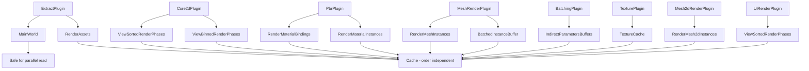

+++
title = "#22951 ignore ambiguities on MainWorld and caches"
date = "2026-02-17T00:00:00"
draft = false
template = "pull_request_page.html"
in_search_index = true

[taxonomies]
list_display = ["show"]

[extra]
current_language = "en"
available_languages = {"en" = { name = "English", url = "/pull_request/bevy/2026-02/pr-22951-en-20260217" }, "zh-cn" = { name = "中文", url = "/pull_request/bevy/2026-02/pr-22951-zh-cn-20260217" }}
labels = ["A-Rendering"]
+++

# Title
ignore ambiguities on MainWorld and caches

## Basic Information
- **Title**: ignore ambiguities on MainWorld and caches
- **PR Link**: https://github.com/bevyengine/bevy/pull/22951
- **Author**: atlv24
- **Status**: MERGED
- **Labels**: A-Rendering, S-Ready-For-Final-Review
- **Created**: 2026-02-14T07:28:54Z
- **Merged**: 2026-02-17T01:26:14Z
- **Merged By**: alice-i-cecile

## Description Translation

# Objective

- bring down the RenderApp ambiguity count by about ~1500

## Solution

- ignore ambiguity on MainWorld in extract (this is fine, it doesnt/shouldnt matter what order we read MainWorld in, and mutating it in extract is cursed)
- caches and other things of the form of HashSet<Entity, Thing> don't care about write order

## Testing

- this doesnt change behavior just ignores ambiguities that dont matter

## The Story of This Pull Request

This PR addresses system scheduling ambiguity warnings in Bevy's renderer by explicitly marking certain resources as safe for parallel execution. The core issue was that Bevy's scheduler was detecting potential data races on resources that were actually safe to access in parallel because their access patterns don't depend on execution order.

The problem stems from Bevy's scheduling system, which needs to ensure memory safety by preventing data races. When multiple systems access the same resource mutably, the scheduler typically treats this as an ambiguity - it can't guarantee which system runs first, so it either runs them sequentially or warns the developer. However, there are cases where the order doesn't matter because the operations are commutative or the data structure is designed to handle concurrent access safely.

In this case, the renderer had two main categories of resources that were safe for parallel access:

1. **MainWorld in extract systems**: The MainWorld is the primary game world that gets copied to the render world. In extract systems, we only read from MainWorld, and any mutation there would be problematic regardless of order. Since extract systems don't mutate MainWorld, the order of reading doesn't matter.

2. **Cache-like resources**: Resources like TextureCache, RenderAssets, and various render phase collections are essentially caches or stores that are rebuilt each frame. These structures often use HashMap or HashSet internally, where insertion order doesn't affect the final result. Multiple systems writing to these caches in parallel is safe because:
   - They operate on different keys (usually different entities or assets)
   - Even if they did operate on the same key, the last write would win, which is acceptable for cache behavior
   - The structures are cleared at the beginning of each frame and populated independently

The solution was to add `.allow_ambiguous_resource()` calls for these specific resources across multiple render plugins. This tells Bevy's scheduler that it's safe to run systems accessing these resources in parallel, reducing the ambiguity count by approximately 1500 warnings.

This optimization is particularly valuable because the renderer runs many systems in parallel, and these ambiguity warnings were creating noise that could obscure actual scheduling issues. By explicitly marking these safe resources, developers can more easily identify genuine problems in their scheduling.

The implementation required changes across 12 files because these cache resources are used throughout Bevy's rendering pipeline - from texture management and material handling to mesh rendering and UI systems. Each plugin that creates one of these cache-like resources needed to explicitly mark it as allowing ambiguous access.

## Visual Representation



## Key Files Changed

### `crates/bevy_render/src/extract_plugin.rs` (+13/-11)
This file sets up the extract schedule for copying data from the main world to the render world. The key change is adding `allow_ambiguous_resource::<MainWorld>()` to indicate that MainWorld can be safely read in parallel by extract systems.

```rust
// After:
render_app
    .add_schedule(Render::base_schedule())
    .add_schedule(extract_schedule)
    .allow_ambiguous_resource::<MainWorld>()  // New line
    .add_systems(
        Render,
        (
            apply_extract_commands.in_set(RenderSystems::ExtractCommands),
            despawn_temporary_render_entities.in_set(RenderSystems::PostCleanup),
        ),
    );
```

### `crates/bevy_render/src/texture/mod.rs` (+7/-4)
This file manages the texture cache. The texture cache is a HashMap-based structure where insertion order doesn't matter, so parallel writes are safe.

```rust
// After:
render_app
    .init_resource::<TextureCache>()
    .allow_ambiguous_resource::<TextureCache>()  // New line
    .add_systems(
        Render,
        update_texture_cache_system.in_set(RenderSystems::Cleanup),
    );
```

### `crates/bevy_pbr/src/render/mesh.rs` (+4/-1)
This file handles mesh rendering for PBR materials. It manages instance buffers that are rebuilt each frame, so write order doesn't matter.

```rust
// After:
let render_mesh_instances = RenderMeshInstances::new(use_gpu_instance_buffer_builder);
render_app
    .allow_ambiguous_resource::<no_gpu_preprocessing::BatchedInstanceBuffer::<MeshUniform>>()
    .allow_ambiguous_resource::<gpu_preprocessing::BatchedInstanceBuffers<MeshUniform, MeshInputUniform>>()
    .insert_resource(render_mesh_instances);
```

### `crates/bevy_core_pipeline/src/core_2d/mod.rs` (+3/-0)
This plugin manages 2D rendering phases. The render phase collections are essentially caches that don't care about write order.

```rust
// After:
.init_resource::<ViewSortedRenderPhases<Transparent2d>>()
.init_resource::<ViewBinnedRenderPhases<Opaque2d>>()
.init_resource::<ViewBinnedRenderPhases<AlphaMask2d>>()
.allow_ambiguous_resource::<ViewSortedRenderPhases<Transparent2d>>()  // New lines
.allow_ambiguous_resource::<ViewBinnedRenderPhases<Opaque2d>>()
.allow_ambiguous_resource::<ViewBinnedRenderPhases<AlphaMask2d>>()
```

### `crates/bevy_pbr/src/lib.rs` (+2/-1)
The main PBR plugin marks RenderMaterialBindings as safe for parallel access since it's a cache-like structure.

```rust
// After:
.init_resource::<LightMeta>()
.init_resource::<RenderMaterialBindings>()
.allow_ambiguous_resource::<RenderMaterialBindings>();  // New line
```

## Further Reading

1. **Bevy Scheduling Documentation**: For understanding system scheduling and ambiguity detection
2. **Entity Component System Pattern**: To understand how Bevy manages data and systems
3. **Data Race Prevention in Game Engines**: Background on why scheduling constraints are necessary
4. **Rust's Ownership Model**: How Bevy leverages Rust's type system for memory safety without garbage collection

# Full Code Diff
*(Provided in the original request)*