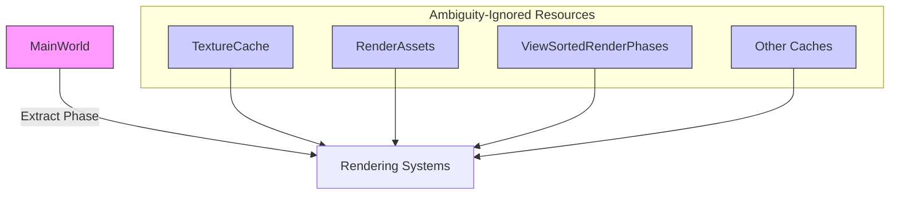

+++
title = "#22951 ignore ambiguities on MainWorld and caches"
date = "2026-02-17T00:00:00"
draft = false
template = "pull_request_page.html"
in_search_index = false

[extra]
current_language = "zh-cn"
available_languages = {"en" = { name = "English", url = "/pull_request/bevy/2026-02/pr-22951-en-20260217" }, "zh-cn" = { name = "中文", url = "/pull_request/bevy/2026-02/pr-22951-zh-cn-20260217" }}
labels = ["A-Rendering"]
+++

# Title
ignore ambiguities on MainWorld and caches

## Basic Information
- **Title**: ignore ambiguities on MainWorld and caches
- **PR Link**: https://github.com/bevyengine/bevy/pull/22951
- **Author**: atlv24
- **Status**: MERGED
- **Labels**: A-Rendering, S-Ready-For-Final-Review
- **Created**: 2026-02-14T07:28:54Z
- **Merged**: 2026-02-17T01:26:14Z
- **Merged By**: alice-i-cecile

## Description Translation
**目标**
- 将RenderApp的歧义计数降低约1500个

**解决方案**
- 在extract阶段忽略MainWorld的歧义（这是可以的，我们读取MainWorld的顺序并不重要/不应该重要，并且在extract阶段修改它是被禁止的）
- HashSet<Entity, Thing>形式的缓存和其他组件不关心写入顺序

**测试**
- 这不会改变行为，只是忽略了那些无关紧要的歧义

## The Story of This Pull Request

这个PR解决了一个Bevy渲染调度中的性能优化问题，核心是减少调度器报告的歧义（ambiguity）数量。在Bevy的ECS系统中，当多个系统可能以不确定的顺序访问同一资源时，调度器会报告歧义。这通常是为了防止数据竞争和非确定性行为。然而，在某些情况下，这种访问顺序并不影响最终结果，报告歧义反而会限制系统的并行执行。

**问题背景**
在Bevy的渲染架构中，存在主世界（MainWorld）和渲染世界（RenderWorld）。提取（Extract）阶段负责从主世界读取数据并写入渲染世界。由于提取阶段是并行执行的，多个提取系统同时读取MainWorld会导致调度器报告大量歧义。此外，许多缓存资源（如HashSet<Entity, Thing>）的写入顺序也不影响最终状态，但同样会被报告歧义。这些不必要的歧义报告限制了系统的并行度，并增加了调度器的计算开销。

**解决方案**
开发者采取了直接的方法：明确告诉调度器哪些资源的歧义是可以接受的。通过为特定资源调用`.allow_ambiguous_resource()`，调度器将不再把这些资源的并发访问视为问题。这分为两类：
1. 对于MainWorld，在提取阶段忽略其歧义，因为提取系统主要是读取操作，且顺序无关紧要。
2. 对于各种缓存和存储结构（如RenderAssets、ViewSortedRenderPhases等），由于它们使用哈希集合或类似结构，写入顺序不影响最终内容。

**实现细节**
修改涉及12个文件，主要是在资源初始化后添加`.allow_ambiguous_resource()`调用。关键修改包括：

在`extract_plugin.rs`中，为MainWorld资源添加歧义允许：
```rust
render_app
    .add_schedule(Render::base_schedule())
    .add_schedule(extract_schedule)
    .allow_ambiguous_resource::<MainWorld>()  // 新增
    .add_systems(...)
```

在其他模块中，为各种缓存资源添加类似调用，例如在`texture/mod.rs`中：
```rust
render_app
    .init_resource::<TextureCache>()
    .allow_ambiguous_resource::<TextureCache>()  // 新增
    .add_systems(...)
```

这种模式在整个PR中重复出现，涵盖了渲染管线的多个部分，包括2D渲染、PBR材质、网格实例、纹理缓存等。

**技术见解**
这个PR体现了几个重要的工程原则：
1. **显式优于隐式**：通过明确标记允许歧义的资源，开发者清楚地表达了设计意图，而不是依赖调度器的默认保守行为。
2. **性能优化**：减少歧义计数可以直接提高系统的并行度，因为调度器现在知道这些资源可以安全地并发访问。
3. **无行为变更**：这是一个纯粹的优化，不改变系统的功能行为，只影响调度决策。

需要注意的是，这种方法只适用于那些真正顺序无关的资源访问。对于MainWorld，开发者特别指出在提取阶段修改它是“被禁止的”（cursed），这强调了提取阶段应该只进行读取操作的约定。

**影响**
这个PR将RenderApp的歧义计数减少了约1500个，这意味着调度器可以更高效地并行执行系统，从而提高渲染性能。同时，它使代码库更清晰地表达了哪些资源访问是顺序无关的，为未来的优化提供了更好的基础。

## Visual Representation



## Key Files Changed

1. **`crates/bevy_render/src/extract_plugin.rs` (+13/-11)**
   - 主要修改：为MainWorld资源添加`.allow_ambiguous_resource::<MainWorld>()`
   - 影响：允许提取阶段并行读取MainWorld，减少歧义计数

2. **`crates/bevy_render/src/texture/mod.rs` (+7/-4)**
   - 主要修改：为TextureCache资源添加歧义允许
   ```rust
   render_app
       .init_resource::<TextureCache>()
       .allow_ambiguous_resource::<TextureCache>()  // 新增
       .add_systems(...)
   ```

3. **`crates/bevy_pbr/src/render/mesh.rs` (+4/-1)**
   - 主要修改：为实例缓冲区资源添加歧义允许
   ```rust
   render_app
       .allow_ambiguous_resource::<no_gpu_preprocessing::BatchedInstanceBuffer::<MeshUniform>>()
       .allow_ambiguous_resource::<gpu_preprocessing::BatchedInstanceBuffers<MeshUniform, MeshInputUniform>>()
       .insert_resource(render_mesh_instances);
   ```

4. **`crates/bevy_core_pipeline/src/core_2d/mod.rs` (+3/-0)**
   - 主要修改：为2D渲染阶段资源添加歧义允许
   ```rust
   .allow_ambiguous_resource::<ViewSortedRenderPhases<Transparent2d>>()
   .allow_ambiguous_resource::<ViewBinnedRenderPhases<Opaque2d>>()
   .allow_ambiguous_resource::<ViewBinnedRenderPhases<AlphaMask2d>>()
   ```

5. **`crates/bevy_pbr/src/lib.rs` (+2/-1)**
   - 主要修改：为RenderMaterialBindings资源添加歧义允许
   ```rust
   .init_resource::<RenderMaterialBindings>()
   .allow_ambiguous_resource::<RenderMaterialBindings>();
   ```

## Further Reading
1. Bevy官方文档中的[调度器与系统并行](https://bevyengine.org/learn/quick-start/ecs/systems/)章节，了解系统执行顺序和歧义概念。
2. Bevy源码中的[`ambiguity_detection.rs`](https://github.com/bevyengine/bevy/blob/main/crates/bevy_ecs/src/schedule/ambiguity_detection.rs)，了解歧义检测的实现细节。
3. Rust的[并发编程模式](https://doc.rust-lang.org/book/ch16-00-concurrency.html)，理解安全并发访问的原则。