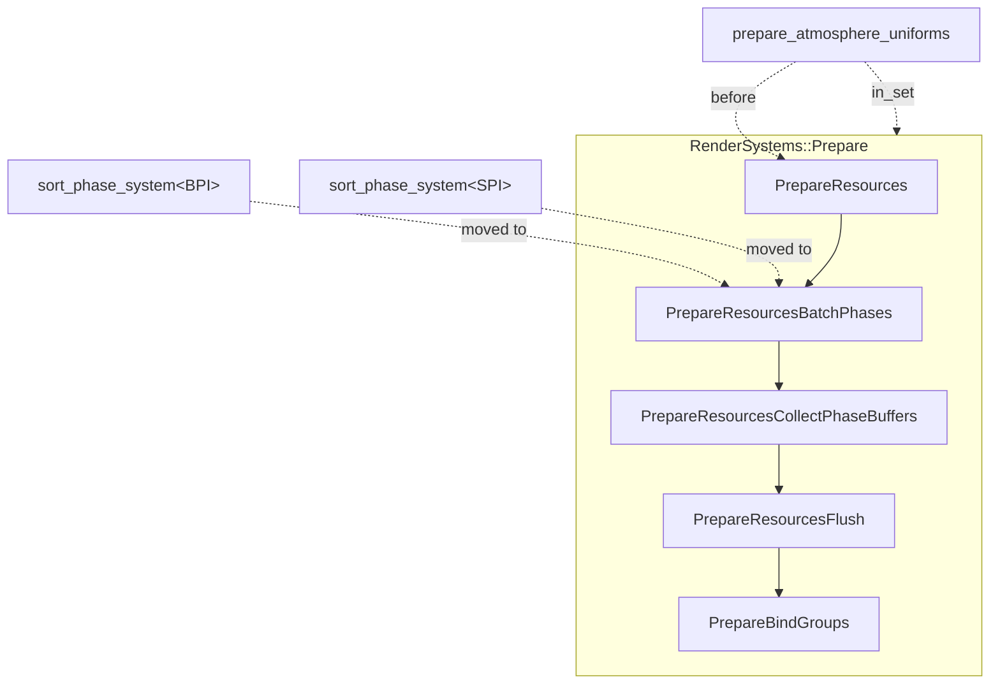

+++
title = "#22952 Add PrepareResourcesBatchPhases RenderSystem set"
date = "2026-02-17T00:00:00"
draft = false
template = "pull_request_page.html"
in_search_index = false

[extra]
current_language = "zh-cn"
available_languages = {"en" = { name = "English", url = "/pull_request/bevy/2026-02/pr-22952-en-20260217" }, "zh-cn" = { name = "中文", url = "/pull_request/bevy/2026-02/pr-22952-zh-cn-20260217" }}
labels = ["A-Rendering", "C-Code-Quality"]
+++

# Add PrepareResourcesBatchPhases RenderSystem set

## Basic Information
- **Title**: Add PrepareResourcesBatchPhases RenderSystem set
- **PR Link**: https://github.com/bevyengine/bevy/pull/22952
- **Author**: atlv24
- **Status**: MERGED
- **Labels**: A-Rendering, C-Code-Quality, S-Ready-For-Review
- **Created**: 2026-02-14T07:50:21Z
- **Merged**: 2026-02-17T01:26:14Z
- **Merged By**: alice-i-cecile

## Description Translation
### 目标 (Objective)
- 减少 RenderApp 中的歧义性。

### 解决方案 (Solution)
- 为批处理阶段（batch phases）分配其专属的系统集（system set），以便在皮肤网格准备（skin mesh preparation，存在于 PrepareResources 中，并与 GetBatchData 参数查询相匹配）之后对其进行排序。
- 同时，使大气（atmosphere）排序的设定更加具体。

### 测试 (Testing)
- 运行了一些示例。大气效果看起来不错。

## The Story of This Pull Request

本次 PR 旨在解决 Bevy 渲染应用（RenderApp）中潜在的系统执行顺序歧义问题。在复杂的渲染管线中，明确各个系统间的依赖关系和执行顺序至关重要，尤其是在涉及数据准备和批处理（batching）的阶段。不明确的顺序可能导致竞争条件（race condition），例如批处理系统可能在它所依赖的网格数据（如蒙皮后的顶点数据）完全准备就绪之前就开始运行，从而导致渲染错误或崩溃。

具体来说，在 Bevy 的渲染调度中，`RenderSystems::PrepareResources` 系统集负责初始化缓冲区（buffers）、纹理（textures）和统一变量（uniforms）。而渲染阶段的排序与批处理系统（例如 `sort_phase_system`）传统上也放置在这个集合中。然而，某些批处理逻辑依赖于 `PrepareResources` 中完成的数据准备，最典型的就是蒙皮网格（skin mesh）的计算，它通过 `GetBatchData` 参数查询提供数据。当多个系统都在同一个宽泛的 `PrepareResources` 集合中时，它们之间的精确执行顺序是未定义的，这便产生了歧义。

开发者 atlv24 采取的解决方案是引入一个新的、更细粒度的系统集 `PrepareResourcesBatchPhases`。这个新集合作为 `RenderSystems::Prepare` 的一个子集，被专门设计用来容纳创建渲染批次（batches）的系统。通过将其插入到现有的调度顺序中——位于 `PrepareResources` 之后、`PrepareResourcesCollectPhaseBuffers` 之前——我们可以在架构层面明确保证：所有必要的资源准备（如蒙皮）都将在批处理阶段开始之前完成。

这个改动涉及三个文件。首先，在 `crates/bevy_render/src/lib.rs` 中，定义了新的 `PrepareResourcesBatchPhases` 枚举变体，并更新了调度配置，将其插入到正确的顺序链中。其次，在 `crates/bevy_render/src/render_phase/mod.rs` 中，将两个关键的批处理系统——分别用于普通批次（`BPI`）和阴影（`SPI`）的 `sort_phase_system`——从旧的 `PrepareResources` 集合移动到了新的 `PrepareResourcesBatchPhases` 集合中。这正是将逻辑概念落实到具体代码的地方。

与此同时，PR 还附带了一个对大气渲染系统的小优化。在 `crates/bevy_pbr/src/atmosphere/mod.rs` 中，`prepare_atmosphere_uniforms` 系统的排序约束被调整得更精确。之前它被设置为在 `PrepareResources` 之前、`PrepareAssets` 之后运行。现在，它被明确地放入 `RenderSystems::Prepare` 主集，并仍然规定在 `PrepareResources` 之前执行。这种调整使其依赖关系更加清晰和符合系统集的组织结构，虽然不影响核心的批处理问题，但体现了对调度顺序一致性的关注。

总之，这个 PR 是一个典型的代码质量改进。它没有改变渲染功能，而是通过重构调度结构来消除歧义，增强代码的健壮性和可维护性。它遵循了 Bevy 调度系统利用明确排序来避免竞态条件的设计哲学。这种细粒度的系统集划分也为未来添加更多与批处理相关的系统或调试提供了清晰的位置。

## Visual Representation



## Key Files Changed

1.  **`crates/bevy_render/src/lib.rs`**
    *   **修改目的**：在渲染系统调度顺序中定义并插入新的 `PrepareResourcesBatchPhases` 系统集。
    *   **关键修改**：
        ```rust
        // 新增的系统集变体定义
        /// A sub-set within [`Prepare`](RenderSystems::Prepare) that creates batches for render phases.
        PrepareResourcesBatchPhases,
        /// A sub-set within [`Prepare`](RenderSystems::Prepare) to collect phase buffers after
        /// [`PrepareResourcesBatchPhases`](RenderSystems::PrepareResourcesBatchPhases) has run.
        PrepareResourcesCollectPhaseBuffers, // 注释已更新
        ```
        ```rust
        // 在调度配置中确立顺序
        schedule.configure_sets(
            (
                PrepareResources,
                PrepareResourcesBatchPhases, // 新增
                PrepareResourcesCollectPhaseBuffers,
                PrepareResourcesFlush,
                PrepareBindGroups,
            )
                .chain(),
        );
        ```

2.  **`crates/bevy_render/src/render_phase/mod.rs`**
    *   **修改目的**：将具体的批处理排序系统从 `PrepareResources` 迁移到新的 `PrepareResourcesBatchPhases` 集合。
    *   **关键修改**：
        ```rust
        // 批量项目排序系统（BPI = BatchPhaseItem）
        .add_systems(
            Render,
            sort_phase_system::<BPI>.in_set(RenderSystems::PrepareResourcesBatchPhases), // 由 .in_set(RenderSystems::PrepareResources) 修改而来
        )
        ```
        ```rust
        // 阴影项目排序系统（SPI = ShadowPhaseItem）
        .add_systems(
            Render,
            sort_phase_system::<SPI>.in_set(RenderSystems::PrepareResourcesBatchPhases), // 由 .in_set(RenderSystems::PrepareResources) 修改而来
        )
        ```

3.  **`crates/bevy_pbr/src/atmosphere/mod.rs`**
    *   **修改目的**：优化大气均匀变量准备系统的排序约束，使其在调度层次中的位置更精确。
    *   **关键修改**：
        ```rust
        // 修改前
        prepare_atmosphere_uniforms
            .before(RenderSystems::PrepareResources)
            .after(RenderSystems::PrepareAssets),
        ```
        ```rust
        // 修改后
        prepare_atmosphere_uniforms
            .in_set(RenderSystems::Prepare) // 明确属于 Prepare 主集
            .before(RenderSystems::PrepareResources), // 保持其在 PrepareResources 之前的顺序
        ```

## Further Reading
1.  **Bevy 官方文档：调度（Schedule）**：理解 Bevy 中 System、SystemSet、Run Conditions 和 Ordering 的核心概念。
    *   链接: [https://bevyengine.org/learn/quick-start/programming/scheduling/](https://bevyengine.org/learn/quick-start/programming/scheduling/)
2.  **Bevy 官方示例：渲染（Rendering）**：查看实际的渲染系统是如何组织和排序的。
    *   链接: [https://github.com/bevyengine/bevy/tree/latest/examples/3d](https://github.com/bevyengine/bevy/tree/latest/examples/3d)
3.  **Rendering System Ordering (Bevy Cheatbook)**：社区整理的关于渲染系统执行顺序的实用指南。
    *   链接: [https://bevy-cheatbook.github.io/programming/render-order.html](https://bevy-cheatbook.github.io/programming/render-order.html)
4.  **“Data-Oriented Design”相关文章**：Bevy 的 ECS 和调度系统深受数据导向设计思想影响，了解该范式有助于理解为何要如此精确地控制系统执行顺序。
    *   推荐: [Data-Oriented Design (书)](https://www.dataorienteddesign.com/dodbook/)

# Full Code Diff
<details>
<summary>展开/折叠完整差异</summary>

```diff
diff --git a/crates/bevy_pbr/src/atmosphere/mod.rs b/crates/bevy_pbr/src/atmosphere/mod.rs
index a065daff40bc0..3c902e160379f 100644
--- a/crates/bevy_pbr/src/atmosphere/mod.rs
+++ b/crates/bevy_pbr/src/atmosphere/mod.rs
@@ -169,8 +169,8 @@ impl Plugin for AtmospherePlugin {
                         .in_set(RenderSystems::PrepareResources)
                         .after(prepare_atmosphere_textures),
                     prepare_atmosphere_uniforms
-                        .before(RenderSystems::PrepareResources)
-                        .after(RenderSystems::PrepareAssets),
+                        .in_set(RenderSystems::Prepare)
+                        .before(RenderSystems::PrepareResources),
                     prepare_atmosphere_probe_bind_groups.in_set(RenderSystems::PrepareBindGroups),
                     prepare_atmosphere_transforms.in_set(RenderSystems::PrepareResources),
                     prepare_atmosphere_bind_groups.in_set(RenderSystems::PrepareBindGroups),
diff --git a/crates/bevy_render/src/lib.rs b/crates/bevy_render/src/lib.rs
index 3a75044bcdd22..b5b46bc339a3e 100644
--- a/crates/bevy_render/src/lib.rs
+++ b/crates/bevy_render/src/lib.rs
@@ -173,8 +173,10 @@ pub enum RenderSystems {
     Prepare,
     /// A sub-set within [`Prepare`](RenderSystems::Prepare) for initializing buffers, textures and uniforms for use in bind groups.
     PrepareResources,
-    /// Collect phase buffers after
-    /// [`PrepareResources`](RenderSystems::PrepareResources) has run.
+    /// A sub-set within [`Prepare`](RenderSystems::Prepare) that creates batches for render phases.
+    PrepareResourcesBatchPhases,
+    /// A sub-set within [`Prepare`](RenderSystems::Prepare) to collect phase buffers after
+    /// [`PrepareResourcesBatchPhases`](RenderSystems::PrepareResourcesBatchPhases) has run.
     PrepareResourcesCollectPhaseBuffers,
     /// Flush buffers after [`PrepareResources`](RenderSystems::PrepareResources), but before [`PrepareBindGroups`](RenderSystems::PrepareBindGroups).
     PrepareResourcesFlush,
@@ -242,6 +244,7 @@ impl Render {
         schedule.configure_sets(
             (
                 PrepareResources,
+                PrepareResourcesBatchPhases,
                 PrepareResourcesCollectPhaseBuffers,
                 PrepareResourcesFlush,
                 PrepareBindGroups,
diff --git a/crates/bevy_render/src/render_phase/mod.rs b/crates/bevy_render/src/render_phase/mod.rs
index 102fe99c4d578..5df822b065325 100644
--- a/crates/bevy_render/src/render_phase/mod.rs
+++ b/crates/bevy_render/src/render_phase/mod.rs
@@ -1153,7 +1153,7 @@ where
                                 >,
                             ),
                     )
-                        .in_set(RenderSystems::PrepareResources),
+                        .in_set(RenderSystems::PrepareResourcesBatchPhases),
                     sweep_old_entities::<BPI>.in_set(RenderSystems::QueueSweep),
                     gpu_preprocessing::collect_buffers_for_phase::<BPI, GFBD>
                         .run_if(
@@ -1258,7 +1258,7 @@ where
                                 >,
                             ),
                     )
-                        .in_set(RenderSystems::PrepareResources),
+                        .in_set(RenderSystems::PrepareResourcesBatchPhases),
                     gpu_preprocessing::collect_buffers_for_phase::<SPI, GFBD>
                         .run_if(
                             resource_exists::<
```
</details>