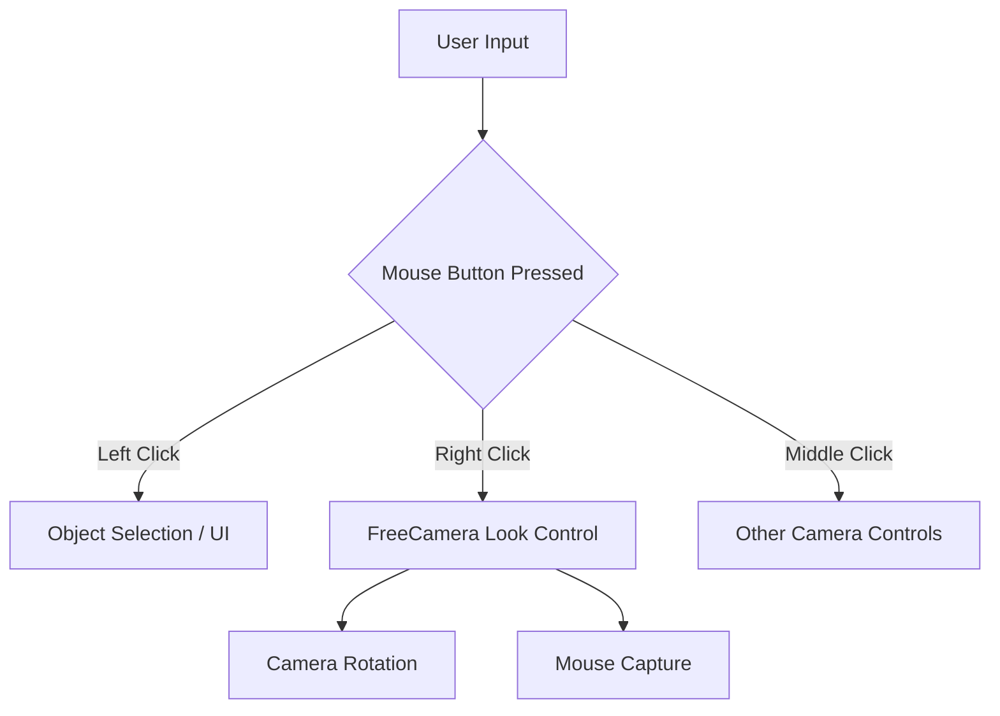

+++
title = "#22953 Changed mouse grab button from Left to Right for `FreeCamera`"
date = "2026-02-17T00:00:00"
draft = false
template = "pull_request_page.html"
in_search_index = true

[taxonomies]
list_display = ["show"]

[extra]
current_language = "en"
available_languages = {"en" = { name = "English", url = "/pull_request/bevy/2026-02/pr-22953-en-20260217" }, "zh-cn" = { name = "中文", url = "/pull_request/bevy/2026-02/pr-22953-zh-cn-20260217" }}
labels = ["C-Usability", "D-Straightforward", "A-Camera"]
+++

# Changed mouse grab button from Left to Right for `FreeCamera`

## Basic Information
- **Title**: Changed mouse grab button from Left to Right for `FreeCamera`
- **PR Link**: https://github.com/bevyengine/bevy/pull/22953
- **Author**: Breakdown-Dog
- **Status**: MERGED
- **Labels**: C-Usability, S-Ready-For-Final-Review, D-Straightforward, A-Camera
- **Created**: 2026-02-14T08:50:49Z
- **Merged**: 2026-02-17T01:26:14Z
- **Merged By**: alice-i-cecile

## Description Translation
### Objective
- Currently, the `FreeCamera` uses MouseButton::Left for cursor grabbing, which risks input conflicts, for example, if scene selection tools are introduced, as both actions would map to the same trigger.
- Remapping this to MouseButton::Right aligns with industry-standard interaction paradigms (e.g., Unity, Unreal, Blender), where the right mouse button is reserved for view manipulation, leaving the left button exclusively for object selection and UI interaction.

### Solution
- Changed mouse grab button from Left to Right for `FreeCamera`

### Testing
- The `free_camera_controller` example works properly.
- CI

---

## The Story of This Pull Request

This pull request addresses a straightforward but important usability issue in Bevy's FreeCamera controller. The problem centers on input mapping conflicts that could arise between camera control and other common 3D application interactions.

The FreeCamera component provides a standard first-person or free-flying camera controller for 3D scenes. Prior to this change, it used the left mouse button to capture and release mouse input for camera look-around functionality. While this worked for basic camera control, it created a potential conflict with other common operations in 3D applications, particularly object selection.

The issue becomes apparent when considering typical 3D application workflows. In engines like Unity and Unreal, as well as DCC (Digital Content Creation) tools like Blender, there's a standard convention: the left mouse button handles selection and UI interactions, while the right mouse button handles view manipulation. This separation prevents mode confusion and allows users to quickly switch between selecting objects and adjusting their viewpoint.

The implementation approach was minimal and focused. The developer identified the single configuration value that needed changing - the `mouse_key_cursor_grab` field in the FreeCamera struct's Default implementation. By changing this from `MouseButton::Left` to `MouseButton::Right`, the camera controller immediately aligns with industry-standard practices without requiring any changes to the underlying camera control logic.

This change also required updating the documentation in the corresponding example to ensure users understand the new default controls. The example file's documentation table was updated to reflect that right click (not left click) now captures the mouse for camera look-around.

From a technical perspective, this change demonstrates good API design. The FreeCamera struct exposes the `mouse_key_cursor_grab` field as configurable, so users who prefer the old behavior can easily override it by setting this field explicitly when creating their camera. The default value change improves the out-of-the-box experience for most users while maintaining flexibility for edge cases.

The impact of this change is primarily on user experience rather than technical architecture. New users coming from other 3D tools will find the controls familiar, reducing the learning curve when working with Bevy. Developers building applications with both camera control and object selection won't face input conflicts by default. This small change helps position Bevy as a more professional-grade engine that follows established industry conventions.

## Visual Representation



## Key Files Changed

### `crates/bevy_camera_controller/src/free_camera.rs`
This file contains the core FreeCamera struct definition and its Default implementation. The change modifies the default mouse button used for cursor grabbing from left to right.

**Before:**
```rust
mouse_key_cursor_grab: MouseButton::Left,
```

**After:**
```rust
mouse_key_cursor_grab: MouseButton::Right,
```

### `examples/camera/free_camera_controller.rs`
This example file demonstrates how to use the FreeCamera controller. The documentation table was updated to reflect the new default control scheme.

**Before:**
```rust
//! | Left click          | Capture mouse (hold)   |
```

**After:**
```rust
//! | Right click         | Capture mouse (hold)   |
```

## Further Reading

1. **Bevy Camera Controller Documentation**: The official documentation for the camera controller crate provides more details on configuration options and usage patterns.

2. **3D Application Interaction Patterns**: Research on standard 3D application controls in engines like Unity, Unreal Engine, and Blender can help understand why certain control schemes become industry standards.

3. **Input Handling in Game Engines**: For those interested in implementing custom input systems, studying how Bevy handles input events and maps them to actions would be beneficial. The `bevy_input` crate provides the foundation for these systems.

4. **Usability in Game Development**: Articles and studies on user experience in 3D applications can provide insights into why certain control schemes work better than others and how to design intuitive interfaces for complex applications.