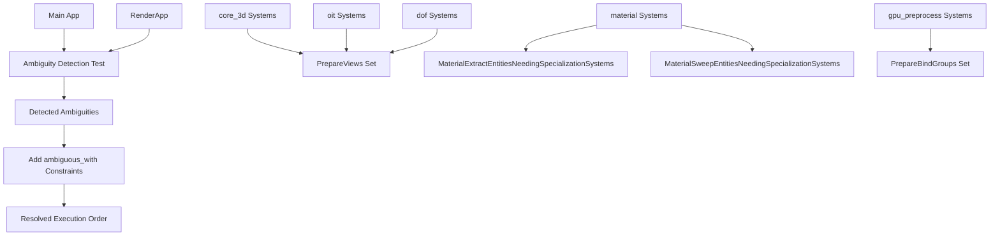

+++
title = "#22954 Enable RenderApp Ambiguity Detection"
date = "2026-02-17T00:00:00"
draft = false
template = "pull_request_page.html"
in_search_index = true

[taxonomies]
list_display = ["show"]

[extra]
current_language = "en"
available_languages = {"en" = { name = "English", url = "/pull_request/bevy/2026-02/pr-22954-en-20260217" }, "zh-cn" = { name = "中文", url = "/pull_request/bevy/2026-02/pr-22954-zh-cn-20260217" }}
labels = ["A-Rendering"]
+++

# Title

## Basic Information
- **Title**: Enable RenderApp Ambiguity Detection
- **PR Link**: https://github.com/bevyengine/bevy/pull/22954
- **Author**: atlv24
- **Status**: MERGED
- **Labels**: A-Rendering, S-Ready-For-Final-Review
- **Created**: 2026-02-14T08:58:17Z
- **Merged**: 2026-02-17T17:02:22Z
- **Merged By**: alice-i-cecile

## Description Translation
**Objective**
- Fix #7386

**Solution**
- #22951 #22952 #22949 #22945 and a handful more changes on this PR. NOTE: Ci will not pass until all these other prs are merged.
- Fix a bug

**Testing**
- examples look fine

## The Story of This Pull Request

This PR addresses a long-standing issue in Bevy's ECS scheduling system. The core problem was that ambiguity detection—which identifies systems that can run in parallel without conflicts—wasn't being applied to the RenderApp. The RenderApp is a separate sub-app in Bevy's architecture that handles rendering logic, running in parallel with the main app.

Without ambiguity detection in the RenderApp, developers could inadvertently introduce system ordering issues that would only manifest as non-deterministic bugs or race conditions during rendering. These bugs would be difficult to diagnose because the ambiguity detection system wouldn't flag them.

The solution involved two main changes:

1. **Enabling ambiguity detection for RenderApp**: The test that checks for system ambiguities was updated to run against both the main app and the RenderApp. Previously, this test only checked the main app, leaving potential rendering ambiguities undetected.

2. **Resolving existing ambiguities in the RenderApp**: Once ambiguity detection was enabled for RenderApp, several actual ambiguities were identified. These were fixed by adding explicit `.ambiguous_with()` constraints to systems that access the same resources but weren't properly ordered.

The changes follow a consistent pattern. For systems that are part of a `SystemSet` but also need exclusive access to resources used by other systems in that same set, we add `.ambiguous_with()` constraints. This tells the scheduler that these systems cannot run in parallel with other systems in their set, even though they're grouped together.

For example, in `core_3d/mod.rs`, the `configure_occlusion_culling_view_targets` system is in the `RenderSystems::PrepareViews` set, but it modifies resources that other systems in that set might also access. The fix adds `.ambiguous_with(RenderSystems::PrepareViews)` to ensure it doesn't run concurrently with other systems in the same set.

A similar pattern appears in the material system, where `extract_entities_needs_specialization` and `sweep_entities_needing_specialization` systems needed to be marked as ambiguous within their respective system sets to prevent concurrent execution issues.

The implementation is careful to maintain the existing system ordering while adding these constraints. The changes are minimal and targeted—each fix addresses a specific ambiguity without restructuring the overall system architecture.

These changes improve the robustness of Bevy's rendering system by ensuring that system execution order is deterministic and free from hidden race conditions. Developers can now rely on ambiguity detection to catch potential issues in both the main app and the RenderApp, making the framework more reliable for complex rendering scenarios.

## Visual Representation



## Key Files Changed

### 1. `tests/ecs/ambiguity_detection.rs` (+8/-5)
This file contains the test that checks for system ambiguities. The key change is enabling ambiguity detection for the RenderApp, which was previously skipped.

**Before:**
```rust
// Ambiguities in the RenderApp are currently allowed.
// Eventually, we should forbid these: see https://github.com/bevyengine/bevy/issues/7386
// Uncomment the lines below to show the current ambiguities in the RenderApp.
// let sub_app = app.sub_app_mut(bevy_render::RenderApp);
// configure_ambiguity_detection(sub_app);
```

**After:**
```rust
let sub_app = app.sub_app_mut(bevy_render::RenderApp);
configure_ambiguity_detection(sub_app);
```

Additionally, assertions were added to check that the RenderApp has no ambiguities, matching the existing check for the main app.

### 2. `crates/bevy_pbr/src/material.rs` (+9/-1)
This file handles material systems in the rendering pipeline. Two systems needed ambiguity constraints, and a new SystemSet was defined.

**Key changes:**
- Added `MaterialSweepEntitiesNeedingSpecializationSystems` SystemSet definition
- Added `.ambiguous_with()` constraints to two material specialization systems

```rust
// New SystemSet definition
#[derive(SystemSet, Clone, PartialEq, Eq, Debug, Hash)]
pub struct MaterialSweepEntitiesNeedingSpecializationSystems;

// System with ambiguity constraint added
extract_entities_needs_specialization::<M>
    .in_set(MaterialExtractEntitiesNeedingSpecializationSystems)
    .ambiguous_with(MaterialExtractEntitiesNeedingSpecializationSystems),

// Another system with ambiguity constraint and new set
sweep_entities_needing_specialization::<M>
    .in_set(MaterialSweepEntitiesNeedingSpecializationSystems)
    .ambiguous_with(MaterialSweepEntitiesNeedingSpecializationSystems)
```

### 3. `crates/bevy_core_pipeline/src/core_3d/mod.rs` (+2/-1)
This file contains 3D rendering pipeline systems. The occlusion culling system needed an ambiguity constraint.

**Before:**
```rust
configure_occlusion_culling_view_targets
    .after(prepare_view_targets)
    .in_set(RenderSystems::PrepareViews),
```

**After:**
```rust
configure_occlusion_culling_view_targets
    .after(prepare_view_targets)
    .in_set(RenderSystems::PrepareViews)
    .ambiguous_with(RenderSystems::PrepareViews),
```

### 4. `crates/bevy_core_pipeline/src/oit/mod.rs` (+3/-1)
This file handles Order Independent Transparency systems. The camera depth configuration system needed an ambiguity constraint.

**Before:**
```rust
configure_camera_depth_usages.in_set(RenderSystems::PrepareViews),
```

**After:**
```rust
configure_camera_depth_usages
    .in_set(RenderSystems::PrepareViews)
    .ambiguous_with(RenderSystems::PrepareViews),
```

### 5. `crates/bevy_pbr/src/render/gpu_preprocess.rs` (+2/-1)
This file handles GPU pre-processing for meshes. Added an explicit ordering constraint.

**Before:**
```rust
prepare_mesh_bind_group::<MeshPipeline, MeshUniform, MeshInputUniform>
    .in_set(RenderSystems::PrepareBindGroups),
```

**After:**
```rust
prepare_mesh_bind_group::<MeshPipeline, MeshUniform, MeshInputUniform>
    .in_set(RenderSystems::PrepareBindGroups)
    .after(prepare_preprocess_pipelines),
```

### 6. `crates/bevy_post_process/src/dof/mod.rs` (+2/-1)
This file handles Depth of Field post-processing. The view target configuration system needed an ambiguity constraint.

**Before:**
```rust
configure_depth_of_field_view_targets,
```

**After:**
```rust
configure_depth_of_field_view_targets
    .ambiguous_with(RenderSystems::PrepareViews),
```

## Further Reading

1. [Bevy ECS System Ordering Documentation](https://bevyengine.org/learn/quick-start/ecs-system-order/) - Official guide on system ordering and ambiguity
2. [System Sets in Bevy](https://bevyengine.org/learn/quick-start/ecs-system-sets/) - How to organize systems into sets
3. [Issue #7386: Enable ambiguity detection for RenderApp](https://github.com/bevyengine/bevy/issues/7386) - The original issue this PR fixes
4. [Bevy Render Graph Architecture](https://bevyengine.org/learn/quick-start/render-graph/) - Understanding the RenderApp and its relationship to the main app