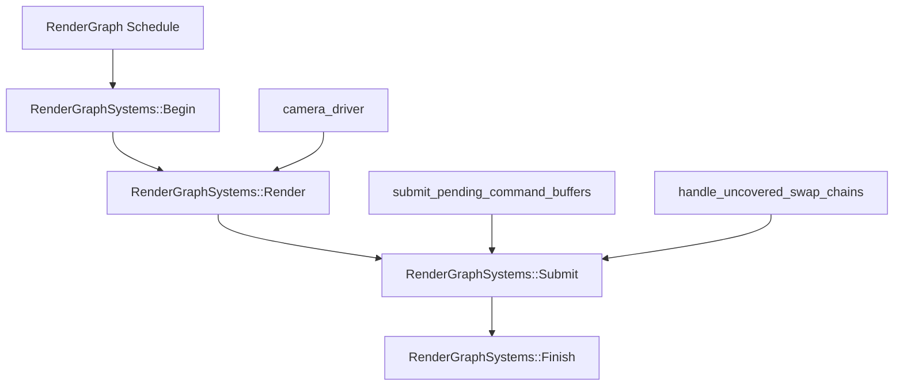

+++
title = "#22958 Introduce RenderGraphSystems"
date = "2026-02-17T00:00:00"
draft = false
template = "pull_request_page.html"
in_search_index = true

[taxonomies]
list_display = ["show"]

[extra]
current_language = "en"
available_languages = {"en" = { name = "English", url = "/pull_request/bevy/2026-02/pr-22958-en-20260217" }, "zh-cn" = { name = "中文", url = "/pull_request/bevy/2026-02/pr-22958-zh-cn-20260217" }}
labels = ["A-Rendering", "C-Code-Quality", "C-Usability"]
+++

# Title
Introduce RenderGraphSystems

## Basic Information
- **Title**: Introduce RenderGraphSystems
- **PR Link**: https://github.com/bevyengine/bevy/pull/22958
- **Author**: IceSentry
- **Status**: MERGED
- **Labels**: A-Rendering, C-Code-Quality, C-Usability, S-Ready-For-Final-Review
- **Created**: 2026-02-14T18:59:05Z
- **Merged**: 2026-02-17T01:26:14Z
- **Merged By**: alice-i-cecile

## Description Translation
# Objective

- It's sometimes useful to order things relative to the `RenderGraph`

## Solution

- Introduce `RenderGraphSytems` that contains all the important phases of the `RenderGraph` execution

## Testing

- I tested the 3d_scene and it worked

## Note

This is needed to fix diagnostic recording of gpu timestamps.

## The Story of This Pull Request

This PR addresses a scheduling problem in Bevy's rendering system. The `RenderGraph` schedule, which orchestrates the rendering pipeline, previously lacked clearly defined execution phases. This made it difficult for developers to schedule systems relative to specific rendering stages, particularly when needing to run systems before or after the main render pass or command buffer submission.

The core issue was that systems like `camera_driver` handled multiple responsibilities in a single function: executing camera render graphs, submitting command buffers, and handling uncovered swap chains. This monolithic approach provided no clear hooks for systems that needed to run between these phases.

The solution introduces a `RenderGraphSystems` enum with four distinct phases: `Begin`, `Render`, `Submit`, and `Finish`. These phases are arranged in a chain, establishing clear ordering constraints. The `Begin` phase runs before rendering for per-frame setup, `Render` handles the main rendering work, `Submit` handles command buffer submission, and `Finish` runs after everything for per-frame finalization.

This change enables proper ordering for systems like GPU timestamp diagnostics, which need to record timestamps at specific points in the render pipeline. By providing these explicit phases, developers can now schedule systems with precise timing relative to the render graph execution.

The implementation restructures the rendering pipeline by:
1. Defining `RenderGraphSystems` as a `SystemSet` with the four phases
2. Configuring these sets in the `RenderGraph::base_schedule()` method
3. Splitting the monolithic `camera_driver` system into logical components
4. Moving command buffer submission and swap chain handling to the `Submit` phase

This architectural change doesn't just solve the immediate problem but provides a foundation for future rendering extensions. The explicit phases make the rendering pipeline more modular and maintainable, allowing new features to be added at appropriate points without disrupting the core flow.

## Visual Representation



## Key Files Changed

### `crates/bevy_render/src/renderer/mod.rs` (+24/-1)
This file defines the new `RenderGraphSystems` enum and updates the `RenderGraph::base_schedule()` method to configure the system sets.

**Key changes:**
```rust
// Added: Definition of RenderGraphSystems
/// System sets for the root [`RenderGraph`] schedule.
#[derive(SystemSet, Debug, Clone, PartialEq, Eq, Hash)]
pub enum RenderGraphSystems {
    /// Runs before rendering. Used for per-frame setup.
    Begin,
    /// The main rendering phase.
    Render,
    /// Submits pending command buffers generated during [`RenderGraphSystems::Render`]
    Submit,
    /// Runs after rendering and submit. Used for per-frame finalization.
    Finish,
}

// Updated: RenderGraph::base_schedule() now configures the system sets
impl RenderGraph {
    pub fn base_schedule() -> Schedule {
        let mut schedule = Schedule::new(Self);
        schedule.configure_sets(
            (
                RenderGraphSystems::Begin,
                RenderGraphSystems::Render,
                RenderGraphSystems::Submit,
                RenderGraphSystems::Finish,
            )
                .chain(),
        );
        schedule
    }
}
```

### `crates/bevy_core_pipeline/src/lib.rs` (+14/-5)
This file updates the `CorePipelinePlugin` to schedule systems using the new `RenderGraphSystems` sets.

**Key changes:**
```rust
// Before:
render_app
    .init_resource::<FullscreenShader>()
    .add_systems(RenderGraph, camera_driver);

// After:
render_app.init_resource::<FullscreenShader>().add_systems(
    RenderGraph,
    (
        camera_driver.in_set(RenderGraphSystems::Render),
        (submit_pending_command_buffers, handle_uncovered_swap_chains)
            .chain()
            .in_set(RenderGraphSystems::Submit),
    ),
);
```

### `crates/bevy_core_pipeline/src/schedule.rs` (+12/-7)
This file refactors the `camera_driver` system and makes helper functions public for use in the new scheduling structure.

**Key changes:**
```rust
// Added: CameraWindows resource to pass data between phases
#[derive(Resource)]
struct CameraWindows(HashSet<Entity>);

// Modified: camera_driver now stores results in CameraWindows instead of processing them
pub fn camera_driver(world: &mut World) {
    // ... camera rendering logic ...
    world.remove_resource::<CurrentView>();
    
    world.insert_resource(CameraWindows(camera_windows)); // Store for later use
}

// Made public for use in RenderGraphSystems::Submit
pub(crate) fn submit_pending_command_buffers(world: &mut World) {
    // ... command buffer submission logic ...
}

pub(crate) fn handle_uncovered_swap_chains(world: &mut World) {
    // Now retrieves CameraWindows from resources instead of as a parameter
    let Some(camera_windows) = world.remove_resource::<CameraWindows>() else {
        return;
    };
    // ... swap chain handling logic using camera_windows.0 ...
}
```

### `crates/bevy_render/src/lib.rs` (+3/-1)
This file ensures the `RenderGraph` schedule is added to the render app.

**Key change:**
```rust
// Added: Ensure RenderGraph schedule is available
render_app.add_schedule(RenderGraph::base_schedule());
```

## Further Reading

1. [Bevy's Scheduling System Documentation](https://bevyengine.org/learn/book/next/programming/schedules/) - Understanding Bevy's ECS scheduling model
2. [System Sets in Bevy](https://bevyengine.org/learn/book/next/programming/schedules/#system-sets) - How to group and order systems
3. [Render Graph Architecture](https://github.com/bevyengine/bevy/blob/main/crates/bevy_render/src/render_graph/mod.rs) - Bevy's render graph implementation
4. [Command Buffers in Graphics Programming](https://vulkan-tutorial.com/Drawing_a_triangle/Drawing/Command_buffers) - Background on command buffer submission patterns