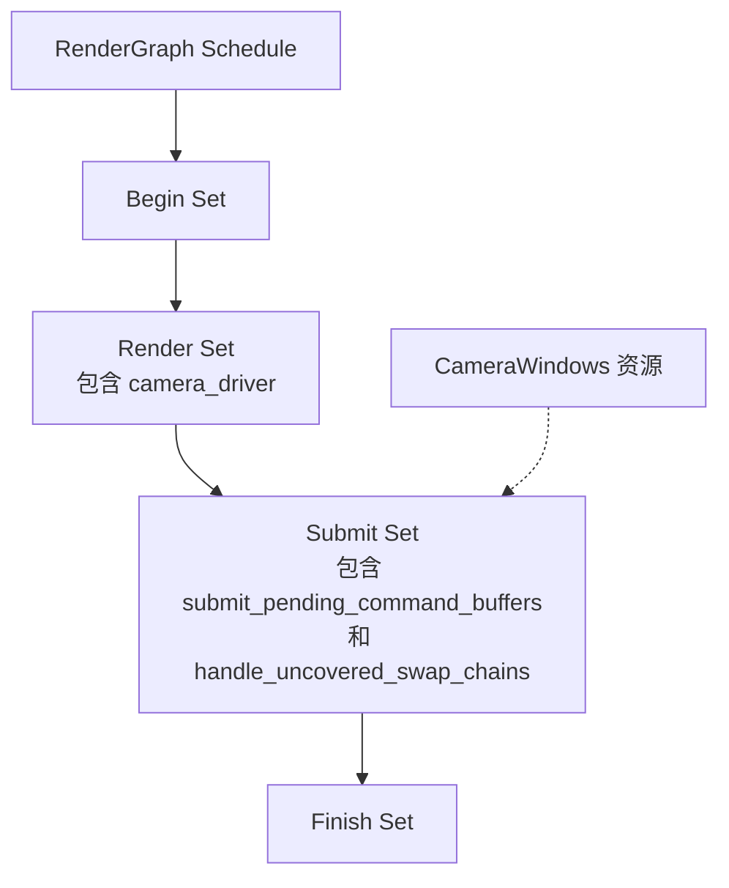

+++
title = "#22958 Introduce RenderGraphSystems"
date = "2026-02-17T00:00:00"
draft = false
template = "pull_request_page.html"
in_search_index = false

[extra]
current_language = "zh-cn"
available_languages = {"en" = { name = "English", url = "/pull_request/bevy/2026-02/pr-22958-en-20260217" }, "zh-cn" = { name = "中文", url = "/pull_request/bevy/2026-02/pr-22958-zh-cn-20260217" }}
+++

# Title
## 基础信息
- **标题**: Introduce RenderGraphSystems
- **PR链接**: https://github.com/bevyengine/bevy/pull/22958
- **作者**: IceSentry
- **状态**: 已合并
- **标签**: A-Rendering, C-Code-Quality, C-Usability, S-Ready-For-Review
- **创建时间**: 2026-02-14T18:59:05Z
- **合并时间**: 2026-02-17T01:26:14Z
- **合并者**: alice-i-cecile

## 描述翻译

### 目标
- 有时候需要在 `RenderGraph` 相关的阶段中安排系统执行顺序

### 解决方案
- 引入 `RenderGraphSystems`，其中包含 `RenderGraph` 执行的所有重要阶段

### 测试
- 我测试了 3d_scene 示例，工作正常

### 备注
这是修复GPU时间戳诊断记录所必需的。

## PR分析报告

这个PR解决了一个具体的技术问题：在Bevy渲染系统中，缺乏标准化的阶段定义来安排与渲染图执行相关的系统。问题的核心在于，当开发者需要将某些系统安排在渲染图特定的执行阶段（例如渲染前、渲染后、提交命令缓冲区之前或之后）时，没有统一的方法来确保正确的执行顺序。

PR作者采取了一种直接且实用的解决方案：引入一个明确的系统集（SystemSet）枚举来定义渲染图的主要执行阶段。这个方案利用了Bevy现有的调度系统框架，通过定义 `RenderGraphSystems` 枚举，为渲染图执行创建了四个清晰的阶段：
1. **Begin**: 渲染前阶段，用于每帧的初始化工作
2. **Render**: 主要渲染阶段
3. **Submit**: 提交在Render阶段生成的待处理命令缓冲区
4. **Finish**: 渲染和提交后的收尾工作

从实现细节来看，这个PR涉及几个关键的技术修改。首先，在 `bevy_render/src/renderer/mod.rs` 中，`RenderGraph::base_schedule()` 方法现在会配置这些系统集并建立它们的链式执行顺序：

```rust
pub fn base_schedule() -> Schedule {
    let mut schedule = Schedule::new(Self);
    schedule.configure_sets(
        (
            RenderGraphSystems::Begin,
            RenderGraphSystems::Render,
            RenderGraphSystems::Submit,
            RenderGraphSystems::Finish,
        )
            .chain(),
    );
    schedule
}
```

这个修改确保了这些阶段会按定义的顺序执行。新的 `RenderGraphSystems` 枚举提供了清晰的阶段划分：

```rust
#[derive(SystemSet, Debug, Clone, PartialEq, Eq, Hash)]
pub enum RenderGraphSystems {
    Begin,
    Render,
    Submit,
    Finish,
}
```

在 `bevy_core_pipeline/src/lib.rs` 中，现有的渲染相关系统被重新组织到这些新的阶段中。`camera_driver` 系统被放置在 `Render` 阶段，而 `submit_pending_command_buffers` 和 `handle_uncovered_swap_chains` 这两个系统被链式组合并放置在 `Submit` 阶段：

```rust
render_app.init_resource::<FullscreenShader>().add_systems(
    RenderGraph,
    (
        camera_driver.in_set(RenderGraphSystems::Render),
        (submit_pending_command_buffers, handle_uncovered_swap_chains)
            .chain()
            .in_set(RenderGraphSystems::Submit),
    ),
);
```

这种组织方式带来几个技术优势。首先，它通过明确的阶段划分改善了代码的可读性和可维护性。开发者现在可以清楚地看到哪些系统在哪个渲染阶段执行。其次，它提供了扩展性，未来可以轻松地在这些阶段之间插入新的系统。第三，它为GPU时间戳诊断等高级功能奠定了基础，因为这些功能需要在特定的渲染阶段记录数据。

一个重要的技术细节是`camera_driver`函数的重构。原先这个函数在内部直接调用了 `submit_pending_command_buffers` 和 `handle_uncovered_swap_chains`，现在改为通过资源传递数据：

```rust
// 之前：在camera_driver内部直接调用
submit_pending_command_buffers(world);
handle_uncovered_swap_chains(world, &camera_windows);

// 之后：将CameraWindows存储为资源，供Submit阶段的系统使用
world.insert_resource(CameraWindows(camera_windows));
```

这个改变使得系统间的依赖更加明确，符合ECS架构的最佳实践。`Submit` 阶段的系统现在可以从资源中获取 `CameraWindows`，而不是依赖函数参数传递。

从工程角度看，这个PR展示了良好的渐进式重构模式。它没有改变核心的渲染逻辑，而是通过引入抽象层来改善代码组织。这种修改降低了认知负担，使新开发者更容易理解渲染管线的执行流程。

值得注意的是，PR作者在描述中提到这个修改是为修复GPU时间戳诊断记录所必需的。这表明 `RenderGraphSystems` 不仅改善了代码结构，还解锁了新的功能可能性。通过提供明确的阶段边界，诊断工具现在可以在特定的渲染阶段（如 `Render` 和 `Submit` 之间）准确地记录时间戳。

## 视觉表示



## 主要文件变更

### `crates/bevy_render/src/renderer/mod.rs` (+24/-1)
这个文件定义了 `RenderGraphSystems` 枚举并配置了渲染图调度的阶段。

关键修改：
```rust
// 新增：RenderGraphSystems 枚举定义
#[derive(SystemSet, Debug, Clone, PartialEq, Eq, Hash)]
pub enum RenderGraphSystems {
    Begin,
    Render,
    Submit,
    Finish,
}

// 修改：base_schedule 方法现在配置系统集
pub fn base_schedule() -> Schedule {
    let mut schedule = Schedule::new(Self);
    schedule.configure_sets(
        (
            RenderGraphSystems::Begin,
            RenderGraphSystems::Render,
            RenderGraphSystems::Submit,
            RenderGraphSystems::Finish,
        )
            .chain(),
    );
    schedule
}
```

### `crates/bevy_core_pipeline/src/lib.rs` (+14/-5)
这个文件将现有的渲染系统重新组织到新的阶段中。

关键修改：
```rust
// 修改前：
render_app
    .init_resource::<FullscreenShader>()
    .add_systems(RenderGraph, camera_driver);

// 修改后：
render_app.init_resource::<FullscreenShader>().add_systems(
    RenderGraph,
    (
        camera_driver.in_set(RenderGraphSystems::Render),
        (submit_pending_command_buffers, handle_uncovered_swap_chains)
            .chain()
            .in_set(RenderGraphSystems::Submit),
    ),
);
```

### `crates/bevy_core_pipeline/src/schedule.rs` (+12/-7)
这个文件重构了 `camera_driver` 函数，使其不再直接调用提交和交换链处理函数。

关键修改：
```rust
// 新增：CameraWindows 资源定义
#[derive(Resource)]
struct CameraWindows(HashSet<Entity>);

// 修改：camera_driver 现在存储资源而不是直接调用
pub fn camera_driver(world: &mut World) {
    // ... 原有逻辑 ...
    world.insert_resource(CameraWindows(camera_windows));
}

// 修改：这两个函数现在可以被外部调用
pub(crate) fn submit_pending_command_buffers(world: &mut World) {
    // ... 实现 ...
}

pub(crate) fn handle_uncovered_swap_chains(world: &mut World) {
    // ... 现在从资源获取 CameraWindows ...
    let Some(camera_windows) = world.remove_resource::<CameraWindows>() else {
        return;
    };
}
```

### `crates/bevy_render/src/lib.rs` (+3/-1)
这个文件确保渲染应用使用配置好的渲染图调度。

关键修改：
```rust
// 新增：添加基础调度到渲染应用
render_app.add_schedule(RenderGraph::base_schedule());
```

## 延伸阅读

- [Bevy 调度系统文档](https://docs.rs/bevy_ecs/latest/bevy_ecs/schedule/index.html) - 了解系统集和调度配置
- [Bevy 渲染图架构](https://bevy-cheatbook.github.io/programming/render-graphs.html) - 理解渲染图的工作原理
- [ECS 架构模式](https://www.gamedeveloper.com/programming/entity-component-system) - 深入理解实体组件系统设计