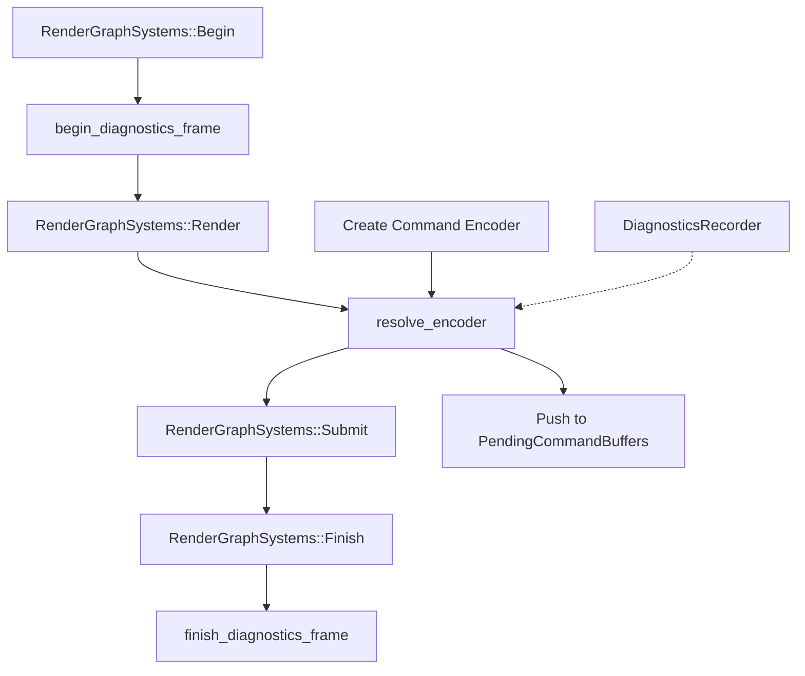

+++
title = "#22960 Fix render diagnostics"
date = "2026-02-18T00:00:00"
draft = false
template = "pull_request_page.html"
in_search_index = true

[taxonomies]
list_display = ["show"]

[extra]
current_language = "en"
available_languages = {"en" = { name = "English", url = "/pull_request/bevy/2026-02/pr-22960-en-20260218" }, "zh-cn" = { name = "中文", url = "/pull_request/bevy/2026-02/pr-22960-zh-cn-20260218" }}
labels = ["C-Bug", "A-Rendering", "C-Usability"]
+++

# Title: Fix render diagnostics

## Basic Information
- **Title**: Fix render diagnostics
- **PR Link**: https://github.com/bevyengine/bevy/pull/22960
- **Author**: IceSentry
- **Status**: MERGED
- **Labels**: C-Bug, A-Rendering, C-Usability, S-Ready-For-Final-Review
- **Created**: 2026-02-14T19:21:11Z
- **Merged**: 2026-02-18T04:08:14Z
- **Merged By**: alice-i-cecile

## Description

# Objective

- Render diagnostics currently don't work

## Solution

- Use the new system sets from https://github.com/bevyengine/bevy/pull/22958 to resolve the encoder after render but before submit

## Testing

- Tested with 3d_scene and solari

## Note

~~This is based on https://github.com/bevyengine/bevy/pull/22958 so need to merge that one first~~


## The Story of This Pull Request

This PR addresses a bug where render diagnostics were broken in Bevy's rendering system. The issue was related to the timing of when command encoders are resolved for diagnostics recording. Before this fix, the diagnostics system wasn't functioning correctly because it wasn't properly integrated into the render graph execution flow.

The core problem stemmed from the render diagnostics needing to capture GPU timing information, which requires creating and resolving command encoders at specific points in the render pipeline. The diagnostics system uses timestamp queries to measure GPU execution time for various render passes, but these queries need to be inserted into command buffers at the right time - after all render commands have been recorded but before the command buffers are submitted to the GPU.

The solution leverages new system sets introduced in PR #22958, which provide more granular control over the ordering of render graph systems. The key insight is that we need to resolve the diagnostics encoder in the gap between the render graph execution and command buffer submission. This timing ensures that all render commands have been encoded, but the command buffers haven't yet been sent to the GPU, allowing us to insert the necessary timestamp queries.

The implementation adds three new systems to the render graph schedule:
1. `begin_diagnostics_frame` runs at the beginning of the frame to start diagnostics recording
2. `resolve_encoder` runs after the main render graph systems but before submission, creating and resolving the command encoder for diagnostics
3. `finish_diagnostics_frame` runs at the end to finalize the frame and sync diagnostics data back to the main world

The most critical system is `resolve_encoder`, which creates a new command encoder specifically for diagnostics. This encoder captures the timestamp queries for all diagnostic spans that were recorded during frame execution. By pushing this encoder to the `PendingCommandBuffers`, it ensures the diagnostic commands are submitted along with the main render commands.

This approach demonstrates a common pattern in graphics programming where timing measurements require careful synchronization points in the command stream. The fix ensures that render diagnostics can accurately measure both CPU and GPU execution times for debugging and optimization purposes.

The testing with 3d_scene and solari confirms that the diagnostics are now working correctly, as evidenced by the Tracy profiler screenshot showing proper GPU timing measurements.

## Visual Representation



## Key Files Changed

**File:** `crates/bevy_render/src/diagnostic/mod.rs`

**Changes:** This file received the primary modifications to fix the render diagnostics. The changes include:
1. Added necessary imports for the new systems and resources
2. Modified the `RenderDiagnosticsPlugin` to register three new systems in the render graph schedule
3. Implemented the three new systems that handle diagnostics frame lifecycle

**Key code modifications:**

```rust
// Before: Plugin implementation didn't register any systems
impl Plugin for RenderDiagnosticsPlugin {
    fn build(&self, app: &mut App) {
        // ... existing setup code ...
    }
}

// After: Plugin now registers systems in the render graph
impl Plugin for RenderDiagnosticsPlugin {
    fn build(&self, app: &mut App) {
        // ... existing setup code ...
        
        render_app.add_systems(
            RenderGraph,
            (
                begin_diagnostics_frame.in_set(RenderGraphSystems::Begin),
                resolve_encoder
                    .after(RenderGraphSystems::Render)
                    .before(RenderGraphSystems::Submit),
                finish_diagnostics_frame.in_set(RenderGraphSystems::Finish),
            ),
        );
    }
}

// New systems added:
pub fn begin_diagnostics_frame(mut recorder: ResMut<DiagnosticsRecorder>) {
    recorder.begin_frame();
}

pub fn resolve_encoder(
    mut recorder: ResMut<DiagnosticsRecorder>,
    render_device: Res<RenderDevice>,
    mut pending_buffers: ResMut<PendingCommandBuffers>,
) {
    let mut encoder =
        render_device.create_command_encoder(&wgpu::CommandEncoderDescriptor::default());
    recorder.resolve(&mut encoder);
    pending_buffers.push_encoder(encoder);
}

fn finish_diagnostics_frame(
    mut recorder: ResMut<DiagnosticsRecorder>,
    render_device: Res<RenderDevice>,
    mutex: Res<RenderDiagnosticsMutex>,
) {
    let mutex = mutex.0.clone();
    recorder.finish_frame(&render_device, move |diagnostics| {
        *mutex.lock().unwrap() = Some(diagnostics);
    });
}
```

## Further Reading

1. **wgpu Command Encoders**: Understanding how command encoders work in wgpu is essential for this fix. The [wgpu documentation on command encoders](https://docs.rs/wgpu/latest/wgpu/struct.CommandEncoder.html) provides details on recording and submitting commands.

2. **Render Graph Architecture**: Bevy's render graph system manages the ordering of render operations. The [Bevy Render Graph documentation](https://bevyengine.org/learn/advanced-topics/rendering/render-graph/) explains how systems are organized into phases.

3. **GPU Timestamp Queries**: This fix relies on timestamp queries for GPU timing. The [wgpu timestamp queries documentation](https://docs.rs/wgpu/latest/wgpu/struct.Features.html#associatedconstant.TIMESTAMP_QUERY) covers the feature requirements and usage.

4. **System Sets in Bevy**: PR #22958 introduced the new system sets used here. Understanding [Bevy's system sets and scheduling](https://bevyengine.org/learn/advanced-topics/scheduling/) helps contextualize the timing improvements.

5. **Tracy Profiler Integration**: The screenshot shows Tracy profiler output, which is a performance analysis tool. The [Tracy documentation](https://github.com/wolfpld/tracy) provides details on GPU profiling capabilities.

# Full Code Diff
diff --git a/crates/bevy_render/src/diagnostic/mod.rs b/crates/bevy_render/src/diagnostic/mod.rs
index 952e0eef3dd69..dc26752249d3a 100644
--- a/crates/bevy_render/src/diagnostic/mod.rs
+++ b/crates/bevy_render/src/diagnostic/mod.rs
@@ -10,12 +10,19 @@ mod render_asset_diagnostic_plugin;
 mod tracy_gpu;
 
 use alloc::{borrow::Cow, sync::Arc};
+use bevy_ecs::{
+    schedule::IntoScheduleConfigs,
+    system::{Res, ResMut},
+};
 use core::marker::PhantomData;
 use wgpu::{BufferSlice, CommandEncoder};
 
 use bevy_app::{App, Plugin, PreUpdate};
 
-use crate::{renderer::RenderAdapterInfo, RenderApp};
+use crate::{
+    renderer::{PendingCommandBuffers, RenderAdapterInfo, RenderGraph, RenderGraphSystems},
+    RenderApp,
+};
 
 use self::internal::{sync_diagnostics, Pass, RenderDiagnosticsMutex, WriteTimestamp};
 pub use self::{
@@ -75,9 +82,49 @@ impl Plugin for RenderDiagnosticsPlugin {
         let device = render_app.world().resource::<RenderDevice>();
         let queue = render_app.world().resource::<RenderQueue>();
         render_app.insert_resource(DiagnosticsRecorder::new(adapter_info, device, queue));
+
+        render_app.add_systems(
+            RenderGraph,
+            (
+                begin_diagnostics_frame.in_set(RenderGraphSystems::Begin),
+                resolve_encoder
+                    .after(RenderGraphSystems::Render)
+                    .before(RenderGraphSystems::Submit),
+                finish_diagnostics_frame.in_set(RenderGraphSystems::Finish),
+            ),
+        );
     }
 }
 
+/// Starts the diagnostics recorder for the frame.
+pub fn begin_diagnostics_frame(mut recorder: ResMut<DiagnosticsRecorder>) {
+    recorder.begin_frame();
+}
+
+/// Resolves the encoder used for diagnostic recording
+pub fn resolve_encoder(
+    mut recorder: ResMut<DiagnosticsRecorder>,
+    render_device: Res<RenderDevice>,
+    mut pending_buffers: ResMut<PendingCommandBuffers>,
+) {
+    let mut encoder =
+        render_device.create_command_encoder(&wgpu::CommandEncoderDescriptor::default());
+    recorder.resolve(&mut encoder);
+    pending_buffers.push_encoder(encoder);
+}
+
+/// Ends the current frame for the diagnostics recorder and syncs it with the main world.
+fn finish_diagnostics_frame(
+    mut recorder: ResMut<DiagnosticsRecorder>,
+    render_device: Res<RenderDevice>,
+    mutex: Res<RenderDiagnosticsMutex>,
+) {
+    let mutex = mutex.0.clone();
+    recorder.finish_frame(&render_device, move |diagnostics| {
+        *mutex.lock().unwrap() = Some(diagnostics);
+    });
+}
+
 /// Allows recording diagnostic spans.
 pub trait RecordDiagnostics: Send + Sync {
     /// Begin a time span, which will record elapsed CPU and GPU time.