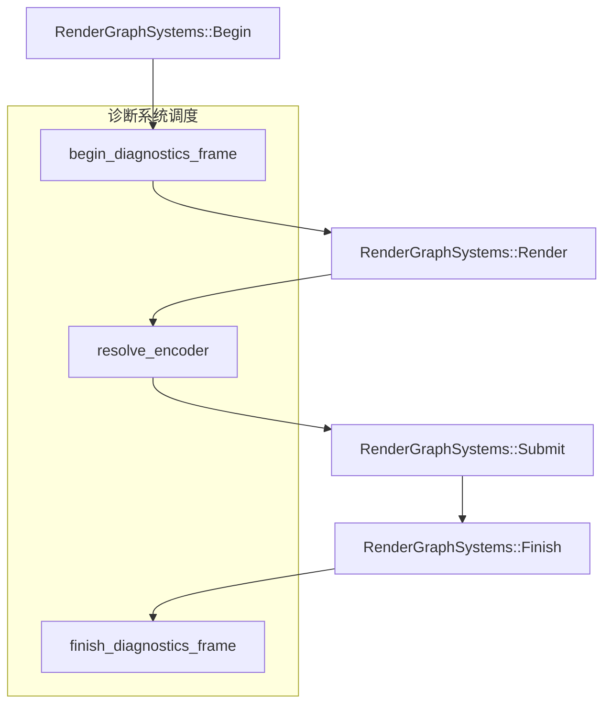

+++
title = "#22960 Fix render diagnostics"
date = "2026-02-18T00:00:00"
draft = false
template = "pull_request_page.html"
in_search_index = false

[extra]
current_language = "zh-cn"
available_languages = {"en" = { name = "English", url = "/pull_request/bevy/2026-02/pr-22960-en-20260218" }, "zh-cn" = { name = "中文", url = "/pull_request/bevy/2026-02/pr-22960-zh-cn-20260218" }}
labels = ["C-Bug", "A-Rendering", "C-Usability"]
+++

# Title

## Basic Information
- **Title**: Fix render diagnostics
- **PR Link**: https://github.com/bevyengine/bevy/pull/22960
- **Author**: IceSentry
- **Status**: MERGED
- **Labels**: C-Bug, A-Rendering, C-Usability, S-Ready-For-Final-Review
- **Created**: 2026-02-14T19:21:11Z
- **Merged**: 2026-02-18T04:08:14Z
- **Merged By**: alice-i-cecile

## Description Translation
**目标**
- 渲染诊断当前无法工作

**解决方案**
- 使用来自 https://github.com/bevyengine/bevy/pull/22958 的新系统集（system sets），在渲染之后、提交之前解析编码器

**测试**
- 使用 3d_scene 和 solari 进行测试

**注意**
~~此 PR 基于 https://github.com/bevyengine/bevy/pull/22958，需要先合并该 PR~~


## The Story of This Pull Request

这个 PR 解决了渲染诊断功能失效的问题。渲染诊断是性能分析的关键工具，它允许开发者追踪 CPU 和 GPU 的渲染时间，从而识别性能瓶颈。

### 问题根源
问题的核心在于诊断系统的调度时机不当。诊断系统需要记录渲染过程中的时间戳，这些时间戳必须被正确地解析（resolve）并同步回 CPU 端。原先的实现中，解析编码器的时机与渲染图（Render Graph）的执行流程不匹配，导致诊断数据无法正确生成。

### 解决方案的技术细节
这个 PR 利用了 PR #22958 中引入的新系统集（system sets）机制。系统集为渲染调度提供了更清晰的结构化阶段划分：`RenderGraphSystems::Begin`、`RenderGraphSystems::Render`、`RenderGraphSystems::Submit` 和 `RenderGraphSystems::Finish`。

修复方案将诊断系统的工作流程拆分为三个明确的系统，并按正确的顺序插入到渲染调度中：

1. **`begin_diagnostics_frame`** - 在渲染图开始时启动新一帧的诊断记录
2. **`resolve_encoder`** - 在渲染图执行后、命令缓冲区提交前解析诊断编码器
3. **`finish_diagnostics_frame`** - 在渲染图结束时完成诊断帧并同步数据

关键的技术洞察是：诊断数据的解析必须在渲染命令记录完成后进行，但又必须在命令缓冲区提交到 GPU 之前完成。`RenderGraphSystems::Render` 和 `RenderGraphSystems::Submit` 之间的间隙正是执行这一操作的理想时机。

### 实现分析
在 `resolve_encoder` 函数中，代码创建了一个新的命令编码器，用于执行诊断数据的解析操作：

```rust
let mut encoder =
    render_device.create_command_encoder(&wgpu::CommandEncoderDescriptor::default());
recorder.resolve(&mut encoder);
pending_buffers.push_encoder(encoder);
```

这里的技术要点是：解析操作本身需要通过 GPU 命令来完成，因此需要创建一个命令编码器来承载这个操作。解析后的命令编码器被添加到待处理的命令缓冲区中，确保它会在正确的时机被执行。

这种设计体现了现代图形 API 的异步特性——诊断数据的收集和解析涉及到 CPU 和 GPU 之间的协调。通过将解析操作编码为 GPU 命令，系统可以确保诊断时间戳在 GPU 端被正确读取并传输回 CPU。

### 架构改进的意义
这个修复不仅仅是让诊断功能重新工作，更重要的是它展示了如何正确地将诊断系统集成到 Bevy 的渲染架构中。通过使用新的系统集机制，诊断系统现在与渲染管线的其他部分保持了明确的时序关系，这增强了代码的可维护性和可预测性。

从工程角度看，这个解决方案体现了几个重要的设计原则：
- **关注点分离**：将诊断系统的不同阶段分解为独立的系统
- **明确的依赖关系**：通过系统集确保操作的正确执行顺序
- **资源生命周期管理**：正确处理命令编码器的创建和提交

### 对开发者的影响
修复后，开发者可以再次使用诊断工具（如 Tracy Profiler）来监控渲染性能。这对于优化渲染性能、调试渲染问题至关重要。从附带的截图可以看到，修复后的诊断系统能够正确显示 GPU 时间的细粒度分布，为性能分析提供了宝贵的数据。

这个修复也验证了 PR #22958 中引入的系统集架构的价值，展示了如何利用这个新架构来解决实际的调度问题。它为后续的渲染系统改进提供了一个清晰的模式。

## Visual Representation



## Key Files Changed

### `crates/bevy_render/src/diagnostic/mod.rs`

**修改内容**：重写了诊断系统的调度逻辑，添加了三个新的系统函数，并将它们按正确的顺序插入到渲染图的调度中。

**关键代码片段**：

```rust
// 修改后的插件初始化代码
render_app.add_systems(
    RenderGraph,
    (
        begin_diagnostics_frame.in_set(RenderGraphSystems::Begin),
        resolve_encoder
            .after(RenderGraphSystems::Render)
            .before(RenderGraphSystems::Submit),
        finish_diagnostics_frame.in_set(RenderGraphSystems::Finish),
    ),
);
```

```rust
// 新增的 resolve_encoder 系统
pub fn resolve_encoder(
    mut recorder: ResMut<DiagnosticsRecorder>,
    render_device: Res<RenderDevice>,
    mut pending_buffers: ResMut<PendingCommandBuffers>,
) {
    let mut encoder =
        render_device.create_command_encoder(&wgpu::CommandEncoderDescriptor::default());
    recorder.resolve(&mut encoder);
    pending_buffers.push_encoder(encoder);
}
```

```rust
// 新增的 begin_diagnostics_frame 系统
pub fn begin_diagnostics_frame(mut recorder: ResMut<DiagnosticsRecorder>) {
    recorder.begin_frame();
}
```

**关联性分析**：这些修改确保了诊断系统在渲染流程的正确阶段执行。`begin_diagnostics_frame` 在渲染开始时启动诊断记录，`resolve_encoder` 在渲染完成后、提交前解析诊断数据，`finish_diagnostics_frame` 在渲染结束时完成数据同步。这三个系统协同工作，解决了诊断功能失效的问题。

## Further Reading

1. **Bevy 渲染架构文档** - 了解 Bevy 的渲染图（Render Graph）和调度系统
2. **wgpu 时间戳查询文档** - 了解 GPU 时间戳查询的工作原理和限制
3. **Tracy Profiler 文档** - 学习如何使用 Tracy 进行性能分析和诊断
4. **PR #22958** - 查看引入系统集机制的原始 PR，理解其架构设计背景
5. **Bevy ECS 调度系统** - 深入了解 Bevy 的实体组件系统和调度器工作原理