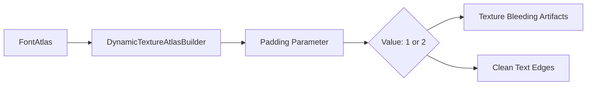

+++
title = "#22962 Reimplement #22722 after it was lost in the parley migration."
date = "2026-02-14T00:00:00"
draft = false
template = "pull_request_page.html"
in_search_index = true

[taxonomies]
list_display = ["show"]

[extra]
current_language = "en"
available_languages = {"en" = { name = "English", url = "/pull_request/bevy/2026-02/pr-22962-en-20260214" }, "zh-cn" = { name = "中文", url = "/pull_request/bevy/2026-02/pr-22962-zh-cn-20260214" }}
labels = ["C-Bug", "D-Trivial", "A-Text", "M-Deliberate-Rendering-Change"]
+++

# Title
Reimplement #22722 after it was lost in the parley migration.

## Basic Information
- **Title**: Reimplement #22722 after it was lost in the parley migration.
- **PR Link**: https://github.com/bevyengine/bevy/pull/22962
- **Author**: andriyDev
- **Status**: MERGED
- **Labels**: C-Bug, D-Trivial, S-Ready-For-Final-Review, A-Text, M-Deliberate-Rendering-Change
- **Created**: 2026-02-14T22:44:33Z
- **Merged**: 2026-02-14T23:40:30Z
- **Merged By**: alice-i-cecile

## Description Translation
# Objective

- This fix was lost in the parley migration (#22879).

## Solution

- Do the same thing as #22722.

## Testing

- PixelEagle should show the diff. The edges of some characters look nicer!
- This doesn't seem to fully fix things, as shuffling the order that glyphs are allocated makes things look different in some cases.

## The Story of This Pull Request

This PR addresses a regression in Bevy's text rendering system that occurred during the parley migration (#22879). The issue involved texture padding in font atlases, which affects how text characters are rendered, particularly the edges of glyphs.

The problem originated from PR #22722, which initially fixed a text rendering issue by increasing the padding in the font atlas builder from 1 to 2 pixels. Padding is critical in texture atlases to prevent texture bleeding - when neighboring glyphs in the atlas affect each other during texture sampling. Without sufficient padding, characters can appear with visual artifacts where edges from adjacent glyphs bleed into each other.

During the migration to the parley text layout system, this padding change was inadvertently lost, reverting the padding back to 1. The regression was subtle but noticeable in text rendering quality, particularly with anti-aliased fonts where edge artifacts are more visible.

The solution was straightforward: restore the padding value to 2 in the `FontAtlas` constructor. This one-character change has significant implications for text rendering quality. When glyphs are packed into texture atlases with only 1 pixel of padding, texture filtering operations (like linear filtering or mipmapping) can sample from adjacent glyphs, causing visual artifacts. Increasing the padding to 2 provides a buffer zone that prevents this sampling from reaching neighboring glyphs.

However, the PR author noted that this fix doesn't completely solve all text rendering issues. The order in which glyphs are allocated to the atlas can still affect rendering outcomes. This suggests there may be deeper issues with the atlas packing algorithm or texture coordinate calculations that need further investigation. The padding fix addresses one specific class of rendering artifacts but doesn't eliminate all potential problems with glyph positioning and texture sampling.

From an engineering perspective, this PR demonstrates the importance of regression testing during major system migrations. The parley migration (#22879) was a substantial change to Bevy's text system, and subtle configuration values like padding parameters can easily be lost during such refactors. The fix also shows how small, targeted changes can have meaningful impacts on visual quality.

## Visual Representation



## Key Files Changed

**crates/bevy_text/src/font_atlas.rs** (+1/-1)

This file contains the `FontAtlas` struct responsible for managing texture atlases for font glyphs. The change modifies the padding parameter when creating the `DynamicTextureAtlasBuilder`.

```rust
// File: crates/bevy_text/src/font_atlas.rs
// Before:
impl FontAtlas {
    pub fn new(
        size: Vec2,
        texture: Image,
        render_device: &RenderDevice,
        render_queue: &RenderQueue,
    ) -> Result<Self, TextureAtlasBuilderError> {
        let texture_atlas =
            TextureAtlas::new_empty(texture.clone_weak(), size, render_device, render_queue);
        Self {
            texture_atlas,
            glyph_to_atlas_index: HashMap::default(),
            dynamic_texture_atlas_builder: DynamicTextureAtlasBuilder::new(size, 1),
            texture,
        }
    }
}

// After:
impl FontAtlas {
    pub fn new(
        size: Vec2,
        texture: Image,
        render_device: &RenderDevice,
        render_queue: &RenderQueue,
    ) -> Result<Self, TextureAtlasBuilderError> {
        let texture_atlas =
            TextureAtlas::new_empty(texture.clone_weak(), size, render_device, render_queue);
        Self {
            texture_atlas,
            glyph_to_atlas_index: HashMap::default(),
            dynamic_texture_atlas_builder: DynamicTextureAtlasBuilder::new(size, 2),
            texture,
        }
    }
}
```

The key change is in the `DynamicTextureAtlasBuilder::new()` call, where the second parameter (padding) changes from `1` to `2`. This padding affects how much empty space is inserted between glyphs in the texture atlas, which prevents texture sampling artifacts during rendering.

## Further Reading

- [Texture Atlas Padding and Bleeding](https://github.com/libgdx/libgdx/wiki/Distance-field-fonts#padding) - Explanation of why padding is necessary in texture atlases
- [Bevy Text Rendering Documentation](https://docs.rs/bevy_text/latest/bevy_text/) - Official Bevy text rendering API documentation
- [Parley Text Layout System](https://github.com/bevyengine/bevy/pull/22879) - The migration that introduced this regression
- [Original Fix #22722](https://github.com/bevyengine/bevy/pull/22722) - The initial fix that was lost during migration

# Full Code Diff
```
diff --git a/crates/bevy_text/src/font_atlas.rs b/crates/bevy_text/src/font_atlas.rs
index 69db4cbac8a93..3cf9cc94b70f2 100644
--- a/crates/bevy_text/src/font_atlas.rs
+++ b/crates/bevy_text/src/font_atlas.rs
@@ -61,7 +61,7 @@ impl FontAtlas {
         Self {
             texture_atlas,
             glyph_to_atlas_index: HashMap::default(),
-            dynamic_texture_atlas_builder: DynamicTextureAtlasBuilder::new(size, 1),
+            dynamic_texture_atlas_builder: DynamicTextureAtlasBuilder::new(size, 2),
             texture,
         }
     }
```