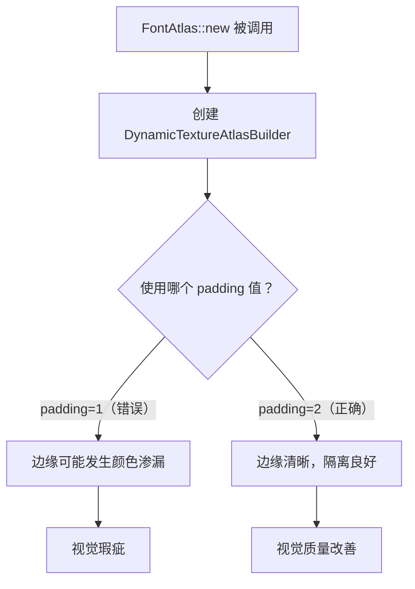

+++
title = "#22962 Reimplement #22722 after it was lost in the parley migration."
date = "2026-02-14T00:00:00"
draft = false
template = "pull_request_page.html"
in_search_index = false

[extra]
current_language = "zh-cn"
available_languages = {"en" = { name = "English", url = "/pull_request/bevy/2026-02/pr-22962-en-20260214" }, "zh-cn" = { name = "中文", url = "/pull_request/bevy/2026-02/pr-22962-zh-cn-20260214" }}
labels = ["C-Bug", "D-Trivial", "A-Text", "M-Deliberate-Rendering-Change"]
+++

# Title

## Basic Information
- **Title**: Reimplement #22722 after it was lost in the parley migration.
- **PR Link**: https://github.com/bevyengine/bevy/pull/22962
- **Author**: andriyDev
- **Status**: MERGED
- **Labels**: C-Bug, D-Trivial, S-Ready-For-Final-Review, A-Text, M-Deliberate-Rendering-Change
- **Created**: 2026-02-14T22:44:33Z
- **Merged**: 2026-02-14T23:40:30Z
- **Merged By**: alice-i-cecile

## Description Translation

# 目标

- 此修复在 parley 迁移 (#22879) 中丢失了。

## 解决方案

- 执行与 #22722 相同的操作。

## 测试

- PixelEagle 应该会显示差异。一些字符的边缘看起来更好了！
- 这似乎没有完全解决问题，因为打乱字形（glyph）分配的顺序会导致在某些情况下看起来不同。

## The Story of This Pull Request

这次 Pull Request 讲述了一个在大型代码库迁移中，一个细微但重要的修复如何被意外丢失，以及如何被迅速找回的故事。问题的核心在于字体渲染的视觉质量，具体来说是纹理图集（texture atlas）中字符边缘的渲染瑕疵。

在 Bevy 游戏引擎中，文本渲染通常使用一种称为字体图集（Font Atlas）的技术。其原理是将所有需要显示的字符（字形）的位图（bitmap）打包到一张大的纹理图片中。当渲染文本时，系统不是为每个字符单独上传纹理，而是从这张大纹理上裁剪出对应的区域进行渲染。这种方法能显著提升渲染效率。负责管理和构建这张动态纹理的组件是 `DynamicTextureAtlasBuilder`。

在初始化 `FontAtlas` 时，`DynamicTextureAtlasBuilder::new` 函数接收两个参数：初始图集尺寸和一个关键的 `padding` 参数。这个 `padding` 参数决定了图集中每个字形图像之间预留的空白像素数。设置 padding 的主要目的是为了防止纹理过滤（例如，当进行缩放或旋转时，GPU 可能会采样邻近的纹素/texel）导致的“颜色渗漏”（color bleeding）现象。如果 padding 为 0 或太小，一个字符的边缘像素可能会错误地采样到相邻字符的像素，导致视觉上的瑕疵，表现为字符边缘出现杂色或模糊。

问题正出在这里：在某个时间点，PR #22722 已经发现并修复了这个问题，将 `FontAtlas` 构造函数中的 `padding` 值从 `1` 增加到了 `2`。然而，在后续一次重大的文本布局库迁移（从 `glyph_brush` 到 `parley`，即 PR #22879）过程中，这项更改在代码合并或重构时被意外地覆盖或遗漏了，导致 `padding` 值又变回了 `1`。这并非功能性的回归，而是一个视觉质量的退化，使得某些字符的边缘渲染质量下降。

PR #22962 的目的非常明确：重新应用丢失的修复。这是一个典型的“修复的修复”。作者 `andriyDev` 清晰地指出了问题的根源（在迁移中丢失），并提供了直接的解决方案（执行与 #22722 相同的更改）。整个修复本身极其简单，仅涉及一行代码的修改。

从技术角度看，将 `padding` 从 `1` 增加到 `2`，意味着每个字形在纹理图集中被至少一个像素的透明（或空白）边框完全包围。这为双线性/三线性过滤提供了安全边界，确保 GPU 在对字形边缘进行采样时，只会取到透明像素，而不会意外地取到另一个字形的有色像素。这直接提升了文本渲染的清晰度和视觉保真度，尤其是在文本被缩放或使用某些渲染效果时。

测试部分提到了使用 PixelEagle（一种图像比较工具）来验证更改，确认了字符边缘的视觉改善。同时，作者也留下了一个重要的注释，指出这个修复并未解决所有问题。他提到了“打乱字形分配的顺序”会影响最终效果，这暗示了字体图集打包算法的复杂性。不同的打包策略可能导致字形在纹理中的相对位置不同，从而可能仍然存在某些边缘情况下的采样冲突。这为未来的优化留下了线索：也许需要一个更鲁棒的打包算法，或者需要动态调整 padding 的策略。

总之，这个 PR 是一个关于代码维护和视觉质量保证的典型案例。它展示了即使在基础设施级的迁移中，对细节的关注也至关重要。一个看似微小的数值变化，直接影响了最终用户的视觉体验。工程师通过追踪历史变更和对比视觉输出，快速定位并修复了问题，体现了良好的工程实践。

## Visual Representation



## Key Files Changed

### `crates/bevy_text/src/font_atlas.rs`
该文件包含了 `FontAtlas` 结构的定义及其构造函数。此次 PR 仅修改了构造函数中初始化 `DynamicTextureAtlasBuilder` 时传入的 `padding` 参数值。

**变更目的：** 恢复在之前的 parley 迁移中丢失的视觉修复，通过增加纹理图集中字形之间的间隔，防止渲染时出现边缘像素采样的视觉瑕疵。

**关键代码修改：**
```rust
// File: crates/bevy_text/src/font_atlas.rs
// 修改前（第64行附近）：
dynamic_texture_atlas_builder: DynamicTextureAtlasBuilder::new(size, 1),

// 修改后：
dynamic_texture_atlas_builder: DynamicTextureAtlasBuilder::new(size, 2),
```
**关系：** 这是整个 PR 的唯一实质性代码更改。它将 `padding` 参数从 `1` 改回 `2`，直接解决了因该值过小导致的文本渲染边缘质量问题。

## Further Reading

1.  **Bevy 官方文档 - 文本 (Text):** 了解 Bevy 中文本渲染的基本组件和系统。
2.  **纹理图集 (Texture Atlas) 概念:** 搜索关于游戏开发中纹理图集优化技术的中文或英文文章，理解其原理和优势。
3.  **纹理过滤与 Mipmapping:** 学习 OpenGL/Vulkan/DirectX 中关于纹理过滤（特别是双线性、三线性过滤）的知识，理解为什么需要 padding 来防止颜色渗漏。
4.  **PR #22722 和 #22879:** 查看本次修复所引用的两个历史 PR，了解该问题的原始上下文以及导致它丢失的大型迁移的具体内容。

# Full Code Diff
```
diff --git a/crates/bevy_text/src/font_atlas.rs b/crates/bevy_text/src/font_atlas.rs
index 69db4cbac8a93..3cf9cc94b70f2 100644
--- a/crates/bevy_text/src/font_atlas.rs
+++ b/crates/bevy_text/src/font_atlas.rs
@@ -61,7 +61,7 @@ impl FontAtlas {
         Self {
             texture_atlas,
             glyph_to_atlas_index: HashMap::default(),
-            dynamic_texture_atlas_builder: DynamicTextureAtlasBuilder::new(size, 1),
+            dynamic_texture_atlas_builder: DynamicTextureAtlasBuilder::new(size, 2),
             texture,
         }
     }
```