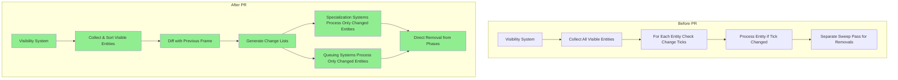

+++
title = "#22966 Use change lists instead of ticks for detecting when meshes need to be re-specialized and/or re-queued."
date = "2026-02-20T00:00:00"
draft = false
template = "pull_request_page.html"
in_search_index = true

[taxonomies]
list_display = ["show"]

[extra]
current_language = "en"
available_languages = {"en" = { name = "English", url = "/pull_request/bevy/2026-02/pr-22966-en-20260220" }, "zh-cn" = { name = "中文", url = "/pull_request/bevy/2026-02/pr-22966-zh-cn-20260220" }}
labels = ["A-Rendering", "C-Performance", "M-Migration-Guide"]
+++

# Title

## Basic Information
- **Title**: Use change lists instead of ticks for detecting when meshes need to be re-specialized and/or re-queued.
- **PR Link**: https://github.com/bevyengine/bevy/pull/22966
- **Author**: pcwalton
- **Status**: MERGED
- **Labels**: A-Rendering, C-Performance, S-Ready-For-Final-Review, M-Migration-Guide
- **Created**: 2026-02-15T06:01:08Z
- **Merged**: 2026-02-20T01:19:16Z
- **Merged By**: alice-i-cecile

## Description Translation

Right now, every frame, all specialization and queuing systems iterate over all entities visible from a view and check to see whether they need to be updated by consulting a set of change ticks and comparing them to the current change ticks. To handle cases in which a mesh needs to be removed from the bins, a separate final *sweep* pass then finds entities that no longer exist and removes them manually from the bins. This process is complex, error-prone, and slow, as it involves visiting all visible entities multiple times every frame.

This PR changes the setup so that, instead of examining change ticks, the visibility logic pushes the set of added and removed entities to each view explicitly. The visibility system determines which meshes need to be added and removed by first sorting the list of visible entities, then performing an O(n) diff process on the last frame's visible entities and this frame's visible entity list. The end result is that the specialization and queuing systems only process the entities that they need to every frame. If a mesh was visible last frame, remained visible this frame, and didn't change its mesh or material, then it's generally not examined at all. Not only is this significantly faster for virtually all realistic scenes, but it's also much simpler.

In order to achieve the benefits of not examining every visible mesh every frame, I made sorted render passes retained via an `IndexMap`. This allows entities to be removed and added via random access while still allowing the list to be sorted by distance. Note that I had to remove the radix sort because `IndexMap` doesn't currently support that; I believe the enormous speed benefits of this patch outweigh any minor sorting regressions from this.

I tested this PR by running `scene_viewer` on a test scene with many meshes and materials and implementing a material shuffler that randomly switches the materials around. I tested the following cases:

* Moving the camera so that meshes become visible and invisible.

* Switching opaque materials on meshes.

* Moving meshes from opaque to alpha masked and vice versa.

* Moving meshes from binned render passes to sorted render passes (i.e. transparent).

* All of the above while the meshes were off screen, then moving them on screen to ensure that the changes took effect.

This PR brings the `specialize_shadows` time on the `bevy_city` demo from 12.87 ms per frame to 0.1261 ms per frame, a 102x speedup. It brings the `queue_shadows` time on the same demo from 12.34 ms per frame to 0.1102 ms, a 111x speedup. Mean frame time goes from 50.16 ms to 23.26 ms, a 2.16x speedup.

`specialize_shadows` in `bevy_city` before and after:


`queue_shadows` in `bevy_city` before and after:


Frame graph of `bevy_city` before:


Frame graph of `bevy_city` after:


## The Story of This Pull Request

### The Problem and Context

Before this PR, Bevy's rendering system used a change tick-based approach to detect when meshes needed their pipelines re-specialized or re-queued. Every frame, for each view, the specialization and queuing systems would iterate over all visible entities and check their change ticks against stored ticks. This required examining every visible entity each frame, even if nothing had changed. Additionally, a separate sweep pass was needed to remove entities that were no longer visible or had been despawned. This design had several drawbacks:

1. **Performance overhead**: The system processed every visible entity every frame, leading to O(n) complexity where n is the number of visible entities, regardless of how many actually changed.

2. **Complexity**: The tick comparison logic was intricate, requiring careful handling of edge cases like material type changes. The sweep pass added additional complexity and was error-prone.

3. **Inefficiency**: Even when an entity remained unchanged and visible, it would still be processed each frame, wasting CPU cycles.

The performance impact was particularly noticeable in scenes with many meshes, as shown in the `bevy_city` demo where shadow specialization and queuing took over 12 ms per frame.

### The Solution Approach

The core idea of this PR is to replace the tick-based change detection with explicit change lists. Instead of checking ticks for each entity, the visibility system now computes the difference between the previous frame's visible entities and the current frame's visible entities. This produces two lists: entities that were added (became visible) and entities that were removed (became invisible). These lists are then used by specialization and queuing systems to process only the entities that actually changed.

The implementation required several architectural changes:

1. **Change list generation**: The visibility system now sorts visible entity lists and performs an O(n) diff to compute added and removed entities.

2. **Retained data structures**: Sorted render phases now use `IndexMap` instead of `Vec` to allow efficient removal of entities by key without rebuilding the entire list each frame.

3. **Centralized change tracking**: New resources (`DirtySpecializations`, `PendingQueues`) were introduced to track which entities need processing and handle cases where assets aren't yet loaded.

4. **Simplified removal logic**: Entities can now be removed directly from bins and sorted phases using the change lists, eliminating the need for the complex sweep pass.

### The Implementation

The implementation touches many parts of the rendering system, but the key changes can be grouped into several categories:

**1. Visibility System Changes**

The visibility system was modified to compute change lists. In `crates/bevy_camera/src/visibility/mod.rs`, visible entity lists are now sorted after collection:

```rust
// The list must be sorted in order for the O(n) diffing algorithm that
// visibility determination uses to work, so do that now.
for visible_entities in visible_entities.entities.values_mut() {
    visible_entities.sort_unstable();
}
```

The `RenderVisibleMeshEntities` struct was enhanced to store not just the current visible entities, but also the added and removed entities:

```rust
pub struct RenderVisibleMeshEntities {
    /// A sorted list of all entities that are visible from this view.
    pub entities: Vec<(Entity, MainEntity)>,
    /// A sorted list of all entities that were invisible last frame and became visible this frame.
    pub added_entities: Vec<(Entity, MainEntity)>,
    /// A sorted list of all entities that were visible last frame and became invisible this frame.
    pub removed_entities: Vec<(Entity, MainEntity)>,
}
```

The `update_from` method performs the diff between the old and new visible entity lists:

```rust
pub fn update_from(
    &mut self,
    mapper: &Extract<Query<RenderEntity>>,
    visible_mesh_entities: &[Entity],
) {
    let old_entities = mem::take(&mut self.entities);
    self.added_entities.clear();
    self.removed_entities.clear();

    // March over the old and new visible entity lists in lockstep, diffing
    // as we go to determine the added and removed entities.
    let mut old_entity_iter = old_entities.iter().peekable();
    for &visible_main_entity in visible_mesh_entities {
        // ... diff logic ...
    }
}
```

**2. Change Tracking Resources**

New resources were added to track which entities need processing:

- `DirtySpecializations`: Tracks renderable objects and views that need re-specialization.
- `PendingQueues`: Handles entities that can't be processed immediately due to unloaded assets.

These resources are used by specialization and queuing systems to determine which entities to process. For example, in `specialize_material_meshes`:

```rust
// Remove cached pipeline IDs corresponding to entities that either
// have been removed or need to be re-specialized.
if let Some(ref mut specialized_material_pipeline_cache) =
    maybe_specialized_material_pipeline_cache
{
    if dirty_specializations
        .must_wipe_specializations_for_view(view.retained_view_entity)
    {
        specialized_material_pipeline_cache.clear();
    } else {
        for &renderable_entity in dirty_specializations.iter_to_despecialize() {
            specialized_material_pipeline_cache.remove(&renderable_entity);
        }
    }
}
```

**3. Render Phase Modifications**

Both binned and sorted render phases were updated to support incremental updates:

- **Binned phases**: Now support direct removal of entities using `remove()` method.
- **Sorted phases**: Now use `IndexMap` to store items, allowing efficient removal by key.

The `SortedRenderPhase` struct was changed:

```rust
pub struct SortedRenderPhase<I>
where
    I: SortedPhaseItem,
{
    pub items: IndexMap<(Entity, MainEntity), I, EntityHash>,
    pub transient_items: Vec<(Entity, MainEntity)>,
}
```

This change required updating the `SortedPhaseItem` trait to work with `IndexMap`:

```rust
fn sort(items: &mut IndexMap<(Entity, MainEntity), Self, EntityHash>);
fn recalculate_sort_keys(
    items: &mut IndexMap<(Entity, MainEntity), Self, EntityHash>,
    view: &ExtractedView,
);
```

**4. Specialization and Queuing Systems**

Specialization and queuing systems were rewritten to use the change lists. Instead of iterating over all visible entities and checking ticks, they now iterate only over entities in the change lists:

```rust
// Now process all meshes that need to be specialized.
for (render_entity, visible_entity) in dirty_specializations.iter_to_specialize(
    view.retained_view_entity,
    render_visible_mesh_entities,
    &view_pending_mesh_material_queues.prev_frame,
) {
    // Only process entities that actually need specialization
}
```

**5. Removal of Old Tick-Based Systems**

The old tick-based systems and resources were removed:

- `EntitySpecializationTicks`
- `ViewSpecializationTicks`
- `LightSpecializationTicks`
- `WireframeEntitySpecializationTicks`
- The `sweep_old_entities` system

### Technical Insights

**Performance Characteristics**

The new approach changes the performance characteristics from O(n) to O(m + d), where n is the total number of visible entities, m is the number of changed entities, and d is the cost of diffing (which is O(n) but much cheaper than the previous per-entity tick checks). In typical scenes where only a small fraction of entities change each frame, this provides massive speedups.

**Data Structure Trade-offs**

The switch from `Vec` to `IndexMap` in sorted render phases introduces a trade-off:
- **Benefit**: Allows O(1) removal of entities by key, enabling incremental updates.
- **Cost**: Slightly slower iteration and sorting compared to `Vec`. The PR also had to abandon radix sort because `IndexMap` doesn't support it.

The performance data shows that the benefits far outweigh the costs, especially given that the number of transparent objects is typically smaller than opaque objects.

**Handling Unloaded Assets**

The `PendingQueues` system addresses a subtle issue: entities might not be processable immediately if their materials or meshes haven't loaded yet. Instead of failing or skipping them entirely, they're added to a pending queue and retried on subsequent frames. This ensures correctness without compromising performance.

**System Ordering**

The PR introduces new system sets (`DirtySpecializationSystems`) to ensure proper ordering:
1. `Clear`: Clears change lists at the start of the frame.
2. `CheckForChanges`: Identifies entities that need re-specialization.
3. `CheckForRemovals`: Identifies entities that need to be removed from render phases.

This ordering is critical to handle cases where an entity changes material type in the same frame it's removed.

### The Impact

**Performance Improvements**

The performance improvements are dramatic:
- `specialize_shadows`: 102x faster (12.87 ms → 0.1261 ms)
- `queue_shadows`: 111x faster (12.34 ms → 0.1102 ms)
- Overall frame time: 2.16x faster (50.16 ms → 23.26 ms)

These improvements scale with scene complexity. In scenes with many static objects, the overhead per frame becomes nearly constant rather than linear in the number of visible entities.

**Code Simplification**

Despite touching many files, the PR simplifies the overall codebase:
- Removes complex tick comparison logic
- Eliminates the error-prone sweep pass
- Reduces per-frame work for unchanged entities
- Centralizes change tracking in a few resources

**Migration Requirements**

Custom render phases need to be updated to use the new change list system. The migration guide provides examples of how to adapt specialization and queuing systems. The changes are mostly mechanical: instead of iterating over all visible entities, iterate over the change lists provided by `DirtySpecializations`.

**Future Implications**

This change lays the groundwork for further optimizations:
- More efficient culling systems
- Better handling of dynamic scenes
- Potential for multi-threading improvements in visibility determination

The architecture is now better positioned to handle the increasing complexity of modern rendering pipelines.

## Visual Representation



## Key Files Changed

### `crates/bevy_render/src/camera.rs` (+364/-24)
This file gained the core change tracking infrastructure.

**Key additions:**
- `DirtySpecializations`: The main resource tracking which entities and views need processing.
- `PendingQueues` and `ViewPendingQueues`: Handle entities with unloaded dependencies.
- System sets for ordering change list processing.

**Code snippet showing the new resource:**
```rust
#[derive(Clone, Resource, Default)]
pub struct DirtySpecializations {
    /// All renderable objects that must be re-specialized this frame.
    pub changed_renderables: MainEntityHashSet,
    /// All renderable objects that need their specializations removed this frame.
    pub removed_renderables: MainEntityHashSet,
    /// Views that must be respecialized this frame.
    pub views: HashSet<RetainedViewEntity>,
}
```

**How it relates to the PR:** This is the central coordination point for change tracking. All specialization and queuing systems now query this resource to determine what work needs to be done.

### `crates/bevy_render/src/render_phase/mod.rs` (+96/-254)
This file contains the render phase infrastructure changes.

**Key changes:**
- `SortedRenderPhase` now uses `IndexMap` instead of `Vec`.
- Added `remove()` methods for direct entity removal.
- Removed the `sweep_old_entities` system and related tick validation logic.

**Code snippet showing the new SortedRenderPhase structure:**
```rust
pub struct SortedRenderPhase<I>
where
    I: SortedPhaseItem,
{
    pub items: IndexMap<(Entity, MainEntity), I, EntityHash>,
    pub transient_items: Vec<(Entity, MainEntity)>,
}
```

**How it relates to the PR:** These changes enable efficient incremental updates to render phases, which is essential for the change list approach to work well.

### `crates/bevy_pbr/src/material.rs` (+205/-235)
This file contains the 3D material specialization and queuing logic.

**Key changes:**
- Replaced tick-based change detection with change list processing.
- Added `PendingMeshMaterialQueues` for handling unloaded materials.
- Simplified the specialization logic to only process changed entities.

**Code snippet showing the new specialization loop:**
```rust
// Now process all meshes that need to be specialized.
for (render_entity, visible_entity) in dirty_specializations.iter_to_specialize(
    view.retained_view_entity,
    render_visible_mesh_entities,
    &view_pending_mesh_material_queues.prev_frame,
) {
    if maybe_specialized_material_pipeline_cache
        .as_ref()
        .is_some_and(|specialized_material_pipeline_cache| {
            specialized_material_pipeline_cache.contains_key(visible_entity)
        })
    {
        continue;
    }
    // ... specialization logic ...
}
```

**How it relates to the PR:** This is where the performance gains are realized for 3D materials. Instead of processing all visible entities, only changed entities are examined.

### `crates/bevy_pbr/src/render/light.rs` (+198/-129)
This file handles shadow specialization and queuing.

**Key changes:**
- Updated shadow processing to use change lists.
- Added `PendingShadowQueues` for handling unloaded assets.
- Simplified the queuing logic.

**Code snippet showing the new queuing approach:**
```rust
// Now iterate through all newly-visible entities and those needing respecialization.
for (render_entity, main_entity) in dirty_specializations.iter_to_queue(
    extracted_view_light.retained_view_entity,
    visible_entities,
    &view_pending_shadow_queues.prev_frame,
) {
    let Some(&(pipeline_id, draw_function)) =
        view_specialized_material_pipeline_cache.get(main_entity)
    else {
        continue;
    };
    // ... queuing logic ...
}
```

**How it relates to the PR:** Shadow rendering saw some of the largest performance improvements (100x+). This file shows how the change list approach was applied to the shadow pipeline.

### `crates/bevy_sprite_render/src/mesh2d/material.rs` (+185/-83)
This file contains the 2D material specialization and queuing logic.

**Key changes:**
- Updated 2D material processing to use change lists.
- Added `PendingMeshMaterial2dQueues` for handling unloaded assets.
- Simplified the tick-based logic.

**Code snippet showing the new 2D specialization:**
```rust
// Now process all 2D meshes that need to be re-specialized.
for (render_entity, visible_entity) in dirty_specializations.iter_to_specialize(
    view.retained_view_entity,
    visible_entities,
    &view_pending_mesh_material2d_queues.prev_frame,
) {
    if view_specialized_material_pipeline_cache.contains_key(visible_entity) {
        continue;
    }
    // ... specialization logic ...
}
```

**How it relates to the PR:** Demonstrates that the change list approach works consistently across both 2D and 3D rendering pipelines.

## Further Reading

1. **Bevy Render Graph Documentation**: Understanding Bevy's render graph architecture helps contextualize these changes.
   - https://bevyengine.org/learn/quick-start/getting-started/systems/

2. **Entity Component System (ECS) Patterns**: The change list approach is a classic ECS optimization pattern for reducing work.
   - https://en.wikipedia.org/wiki/Entity_component_system

3. **Difference Algorithms**: The O(n) diff algorithm used for computing change lists is similar to those used in text diffing tools.
   - https://en.wikipedia.org/wiki/Diff_algorithm

4. **IndexMap Data Structure**: Understanding the trade-offs of `IndexMap` vs `Vec` for sorted data.
   - https://docs.rs/indexmap/latest/indexmap/

5. **Rendering Pipeline Optimization**: General techniques for optimizing rendering pipelines.
   - Real-Time Rendering, 4th Edition, by Tomas Akenine-Möller et al.