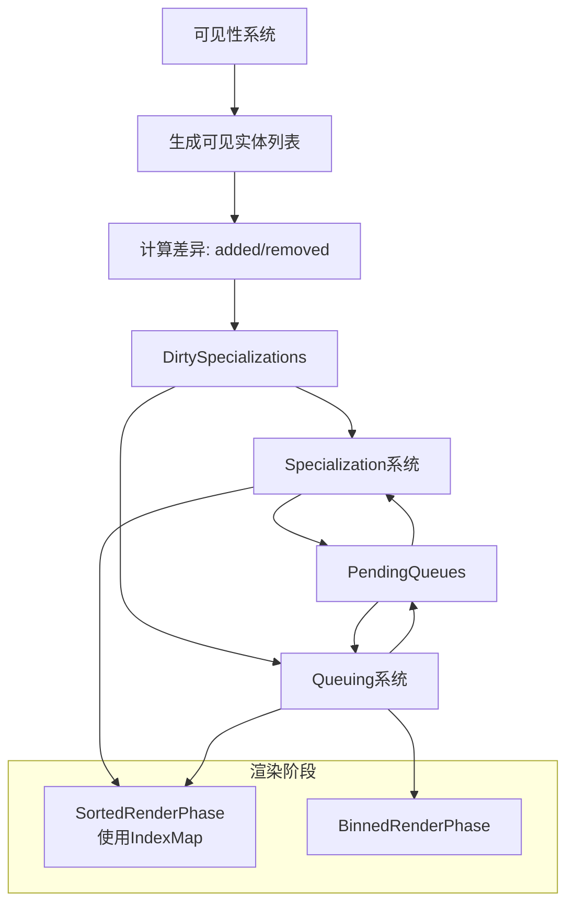

+++
title = "#22966 Use change lists instead of ticks for detecting when meshes need to be re-specialized and/or re-queued."
date = "2026-02-20T00:00:00"
draft = false
template = "pull_request_page.html"
in_search_index = false

[extra]
current_language = "zh-cn"
available_languages = {"en" = { name = "English", url = "/pull_request/bevy/2026-02/pr-22966-en-20260220" }, "zh-cn" = { name = "中文", url = "/pull_request/bevy/2026-02/pr-22966-zh-cn-20260220" }}
labels = ["A-Rendering", "C-Performance", "M-Migration-Guide"]
+++

# Title

## Basic Information
- **Title**: Use change lists instead of ticks for detecting when meshes need to be re-specialized and/or re-queued.
- **PR Link**: https://github.com/bevyengine/bevy/pull/22966
- **Author**: pcwalton
- **Status**: MERGED
- **Labels**: A-Rendering, C-Performance, S-Ready-For-Final-Review, M-Migration-Guide
- **Created**: 2026-02-15T06:01:08Z
- **Merged**: 2026-02-20T01:19:16Z
- **Merged By**: alice-i-cecile

## Description Translation
目前，每一帧中，所有specialization和queuing系统都会遍历视图可见的所有实体，并通过查询一组变更tick并与当前变更tick进行比较来检查它们是否需要更新。为了处理需要从bins中移除网格的情况，还需要一个单独的最终*扫描*过程来查找不再存在的实体，并手动将它们从bins中移除。这个过程复杂、容易出错且速度慢，因为它需要每帧多次访问所有可见实体。

本PR改变了设置，使得可见性逻辑将添加和移除的实体集合显式地推送到每个视图，而不是检查变更tick。可见性系统通过首先对可见实体列表进行排序，然后对上一帧的可见实体列表和本帧的可见实体列表执行O(n)的差异比较过程，来确定需要添加和移除的网格。最终结果是，specialization和queuing系统每帧只处理它们需要处理的实体。如果一个网格上一帧可见，本帧仍然可见，并且其网格或材质没有改变，那么它通常根本不会被检查。这不仅在几乎所有现实场景中都显著更快，而且也更简单。

为了获得不每帧检查每个可见网格的好处，我通过`IndexMap`保留了排序的渲染阶段。这允许通过随机访问添加和移除实体，同时仍然允许按距离排序。请注意，我不得不移除基数排序，因为`IndexMap`目前不支持基数排序；我相信这个补丁的巨大速度优势超过了由此带来的任何微小排序性能下降。

我通过在一个具有许多网格和材质的测试场景上运行`scene_viewer`并实现一个随机切换材质的材质混洗器来测试这个PR。我测试了以下情况：

* 移动相机，使网格变得可见和不可见。

* 在网格上切换不透明材质。

* 将网格从不透明移动到alpha遮罩，反之亦然。

* 将网格从分箱渲染阶段移动到排序渲染阶段（即透明）。

* 当网格在屏幕外时进行上述所有操作，然后将它们移动到屏幕上以确保更改生效。

本PR将`bevy_city`演示中的`specialize_shadows`时间从每帧12.87毫秒降低到0.1261毫秒，速度提升了102倍。它将同一演示中的`queue_shadows`时间从每帧12.34毫秒降低到0.1102毫秒，速度提升了111倍。平均帧时间从50.16毫秒降低到23.26毫秒，速度提升了2.16倍。

`bevy_city`中`specialize_shadows`的前后对比：


`bevy_city`中`queue_shadows`的前后对比：


`bevy_city`之前的帧图：


`bevy_city`之后的帧图：


## The Story of This Pull Request

### 问题和背景
在Bevy的渲染架构中，每一帧都需要确定哪些实体需要重新specialize（即重新生成渲染管线）以及哪些实体需要重新queue（即重新放入渲染阶段）。原来的实现依赖于检查每个实体的变更tick（change tick），并与视图的变更tick进行比较。这个过程需要遍历所有可见实体，即使它们没有变化。此外，为了处理实体被移除的情况，还需要一个额外的扫描阶段来清理不再存在的实体。这种方法有两个主要问题：性能低下，因为每帧都要检查所有实体；代码复杂，容易出错。

从技术角度来看，原有方案的核心缺陷在于其O(n)的遍历成本与可见实体数量线性相关，且每帧都需要执行多次这样的遍历（specialization和queuing各一次）。在复杂场景中，这会导致显著的CPU开销。

### 解决方案
作者提出了一种新的方法：使用变更列表（change lists）来显式跟踪哪些实体被添加或移除。可见性系统在每一帧会生成一个已排序的可见实体列表，并与上一帧的列表进行O(n)的差异比较，从而得到新增和移除的实体列表。然后，specialization和queuing系统只需要处理这些变更的实体，而不是所有可见实体。

关键技术决策包括：
1. 将排序渲染阶段（sorted render phases）的数据结构从`Vec`改为`IndexMap`，以支持快速随机删除
2. 引入`DirtySpecializations`资源来集中管理需要重新specialize的实体和视图
3. 创建`PendingQueues`模式来处理因依赖资源未加载而无法立即处理的实体

### 实现细节
这个PR涉及了大量文件的修改，主要集中在渲染管线的specialization和queuing逻辑上。以下是关键变化的详细说明：

**1. 核心数据结构的改变**
在`crates/bevy_render/src/render_phase/mod.rs`中，`SortedRenderPhase`的结构发生了根本性变化：

```rust
// 修改前
pub struct SortedRenderPhase<I> {
    pub items: Vec<I>,
}

// 修改后
pub struct SortedRenderPhase<I> {
    pub items: IndexMap<(Entity, MainEntity), I, EntityHash>,
    pub transient_items: Vec<(Entity, MainEntity)>,
}
```

这个改变允许通过`(Entity, MainEntity)`键快速查找和删除特定的phase item，而无需重新构建整个列表。`transient_items`用于存储那些每帧都需要添加和移除的临时项（如线框）。

**2. 变更列表的管理**
新增的`DirtySpecializations`资源（在`crates/bevy_render/src/camera.rs`中）是核心组件：

```rust
pub struct DirtySpecializations {
    pub changed_renderables: MainEntityHashSet,
    pub removed_renderables: MainEntityHashSet,
    pub views: HashSet<RetainedViewEntity>,
}
```

该系统提供了几个关键的迭代器方法：
- `iter_to_despecialize()`: 遍历需要清除specialization的实体
- `iter_to_specialize()`: 遍历需要重新specialize的实体
- `iter_to_dequeue()`: 遍历需要从渲染阶段移除的实体
- `iter_to_queue()`: 遍历需要加入渲染阶段的实体

**3. specialization系统的重构**
以`crates/bevy_pbr/src/material.rs`中的`specialize_material_meshes`系统为例，原来的tick比较逻辑被完全移除：

```rust
// 旧逻辑（简化）
let needs_specialization = last_specialized_tick.is_none_or(|tick| {
    view_tick.is_newer_than(tick, this_run)
        || entity_tick.is_newer_than(tick, this_run)
});

// 新逻辑
for (render_entity, visible_entity) in dirty_specializations.iter_to_specialize(
    view.retained_view_entity,
    render_visible_mesh_entities,
    &view_pending_mesh_material_queues.prev_frame,
) {
    // 只处理变更列表中的实体
}
```

**4. queuing系统的优化**
在`queue_material_meshes`系统中，现在首先移除需要处理的实体，然后只添加变更列表中的实体：

```rust
// 首先移除实体
for &main_entity in dirty_specializations
    .iter_to_dequeue(view.retained_view_entity, render_visible_mesh_entities)
{
    opaque_phase.remove(main_entity);
    alpha_mask_phase.remove(main_entity);
    // ...
}

// 然后处理需要添加的实体
for (render_entity, visible_entity) in dirty_specializations.iter_to_queue(
    view.retained_view_entity,
    render_visible_mesh_entities,
    &view_pending_mesh_material_queues.prev_frame,
) {
    // 添加实体到相应的阶段
}
```

**5. 可见性系统的增强**
可见性系统现在负责计算实体列表的差异。在`crates/bevy_render/src/view/visibility/mod.rs`中，`RenderVisibleMeshEntities`现在包含了`added_entities`和`removed_entities`列表：

```rust
pub struct RenderVisibleMeshEntities {
    pub entities: Vec<(Entity, MainEntity)>,
    pub added_entities: Vec<(Entity, MainEntity)>,
    pub removed_entities: Vec<(Entity, MainEntity)>,
}
```

`update_from`方法通过O(n)的差异比较算法填充这些列表，确保所有列表都保持排序状态，便于后续的二进制搜索。

### 技术见解
1. **性能权衡**：使用`IndexMap`虽然提供了O(1)的删除操作，但牺牲了基数排序的性能。作者通过基准测试证明，在典型场景中，减少的遍历开销远大于排序性能的微小损失。

2. **内存管理**：新的实现在处理大量实体时更高效，因为它避免了每帧分配和释放大型向量。`IndexMap`和`HashSet`的使用减少了内存碎片。

3. **错误处理改进**：通过显式的变更列表，系统现在能更精确地处理实体状态变化，减少了因tick竞争条件导致的错误。

4. **可扩展性**：`PendingQueues`模式的引入使得系统能够优雅地处理异步资源加载，这对于大型游戏场景尤为重要。

### 影响
这个PR带来了显著的性能提升：
- `specialize_shadows`: 102倍加速（12.87ms → 0.1261ms）
- `queue_shadows`: 111倍加速（12.34ms → 0.1102ms）
- 整体帧时间: 2.16倍加速（50.16ms → 23.26ms）

代码复杂度也显著降低：
- 移除了复杂的tick比较逻辑
- 消除了`sweep_old_entities`系统
- 减少了每帧需要遍历的实体数量

从架构角度看，这个改变使得渲染系统更容易理解和维护，同时为未来的优化奠定了基础。

## Visual Representation



## Key Files Changed

### 1. `crates/bevy_render/src/camera.rs` (+364/-24)
**变化描述**：新增了`DirtySpecializations`和`PendingQueues`等核心资源，用于集中管理需要重新specialize的实体和视图。

**关键代码片段**：
```rust
pub struct DirtySpecializations {
    pub changed_renderables: MainEntityHashSet,
    pub removed_renderables: MainEntityHashSet,
    pub views: HashSet<RetainedViewEntity>,
}

pub struct PendingQueues(pub HashMap<RetainedViewEntity, ViewPendingQueues>);
```

**关联性**：这些资源是新的变更列表系统的核心，为所有specialization和queuing系统提供变更信息。

### 2. `crates/bevy_render/src/render_phase/mod.rs` (+96/-254)
**变化描述**：重构了`SortedRenderPhase`和`BinnedRenderPhase`，移除了基于tick的验证逻辑，改用`IndexMap`支持快速删除。

**关键代码片段**：
```rust
// 修改前
pub struct SortedRenderPhase<I> {
    pub items: Vec<I>,
}

// 修改后
pub struct SortedRenderPhase<I> {
    pub items: IndexMap<(Entity, MainEntity), I, EntityHash>,
    pub transient_items: Vec<(Entity, MainEntity)>,
}
```

**关联性**：这是支持增量更新的基础数据结构改变，使得实体可以高效地从渲染阶段添加和移除。

### 3. `crates/bevy_pbr/src/material.rs` (+205/-235)
**变化描述**：移除了`EntitySpecializationTicks`等基于tick的系统，改为使用`DirtySpecializations`指导specialization。

**关键代码片段**：
```rust
// 旧的tick检查逻辑被移除
// 新的变更列表驱动逻辑
for (render_entity, visible_entity) in dirty_specializations.iter_to_specialize(
    view.retained_view_entity,
    render_visible_mesh_entities,
    &view_pending_mesh_material_queues.prev_frame,
) {
    // 只处理变更列表中的实体
}
```

**关联性**：这是3D材质系统的核心改造，展示了如何从旧系统迁移到新系统。

### 4. `crates/bevy_pbr/src/render/light.rs` (+198/-129)
**变化描述**：阴影渲染系统进行了类似的改造，移除了`LightSpecializationTicks`。

**关键代码片段**：
```rust
// 使用变更列表而不是tick
for &main_entity in dirty_specializations
    .iter_to_dequeue(extracted_view_light.retained_view_entity, visible_entities)
{
    shadow_phase.remove(main_entity);
}
```

**关联性**：展示了阴影渲染如何集成到新的变更列表系统中。

### 5. `crates/bevy_sprite_render/src/mesh2d/material.rs` (+185/-83)
**变化描述**：2D材质系统也进行了相应改造，移除了`EntitySpecializationTickPair`。

**关键代码片段**：
```rust
// 2D系统的变更列表处理
for (render_entity, visible_entity) in dirty_specializations.iter_to_queue(
    view.retained_view_entity,
    visible_entities,
    &view_pending_mesh_material2d_queues.prev_frame,
) {
    // 处理2D实体的queuing
}
```

**关联性**：证明新系统在2D和3D渲染中都能工作，确保了架构的一致性。

## Further Reading

1. **Bevy渲染架构文档**：
   - [Bevy Render Graph](https://bevyengine.org/learn/quick-start/rendering/render-graph/)
   - [Bevy Rendering Concepts](https://bevyengine.org/learn/quick-start/rendering/concepts/)

2. **IndexMap文档**：
   - [IndexMap crate documentation](https://docs.rs/indexmap/latest/indexmap/)

3. **差异算法**：
   - [Myers差分算法](https://blog.robertelder.org/diff-algorithm/)
   - [实现高效的列表差异比较](https://github.com/google/diff-match-patch)

4. **渲染优化技术**：
   - [Frustum Culling](https://learnopengl.com/Guest-Articles/2021/Scene/Frustum-Culling)
   - [Visibility Buffer Rendering](https://advances.realtimerendering.com/s2015/aaltonenhaar_siggraph2015_combined_final_footer_220dpi.pdf)

5. **相关PR和讨论**：
   - [Bevy PR #22966](https://github.com/bevyengine/bevy/pull/22966) 完整讨论
   - [性能优化策略](https://github.com/bevyengine/bevy/discussions/categories/performance)