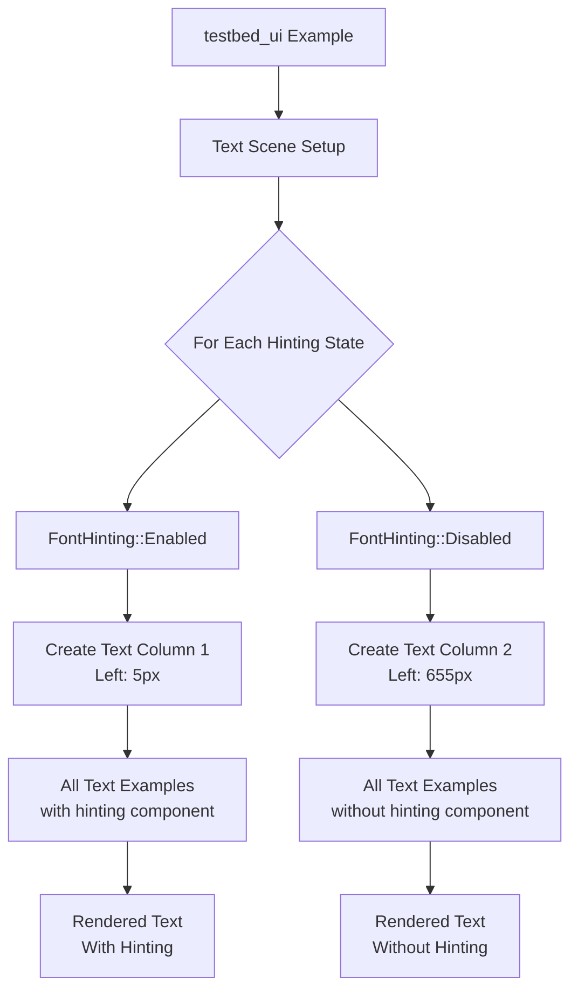

+++
title = "#22970 Add font hinting example to `testbed_ui`'s text scene"
date = "2026-02-17T00:00:00"
draft = false
template = "pull_request_page.html"
in_search_index = true

[taxonomies]
list_display = ["show"]

[extra]
current_language = "en"
available_languages = {"en" = { name = "English", url = "/pull_request/bevy/2026-02/pr-22970-en-20260217" }, "zh-cn" = { name = "中文", url = "/pull_request/bevy/2026-02/pr-22970-zh-cn-20260217" }}
labels = ["D-Trivial", "A-UI", "A-Text", "M-Deliberate-Rendering-Change"]
+++

# Add font hinting example to `testbed_ui`'s text scene

## Basic Information
- **Title**: Add font hinting example to `testbed_ui`'s text scene
- **PR Link**: https://github.com/bevyengine/bevy/pull/22970
- **Author**: ickshonpe
- **Status**: MERGED
- **Labels**: D-Trivial, A-UI, S-Ready-For-Final-Review, A-Text, M-Deliberate-Rendering-Change
- **Created**: 2026-02-15T23:58:50Z
- **Merged**: 2026-02-17T01:47:20Z
- **Merged By**: alice-i-cecile

## Description Translation
# Objective

Add font hinting to the UI testbed text scene.

## Solution

Draw all the cases again without hinting:


## The Story of This Pull Request

This PR extends the existing text demonstration scene in Bevy's testbed UI to showcase font hinting, a feature that was already implemented in the engine but not yet visualized in the examples. The `testbed_ui` example serves as a comprehensive visual testing ground for Bevy's UI system, allowing developers to see how various text rendering features behave under different configurations.

The developer identified that while Bevy's text rendering system supported font hinting (a technique that adjusts character shapes to align with pixel grids for improved legibility at small sizes), there was no visual demonstration of this feature in the examples. Without such a demonstration, developers would need to manually test font hinting behavior or read through source code to understand its visual impact.

The solution approach is straightforward: modify the existing text scene generation code to create two parallel sets of all text examples - one with font hinting enabled and one with font hinting disabled. This side-by-side comparison allows developers to immediately see the visual differences hinting makes across various text scenarios. The implementation avoids duplicating code by wrapping the existing text entity creation logic in a loop that iterates over both `FontHinting::Enabled` and `FontHinting::Disabled` variants.

The implementation centers around a structural refactoring of the text scene setup. Previously, the code created a series of text entities with hardcoded positions. The new implementation introduces a loop that runs twice - once for each hinting state - and conditionally offsets the x-position of the second column to create a side-by-side layout. Each text entity now receives the `hinting` component, which determines whether font hinting is applied during rendering.

```rust
for hinting in [FontHinting::Enabled, FontHinting::Disabled] {
    let mut top = 230.;
    let left = px(5.
        + if hinting == FontHinting::Disabled {
            650.
        } else {
            0.
        });
    
    // Text entity creation with hinting component
    commands.spawn((
        Node {
            left,
            top: px(top),
            ..Default::default()
        },
        Text::new(format!("FontHinting::{:?}", hinting)),
        hinting,  // Component added here
        // ... other components
    ));
}
```

The key technical insight here is that Bevy's ECS (Entity Component System) allows the same component type (`FontHinting`) to be added to multiple entities, and the text rendering system automatically respects this setting for each entity. The implementation demonstrates proper use of Bevy's component system by passing the `hinting` variable (which holds either `FontHinting::Enabled` or `FontHinting::Disabled`) as a component in each entity's bundle.

The changes are purely additive and don't break any existing functionality. All previous text examples are preserved and now rendered twice - once with hinting and once without. The spatial layout ensures the two columns don't overlap, with the disabled hinting examples positioned 650 pixels to the right of the enabled ones.

The impact of this PR is primarily educational and demonstrative. It provides immediate visual feedback on how font hinting affects text rendering across different fonts, weights, colors, and formatting scenarios. Developers can now run the `testbed_ui` example, navigate to the text scene, and directly compare the visual quality of text with and without hinting. This is particularly useful for understanding when to enable or disable hinting based on specific use cases, such as when rendering text at very small sizes versus large display text.

The PR also demonstrates a good pattern for extending existing examples: rather than creating a separate example or scene, the existing demonstration was enhanced to show more features without increasing complexity for users. The side-by-side comparison is an effective way to visualize the impact of rendering settings without requiring users to toggle options or modify code.

## Visual Representation



## Key Files Changed

### `examples/testbed/ui.rs` (+478/-439)

This file contains the testbed UI example that showcases various UI features. The changes refactor the text scene setup to demonstrate font hinting by creating two parallel columns of text examples.

**Key modifications:**
1. The entire text scene generation is wrapped in a loop that iterates over `FontHinting::Enabled` and `FontHinting::Disabled`
2. Each text entity now includes the `hinting` component
3. The x-position is conditionally offset to create a side-by-side layout

**Before (simplified structure):**
```rust
commands.spawn((
    Node {
        left: px(100.),
        top: px(230.),
        ..Default::default()
    },
    Text::new("white "),
    TextFont {
        font: asset_server.load("fonts/FiraSans-Bold.ttf").into(),
        ..default()
    },
    DespawnOnExit(super::Scene::Text),
    children![/* ... */],
));
```

**After (simplified structure):**
```rust
for hinting in [FontHinting::Enabled, FontHinting::Disabled] {
    let mut top = 230.;
    let left = px(5.
        + if hinting == FontHinting::Disabled {
            650.
        } else {
            0.
        });
    
    commands.spawn((
        Node {
            left,
            top: px(top),
            ..Default::default()
        },
        Text::new("white "),
        TextFont {
            font: asset_server.load("fonts/FiraSans-Bold.ttf").into(),
            ..default()
        },
        hinting,  // Added component
        DespawnOnExit(super::Scene::Text),
        children![/* ... */],
    ));
    
    // More text entities follow with same pattern
}
```

The changes relate to the overall purpose by providing a visual demonstration of font hinting's effects within the existing testbed framework, making it easy for developers to understand and test this feature.

## Further Reading

1. **Bevy UI Documentation**: Official Bevy UI guide for understanding the text rendering system
2. **Font Hinting Explained**: Technical articles on font hinting and its impact on text legibility
3. **Bevy Examples Repository**: Other examples demonstrating text rendering features
4. **FreeType Documentation**: Details on font rendering and hinting algorithms (Bevy uses FreeType via `ab_glyph`)
5. **Digital Typography Resources**: Books and articles on type rendering techniques for screens