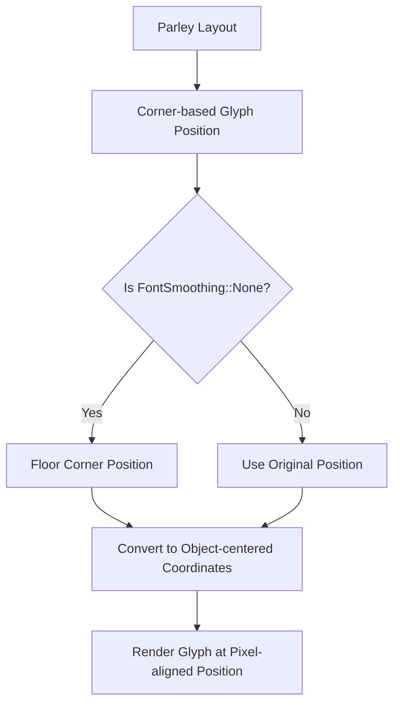

+++
title = "#22972 `FontSmoothing::None` pixel alignment fix"
date = "2026-02-17T00:00:00"
draft = false
template = "pull_request_page.html"
in_search_index = true

[taxonomies]
list_display = ["show"]

[extra]
current_language = "en"
available_languages = {"en" = { name = "English", url = "/pull_request/bevy/2026-02/pr-22972-en-20260217" }, "zh-cn" = { name = "中文", url = "/pull_request/bevy/2026-02/pr-22972-zh-cn-20260217" }}
labels = ["C-Bug", "A-Rendering", "P-Regression", "A-Text", "D-Straightforward", "M-Deliberate-Rendering-Change"]
+++

# Title

`FontSmoothing::None` pixel alignment fix

## Basic Information
- **Title**: `FontSmoothing::None` pixel alignment fix
- **PR Link**: https://github.com/bevyengine/bevy/pull/22972
- **Author**: ickshonpe
- **Status**: MERGED
- **Labels**: C-Bug, A-Rendering, S-Ready-For-Final-Review, P-Regression, A-Text, D-Straightforward, M-Deliberate-Rendering-Change
- **Created**: 2026-02-16T00:48:05Z
- **Merged**: 2026-02-17T01:47:20Z
- **Merged By**: alice-i-cecile

## Description Translation

# Objective

With `FontSmoothing::None` `update_text_layout_info` rounds the final object-centered position of each glyph. This breaks pixel alignment if the glyph has an odd size.

Fixes #22975

## Solution

Floor the corner-based glyph position from the Parley layout first, before we convert to object-centered coords.

#### Concrete example

1. Parley returns a top-left corner-based glyph rect:
```left = 100, top = 50, width = 15, height = 18```
2. The UI renderer expects glyphs coords to be object centered, so we add the half size to get the object centered position of the glyph. So the glyphs horizontal center will be at:
```x = left + width / 2 = 100 + 7.5 = 107.5```
3. Which is pixel aligned because if we subtract the half size again we get the `left` edge position back.
4. But if we floor the object centered position `x' = floor(x) = 107`. This moves the glyph sprite's left edge to a subpixel position:
```left' = x' - width / 2 = 107 - 7.5 = 99.5```
5. There's no subpixel issues on the y-axis as the height divides exactly by 2.

## Testing

If you compare the outputs closely from `test_bed_ui`'s `text` scene, the improvement is quite clear:

#### main


#### this PR


## The Story of This Pull Request

This PR addresses a pixel alignment bug in Bevy's text rendering system. When `FontSmoothing::None` is used, glyphs with odd dimensions could appear blurry or misaligned due to subpixel positioning errors. The issue was tracked in GitHub issue #22975.

The problem originated in how the text pipeline handled coordinate conversion. Bevy's text rendering uses Parley for layout, which returns glyph positions as top-left corner coordinates. However, Bevy's UI renderer expects glyph positions to be object-centered. The conversion between these coordinate systems requires adding half the glyph size to the corner position.

The bug occurred when `FontSmoothing::None` was enabled. In this mode, the code was rounding the final object-centered position to achieve pixel alignment. However, for glyphs with odd widths or heights, this rounding created a problem. When you round an object-centered coordinate and then subtract half the glyph size to get back to the corner position, you can end up with a subpixel corner position if the glyph has odd dimensions.

The developer identified that the correct approach was to apply the pixel alignment operation (flooring, not rounding) to the corner-based position from Parley first, then convert to object-centered coordinates. This ensures that both the corner position and the object-centered position remain properly aligned to pixel boundaries.

The implementation change is relatively small but demonstrates an important principle in graphics programming: the order of operations matters when working with pixel alignment. By fixing the position before the coordinate system conversion, the solution maintains both the pixel alignment requirement and the correct coordinate system for the renderer.

The fix required changing 11 lines in the text pipeline, modifying how glyph positions are calculated when `FontSmoothing::None` is active. The new approach computes the glyph position by taking the Parley-provided corner position, applying flooring if smoothing is disabled, then adding half the glyph size and the offset to get the final object-centered position.

This change is a regression fix, indicated by the "P-Regression" label. The straightforward nature of the fix (labeled "D-Straightforward") and its deliberate impact on rendering ("M-Deliberate-Rendering-Change") suggest this was a targeted fix for a specific rendering issue that likely appeared in a recent change to the text rendering system.

## Visual Representation



## Key Files Changed

### `crates/bevy_text/src/pipeline.rs` (+11/-11)

This is the only file modified in this PR. The changes are in the `TextPipeline::update_text_layout_info` method, specifically in how glyph positions are calculated when font smoothing is disabled.

**Before:**
```rust
let glyph_rect = texture_atlas.textures[location.glyph_index];
let glyph_size = UVec2::new(glyph_rect.width(), glyph_rect.height());

let mut x = glyph_size.x as f32 / 2.0 + glyph.x + location.offset.x as f32;
let mut y = glyph_size.y as f32 / 2.0 + glyph.y - location.offset.y as f32;

if font_smoothing == FontSmoothing::None {
    x = x.round();
    y = y.round();
}

layout_info.glyphs.push(PositionedGlyph {
    position: Vec2::new(x, y),
    size: glyph_size.as_vec2(),
    atlas_info,
    span_index,
    byte_index: text_range.start,
});
```

**After:**
```rust
let glyph_rect = texture_atlas.textures[location.glyph_index];
let glyph_size = UVec2::new(glyph_rect.width(), glyph_rect.height()).as_vec2();
let glyph_pos = Vec2::new(glyph.x, glyph.y);

layout_info.glyphs.push(PositionedGlyph {
    position: glyph_size / 2.
        + if font_smoothing == FontSmoothing::None {
            glyph_pos.floor()
        } else {
            glyph_pos
        }
        + location.offset.as_vec2() * Vec2::new(1., -1.),
    size: glyph_size,
    atlas_info,
    span_index,
    byte_index: text_range.start,
});
```

Key changes:
1. `glyph_size` is now converted to `Vec2` immediately using `.as_vec2()` instead of keeping it as `UVec2`
2. The glyph position from Parley (`glyph.x`, `glyph.y`) is stored in a `Vec2` variable
3. Instead of rounding the final object-centered position, the code now floors the corner position when `FontSmoothing::None` is enabled
4. The position calculation is consolidated into a single expression that adds: half the glyph size, the (possibly floored) corner position, and the offset with Y inversion

These changes ensure that when font smoothing is disabled, the corner position is aligned to pixel boundaries before being converted to object-centered coordinates, preventing subpixel positioning issues.

## Further Reading

1. [Bevy Text Documentation](https://docs.rs/bevy_text/latest/bevy_text/) - Official documentation for Bevy's text rendering system
2. [Pixel-Perfect Text Rendering](https://developer.nvidia.com/gpugems/gpugems3/part-iv-image-effects/chapter-25-rendering-vector-art-gpu) - NVIDIA's guide to vector art and text rendering on GPU
3. [Subpixel Rendering Techniques](https://en.wikipedia.org/wiki/Subpixel_rendering) - Wikipedia article on subpixel rendering
4. [Coordinate Systems in Computer Graphics](https://www.scratchapixel.com/lessons/mathematics-physics-for-computer-graphics/geometry/coordinate-systems) - Explanation of different coordinate systems used in graphics programming