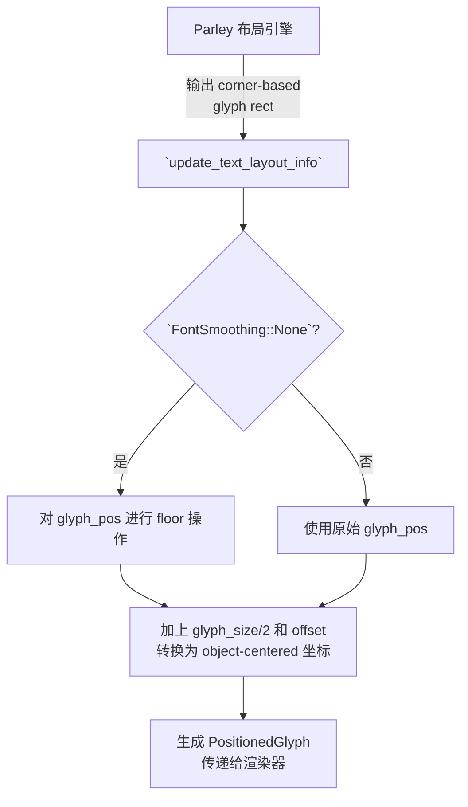

+++
title = "#22972 `FontSmoothing::None` pixel alignment fix"
date = "2026-02-17T00:00:00"
draft = false
template = "pull_request_page.html"
in_search_index = false

[extra]
current_language = "zh-cn"
available_languages = {"en" = { name = "English", url = "/pull_request/bevy/2026-02/pr-22972-en-20260217" }, "zh-cn" = { name = "中文", url = "/pull_request/bevy/2026-02/pr-22972-zh-cn-20260217" }}
labels = ["C-Bug", "A-Rendering", "P-Regression", "A-Text", "D-Straightforward", "M-Deliberate-Rendering-Change"]
+++

# Title

## Basic Information
- **Title**: `FontSmoothing::None` pixel alignment fix
- **PR Link**: https://github.com/bevyengine/bevy/pull/22972
- **Author**: ickshonpe
- **Status**: MERGED
- **Labels**: C-Bug, A-Rendering, S-Ready-For-Final-Review, P-Regression, A-Text, D-Straightforward, M-Deliberate-Rendering-Change
- **Created**: 2026-02-16T00:48:05Z
- **Merged**: 2026-02-17T01:47:20Z
- **Merged By**: alice-i-cecile

## Description Translation
### 目的
当使用 `FontSmoothing::None` 时，`update_text_layout_info` 会对每个字形（glyph）最终的对象中心（object-centered）位置进行四舍五入（round）。如果字形的大小为奇数，这会破坏像素对齐（pixel alignment）。

修复问题 #22975

### 解决方案
在我们将坐标转换为对象中心坐标之前，首先对从 Parley 布局得到的基于角落（corner-based）的字形位置进行向下取整（floor）。

#### 具体示例
1. Parley 返回一个基于左上角的字形矩形：
`left = 100, top = 50, width = 15, height = 18`
2. UI 渲染器期望字形坐标是对象中心的，因此我们加上一半的尺寸来得到字形的对象中心位置。所以字形的水平中心将在：
`x = left + width / 2 = 100 + 7.5 = 107.5`
3. 这是像素对齐的，因为如果我们再减去一半的尺寸，就可以得到 `left` 边缘的位置。
4. 但是，如果我们对对象中心位置向下取整 `x' = floor(x) = 107`。这将字形精灵（sprite）的左边缘移动到了一个亚像素（subpixel）位置：
`left' = x' - width / 2 = 107 - 7.5 = 99.5`
5. 在 y 轴上没有亚像素问题，因为高度可以被 2 整除。

### 测试
如果仔细比较 `test_bed_ui` 中 `text` 场景的输出，改进是相当明显的：

#### main（主分支）


#### 本 PR


## The Story of This Pull Request

这是一个关于渲染管线中一个微妙但重要bug的修复故事，涉及坐标空间转换和取整操作的顺序问题。

问题始于一个回归（regression），当开发者将文本的 `FontSmoothing` 设置为 `None` 时，期望得到清晰、像素对齐的文本，但实际渲染结果却出现了模糊或错位的字形。标签 `P-Regression` 和 `C-Bug` 明确指出了这一点。问题的核心在于 `bevy_text` 管线中处理字形定位的逻辑存在缺陷。

具体来说，文本布局引擎 Parley 输出的字形位置是基于其边界矩形的左上角（top-left corner）的。然而，Bevy 的 UI 渲染器内部使用的是对象中心（object-centered）坐标系，即位置代表精灵的中心点。因此，代码需要进行一次坐标转换：将角落坐标加上字形尺寸的一半，以得到中心坐标。

当 `FontSmoothing` 为 `None` 时，为了实现像素级锐利渲染，代码需要对最终位置进行取整（round），以确保其落在整数像素上。这里的 bug 在于**取整操作的时机错了**。原始代码在完成从“角落坐标”到“中心坐标”的转换*之后*，才对中心坐标进行 `round`。这导致了一个问题：对于一个宽度为奇数的字形，其中心坐标可能是一个像 `107.5` 这样的半像素值。`round(107.5)` 得到 `108.0`。当渲染器用这个中心坐标 `108.0` 减去半宽（例如 `7.5`）来重新计算用于实际绘制的左上角时，得到的是 `100.5`。这个亚像素（subpixel）位置就是导致渲染模糊的根本原因。

解决方案在概念上很清晰：为了确保最终的渲染位置是像素对齐的，必须在进行可能导致非整数结果的运算*之前*，就将基础坐标固定到整数像素网格上。开发者将取整操作从坐标转换链的末端移到了前端。

具体实现是，不再单独计算 `x` 和 `y` 然后对它们取整，而是直接构建一个 `glyph_pos` 向量（`Vec2::new(glyph.x, glyph.y)`）。然后，在将其与半尺寸和偏移量相加之前，先根据 `font_smoothing` 的设置进行条件处理：如果是 `FontSmoothing::None`，则使用 `glyph_pos.floor()`；否则使用原始的 `glyph_pos`。这个 `floor` 操作（对比之前的 `round`）确保了字形的基础定位点被牢牢锁定在像素网格上，后续的任何加法运算（包括加上半尺寸）都会从这个稳固的整数基础开始，从而保证最终渲染的左上角坐标也是整数。

从工程角度看，这个修复是精准且最小化的。它没有改变管线的基本流程或数据结构，只是修正了计算顺序和取整函数的选用（`floor` 确保了向下对齐，对于从左上角开始的坐标系是合适的）。修改集中在一处，`+11/-11` 的代码行变化也体现了这一点。附带的测试截图直观地证明了修复的有效性：文本的锐利度和整体渲染质量得到了显著提升。这个案例很好地说明了在图形渲染中，数学精度和操作顺序的极端重要性，一个看似简单的取整操作放错了地方，就会直接损害视觉保真度。

## Visual Representation



## Key Files Changed

**crates/bevy_text/src/pipeline.rs** (+11/-11)

这个文件包含了文本渲染管线的核心逻辑。修改发生在 `update_text_layout_info` 函数中，该函数负责将 Parley 布局引擎的输出转换为 Bevy 渲染器所需的 `PositionedGlyph` 数据。

**关键修改：**
修改的核心是重组了计算 `PositionedGlyph.position` 的数学公式，将像素对齐的取整操作从计算链的末端移到了起始端。

```rust
// 修改前（存在bug的逻辑）：
let glyph_size = UVec2::new(glyph_rect.width(), glyph_rect.height());
let mut x = glyph_size.x as f32 / 2.0 + glyph.x + location.offset.x as f32;
let mut y = glyph_size.y as f32 / 2.0 + glyph.y - location.offset.y as f32;
if font_smoothing == FontSmoothing::None {
    x = x.round(); // 在中心坐标上取整，为bug来源
    y = y.round();
}
layout_info.glyphs.push(PositionedGlyph {
    position: Vec2::new(x, y),
    size: glyph_size.as_vec2(),
    // ...
});

// 修改后（修复后的逻辑）：
let glyph_size = UVec2::new(glyph_rect.width(), glyph_rect.height()).as_vec2();
let glyph_pos = Vec2::new(glyph.x, glyph.y);
layout_info.glyphs.push(PositionedGlyph {
    position: glyph_size / 2.
        + if font_smoothing == FontSmoothing::None {
            glyph_pos.floor() // 先在原始角落坐标上取整
        } else {
            glyph_pos
        }
        + location.offset.as_vec2() * Vec2::new(1., -1.),
    size: glyph_size,
    // ...
});
```

**关系说明：**
这项修改直接解决了 PR 描述中概述的像素对齐问题。通过先对从布局引擎得到的原始 `glyph_pos`（角落坐标）进行 `floor` 操作，确保了后续所有计算都基于一个像素对齐的起点，从而最终渲染出的字形边界也能精确落在像素网格上。这是修复 `FontSmoothing::None` 模式下文本渲染模糊问题的根本所在。

## Further Reading
1.  **Bevy 官方文档 - 文本（Text）**：了解 Bevy 中文本渲染的基本组件和用法。
2.  **像素对齐（Pixel Alignment）** 在计算机图形学中的重要性，特别是在 2D UI 和字体渲染中，这是保证清晰度的关键技术。
3.  **坐标空间变换** 的概念，理解如何在不同的坐标系（如世界坐标、局部坐标、屏幕坐标、纹理坐标）之间进行转换是图形编程的基础。
4.  **关于“亚像素渲染（Subpixel Rendering）”** 的讨论，这与本 PR 的 `FontSmoothing::None`（即关闭亚像素平滑）形成对比，有助于理解不同字体平滑技术的取舍。