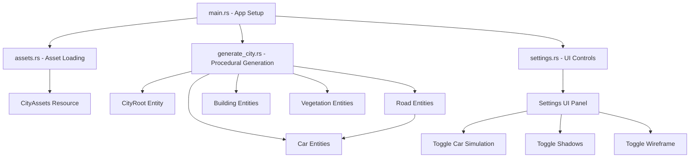

+++
title = "#22973 Add bevy_city"
date = "2026-02-17T00:00:00"
draft = false
template = "pull_request_page.html"
in_search_index = true

[taxonomies]
list_display = ["show"]

[extra]
current_language = "en"
available_languages = {"en" = { name = "English", url = "/pull_request/bevy/2026-02/pr-22973-en-20260217" }, "zh-cn" = { name = "中文", url = "/pull_request/bevy/2026-02/pr-22973-zh-cn-20260217" }}
labels = ["A-Rendering", "C-Examples"]
+++

# Title: Add bevy_city

## Basic Information
- **Title**: Add bevy_city
- **PR Link**: https://github.com/bevyengine/bevy/pull/22973
- **Author**: IceSentry
- **Status**: MERGED
- **Labels**: A-Rendering, C-Examples, S-Ready-For-Final-Review
- **Created**: 2026-02-16T01:23:22Z
- **Merged**: 2026-02-17T02:49:51Z
- **Merged By**: alice-i-cecile

## Description Translation
The PR description is already in English, so it's included exactly as-is:

# Objective

- Add a test scene that pushes a lot of rendering features while also pushing the ECS with a lot of entity updates

## Solution

- Add a procedurally generated city with a lot of different assets.
	- Spawn cars that move on every frame, eventually this will have a full traffic simulation that should stress the ECS

## Testing

- The example runs

---

## Showcase


## The Story of This Pull Request

This PR introduces a new example called `bevy_city` to the Bevy game engine. The primary objective is to create a stress test scene that pushes both rendering capabilities and the Entity Component System (ECS) performance. The example procedurally generates a city with various assets including roads, buildings, cars, and vegetation, creating a scene with a high entity count that can be used for benchmarking and testing.

The problem the developer is addressing is the need for a comprehensive test scene that can evaluate Bevy's performance under realistic conditions. Existing examples might test individual features, but a complex city scene with many moving parts provides a more holistic stress test. This is important for identifying performance bottlenecks, testing rendering optimizations, and ensuring the ECS can handle large numbers of entities with frequent updates.

The solution approach involves creating a procedurally generated city using assets from Kenney's asset packs. The city is laid out in a grid pattern with different density zones (forest, low-density, medium-density, high-density) determined by noise functions. Cars are spawned on roads and move continuously, providing the ECS stress through frequent position updates. The implementation is structured into several modules: asset management, city generation, main application setup, and a settings UI.

Looking at the implementation, the code follows a clean separation of concerns. The `assets.rs` module handles loading all 3D models and materials from remote URLs, organizing them into a `CityAssets` resource for easy access. The `generate_city.rs` module contains the procedural generation logic, using noise functions to create varied city zones and carefully positioning each entity relative to a grid. The `main.rs` file sets up the Bevy app with appropriate plugins and systems, including a free camera, atmospheric effects, and the car simulation system. The `settings.rs` module provides a UI panel to toggle features like car simulation, shadow maps, and wireframe rendering.

One technical insight is the use of noise functions for procedural generation. The `OpenSimplex` noise from the `noise` crate determines the density of each city block, creating natural-feeling transitions between different zone types. The car movement system is efficiently implemented using parent-child relationships: roads are parent entities with car entities as children, and the car simulation calculates positions based on travel distance along the road segment.

The impact of this PR is significant for the Bevy ecosystem. It provides developers with a ready-made complex scene for performance testing and benchmarking. The example showcases multiple rendering features simultaneously: HDR rendering, atmospheric scattering, bloom, temporal anti-aliasing, contact shadows, and wireframe rendering. The moving cars stress-test the ECS's ability to handle frequent component updates. Additionally, the settings UI demonstrates how to create interactive controls for toggling features at runtime.

From an architectural perspective, this example demonstrates several best practices for Bevy development: using resources for shared assets, organizing systems into modules, implementing parent-child hierarchies for spatial relationships, and creating reusable UI components. The code also shows how to handle external assets from URLs and how to structure a large scene with many procedurally generated entities.

## Visual Representation



## Key Files Changed

### `examples/large_scenes/bevy_city/src/main.rs` (+158/-0)
This is the entry point that sets up the Bevy application with all necessary plugins and systems.

Key code snippets:
```rust
fn main() {
    let args: Args = argh::from_env();

    App::new()
        .add_plugins((
            DefaultPlugins.set(WindowPlugin {
                primary_window: Some(Window {
                    title: "bevy_city".into(),
                    resolution: WindowResolution::new(1920, 1080).with_scale_factor_override(1.0),
                    present_mode: PresentMode::AutoNoVsync,
                    ..default()
                }),
                ..default()
            }),
            FreeCameraPlugin,
            FeathersPlugins,
            WireframePlugin::default(),
        ))
        // ... more setup
        .run();
}

fn simulate_cars(
    settings: Res<Settings>,
    roads: Query<(&Road, &Transform, &Children), Without<Car>>,
    mut cars: Query<(&mut Car, &mut Transform), Without<Road>>,
    time: Res<Time>,
) {
    if !settings.simulate_cars {
        return;
    }
    let speed = 1.5;

    for (road, _, children) in &roads {
        for child in children {
            let Ok((mut car, mut car_transform)) = cars.get_mut(*child) else {
                continue;
            };

            car.distance_traveled += speed * time.delta_secs();
            // ... position calculation
        }
    }
}
```

The main file establishes the application structure, sets up a 3D camera with advanced rendering features (HDR, atmosphere, bloom), and implements the car simulation system that moves cars along their parent roads.

### `examples/large_scenes/bevy_city/src/generate_city.rs` (+351/-0)
This module contains the procedural generation logic for creating the city layout.

Key code snippets:
```rust
pub fn spawn_city(commands: &mut Commands, assets: &CityAssets, seed: u64, size: u32) {
    let mut rng = SmallRng::seed_from_u64(seed);
    let noise = OpenSimplex::new(rng.random());
    let noise_scale = 0.025;

    commands
        .spawn((CityRoot, Transform::default(), Visibility::default()))
        .with_children(|commands| {
            let half_size = size as i32 / 2;
            for x in -half_size..half_size {
                for z in -half_size..half_size {
                    // scale the position to match the city block size
                    let x = x as f32 * 5.5;
                    let z = z as f32 * 4.0;
                    let offset = Vec3::new(x, 0.0, z);

                    spawn_roads_and_cars(commands, assets, &mut rng, offset);

                    let density = noise.get([
                        offset.x as f64 * noise_scale,
                        offset.z as f64 * noise_scale,
                        0.0,
                    ]) * 0.5
                        + 0.5;

                    // Determine zone type based on density
                    let forest = 0.45;
                    let low_density = 0.6;
                    let medium_density = 0.7;

                    // ... spawn appropriate zone
                }
            }
        });
}
```

The generation system creates a grid of city blocks, uses noise to determine zone density for each block, and spawns appropriate content (roads, buildings, vegetation) based on the density value.

### `examples/large_scenes/bevy_city/src/assets.rs` (+233/-0)
This module handles loading and organizing all 3D assets from remote URLs.

Key code snippets:
```rust
#[derive(Resource)]
pub struct CityAssets {
    pub cars: Vec<Handle<Scene>>,
    pub crossroad: Handle<Scene>,
    pub road_straight: Handle<Scene>,
    pub high_density: Buildings,
    pub medium_density: Buildings,
    pub low_density: Buildings,
    pub ground_tile: (
        Handle<Mesh>,
        Handle<StandardMaterial>,
        Handle<StandardMaterial>,
    ),
    pub tree_small: Handle<Scene>,
    pub tree_large: Handle<Scene>,
    pub path_stones_long: Handle<Scene>,
    pub fence: Handle<Scene>,
}

pub fn load_assets(
    mut commands: Commands,
    asset_server: Res<AssetServer>,
    mut materials: ResMut<Assets<StandardMaterial>>,
) {
    let base_url = "https://github.com/bevyengine/bevy_asset_files/raw/main/kenney";

    let cars = {
        // TODO generate color variations
        [
            "hatchback-sports", "suv", "suv-luxury", "sedan", "sedan-sports",
            "truck", "truck-flat", "van", "delivery", "delivery-flat",
            "taxi", "garbage-truck", "ambulance", "police", "firetruck",
        ]
        .iter()
        .map(|t| {
            asset_server
                .load(GltfAssetLabel::Scene(0).from_asset(format!("{base_url}/car-kit/{t}.glb")))
        })
        .collect::<Vec<_>>()
    };
    
    // ... load other assets
    
    commands.insert_resource(CityAssets {
        cars,
        crossroad,
        road_straight,
        high_density,
        medium_density,
        low_density,
        ground_tile,
        tree_small,
        tree_large,
        path_stones_long,
        fence,
    });
}
```

The asset system loads models from Kenney's asset packs hosted on GitHub, creates material variations for buildings, and organizes everything into a resource for easy access throughout the application.

### `examples/large_scenes/bevy_city/src/settings.rs` (+148/-0)
This module implements a UI settings panel with interactive controls.

Key code snippets:
```rust
#[derive(Resource)]
pub struct Settings {
    pub simulate_cars: bool,
    pub shadow_maps_enabled: bool,
    pub contact_shadows_enabled: bool,
    pub wireframe_enabled: bool,
}

pub fn setup_settings_ui(mut commands: Commands) {
    commands.spawn((
        Node {
            position_type: PositionType::Absolute,
            top: Val::Px(10.0),
            right: Val::Px(10.0),
            padding: UiRect::all(Val::Px(8.0)),
            ..default()
        },
        // ... UI setup with checkboxes and buttons
        children![
            (Text("Settings".to_owned())),
            (
                checkbox(Checked, Spawn((Text::new("Simulate Cars"), ThemedText))),
                observe(checkbox_self_update),
                observe(
                    |change: On<ValueChange<bool>>, mut settings: ResMut<Settings>| {
                        settings.simulate_cars = change.value;
                    }
                )
            ),
            // ... more checkboxes for shadow maps, contact shadows, wireframe
            (
                button(
                    ButtonProps::default(),
                    (),
                    Spawn((Text::new("Regenerate City"), ThemedText))
                ),
                observe(
                    |_activate: On<Activate>,
                     mut commands: Commands,
                     city_root: Single<Entity, With<CityRoot>>,
                     assets: Res<CityAssets>| {
                        commands.entity(*city_root).despawn();
                        
                        let mut rng = rand::rng();
                        let seed = rng.random::<u64>();
                        println!("new seed: {seed}");
                        spawn_city(&mut commands, &assets, seed, 32);
                    }
                )
            ),
        ]
    ));
}
```

The settings UI demonstrates Bevy's UI system (Feathers) with interactive controls that modify runtime settings and even trigger a complete regeneration of the city with a new random seed.

### `examples/large_scenes/bevy_city/Cargo.toml` (+17/-0)
The Cargo.toml specifies dependencies including Bevy with specific features enabled:
```toml
[dependencies]
bevy = { path = "../../../", features = [
  "https",
  "free_camera",
  "experimental_bevy_feathers",
] }

argh = "0.1"
noise = "0.9.0"
rand = "0.10.0"
```

This configuration shows which Bevy features are required for this example, particularly the HTTP asset loading capability and the experimental UI system.

## Further Reading

1. **Bevy Engine Documentation**: https://bevyengine.org/learn/
2. **Kenney Asset Packs**: https://kenney.nl/assets - The source of 3D models used in this example
3. **Procedural Generation with Noise**: The `noise` crate documentation (https://docs.rs/noise) for understanding the OpenSimplex noise algorithm
4. **ECS Pattern**: The Entity Component System architecture pattern used throughout Bevy
5. **Bevy Feathers UI**: The experimental UI system used for the settings panel (currently in development)
6. **Traffic Simulation Inspiration**: The example was inspired by https://flecs-hub.github.io/traffic/etc/ which demonstrates a traffic simulation using the FLECS ECS

# Full Code Diff
```
diff --git a/Cargo.toml b/Cargo.toml
index d28f6fb2fbd31..879b296af38cf 100644
--- a/Cargo.toml
+++ b/Cargo.toml
@@ -33,6 +33,7 @@ members = [
   # Examples of large bevy scenes.
   "examples/large_scenes/bistro",
   "examples/large_scenes/caldera_hotel",
+  "examples/large_scenes/bevy_city",
   # Mipmap generator for testing large bevy scenes with mips and texture compression.
   "examples/large_scenes/mipmap_generator",
   # Benchmarks
diff --git a/examples/large_scenes/bevy_city/Cargo.toml b/examples/large_scenes/bevy_city/Cargo.toml
new file mode 100644
index 0000000000000..efdc1155e969e
--- /dev/null
+++ b/examples/large_scenes/bevy_city/Cargo.toml
@@ -0,0 +1,17 @@
+[package]
+name = "bevy_city"
+version = "0.1.0"
+edition = "2024"
+publish = false
+license = "MIT OR Apache-2.0"
+
+[dependencies]
+bevy = { path = "../../../", features = [
+  "https",
+  "free_camera",
+  "experimental_bevy_feathers",
+] }
+
+argh = "0.1"
+noise = "0.9.0"
+rand = "0.10.0"
diff --git a/examples/large_scenes/bevy_city/README.md b/examples/large_scenes/bevy_city/README.md
new file mode 100644
index 0000000000000..4b1d494d1ed54
--- /dev/null
+++ b/examples/large_scenes/bevy_city/README.md
@@ -0,0 +1,6 @@
+# bevy_city
+
+A procedurally generated city using assets from [kenney](https://kenney.nl)
+
+This project was inspired by <https://flecs-hub.github.io/traffic/etc/>.
+Currently it doesn't do any traffic simulation but the goal is to have a similar simulation but using bevy_ecs.
diff --git a/examples/large_scenes/bevy_city/src/assets.rs b/examples/large_scenes/bevy_city/src/assets.rs
new file mode 100644
index 0000000000000..1db9a7bb78f91
--- /dev/null
+++ b/examples/large_scenes/bevy_city/src/assets.rs
@@ -0,0 +1,233 @@
+use bevy::{color::palettes::css::WHITE, prelude::*};
+use rand::RngExt;
+
+#[derive(Resource)]
+pub struct CityAssets {
+    pub cars: Vec<Handle<Scene>>,
+    pub crossroad: Handle<Scene>,
+    pub road_straight: Handle<Scene>,
+    pub high_density: Buildings,
+    pub medium_density: Buildings,
+    pub low_density: Buildings,
+    pub ground_tile: (
+        Handle<Mesh>,
+        Handle<StandardMaterial>,
+        Handle<StandardMaterial>,
+    ),
+    pub tree_small: Handle<Scene>,
+    pub tree_large: Handle<Scene>,
+    pub path_stones_long: Handle<Scene>,
+    pub fence: Handle<Scene>,
+}
+
+impl CityAssets {
+    pub fn get_random_car<R: RngExt>(&self, rng: &mut R) -> Handle<Scene> {
+        self.cars[rng.random_range(0..self.cars.len())].clone()
+    }
+}
+
+pub struct Buildings {
+    meshes: Vec<Handle<Mesh>>,
+    materials: Vec<Handle<StandardMaterial>>,
+}
+
+impl Buildings {
+    pub fn get_random_building<R: RngExt>(
+        &self,
+        rng: &mut R,
+    ) -> (Mesh3d, MeshMaterial3d<StandardMaterial>) {
+        let mesh = self.meshes[rng.random_range(0..self.meshes.len())].clone();
+        let material = self.materials[rng.random_range(0..self.materials.len())].clone();
+        (Mesh3d(mesh), MeshMaterial3d(material))
+    }
+}
+
+pub fn load_assets(
+    mut commands: Commands,
+    asset_server: Res<AssetServer>,
+    mut materials: ResMut<Assets<StandardMaterial>>,
+) {
+    let base_url = "https://github.com/bevyengine/bevy_asset_files/raw/main/kenney";
+
+    let cars = {
+        // TODO generate color variations
+        [
+            "hatchback-sports",
+            "suv",
+            "suv-luxury",
+            "sedan",
+            "sedan-sports",
+            "truck",
+            "truck-flat",
+            "van",
+            "delivery",
+            "delivery-flat",
+            "taxi",
+            "garbage-truck",
+            "ambulance",
+            "police",
+            "firetruck",
+        ]
+        .iter()
+        .map(|t| {
+            asset_server
+                .load(GltfAssetLabel::Scene(0).from_asset(format!("{base_url}/car-kit/{t}.glb")))
+        })
+        .collect::<Vec<_>>()
+    };
+
+    let crossroad = asset_server.load(
+        GltfAssetLabel::Scene(0)
+            .from_asset(format!("{base_url}/city-kit-roads/road-crossroad-path.glb")),
+    );
+    let road_straight = asset_server.load(
+        GltfAssetLabel::Scene(0).from_asset(format!("{base_url}/city-kit-roads/road-straight.glb")),
+    );
+
+    let high_density = {
+        let materials = ["colormap", "variation-a", "variation-b"]
+            .iter()
+            .map(|variation| {
+                materials.add(StandardMaterial {
+                    base_color_texture: Some(asset_server.load(format!(
+                        "{base_url}/city-kit-commercial/Textures/{variation}.png"
+                    ))),
+                    ..Default::default()
+                })
+            })
+            .collect::<Vec<_>>();
+
+        let mut meshes = ["a", "b", "c", "d", "e"]
+            .iter()
+            .map(|t| {
+                asset_server.load(
+                    GltfAssetLabel::Primitive {
+                        mesh: 0,
+                        primitive: 0,
+                    }
+                    .from_asset(format!(
+                        "{base_url}/city-kit-commercial/building-skyscraper-{t}.glb"
+                    )),
+                )
+            })
+            .collect::<Vec<_>>();
+        meshes.extend(["m", "l"].iter().map(|t| {
+            asset_server.load(
+                GltfAssetLabel::Primitive {
+                    mesh: 0,
+                    primitive: 0,
+                }
+                .from_asset(format!("{base_url}/city-kit-commercial/building-{t}.glb")),
+            )
+        }));
+
+        Buildings { meshes, materials }
+    };
+
+    let medium_density = {
+        let materials = ["colormap", "variation-a", "variation-b"]
+            .iter()
+            .map(|variation| {
+                materials.add(StandardMaterial {
+                    base_color_texture: Some(asset_server.load(format!(
+                        "{base_url}/city-kit-commercial/Textures/{variation}.png"
+                    ))),
+                    ..Default::default()
+                })
+            })
+            .collect::<Vec<_>>();
+        let meshes = ["a", "b", "c", "d", "f", "g", "h"]
+            .iter()
+            .map(|t| {
+                asset_server.load(
+                    GltfAssetLabel::Primitive {
+                        mesh: 0,
+                        primitive: 0,
+                    }
+                    .from_asset(format!("{base_url}/city-kit-commercial/building-{t}.glb")),
+                )
+            })
+            .collect::<Vec<_>>();
+
+        Buildings { meshes, materials }
+    };
+    let low_density = {
+        let materials = ["colormap", "variation-a", "variation-b", "variation-c"]
+            .iter()
+            .map(|variation| {
+                materials.add(StandardMaterial {
+                    base_color_texture: Some(asset_server.load(format!(
+                        "{base_url}/city-kit-suburban/Textures/{variation}.png"
+                    ))),
+                    ..Default::default()
+                })
+            })
+            .collect::<Vec<_>>();
+        let meshes = ["b", "c", "d", "e", "f", "g", "h", "i", "k", "l", "o", "u"]
+            .iter()
+            .map(|t| {
+                asset_server.load(
+                    GltfAssetLabel::Primitive {
+                        mesh: 0,
+                        primitive: 0,
+                    }
+                    .from_asset(format!(
+                        "{base_url}/city-kit-suburban/building-type-{t}.glb"
+                    )),
+                )
+            })
+            .collect::<Vec<_>>();
+
+        Buildings { meshes, materials }
+    };
+
+    let ground_tile = {
+        let mesh = asset_server.load(
+            GltfAssetLabel::Primitive {
+                mesh: 0,
+                primitive: 0,
+            }
+            .from_asset(format!("{base_url}/city-kit-roads/tile-low.glb")),
+        );
+        // TODO use this once https://github.com/bevyengine/bevy/pull/22943 is merged
+        // let default_material: Handle<StandardMaterial> = asset_server.load(format!(
+        //     "ground_tile/tile-low.glb#{}/std",
+        //     GltfAssetLabel::DefaultMaterial
+        // ));
+        let white_material = materials.add(StandardMaterial::from_color(WHITE));
+        let grass_material =
+            materials.add(StandardMaterial::from_color(Color::srgb_u8(97, 203, 139)));
+
+        (mesh, white_material, grass_material)
+    };
+
+    let tree_small: Handle<Scene> = asset_server.load(
+        GltfAssetLabel::Scene(0).from_asset(format!("{base_url}/city-kit-suburban/tree-small.glb")),
+    );
+    let tree_large: Handle<Scene> = asset_server.load(
+        GltfAssetLabel::Scene(0).from_asset(format!("{base_url}/city-kit-suburban/tree-large.glb")),
+    );
+
+    let path_stones_long: Handle<Scene> = asset_server.load(
+        GltfAssetLabel::Scene(0)
+            .from_asset(format!("{base_url}/city-kit-suburban/path-stones-long.glb")),
+    );
+
+    let fence: Handle<Scene> = asset_server.load(
+        GltfAssetLabel::Scene(0).from_asset(format!("{base_url}/city-kit-suburban/fence.glb")),
+    );
+
+    commands.insert_resource(CityAssets {
+        cars,
+        crossroad,
+        road_straight,
+        high_density,
+        medium_density,
+        low_density,
+        ground_tile,
+        tree_small,
+        tree_large,
+        path_stones_long,
+        fence,
+    });
+}
diff --git a/examples/large_scenes/bevy_city/src/generate_city.rs b/examples/large_scenes/bevy_city/src/generate_city.rs
new file mode 100644
index 0000000000000..46aa5594e4cc8
--- /dev/null
+++ b/examples/large_scenes/bevy_city/src/generate_city.rs
@@ -0,0 +1,351 @@
+use bevy::prelude::*;
+use noise::{NoiseFn, OpenSimplex};
+use rand::{rngs::SmallRng, RngExt, SeedableRng};
+
+use crate::{assets::CityAssets, Car, Road};
+
+#[derive(Component)]
+pub struct CityRoot;
+
+/// Spawns a grid of city blocks
+///
+/// For simplicity we spawn the roads and buildings in this pattern
+///
+/// X-------
+/// | B B B
+/// | B B B
+///
+/// X = crossroad, B = buildings
+///
+/// This way we can easily tile each city block
+/// Each city block is 5.5 units x 4.0 units.
+///
+/// Every asset gets spawned relative to the crossroad position
+pub fn spawn_city(commands: &mut Commands, assets: &CityAssets, seed: u64, size: u32) {
+    let mut rng = SmallRng::seed_from_u64(seed);
+    let noise = OpenSimplex::new(rng.random());
+    let noise_scale = 0.025;
+
+    commands
+        .spawn((CityRoot, Transform::default(), Visibility::default()))
+        .with_children(|commands| {
+            let half_size = size as i32 / 2;
+            for x in -half_size..half_size {
+                for z in -half_size..half_size {
+                    // scale the position to match the city block size
+                    let x = x as f32 * 5.5;
+                    let z = z as f32 * 4.0;
+                    let offset = Vec3::new(x, 0.0, z);
+
+                    spawn_roads_and_cars(commands, assets, &mut rng, offset);
+
+                    let density = noise.get([
+                        offset.x as f64 * noise_scale,
+                        offset.z as f64 * noise_scale,
+                        0.0,
+                    ]) * 0.5
+                        + 0.5;
+
+                    let forest = 0.45;
+                    let low_density = 0.6;
+                    let medium_density = 0.7;
+
+                    let ground_tile_scale = Vec3::new(4.5, 1.0, 3.0);
+                    commands.spawn((
+                        Mesh3d(assets.ground_tile.0.clone()),
+                        if density < low_density {
+                            MeshMaterial3d(assets.ground_tile.2.clone())
+                        } else {
+                            MeshMaterial3d(assets.ground_tile.1.clone())
+                        },
+                        Transform::from_translation(
+                            Vec3::new(0.5, -0.5005, 0.5) + ground_tile_scale / 2.0 + offset,
+                        )
+                        .with_scale(ground_tile_scale),
+                    ));
+
+                    if density < forest {
+                        spawn_forest(commands, assets, &mut rng, offset);
+                    } else if density < low_density {
+                        spawn_low_density(commands, assets, &mut rng, offset);
+                    } else if density < medium_density {
+                        spawn_medium_density(commands, assets, &mut rng, offset);
+                    } else {
+                        spawn_high_density(commands, assets, &mut rng, offset);
+                    }
+                }
+            }
+        });
+}
+
+fn spawn_roads_and_cars<R: RngExt>(
+    commands: &mut ChildSpawnerCommands,
+    assets: &CityAssets,
+    rng: &mut R,
+    offset: Vec3,
+) {
+    let x = offset.x;
+    let z = offset.z;
+
+    commands.spawn((
+        SceneRoot(assets.crossroad.clone()),
+        Transform::from_xyz(x, 0.0, z),
+    ));
+
+    let max_car_density = 0.4;
+
+    // When spawning roads we rotate and stretch a single road asset instead of spawning multiple
+    // road segments
+
+    // NOTE most of the magic numbers were hand tweaked for something that looks visually nice
+
+    // horizontal road
+    let car_count = 9;
+    commands
+        .spawn((
+            Transform::from_translation(offset),
+            Visibility::default(),
+            Road {
+                start: Vec3::new(0.75, 0.0, 0.0),
+                end: Vec3::new(0.75 + (0.5 * car_count as f32), 0.0, 0.0),
+            },
+        ))
+        .with_children(|commands| {
+            commands.spawn((
+                SceneRoot(assets.road_straight.clone()),
+                Transform::from_translation(Vec3::new(2.75, 0.0, 0.0))
+                    .with_scale(Vec3::new(4.5, 1.0, 1.0)),
+            ));
+
+            for i in 0..car_count {
+                let car_pos = Vec3::new(0.0, 0.0, 0.75 + i as f32 * 0.5);
+
+                if rng.random::<f32>() < max_car_density {
+                    commands.spawn((
+                        SceneRoot(assets.get_random_car(rng)),
+                        Transform::from_translation(car_pos + Vec3::new(0.0, 0.0, -0.15))
+                            .with_scale(Vec3::splat(0.15))
+                            .with_rotation(Quat::from_axis_angle(
+                                Vec3::Y,
+                                3.0 * std::f32::consts::FRAC_PI_2,
+                            )),
+                        Car {
+                            distance_traveled: i as f32 * 0.5,
+                            dir: -1.0,
+                            offset: Vec3::new(4.25, 0.0, -0.15),
+                        },
+                    ));
+                }
+
+                if rng.random::<f32>() < max_car_density {
+                    commands.spawn((
+                        SceneRoot(assets.get_random_car(rng)),
+                        Transform::from_translation(car_pos + Vec3::new(0.0, 0.0, 0.15))
+                            .with_scale(Vec3::splat(0.15))
+                            .with_rotation(Quat::from_axis_angle(
+                                Vec3::Y,
+                                std::f32::consts::FRAC_PI_2,
+                            )),
+                        Car {
+                            distance_traveled: i as f32 * 0.5,
+                            dir: 1.0,
+                            offset: Vec3::new(-0.25, 0.0, 0.15),
+                        },
+                    ));
+                }
+            }
+        });
+
+    // vertical road
+    let car_count = 6;
+    commands
+        .spawn((
+            Transform::from_translation(offset),
+            Visibility::default(),
+            Road {
+                start: Vec3::new(0.0, 0.0, 0.75),
+                end: Vec3::new(0.0, 0.0, 0.75 + (0.5 * car_count as f32)),
+            },
+        ))
+        .with_children(|commands| {
+            commands.spawn((
+                SceneRoot(assets.road_straight.clone()),
+                Transform::from_translation(Vec3::new(0.0, 0.0, 2.0))
+                    .with_scale(Vec3::new(3.0, 1.0, 1.0))
+                    .with_rotation(Quat::from_axis_angle(Vec3::Y, std::f32::consts::FRAC_PI_2)),
+            ));
+
+            for i in 0..car_count {
+                let car_pos = Vec3::new(0.0, 0.0, 0.75 + i as f32 * 0.5);
+
+                if rng.random::<f32>() < max_car_density {
+                    commands.spawn((
+                        SceneRoot(assets.get_random_car(rng)),
+                        Transform::from_translation(car_pos + Vec3::new(0.15, 0.0, 0.0))
+                            .with_scale(Vec3::splat(0.15)),
+                        Car {
+                            distance_traveled: i as f32 * 0.5,
+                            dir: 1.0,
+                            offset: Vec3::new(-0.15, 