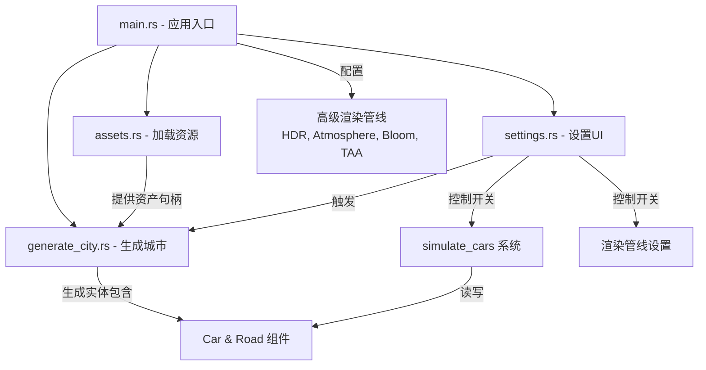

+++
title = "#22973 Add bevy_city"
date = "2026-02-17T00:00:00"
draft = false
template = "pull_request_page.html"
in_search_index = false

[extra]
current_language = "zh-cn"
available_languages = {"en" = { name = "English", url = "/pull_request/bevy/2026-02/pr-22973-en-20260217" }, "zh-cn" = { name = "中文", url = "/pull_request/bevy/2026-02/pr-22973-zh-cn-20260217" }}
+++

# 添加 bevy_city 示例

## 基础信息
- **标题**: Add bevy_city
- **PR 链接**: https://github.com/bevyengine/bevy/pull/22973
- **作者**: IceSentry
- **状态**: 已合并
- **标签**: A-Rendering, C-Examples, S-Ready-For-Final-Review
- **创建时间**: 2026-02-16T01:23:22Z
- **合并时间**: 2026-02-17T02:49:51Z
- **合并者**: alice-i-cecile

## 描述翻译

# 目标
- 添加一个测试场景，该场景能同时测试大量渲染功能，并通过大量实体更新来对 ECS（实体组件系统）施压。

## 解决方案
- 添加一个包含大量不同资源（assets）的程序化生成城市。
    - 生成在每一帧移动的汽车，最终这将拥有一个完整的交通模拟，应该能对 ECS 产生压力。

## 测试
- 示例成功运行。

---

## 展示


## 本 PR 的技术叙述

本 PR 的主要目标是为 Bevy 引擎创建一个新的、规模庞大的示例场景。其核心需求是双重的：首先，这个场景需要能展示并测试引擎的多种高级渲染功能；其次，它需要生成和管理足够多的动态实体，以便对 Bevy 的 ECS（实体组件系统）框架进行压力测试和性能评估。

开发者选择创建一个程序化生成的城市场景 `bevy_city` 作为解决方案。这个场景并非静态，它包含了会每帧移动的车辆，为未来的完整交通模拟奠定了基础，这正是对 ECS 进行压力测试的关键。

**实现从资产管理开始**。在 `assets.rs` 中，定义了 `CityAssets` 资源结构体，用于集中加载和管理场景所需的所有 GLTF 模型和材质。这包括多种汽车模型、不同类型的建筑（高密度、中密度、低密度）、道路、地面、树木、围栏等。代码中大量使用了来自 Kenney 资产库的模型，并通过 `AssetServer` 从远程仓库加载。一个值得注意的设计是 `Buildings` 结构体，它封装了特定密度区域的建筑网格和材质列表，并提供了 `get_random_building` 方法来随机选取，这为城市多样性奠定了基础。

```rust
// File: examples/large_scenes/bevy_city/src/assets.rs
// 关键结构体，用于管理所有城市资产
#[derive(Resource)]
pub struct CityAssets {
    pub cars: Vec<Handle<Scene>>,
    pub crossroad: Handle<Scene>,
    pub road_straight: Handle<Scene>,
    pub high_density: Buildings,
    pub medium_density: Buildings,
    pub low_density: Buildings,
    pub ground_tile: (
        Handle<Mesh>,
        Handle<StandardMaterial>,
        Handle<StandardMaterial>,
    ),
    // ... 其他资产
}

// 用于随机获取建筑的辅助结构
pub struct Buildings {
    meshes: Vec<Handle<Mesh>>,
    materials: Vec<Handle<StandardMaterial>>,
}
impl Buildings {
    pub fn get_random_building<R: RngExt>(&self, rng: &mut R) -> (Mesh3d, MeshMaterial3d<StandardMaterial>) {
        let mesh = self.meshes[rng.random_range(0..self.meshes.len())].clone();
        let material = self.materials[rng.random_range(0..self.materials.len())].clone();
        (Mesh3d(mesh), MeshMaterial3d(material))
    }
}
```

**城市生成的核心逻辑** 位于 `generate_city.rs`。函数 `spawn_city` 是整个过程的入口。它根据传入的种子（seed）和大小（size）参数，生成一个城市区块网格。每个区块的位置通过一个简单的公式 (`x * 5.5, z * 4.0`) 计算，确保了区块间的整齐排列。为了实现城市区域的自然分布（如森林、低密度住宅、商业区、摩天大楼），开发者引入了 `OpenSimplex` 噪声函数。对每个区块中心位置采样噪声值，并根据预设的阈值（`forest=0.45`, `low_density=0.6`, `medium_density=0.7`）来决定在该区块生成何种内容。

```rust
// File: examples/large_scenes/bevy_city/src/generate_city.rs
// 使用噪声决定区块类型
let density = noise.get([
    offset.x as f64 * noise_scale,
    offset.z as f64 * noise_scale,
    0.0,
]) * 0.5 + 0.5; // 将噪声值映射到 [0, 1] 范围

if density < forest {
    spawn_forest(commands, assets, &mut rng, offset);
} else if density < low_density {
    spawn_low_density(commands, assets, &mut rng, offset);
} else if density < medium_density {
    spawn_medium_density(commands, assets, &mut rng, offset);
} else {
    spawn_high_density(commands, assets, &mut rng, offset);
}
```

**道路和车辆系统** 是使场景动态化的关键。每个区块的十字路口处放置一个交叉路口模型。道路则通过对一个直线道路模型进行旋转和缩放来生成，而不是拼接多个路段，这是一种高效的实例化应用。车辆（`Car`）作为道路（`Road`）实体的子实体生成。`Road` 组件定义了路段的起点和终点。`Car` 组件则记录了车辆在路段上的行进距离、方向以及一个局部偏移量（用于确定车辆在车道上的位置）。

```rust
// File: examples/large_scenes/bevy_city/src/main.rs
// 定义道路和车辆组件
#[derive(Component)]
struct Road {
    start: Vec3,
    end: Vec3,
}
#[derive(Component)]
struct Car {
    offset: Vec3,
    distance_traveled: f32,
    dir: f32, // 方向：1 或 -1
}

// 车辆模拟系统
fn simulate_cars(...) {
    for (road, _, children) in &roads {
        for child in children {
            // ... 获取车辆实体
            car.distance_traveled += speed * time.delta_secs();
            // ... 处理循环逻辑
            let direction = (road.end - road.start).normalize() * car.dir;
            let progress = car.distance_traveled / road_len;
            car_transform.translation = (road.start + car.offset) + direction * road_len * progress;
        }
    }
}
```

**主程序 (`main.rs`)** 负责整合所有模块并配置渲染环境。它设置了支持 HDR、大气散射、接触阴影、TAA 抗锯齿和泛光效果的高级 3D 相机，并启用了定向光阴影。这直接满足了“测试大量渲染功能”的目标。通过命令行参数 (`argh` crate) 可以控制生成城市的种子和大小，增加了示例的可重复性和可测试性。

**交互式设置界面 (`settings.rs`)** 为示例增添了实用性。它利用 Bevy 的 `Feathers` UI 框架创建了一个浮动面板，允许用户实时切换多项设置：是否模拟车辆、是否启用阴影映射、是否启用接触阴影、是否全局启用线框模式，以及一键“重新生成城市”。这个 UI 的设计考虑到了用户体验，当鼠标悬停在面板上时，会暂时禁用自由相机控制，防止误操作。

**从技术角度看**，这个 PR 的实现展示了几个有效的模式：1) **资源集中管理**：将大量资产封装在单个 `Resource` 中，便于访问和生命周期管理。2) **程序化内容生成**：结合噪声算法和规则，用相对简单的代码生成复杂、多样的场景。3) **ECS 模式应用**：清晰地将数据（`Road`, `Car` 组件）与逻辑 (`simulate_cars` 系统) 分离。4) **性能考量**：通过旋转缩放单个模型来“实例化”道路，减少资产加载和绘制调用。5) **可配置性与可测试性**：通过种子参数和 UI 控制，使场景行为可预测、可调整。

**当前实现的影响** 是为 Bevy 社区提供了一个高质量的压力测试与视觉效果展示场景。它能够有效测试引擎在管理数万实体（建筑、树木、车辆）时的 ECS 性能，并同时展示包括 PBR、阴影、后处理、大气效果在内的现代渲染管线。

**潜在的未来改进** 在代码中已有提及，例如为汽车生成颜色变体，以及在另一个 PR 合并后使用 GLTF 默认材质。长远来看，实现更复杂的交通模拟（如避让、红绿灯）将是对 ECS 调度和系统设计的更大挑战。

总而言之，`bevy_city` PR 是一个构思清晰、执行良好的新增示例。它通过一个具体的、可视化的应用场景，同时达成了引擎功能展示和核心框架压力测试两个工程目标，其模块化设计和代码模式也为其他开发者创建复杂 Bevy 应用提供了参考。

## 视觉表现



## 关键文件更改

1.  **`examples/large_scenes/bevy_city/src/assets.rs` (+233/-0)**
    - **描述**：新增文件，负责定义和加载场景所需的所有 3D 模型和材质资产。这是整个示例的资源仓库。
    - **关键代码**：
        ```rust
        // 加载汽车模型列表
        let cars = [...].iter().map(|t| {
            asset_server.load(GltfAssetLabel::Scene(0).from_asset(format!("{base_url}/car-kit/{t}.glb")))
        }).collect::<Vec<_>>();
        
        // 创建不同密度的建筑资产集合
        let high_density = Buildings { meshes, materials };
        ```
    - **与 PR 目标的关系**：集中化管理资产是实现大规模、多样化场景的前提，为压力测试提供了丰富的渲染对象。

2.  **`examples/large_scenes/bevy_city/src/generate_city.rs` (+351/-0)**
    - **描述**：新增文件，包含程序化生成城市网格、道路、建筑、植被和车辆的核心逻辑。这是场景构建的主要算法所在。
    - **关键代码**：
        ```rust
        // 使用噪声决定区块类型
        let density = noise.get([...]) * 0.5 + 0.5;
        if density < forest { spawn_forest(...); }
        // ... 其他分支
        
        // 在道路上生成车辆
        if rng.random::<f32>() < max_car_density {
            commands.spawn((SceneRoot(assets.get_random_car(rng)), ..., Car { ... }));
        }
        ```
    - **与 PR 目标的关系**：直接实现了“程序化生成城市”和“生成移动汽车”的解决方案，是产生大量实体以测试 ECS 的关键。

3.  **`examples/large_scenes/bevy_city/src/main.rs` (+158/-0)**
    - **描述**：新增文件，作为示例应用的主入口。负责初始化插件、设置高级渲染相机和光照、解析命令行参数，并启动资产加载和城市生成流程。
    - **关键代码**：
        ```rust
        // 配置具有多种后处理效果的高级相机
        commands.spawn((Camera3d::default(), Hdr, Atmosphere::earthlike(...), Bloom::NATURAL, ...));
        // 定义车辆模拟系统
        fn simulate_cars(...) { ... }
        ```
    - **与 PR 目标的关系**：整合所有模块，并显式启用和配置了 HDR、大气、泛光等渲染功能，满足了“测试大量渲染功能”的目标。

4.  **`examples/large_scenes/bevy_city/src/settings.rs` (+148/-0)**
    - **描述**：新增文件，实现了一个交互式 UI 设置面板，允许用户实时控制模拟和渲染的各种开关。
    - **关键代码**：
        ```rust
        // 创建一个带复选框和按钮的 UI 面板
        (checkbox(Checked, ...), observe(|change: On<ValueChange<bool>>, mut settings: ResMut<Settings>| {
            settings.simulate_cars = change.value; // 响应 UI 事件更新设置
        }))
        ```
    - **与 PR 目标的关系**：提升了示例的交互性和演示价值，使用户能够动态观察不同设置（如开关阴影、车辆模拟）下的性能和视觉效果变化。

5.  **`examples/large_scenes/bevy_city/Cargo.toml` (+17/-0)**
    - **描述**：新增示例的 Cargo 清单文件，定义了项目元数据和依赖。
    - **关键代码**：
        ```toml
        [dependencies]
        bevy = { path = "../../../", features = ["https", "free_camera", "experimental_bevy_feathers"] }
        argh = "0.1"
        noise = "0.9.0"  # 用于程序化生成
        rand = "0.10.0"
        ```
    - **与 PR 目标的关系**：声明了项目依赖，特别是 `noise` 库（用于程序化生成）和 `bevy` 的特定功能（如 `https` 用于远程加载资产，`feathers` 用于 UI），是项目能正常运行的基础配置。

## 延伸阅读

1.  **Kenney 资产库**: 本示例使用了来自 [Kenney.nl](https://kenney.nl) 的优质免费游戏资产，这是游戏开发中常用的资源来源。
2.  **Bevy ECS 官方指南**: 深入了解 Bevy 的实体组件系统设计模式，有助于理解本例中 `Car`、`Road` 组件和 `simulate_cars` 系统是如何工作的。
3.  **程序化内容生成**:
    - **噪声算法**: 学习 `OpenSimplex` 或其他噪声算法（如 Perlin, Simplex）在生成自然地形和分布中的应用。
    - **《游戏编程模式》中的“程序化生成”章节**: 了解更广泛的 PCG 技术和设计思路。
4.  **Bevy 渲染管线**:
    - **Bevy 官方文档中关于 PBR、光照、后处理的部分**：深入理解本例中启用的 HDR、大气散射、接触阴影、泛光等技术。
    - **《Real-Time Rendering》**：经典的计算机图形学教科书，涵盖现代渲染管线的方方面面。