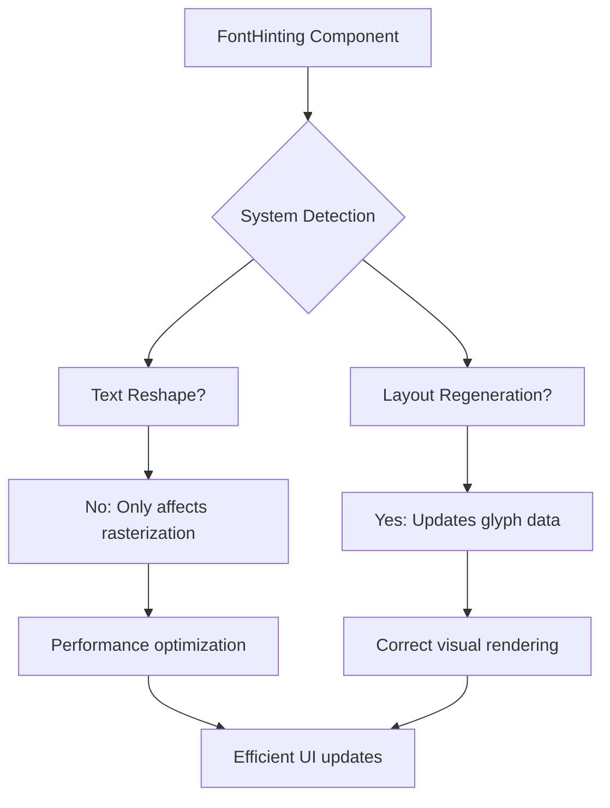

+++
title = "#22979 Font hinting fixes"
date = "2026-02-17T00:00:00"
draft = false
template = "pull_request_page.html"
in_search_index = true

[taxonomies]
list_display = ["show"]

[extra]
current_language = "en"
available_languages = {"en" = { name = "English", url = "/pull_request/bevy/2026-02/pr-22979-en-20260217" }, "zh-cn" = { name = "中文", url = "/pull_request/bevy/2026-02/pr-22979-zh-cn-20260217" }}
labels = ["C-Bug", "A-Rendering", "A-UI", "P-Regression", "A-Text", "D-Straightforward", "M-Deliberate-Rendering-Change"]
+++

# Font hinting fixes

## Basic Information
- **Title**: Font hinting fixes
- **PR Link**: https://github.com/bevyengine/bevy/pull/22979
- **Author**: ickshonpe
- **Status**: MERGED
- **Labels**: C-Bug, A-Rendering, A-UI, S-Ready-For-Final-Review, P-Regression, A-Text, D-Straightforward, M-Deliberate-Rendering-Change
- **Created**: 2026-02-16T11:57:02Z
- **Merged**: 2026-02-17T03:14:41Z
- **Merged By**: alice-i-cecile

## Description Translation
# Objective

Follow up to the parley migration PR #22879, fixing some hinting issues:

1. The `font_hinting` field on `ComputedTextBlock` is redundant.
2. Hinting should be enabled by default for UI text (was disabled before due to a bug in the cosmic text implementation).
3. Hinting should only be applied to antialiased text.
4. Changes to hinting no longer require reshaping.
5. `TextLayoutInfo` needs to be regenerated on changes to hinting.

## Solution

Changes:
1. Removed the `font_hinting` field from `ComputedTextBlock` as redundant.
2. Enabled hinting by default for UI `Text` as it's normally pixel aligned.
3. In `update_text_layout_info` only hint antialiased text sections. 
    Fixes #22977
4. `Text` and `Text2d` text is no longer reshaped on `FontHinting` component changes. 
5. `Text` and `Text2d` entity's `TextLayoutInfo`s are regenerated on `FontHinting` component changes.

## The Story of This Pull Request

This PR addresses several font hinting issues that emerged after the parley text layout migration in PR #22879. The core problem was that font hinting—a technique for adjusting glyph shapes to align with pixel grids—wasn't working correctly in certain scenarios.

The first issue was architectural redundancy. The `ComputedTextBlock` struct contained a `font_hinting` field, but this duplicated information already available in the `FontHinting` component. This redundancy meant changes to hinting could potentially cause inconsistencies between the component state and the computed text block state.

```rust
// Before (in bevy_text/src/text.rs):
pub struct ComputedTextBlock {
    // ... other fields
    pub(crate) font_hinting: FontHinting,
}

// After:
pub struct ComputedTextBlock {
    // ... other fields
    // font_hinting field removed
}
```

The second issue was incorrect defaults. UI text previously had hinting disabled due to a bug in the cosmic text implementation. Since UI text is typically pixel-aligned for sharp rendering, hinting should be enabled by default. The fix was straightforward:

```rust
// Before:
#[derive(Component, Default, Reflect)]
#[reflect(Component, Default)]
pub struct Text(pub String);

// After:
#[derive(Component, Default, Reflect)]
#[reflect(Component, Default)]
pub struct Text(pub String);
// Hinting is now enabled by default as UI text is normally pixel-aligned
```

The third issue was that hinting was being applied to all text, regardless of antialiasing settings. Font hinting only makes sense for antialiased text—for pixel-perfect aliased text, hinting can actually distort the intended appearance. The fix was to conditionally apply hinting based on the font smoothing setting:

```rust
// In bevy_text/src/pipeline.rs:
let hint = hinting.should_hint() && font_smoothing == FontSmoothing::AntiAliased;
```

The fourth issue was performance-related. When the `FontHinting` component changed, the system was triggering a complete text reshape—recalculating line breaks, positioning, and layout. This was unnecessary because hinting only affects glyph rasterization, not layout. The PR optimized this by separating layout changes from hinting changes.

The key insight was distinguishing between when text needs to be reshaped versus when only the rasterization parameters need updating. Text reshaping is expensive and should only happen when text content, font size, or layout constraints change. Hinting changes, however, only affect how existing glyphs are rendered at the pixel level.

```rust
// Before (in bevy_sprite/src/text2d.rs):
let text_changed = scale_factor != text_layout_info.scale_factor
    || block.is_changed()
    || hinting.is_changed()  // Hinting changes triggered reshape
    || computed.needs_rerender(viewport_size_changed, rem_size.is_changed())
    || (!reprocess_queue.is_empty() && reprocess_queue.remove(&entity));

// After:
let text_changed = scale_factor != text_layout_info.scale_factor
    || block.is_changed()
    // hinting.is_changed() removed from reshape condition
    || computed.needs_rerender(viewport_size_changed, rem_size.is_changed())
    || (!reprocess_queue.is_empty() && reprocess_queue.remove(&entity));

// But still trigger layout update for hinting changes:
if !(text_changed || bounds.is_changed() || hinting.is_changed()) {
    continue;
}
```

The final issue was that while hinting changes shouldn't trigger reshaping, they do require regenerating the `TextLayoutInfo` which contains the actual glyph rasterization data. The systems needed to be updated to regenerate layout information when hinting changes.

```rust
// In bevy_ui/src/widget/text.rs:
for (node, block, mut text_layout_info, mut text_flags, mut computed, hinting) in
    &mut text_query
{
    if node.is_changed() || text_flags.needs_recompute || hinting.is_changed() {
        // Regenerate TextLayoutInfo when hinting changes
```

These changes work together to create a more efficient and correct font rendering pipeline. The system now properly distinguishes between layout changes (which require expensive reshaping) and rendering parameter changes (which only require regenerating glyph data). This separation is crucial for performance, especially in UI-heavy applications where text properties might change frequently.

The architectural cleanup—removing the redundant `font_hinting` field from `ComputedTextBlock`—also simplifies the data flow. All hinting state now flows through the `FontHinting` component, making the system easier to reason about and maintain.

## Visual Representation



## Key Files Changed

### `crates/bevy_ui/src/widget/text.rs` (+5/-10)
This file contains the UI text widget implementation. The changes fix the default hinting setting and optimize when text layout needs to be regenerated.

**Key changes:**
1. Changed default `FontHinting` from `Disabled` to `Enabled` for UI text
2. Removed hinting changes from the reshape trigger condition
3. Added hinting changes to the layout regeneration condition

```rust
// Before (default hinting):
#[derive(Component, Default, Reflect)]
#[reflect(Component, Default)]
pub struct Text(pub String);
// Disable hinting for UI text

// After (default hinting):
#[derive(Component, Default, Reflect)]
#[reflect(Component, Default)]
pub struct Text(pub String);
// Hinting is enabled by default as UI text is normally pixel-aligned
```

### `crates/bevy_text/src/pipeline.rs` (+2/-6)
This file handles the text layout and rendering pipeline. The changes remove redundant hinting parameters and fix when hinting is applied.

**Key changes:**
1. Removed `hinting` parameter from `create_text_measure` and `measure` methods
2. Removed setting of `computed.font_hinting` field
3. Fixed hinting to only apply to antialiased text

```rust
// Before (applying hinting):
let hint = computed.font_hinting.should_hint();

// After (conditional hinting):
let hint = hinting.should_hint() && font_smoothing == FontSmoothing::AntiAliased;
```

### `crates/bevy_sprite/src/text2d.rs` (+1/-3)
This file handles 2D text rendering. The changes optimize the text update logic to avoid unnecessary reshaping.

**Key changes:**
1. Removed `hinting.is_changed()` from text reshape condition
2. Still checks for hinting changes to trigger layout updates

```rust
// Before (trigger logic):
let text_changed = scale_factor != text_layout_info.scale_factor
    || block.is_changed()
    || hinting.is_changed()  // Causes reshape
    || computed.needs_rerender(viewport_size_changed, rem_size.is_changed())
    || (!reprocess_queue.is_empty() && reprocess_queue.remove(&entity));

// After (optimized trigger):
let text_changed = scale_factor != text_layout_info.scale_factor
    || block.is_changed()
    // hinting.is_changed() removed here
    || computed.needs_rerender(viewport_size_changed, rem_size.is_changed())
    || (!reprocess_queue.is_empty() && reprocess_queue.remove(&entity));

// But still check for hinting changes separately:
if !(text_changed || bounds.is_changed() || hinting.is_changed()) {
    continue;
}
```

### `crates/bevy_text/src/text.rs` (+0/-4)
This file defines text data structures. The changes remove redundant state.

**Key changes:**
1. Removed `font_hinting` field from `ComputedTextBlock` struct
2. Updated `Debug` and `Default` implementations accordingly

```rust
// Before:
pub struct ComputedTextBlock {
    // ... other fields
    pub(crate) font_hinting: FontHinting,
}

// After:
pub struct ComputedTextBlock {
    // ... other fields
    // font_hinting field removed
}
```

## Further Reading

- [Bevy Text Documentation](https://docs.rs/bevy_text/latest/bevy_text/) - Official Bevy text rendering API
- [Parley Text Layout](https://github.com/dfrg/parley) - The text layout library used by Bevy
- [Font Hinting Explained](https://en.wikipedia.org/wiki/Font_hinting) - Technical background on font hinting techniques
- [GPU Glyph Rasterization](https://developer.nvidia.com/gpugems/gpugems2/part-iv-image-oriented-computing/chapter-40-incremental-and-compute-caching) - Modern approaches to text rendering
- [PR #22879 - Parley Migration](https://github.com/bevyengine/bevy/pull/22879) - The original migration that introduced these text systems

# Full Code Diff
<details>
<summary>Click to expand full diff</summary>

```diff
diff --git a/crates/bevy_sprite/src/text2d.rs b/crates/bevy_sprite/src/text2d.rs
index 18d1657dbcebb..1920adf81acb6 100644
--- a/crates/bevy_sprite/src/text2d.rs
+++ b/crates/bevy_sprite/src/text2d.rs
@@ -241,11 +241,10 @@ pub fn update_text2d_layout(
 
         let text_changed = scale_factor != text_layout_info.scale_factor
             || block.is_changed()
-            || hinting.is_changed()
             || computed.needs_rerender(viewport_size_changed, rem_size.is_changed())
             || (!reprocess_queue.is_empty() && reprocess_queue.remove(&entity));
 
-        if !(text_changed || bounds.is_changed()) {
+        if !(text_changed || bounds.is_changed() || hinting.is_changed()) {
             continue;
         }
 
@@ -269,7 +268,6 @@ pub fn update_text2d_layout(
                 &mut computed,
                 &mut font_system,
                 &mut layout_cx,
-                *hinting,
                 logical_viewport_size,
                 rem_size.0,
             ) {
diff --git a/crates/bevy_text/src/pipeline.rs b/crates/bevy_text/src/pipeline.rs
index fd5d1e2da5ef3..a6e28fc038e1e 100644
--- a/crates/bevy_text/src/pipeline.rs
+++ b/crates/bevy_text/src/pipeline.rs
@@ -55,7 +55,6 @@ impl TextPipeline {
         computed: &mut ComputedTextBlock,
         font_system: &mut FontCx,
         layout_cx: &mut LayoutCx,
-        hinting: FontHinting,
         logical_viewport_size: Vec2,
         base_rem_size: f32,
     ) -> Result<(), TextError> {
@@ -63,7 +62,6 @@ impl TextPipeline {
         computed.needs_rerender = false;
         computed.uses_rem_sizes = false;
         computed.uses_viewport_sizes = false;
-        computed.font_hinting = hinting;
 
         if scale_factor <= 0.0 {
             warn_once!("Text scale factor is <= 0.0. No text will be displayed.");
@@ -227,7 +225,6 @@ impl TextPipeline {
         computed: &mut ComputedTextBlock,
         font_system: &mut FontCx,
         layout_cx: &mut LayoutCx,
-        hinting: FontHinting,
         logical_viewport_size: Vec2,
         base_rem_size: f32,
     ) -> Result<TextMeasureInfo, TextError> {
@@ -245,7 +242,6 @@ impl TextPipeline {
             computed,
             font_system,
             layout_cx,
-            hinting,
             logical_viewport_size,
             base_rem_size,
         )?;
@@ -282,8 +278,6 @@ impl TextPipeline {
         let layout = &mut computed.layout;
         layout_with_bounds(layout, bounds, justify);
 
-        let hint = computed.font_hinting.should_hint();
-
         for (line_index, line) in layout.lines().enumerate() {
             for item in line.items() {
                 if let PositionedLayoutItem::GlyphRun(glyph_run) = item {
@@ -310,6 +304,8 @@ impl TextPipeline {
                         return Err(TextError::NoSuchFont);
                     };
 
+                    let hint =
+                        hinting.should_hint() && font_smoothing == FontSmoothing::AntiAliased;
                     let mut scaler = scale_cx
                         .0
                         .builder(font_ref)
diff --git a/crates/bevy_text/src/text.rs b/crates/bevy_text/src/text.rs
index cdc399a580489..17e9a2f86c47e 100644
--- a/crates/bevy_text/src/text.rs
+++ b/crates/bevy_text/src/text.rs
@@ -64,8 +64,6 @@ pub struct ComputedTextBlock {
     // Used by dependents to determine if they should update a text block on changes to
     // the rem size.
     pub(crate) uses_rem_sizes: bool,
-    /// Hinting mode to use when rasterizing glyphs for this block.
-    pub(crate) font_hinting: FontHinting,
 }
 
 impl Debug for ComputedTextBlock {
@@ -76,7 +74,6 @@ impl Debug for ComputedTextBlock {
             .field("needs_rerender", &self.needs_rerender)
             .field("uses_viewport_sizes", &self.uses_viewport_sizes)
             .field("uses_rem_sizes", &self.uses_rem_sizes)
-            .field("font_hinting", &self.font_hinting)
             .finish()
     }
 }
@@ -118,7 +115,6 @@ impl Default for ComputedTextBlock {
             needs_rerender: true,
             uses_rem_sizes: false,
             uses_viewport_sizes: false,
-            font_hinting: FontHinting::Disabled,
         }
     }
 }
diff --git a/crates/bevy_ui/src/widget/text.rs b/crates/bevy_ui/src/widget/text.rs
index 99726004b542f..f8735e62b683a 100644
--- a/crates/bevy_ui/src/widget/text.rs
+++ b/crates/bevy_ui/src/widget/text.rs
@@ -104,9 +104,8 @@ impl Default for TextNodeFlags {
     LineHeight,
     TextNodeFlags,
     ContentSize,
-    // Disable hinting.
-    // UI text is normally pixel-aligned, but with hinting enabled sometimes the text bounds are miscalculated slightly.
-    FontHinting::Disabled
+    // Hinting is enabled by default as UI text is normally pixel.
+    FontHinting::Enabled
 )]
 pub struct Text(pub String);
 
@@ -248,7 +247,6 @@ pub fn measure_text_system(
             &mut ComputedTextBlock,
             Ref<ComputedUiRenderTargetInfo>,
             &ComputedNode,
-            Ref<FontHinting>,
         ),
         With<Node>,
     >,
@@ -266,7 +264,6 @@ pub fn measure_text_system(
         mut computed,
         computed_target,
         computed_node,
-        hinting,
     ) in &mut text_query
     {
         // Note: the ComputedTextBlock::needs_rerender bool is cleared in create_text_measure().
@@ -275,8 +272,7 @@ pub fn measure_text_system(
             < (computed_target.scale_factor() - computed_node.inverse_scale_factor.recip()).abs()
             || computed.needs_rerender(computed_target.is_changed(), rem_size.is_changed())
             || text_flags.needs_measure_fn
-            || content_size.is_added()
-            || hinting.is_changed())
+            || content_size.is_added())
         {
             continue;
         }
@@ -290,7 +286,6 @@ pub fn measure_text_system(
             computed.as_mut(),
             &mut font_system,
             &mut layout_cx,
-            *hinting,
             computed_target.logical_size(),
             rem_size.0,
         ) {
@@ -345,14 +340,14 @@ pub fn text_system(
         &mut TextLayoutInfo,
         &mut TextNodeFlags,
         &mut ComputedTextBlock,
-        &FontHinting,
+        Ref<FontHinting>,
     )>,
     mut scale_cx: ResMut<ScaleCx>,
 ) {
     for (node, block, mut text_layout_info, mut text_flags, mut computed, hinting) in
         &mut text_query
     {
-