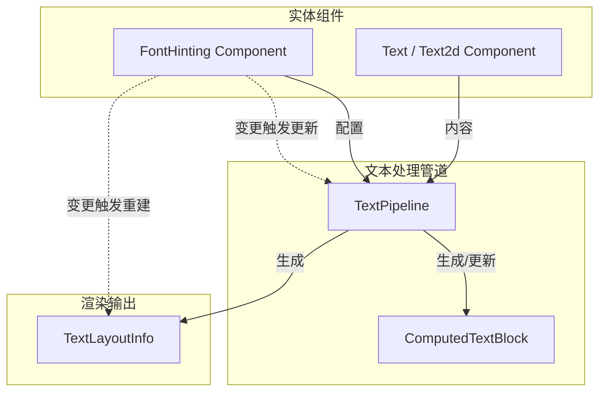

+++
title = "#22979 Font hinting fixes"
date = "2026-02-17T00:00:00"
draft = false
template = "pull_request_page.html"
in_search_index = false

[extra]
current_language = "zh-cn"
available_languages = {"en" = { name = "English", url = "/pull_request/bevy/2026-02/pr-22979-en-20260217" }, "zh-cn" = { name = "中文", url = "/pull_request/bevy/2026-02/pr-22979-zh-cn-20260217" }}
+++

# Font hinting fixes

## 基本信息
- **标题**: Font hinting fixes
- **PR链接**: https://github.com/bevyengine/bevy/pull/22979
- **作者**: ickshonpe
- **状态**: 已合并
- **标签**: C-Bug, A-Rendering, A-UI, S-Ready-For-Final-Review, P-Regression, A-Text, D-Straightforward, M-Deliberate-Rendering-Change
- **创建时间**: 2026-02-16T11:57:02Z
- **合并时间**: 2026-02-17T03:14:41Z
- **合并者**: alice-i-cecile

## 描述翻译

这是对parley迁移PR #22879的后续修复，解决了几个字体提示（font hinting）问题：
1. `ComputedTextBlock` 上的 `font_hinting` 字段是冗余的。
2. UI文本应默认启用提示（之前由于cosmic text实现中的一个bug而被禁用）。
3. 提示应仅应用于抗锯齿（antialiased）文本。
4. 提示设置的更改不应触发文本重排（reshaping）。
5. 当提示设置改变时，需要重新生成`TextLayoutInfo`。

### 解决方案
1. 从 `ComputedTextBlock` 中移除冗余的 `font_hinting` 字段。
2. 为UI的 `Text` 默认启用提示，因为UI文本通常是像素对齐的。
3. 在 `update_text_layout_info` 中，仅对抗锯齿文本部分应用提示。修复了问题 #22977。
4. 当 `FontHinting` 组件改变时，`Text` 和 `Text2d` 的文本不再触发重排。
5. 当 `FontHinting` 组件改变时，`Text` 和 `Text2d` 实体的 `TextLayoutInfo` 会被重新生成。

## 此拉取请求的故事

这个PR是Bevy渲染管线中文本处理模块的一次精确调整，主要围绕字体提示（font hinting）的逻辑进行修复和优化。整个故事源于一个底层的依赖库变更：项目从旧的文本布局库迁移到了新的Parley库（PR #22879）。在这次迁移后，一些关于字体提示的预期行为出现了偏差。

问题的核心在于字体提示的实现细节。字体提示是一项用于在低分辨率显示器上改善小号字体可读性的技术，它通过微调字形（glyph）的轮廓来更好地对齐像素网格。然而，并非所有渲染模式都适合应用提示，尤其是在使用次像素抗锯齿等高级平滑技术时。迁移后，Bevy的文本系统在几个关键点上处理不当：首先，UI文本错误地默认禁用了提示，这与UI文本通常需要像素级精确对齐的常规做法相悖。其次，系统试图对所有文本（包括非抗锯齿文本）应用提示，这可能导致不必要的计算甚至渲染瑕疵。此外，数据流中存在冗余字段，并且提示设置的变更触发了过于昂贵的文本重排操作。

开发者采取的解决方案直接且高效，通过五个紧密关联的修改点来解决问题。

首先，他们移除了数据冗余。`ComputedTextBlock` 结构体原本存储了一个 `font_hinting` 字段。然而，提示设置实际上是通过 `FontHinting` 组件来管理和传递的。在渲染管线中，`FontHinting` 组件被直接传递给处理函数。因此，在 `ComputedTextBlock` 中重复存储此信息不仅是冗余的，还导致了数据同步的复杂性。清理这个字段简化了数据结构，是代码健康度的一个良好实践。这一修改体现在 `bevy_text/src/text.rs` 中，该字段从结构体定义、`Debug` 实现和 `Default` 实现中被彻底移除。

```rust
// File: crates/bevy_text/src/text.rs
// 修改前片段:
pub struct ComputedTextBlock {
    // ...
    pub(crate) font_hinting: FontHinting,
}

impl Default for ComputedTextBlock {
    fn default() -> Self {
        Self {
            // ...
            font_hinting: FontHinting::Disabled,
        }
    }
}

// 修改后:
pub struct ComputedTextBlock {
    // ... (font_hinting 字段被移除)
}

impl Default for ComputedTextBlock {
    fn default() -> Self {
        Self {
            needs_rerender: true,
            uses_rem_sizes: false,
            uses_viewport_sizes: false,
            // font_hinting 字段初始化被移除
        }
    }
}
```

其次，他们修正了UI文本的默认行为。在 `bevy_ui/src/widget/text.rs` 中，`Text` 组件通过 `#[text_pipeline]` 属性进行配置。之前由于对底层库行为的误判，注释声称“启用提示有时会略微错误计算文本边界”，因此默认禁用了提示。修复方案是将默认值从 `FontHinting::Disabled` 改为 `FontHinting::Enabled`，因为UI文本的定位通常依赖像素网格对齐，启用提示是正确的选择。

第三项也是技术上的核心修改，是确保提示逻辑仅在正确的渲染条件下生效。这个逻辑被嵌入到 `bevy_text/src/pipeline.rs` 的 `update_text_layout_info` 函数中。修改的关键在于渲染字形（glyph）的那一刻。之前，提示的启用与否仅由 `hinting` 参数决定。现在，代码增加了一个条件检查：只有在提示功能被启用 **并且** 字体的平滑模式为 `FontSmoothing::AntiAliased` 时，才会应用提示。

```rust
// File: crates/bevy_text/src/pipeline.rs
// 修改后逻辑:
let hint = hinting.should_hint() && font_smoothing == FontSmoothing::AntiAliased;
let mut scaler = scale_cx
    .0
    .builder(font_ref)
    .size(font_size)
    .hint(hint) // 条件性地应用提示
    .build();
```

这一改动解决了问题 #22977，并符合图形学的通用实践：像次像素渲染这样的高级抗锯齿技术已经包含了类似提示的调整，额外应用传统的栅格化提示可能会导致冲突和视觉瑕疵。

最后两项修改针对性能优化，调整了Bevy的EC（Entity-Component）系统的变更检测（change detection）逻辑。目标是减少不必要的计算。之前，当 `FontHinting` 组件发生变化时，系统会将其视为文本内容变化，从而触发代价高昂的文本“重排”（reshaping，涉及字形选择和定位）。然而，提示设置本身并不影响文本的布局几何形状（如换行、对齐），它只影响字形在最终栅格化时的微调。因此，触发重排是过度反应。

修改分别在 `bevy_sprite/src/text2d.rs` 和 `bevy_ui/src/widget/text.rs` 中进行。以 `text2d.rs` 为例，逻辑被重组：

```rust
// File: crates/bevy_sprite/src/text2d.rs
// 修改前:
let text_changed = ... || hinting.is_changed() || ...;
if !(text_changed || bounds.is_changed()) { continue; }

// 修改后:
let text_changed = ... /* hinting.is_changed() 被移除 */ || ...;
if !(text_changed || bounds.is_changed() || hinting.is_changed()) { continue; }
```

通过将 `hinting.is_changed()` 从触发重排的条件 (`text_changed`) 中移除，但保留在决定是否继续执行布局更新流程的总条件中，系统达成了一种平衡：提示变化不再触发重排，但仍会触发后续的 `TextLayoutInfo` 重新生成。`TextLayoutInfo` 包含了文本的实际位置和大小，这些信息会因字形轮廓的微调（即提示的应用）而略有变化，因此重新生成是必要的。在UI系统中也应用了类似的逻辑，确保 `text_system` 在检测到 `hinting.is_changed()` 时重新计算布局信息。

总结来说，这个PR通过一系列精细的、目标明确的改动，修复了文本渲染管道中的一个回归性bug，并优化了相关性能。它展示了在游戏引擎这类复杂系统中进行底层依赖升级后，进行细致验证和微调的重要性。同时，它也体现了良好的软件设计原则：消除数据冗余、根据渲染技术特性精确控制功能开关、以及通过理解不同操作的成本来优化变更检测逻辑。

## 视觉呈现



## 关键文件变更

1. **`crates/bevy_text/src/text.rs`**
   - **变更描述**: 移除了 `ComputedTextBlock` 结构体中冗余的 `font_hinting` 字段。这简化了数据结构，因为提示信息通过 `FontHinting` 组件直接传递，无需重复存储。
   - **代码差异**:
     ```rust
     // 字段从结构体定义中移除
     // pub(crate) font_hinting: FontHinting,

     // 从 Debug trait 实现中移除
     // .field("font_hinting", &self.font_hinting)

     // 从 Default trait 实现中移除
     // font_hinting: FontHinting::Disabled,
     ```
   - **与PR目的关系**: 这是解决方案的第一点，旨在消除冗余状态，保持数据源的单一性。

2. **`crates/bevy_text/src/pipeline.rs`**
   - **变更描述**: 修改了 `update_text_layout_info` 函数，使其不再接收 `hinting` 参数，也不再设置 `computed.font_hinting`。核心逻辑改为仅在 `hinting` 启用且 `font_smoothing` 为 `AntiAliased` 时应用提示。
   - **代码差异**:
     ```rust
     // 函数签名移除 hinting 参数
     // hinting: FontHinting,
     // 函数体内不再设置 computed.font_hinting
     // computed.font_hinting = hinting;

     // 条件性应用提示的逻辑
     // let hint = hinting.should_hint() && font_smoothing == FontSmoothing::AntiAliased;
     ```
   - **与PR目的关系**: 实现了解决方案的第1、3、5点。它移除了对冗余字段的依赖，确保提示只应用于抗锯齿文本，并且在提示设置变化时，通过调用此函数来重新生成布局信息。

3. **`crates/bevy_ui/src/widget/text.rs`**
   - **变更描述**: 1) 将 `Text` 组件的默认 `FontHinting` 从 `Disabled` 改为 `Enabled`。2) 调整了变更检测逻辑，使 `FontHinting` 的变化不再触发 `measure_text_system` 中的跳过逻辑，但会触发 `text_system` 中的重新计算。
   - **代码差异**:
     ```rust
     // 默认提示设置更改
     // - FontHinting::Disabled
     // + FontHinting::Enabled

     // 在 measure_text_system 查询中移除对 hinting 的引用
     // 并移除 hinting.is_changed() 作为 continue 的条件

     // 在 text_system 中，将 &FontHinting 改为 Ref<FontHinting>
     // 并将 hinting.is_changed() 加入重新计算的条件
     ```
   - **与PR目的关系**: 实现了解决方案的第2点和第4点。默认启用UI提示，并优化了提示变化时的处理流程，避免不必要的重排但确保视觉更新。

4. **`crates/bevy_sprite/src/text2d.rs`**
   - **变更描述**: 重构了 `update_text2d_layout` 系统中的变更检测逻辑。将 `hinting.is_changed()` 从触发文本重排的条件中移除，但仍将其保留为触发整体布局更新流程的条件之一。
   - **代码差异**:
     ```rust
     // let text_changed = ... || hinting.is_changed() || ...; // 移除
     // if !(text_changed || bounds.is_changed()) { continue; } // 旧条件

     // if !(text_changed || bounds.is_changed() || hinting.is_changed()) { continue; } // 新条件
     ```
   - **与PR目的关系**: 实现了解决方案的第4点和第5点。确保 `Text2d` 实体在提示变化时不会重排文本，但会重新生成布局信息。

## 扩展阅读

1. **相关PR**: [PR #22879](https://github.com/bevyengine/bevy/pull/22879) - 将文本布局迁移到 `parley` 库的原始PR，本次修复的上下文。
2. **Bevy 文档 - 变更检测**: 了解Bevy ECS中 `is_changed()`、`is_added()` 等的工作原理，有助于理解本PR中的性能优化策略。
3. **字体提示（Font Hinting）**: 可以搜索关于“字体栅格化”、“灰度抗锯齿 vs 次像素抗锯齿”的图形学资料，深入理解为何提示仅适用于特定抗锯齿模式。
4. **Parley 库**: 查看 [parley](https://github.com/dfrg/parley) 项目的文档或源码，了解Bevy文本布局的新基础。