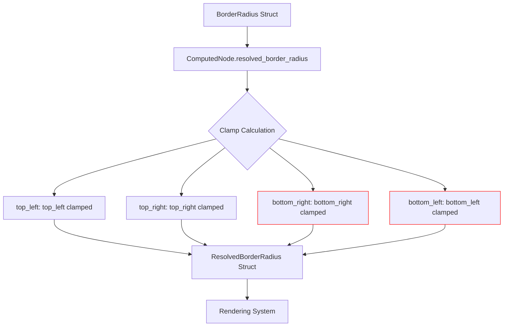

+++
title = "#22980 fix: ResolvedBorderRadius left -> right, right -> left"
date = "2026-02-16T00:00:00"
draft = false
template = "pull_request_page.html"
in_search_index = true

[taxonomies]
list_display = ["show"]

[extra]
current_language = "en"
available_languages = {"en" = { name = "English", url = "/pull_request/bevy/2026-02/pr-22980-en-20260216" }, "zh-cn" = { name = "中文", url = "/pull_request/bevy/2026-02/pr-22980-zh-cn-20260216" }}
labels = ["C-Bug", "A-UI", "M-Deliberate-Rendering-Change"]
+++

# Title

## Basic Information
- **Title**: fix: ResolvedBorderRadius left -> right, right -> left
- **PR Link**: https://github.com/bevyengine/bevy/pull/22980
- **Author**: cuiweixie
- **Status**: MERGED
- **Labels**: C-Bug, A-UI, S-Ready-For-Final-Review, M-Deliberate-Rendering-Change
- **Created**: 2026-02-16T13:31:14Z
- **Merged**: 2026-02-16T17:57:25Z
- **Merged By**: mockersf

## Description Translation
The PR description is already in English:

# Objective

fixes ResolvedBorderRadius calculation

## The Story of This Pull Request

This pull request fixes a straightforward but critical bug in Bevy's UI border radius calculation system. The issue was discovered during development when testing UI elements with asymmetric border radii - specifically, when the bottom-left and bottom-right corner radii were set to different values. The bug manifested as these corners being swapped in the actual rendered output: what should have been the bottom-right radius was applied to the bottom-left corner, and vice versa.

The problem originated in the `ComputedNode::resolved_border_radius()` method in `ui_node.rs`. This method is responsible for converting a `BorderRadius` struct (which stores the raw radius values for each corner) into a `ResolvedBorderRadius` struct (which clamps these values based on the node's size and border thickness). The bug was a simple variable swap in two lines of code, but it had noticeable visual consequences for any UI element with non-uniform border radii.

When examining the code, we can see the logical flow of the original implementation. The method takes the computed node's border radius values and applies clamping to ensure they don't exceed the available space. For the top corners, the code was correct:
- `top_left` used `self.border_radius.top_left`
- `top_right` used `self.border_radius.top_right`

However, for the bottom corners, the assignments were reversed:
- `bottom_right` incorrectly used `self.border_radius.bottom_left`
- `bottom_left` incorrectly used `self.border_radius.bottom_right`

This type of bug is common in symmetric data structures where fields have similar names and purposes. The developer likely made a copy-paste error or mental slip when writing the initial implementation. The fix is minimal but important - simply swapping the two assignments to match the correct field names.

The clamping function `clamp_corner` itself wasn't affected by this bug. It properly handles the mathematical constraints of border radii, ensuring that the sum of adjacent radii doesn't exceed the corresponding dimension of the node's rectangle. The bug was purely in the data routing - passing the wrong source values to the correct processing function.

From an architectural perspective, this fix maintains the existing design pattern where `ComputedNode` serves as an intermediate representation between the high-level UI components and the low-level rendering data. The `resolved_border_radius()` method acts as a transformation layer that applies constraints and produces render-ready values. The bug fix ensures this transformation preserves the intended corner assignments.

The impact of this fix is specific but important for UI consistency. Any UI element with different bottom-left and bottom-right border radii would have rendered incorrectly. This could affect visual design systems, theme implementations, or any game UI that uses rounded corners asymmetrically for aesthetic or functional purposes.

The fix was merged quickly (within about 4.5 hours of creation), indicating it was clearly correct and addressed a concrete bug. The labels applied (C-Bug, A-UI, M-Deliberate-Rendering-Change) accurately categorize this as a bug fix in the UI system that intentionally changes rendering behavior to correct the previous incorrect output.

## Visual Representation



The diagram shows the data flow through the border radius resolution process. The red highlights indicate where the bug occurred - the `bottom_right` and `bottom_left` assignments were swapped in their data sources.

## Key Files Changed

### `crates/bevy_ui/src/ui_node.rs`
This file contains the `ComputedNode` struct and its implementation, including the `resolved_border_radius()` method that was fixed.

**Change Description**: Fixed a variable assignment bug where bottom-left and bottom-right border radius values were swapped during the resolution process.

**Code Snippet**:
```rust
// Before the fix:
ResolvedBorderRadius {
    top_left: clamp_corner(self.border_radius.top_left, s, b.xy()),
    top_right: clamp_corner(self.border_radius.top_right, s, b.zy()),
    bottom_right: clamp_corner(self.border_radius.bottom_left, s, b.xw()),  // BUG: Using bottom_left
    bottom_left: clamp_corner(self.border_radius.bottom_right, s, b.zw()),  // BUG: Using bottom_right
}

// After the fix:
ResolvedBorderRadius {
    top_left: clamp_corner(self.border_radius.top_left, s, b.xy()),
    top_right: clamp_corner(self.border_radius.top_right, s, b.zy()),
    bottom_right: clamp_corner(self.border_radius.bottom_right, s, b.xw()),  // FIXED: Now using bottom_right
    bottom_left: clamp_corner(self.border_radius.bottom_left, s, b.zw()),    // FIXED: Now using bottom_left
}
```

**Relationship to PR Purpose**: This is the only change in the PR and directly addresses the bug described in the objective. The fix ensures that each corner's border radius value is correctly associated with its intended corner during the resolution process.

## Further Reading

1. **Bevy UI System Documentation**: For understanding how UI components are structured and rendered in Bevy
2. **Border Radius Clamping Algorithms**: For the mathematical principles behind constraining border radii to fit within element dimensions
3. **Common Anti-patterns in Data Transformation**: For understanding how similar bugs can be prevented through code review practices and testing strategies
4. **Rounded Rectangle Rendering Techniques**: For background on how border radii are implemented in rendering pipelines

# Full Code Diff
```
diff --git a/crates/bevy_ui/src/ui_node.rs b/crates/bevy_ui/src/ui_node.rs
index 4f672126e4800..685dd152541fa 100644
--- a/crates/bevy_ui/src/ui_node.rs
+++ b/crates/bevy_ui/src/ui_node.rs
@@ -201,8 +201,8 @@ impl ComputedNode {
         ResolvedBorderRadius {
             top_left: clamp_corner(self.border_radius.top_left, s, b.xy()),
             top_right: clamp_corner(self.border_radius.top_right, s, b.zy()),
-            bottom_right: clamp_corner(self.border_radius.bottom_left, s, b.xw()),
-            bottom_left: clamp_corner(self.border_radius.bottom_right, s, b.zw()),
+            bottom_right: clamp_corner(self.border_radius.bottom_right, s, b.xw()),
+            bottom_left: clamp_corner(self.border_radius.bottom_left, s, b.zw()),
         }
     }
 
```