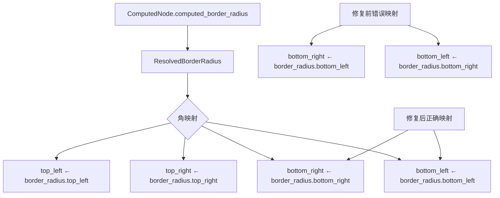

+++
title = "#22980 fix: ResolvedBorderRadius left -> right, right -> left"
date = "2026-02-16T00:00:00"
draft = false
template = "pull_request_page.html"
in_search_index = false

[extra]
current_language = "zh-cn"
available_languages = {"en" = { name = "English", url = "/pull_request/bevy/2026-02/pr-22980-en-20260216" }, "zh-cn" = { name = "中文", url = "/pull_request/bevy/2026-02/pr-22980-zh-cn-20260216" }}
+++

# fix: ResolvedBorderRadius left -> right, right -> left

## 基本信息
- **标题**: fix: ResolvedBorderRadius left -> right, right -> left
- **PR链接**: https://github.com/bevyengine/bevy/pull/22980
- **作者**: cuiweixie
- **状态**: 已合并
- **标签**: C-Bug, A-UI, S-Ready-For-Final-Review, M-Deliberate-Rendering-Change
- **创建时间**: 2026-02-16T13:31:14Z
- **合并时间**: 2026-02-16T17:57:25Z
- **合并者**: mockersf

## 描述翻译
### 目标
修复 ResolvedBorderRadius 的计算问题

## 本次PR的技术分析

这是一个非常直接的UI渲染bug修复。问题出现在Bevy引擎的UI系统中，具体在`ComputedNode`结构的`computed_border_radius`方法中。这个方法负责计算UI节点的解析后边框半径（ResolvedBorderRadius），用于渲染具有圆角的UI元素。

问题的本质是一个简单的赋值错误：在计算底部两个角的边框半径时，代码错误地将左下角的半径赋值给了右下角，而将右下角的半径赋值给了左下角。这种左右颠倒的错误会导致UI元素的圆角渲染不正确——右下角会显示左下角的圆角半径，左下角会显示右下角的圆角半径。

从技术角度看，`ResolvedBorderRadius`结构体有四个字段，分别对应四个角：`top_left`、`top_right`、`bottom_right`、`bottom_left`。在原始代码中，`bottom_right`字段被错误地赋值为`self.border_radius.bottom_left`的值，而`bottom_left`字段被错误地赋值为`self.border_radius.bottom_right`的值。这是一个典型的变量交换错误。

这个bug的影响是视觉上的：任何使用不同值设置左下角和右下角边框半径的UI元素都会显示错误的圆角。例如，如果开发者设置了`bottom_left: 10.0`和`bottom_right: 20.0`，实际渲染时左下角会是20px的圆角，右下角会是10px的圆角，这与预期相反。

修复方法非常简单：交换这两个赋值语句，使每个角获得正确的半径值。这是一个两行代码的修改，但非常重要，因为它确保了UI渲染的准确性。

从代码架构的角度看，这个bug位于UI节点的计算阶段。`ComputedNode`结构体包含了节点的计算属性，这些属性由样式系统计算得出，然后用于实际的渲染。`computed_border_radius`方法使用`clamp_corner`函数来确保边框半径值不会超过对应边的可用空间，这是防止圆角过度扩展的重要边界检查。

值得注意的是，这个bug只影响底部两个角，顶部两个角的计算是正确的。这表明可能是开发人员在编写或修改这部分代码时出现了疏忽。修复后，所有四个角都能获得正确的边框半径值，确保UI按照开发者的预期进行渲染。

## 视觉表示



## 关键文件变更

### `crates/bevy_ui/src/ui_node.rs` (+2/-2)

这个文件包含了`ComputedNode`结构的实现。修改发生在`computed_border_radius`方法中，修复了底部两个角边框半径的错误映射。

**代码变更：**

```rust
// 修复前：
ResolvedBorderRadius {
    top_left: clamp_corner(self.border_radius.top_left, s, b.xy()),
    top_right: clamp_corner(self.border_radius.top_right, s, b.zy()),
    bottom_right: clamp_corner(self.border_radius.bottom_left, s, b.xw()), // 错误：使用了bottom_left
    bottom_left: clamp_corner(self.border_radius.bottom_right, s, b.zw()), // 错误：使用了bottom_right
}

// 修复后：
ResolvedBorderRadius {
    top_left: clamp_corner(self.border_radius.top_left, s, b.xy()),
    top_right: clamp_corner(self.border_radius.top_right, s, b.zy()),
    bottom_right: clamp_corner(self.border_radius.bottom_right, s, b.xw()), // 正确：使用bottom_right
    bottom_left: clamp_corner(self.border_radius.bottom_left, s, b.zw()), // 正确：使用bottom_left
}
```

这个修改确保了：
1. `bottom_right`字段从`border_radius.bottom_right`获取值
2. `bottom_left`字段从`border_radius.bottom_left`获取值
3. 每个角都使用正确的源值进行边界检查（clamp_corner）

## 进一步阅读

1. **Bevy UI系统文档**：了解Bevy的UI组件和渲染系统
2. **CSS边框半径规范**：理解边框半径的工作原理和视觉影响
3. **几何约束在UI系统中的应用**：了解`clamp_corner`函数如何防止圆角超出可用空间
4. **Bevy的ECS架构**：理解`ComputedNode`如何融入Bevy的实体组件系统

---

# 完整代码差异
```
diff --git a/crates/bevy_ui/src/ui_node.rs b/crates/bevy_ui/src/ui_node.rs
index 4f672126e4800..685dd152541fa 100644
--- a/crates/bevy_ui/src/ui_node.rs
+++ b/crates/bevy_ui/src/ui_node.rs
@@ -201,8 +201,8 @@ impl ComputedNode {
         ResolvedBorderRadius {
             top_left: clamp_corner(self.border_radius.top_left, s, b.xy()),
             top_right: clamp_corner(self.border_radius.top_right, s, b.zy()),
-            bottom_right: clamp_corner(self.border_radius.bottom_left, s, b.xw()),
-            bottom_left: clamp_corner(self.border_radius.bottom_right, s, b.zw()),
+            bottom_right: clamp_corner(self.border_radius.bottom_right, s, b.xw()),
+            bottom_left: clamp_corner(self.border_radius.bottom_left, s, b.zw()),
         }
     }
 
```