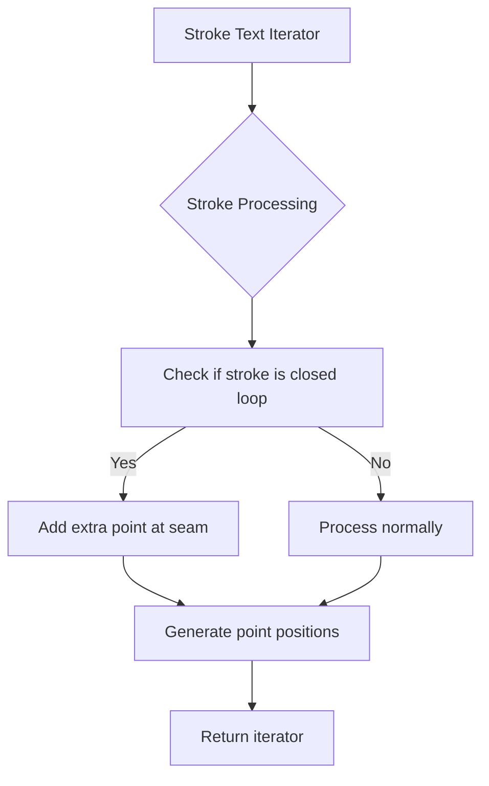

+++
title = "#22982 Loop seam fix for stroke text gizmos"
date = "2026-02-17T00:00:00"
draft = false
template = "pull_request_page.html"
in_search_index = true

[taxonomies]
list_display = ["show"]

[extra]
current_language = "en"
available_languages = {"en" = { name = "English", url = "/pull_request/bevy/2026-02/pr-22982-en-20260217" }, "zh-cn" = { name = "中文", url = "/pull_request/bevy/2026-02/pr-22982-zh-cn-20260217" }}
labels = ["A-Gizmos", "D-Straightforward", "C-Refinement"]
+++

# Title
Loop seam fix for stroke text gizmos

## Basic Information
- **Title**: Loop seam fix for stroke text gizmos
- **PR Link**: https://github.com/bevyengine/bevy/pull/22982
- **Author**: ickshonpe
- **Status**: MERGED
- **Labels**: S-Ready-For-Final-Review, A-Gizmos, D-Straightforward, C-Refinement
- **Created**: 2026-02-16T16:26:47Z
- **Merged**: 2026-02-17T02:49:51Z
- **Merged By**: alice-i-cecile

## Description Translation

# Objective

With text gizmos, loops leave a discontinuity at the seam:


## Solution

When a stroke forms a loop, queue an extra point to add a join at the seam:


## The Story of This Pull Request

The issue was a visual artifact in Bevy's text gizmo rendering system. When text characters contained closed loops in their stroke definitions, there would be a noticeable discontinuity or gap at the point where the stroke completed its loop. This problem was particularly visible in characters like "O" which have circular or oval shapes.

The root cause was in how stroke points were being processed. In the original implementation, when iterating through stroke points to render text gizmos, the system would process each stroke's points exactly as defined in the font data. For closed loops, this meant the last point connected back to the first point, but without an explicit join operation at that seam, rendering engines could leave a small gap.

The solution modifies the stroke iterator to detect when a stroke forms a closed loop and adds an extra point at the seam. The key insight is that by duplicating the second point of the loop at the end of the stroke sequence, the rendering system will create a proper join between the end and beginning of the loop, eliminating the visual discontinuity.

Looking at the code changes, the implementation approach is straightforward. The original code had nested loops - an outer loop for characters and an inner loop for strokes within each character. The refactored code simplifies the control flow by removing one level of nesting and adding the loop detection logic.

The critical change is this check:
```rust
let join = (self.font.positions[stroke.start]
    == self.font.positions[stroke.end - 1])
    .then_some(stroke.start + 1);
```

This checks if the first and last points of the stroke are at the same position (indicating a closed loop). If they are, it returns the index of the second point (stroke.start + 1) to be added to the stroke point sequence.

The implementation then uses `stroke.chain(join.into_iter())` to append this extra point to the stroke's point iterator. This causes the stroke to have one additional point at the end that's actually the second point of the original stroke, creating the necessary overlap for a seamless join.

From an architectural perspective, this change is minimal and focused. It doesn't alter the overall structure of the text rendering system or add significant complexity. The solution is localized to the point iteration logic, making it easy to understand and maintain.

One interesting aspect is the use of Rust's `then_some()` method with the `bool` type, which is a concise way to conditionally create an `Option` value. This is more readable than an explicit `if` statement for this particular pattern.

The impact of this change is purely visual - it fixes rendering artifacts in text gizmos without affecting performance in any meaningful way. The additional point per closed loop stroke adds negligible overhead while solving a clear visual defect.

## Visual Representation



## Key Files Changed

### `crates/bevy_gizmos/src/stroke_text.rs` (+17/-14)

This file contains the `StrokeTextLayout` struct implementation. The changes modify the iterator that generates points for text strokes, specifically to handle closed loops properly.

**Key changes:**

1. **Control flow simplification**: The original nested loop structure was refactored to flatten the control flow, making the code more linear and easier to follow.

2. **Loop detection logic**: Added logic to detect when a stroke forms a closed loop by comparing the first and last points.

3. **Extra point insertion**: When a closed loop is detected, an extra point (the second point of the stroke) is appended to create a proper join at the seam.

**Code diff highlights:**

```rust
// Before:
if !current_strokes.is_empty() {
    for stroke_index in current_strokes.by_ref() {
        let stroke = self.font.strokes[stroke_index].clone();
        if stroke.len() < 2 {
            continue;
        }

        return Some(stroke.map(move |index| {
            let [p, q] = self.font.positions[index];
            Vec2::new(
                current_x + self.scale * p as f32,
                y - self.scale * (self.font.cap_height - q as f32),
            )
        }));
    }
}

// After:
for stroke_index in current_strokes.by_ref() {
    let stroke = self.font.strokes[stroke_index].clone();
    if stroke.len() < 2 {
        continue;
    }

    // If this stroke is a closed loop, append one extra point to add a join at the seam.
    let join = (self.font.positions[stroke.start]
        == self.font.positions[stroke.end - 1])
        .then_some(stroke.start + 1);

    return Some(stroke.chain(join.into_iter()).map(move |index| {
        let [p, q] = self.font.positions[index];
        Vec2::new(
            current_x + self.scale * p as f32,
            y - self.scale * (self.font.cap_height - q as f32),
        )
    }));
}
```

The main differences are:
- Removal of the outer `if !current_strokes.is_empty()` check (the inner `for` loop handles emptiness)
- Addition of the `join` variable that conditionally contains an extra point index for closed loops
- Use of `stroke.chain(join.into_iter())` to append the extra point when needed

## Further Reading

1. **Bevy Gizmos Documentation**: For understanding how gizmos work in Bevy's rendering system
2. **Vector Graphics Stroke Joins**: Information about stroke join types (miter, round, bevel) in vector graphics
3. **Rust Iterator Adapters**: Documentation on `chain()`, `map()`, and other iterator methods used in this implementation
4. **Font Rendering Techniques**: Background on how font outlines are converted to rendered strokes