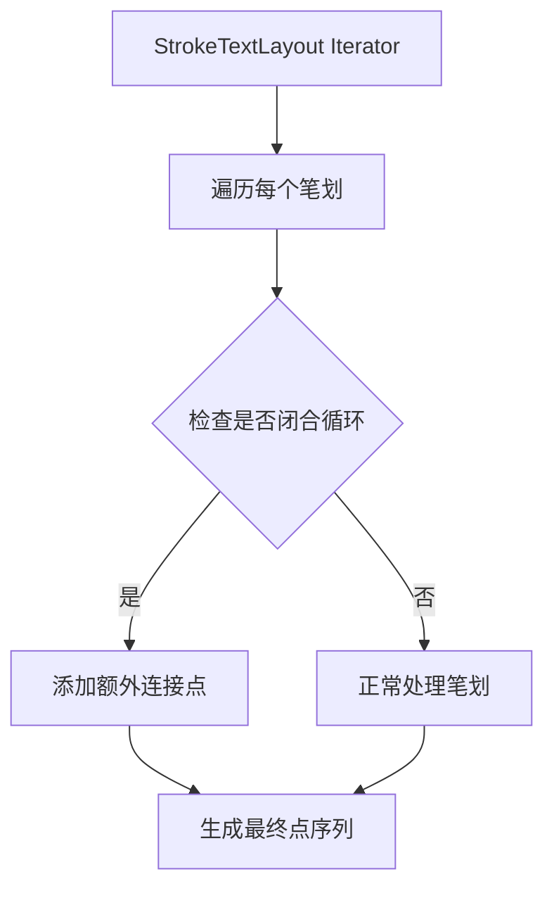

+++
title = "#22982 Loop seam fix for stroke text gizmos"
date = "2026-02-17T00:00:00"
draft = false
template = "pull_request_page.html"
in_search_index = false

[extra]
current_language = "zh-cn"
available_languages = {"en" = { name = "English", url = "/pull_request/bevy/2026-02/pr-22982-en-20260217" }, "zh-cn" = { name = "中文", url = "/pull_request/bevy/2026-02/pr-22982-zh-cn-20260217" }}
+++

# Loop seam fix for stroke text gizmos

## 基本信息
- **标题**: Loop seam fix for stroke text gizmos
- **PR链接**: https://github.com/bevyengine/bevy/pull/22982
- **作者**: ickshonpe
- **状态**: 已合并
- **标签**: S-Ready-For-Final-Review, A-Gizmos, D-Straightforward, C-Refinement
- **创建时间**: 2026-02-16T16:26:47Z
- **合并时间**: 2026-02-17T02:49:51Z
- **合并者**: alice-i-cecile

## 描述翻译

### 目标

使用文本gizmos时，循环图形在接缝处会出现不连续：


### 解决方案

当描边形成一个循环时，额外添加一个点来在接缝处创建连接：


## 本次PR的技术分析

这个PR解决了一个在Bevy引擎的文本gizmos渲染中出现的视觉瑕疵问题。当使用描边文本gizmos绘制闭合图形（如字母"O"）时，路径的起始点和结束点连接处会出现一个可见的间断，这是因为渲染器没有正确处理循环路径的接缝连接。

问题的核心在于当前的描边生成算法将每个笔划视为独立的线段序列。对于闭合路径，虽然起点和终点在几何上是相同的点，但渲染器在处理最后一个线段时没有考虑到需要与第一个线段平滑连接。这导致了视觉上的不连续，特别是在使用较粗描边或特定渲染风格时更为明显。

开发者采用了一个直接而有效的解决方案：当检测到一个笔划形成闭合循环时，在路径末尾额外添加一个点。具体来说，添加的是路径的第二个点。这个做法在计算机图形学中是常见的技巧，通过重复路径上的一个点来"关闭"循环，确保渲染器在处理接缝时能够应用正确的连接样式（join style）。

从实现角度看，修改集中在`StrokeTextLayout`迭代器的实现中。原有的代码结构包含两层循环：外层检查`current_strokes`是否为空，内层遍历每个笔划。修改后，代码结构被简化，移除了冗余的空检查，直接遍历笔划序列。

关键的技术改进在于检测循环条件并添加额外点。代码通过比较笔划起点和终点的位置是否相等来判断是否形成循环。如果相等，则使用`chain`方法将原始笔划迭代器与一个包含额外点的迭代器连接起来。这里使用了`then_some`方法，这是Rust中条件表达式的一种简洁写法，等价于`if condition { Some(value) } else { None }`。

这个修复有几个技术优点：首先，它只影响闭合路径，对开放路径没有性能影响；其次，添加的额外点数量最少（仅一个点），对内存和计算开销几乎可以忽略；最后，解决方案完全在渲染管线的前期处理阶段完成，不涉及底层图形API的修改。

从工程角度看，这个PR展示了良好的问题定位和精准修复。开发者没有过度设计解决方案，而是针对具体问题提供了最小化的修复。代码的可读性也得到了改善，通过移除冗余的条件判断和简化控制流，使逻辑更加清晰。

需要注意的是，这个修复假设字体数据中闭合路径的起点和终点位置完全相同。这在大多数矢量字体格式中是标准做法，但理论上存在某些字体可能使用近似但不完全相等的坐标表示闭合路径。不过，考虑到字体通常使用整数坐标和精确的几何定义，这种假设在实践中是安全的。

## 可视化关系



## 关键文件更改

### `crates/bevy_gizmos/src/stroke_text.rs` (+17/-14)

这个文件包含了文本gizmos描边渲染的核心逻辑。修改主要针对笔划迭代器的实现，解决了闭合路径接缝处的视觉间断问题。

**修改前**：
```rust
if !current_strokes.is_empty() {
    for stroke_index in current_strokes.by_ref() {
        let stroke = self.font.strokes[stroke_index].clone();
        if stroke.len() < 2 {
            continue;
        }

        return Some(stroke.map(move |index| {
            let [p, q] = self.font.positions[index];
            Vec2::new(
                current_x + self.scale * p as f32,
                y - self.scale * (self.font.cap_height - q as f32),
            )
        }));
    }
}
```

**修改后**：
```rust
for stroke_index in current_strokes.by_ref() {
    let stroke = self.font.strokes[stroke_index].clone();
    if stroke.len() < 2 {
        continue;
    }

    // If this stroke is a closed loop, append one extra point to add a join at the seam.
    let join = (self.font.positions[stroke.start]
        == self.font.positions[stroke.end - 1])
        .then_some(stroke.start + 1);

    return Some(stroke.chain(join.into_iter()).map(move |index| {
        let [p, q] = self.font.positions[index];
        Vec2::new(
            current_x + self.scale * p as f32,
            y - self.scale * (self.font.cap_height - q as f32),
        )
    }));
}
```

主要变化：
1. 移除了对`current_strokes.is_empty()`的冗余检查，简化了控制流
2. 添加了循环检测逻辑：比较笔划起点(`stroke.start`)和终点(`stroke.end - 1`)的位置
3. 对于闭合循环，使用`chain`方法在笔划点序列后添加一个额外点（起点的下一个点）
4. 使用`then_some`方法使条件表达式更简洁

这些修改确保了闭合路径在渲染时能够正确连接，消除了接缝处的视觉间断，同时保持了代码的简洁性和高效性。

## 扩展阅读

1. **Bevy Gizmos文档**: https://docs.rs/bevy_gizmos/latest/bevy_gizmos/
2. **矢量图形路径渲染原理**: 了解贝塞尔曲线、路径连接和端点样式的处理方式
3. **Rust迭代器组合器**: `chain`、`then_some`等方法的详细用法和性能特性
4. **计算机图形学中的抗锯齿技术**: 了解如何处理几何边缘的视觉瑕疵

# Full Code Diff
diff --git a/crates/bevy_gizmos/src/stroke_text.rs b/crates/bevy_gizmos/src/stroke_text.rs
index 7801dca9c868d..255e6ae1d648e 100644
--- a/crates/bevy_gizmos/src/stroke_text.rs
+++ b/crates/bevy_gizmos/src/stroke_text.rs
@@ -116,21 +116,24 @@ impl<'a> StrokeTextLayout<'a> {
         let mut current_x = 0.0;
 
         core::iter::from_fn(move || loop {
-            if !current_strokes.is_empty() {
-                for stroke_index in current_strokes.by_ref() {
-                    let stroke = self.font.strokes[stroke_index].clone();
-                    if stroke.len() < 2 {
-                        continue;
-                    }
-
-                    return Some(stroke.map(move |index| {
-                        let [p, q] = self.font.positions[index];
-                        Vec2::new(
-                            current_x + self.scale * p as f32,
-                            y - self.scale * (self.font.cap_height - q as f32),
-                        )
-                    }));
+            for stroke_index in current_strokes.by_ref() {
+                let stroke = self.font.strokes[stroke_index].clone();
+                if stroke.len() < 2 {
+                    continue;
                 }
+
+                // If this stroke is a closed loop, append one extra point to add a join at the seam.
+                let join = (self.font.positions[stroke.start]
+                    == self.font.positions[stroke.end - 1])
+                    .then_some(stroke.start + 1);
+
+                return Some(stroke.chain(join.into_iter()).map(move |index| {
+                    let [p, q] = self.font.positions[index];
+                    Vec2::new(
+                        current_x + self.scale * p as f32,
+                        y - self.scale * (self.font.cap_height - q as f32),
+                    )
+                }));
             }
 
             let c = chars.next()?;