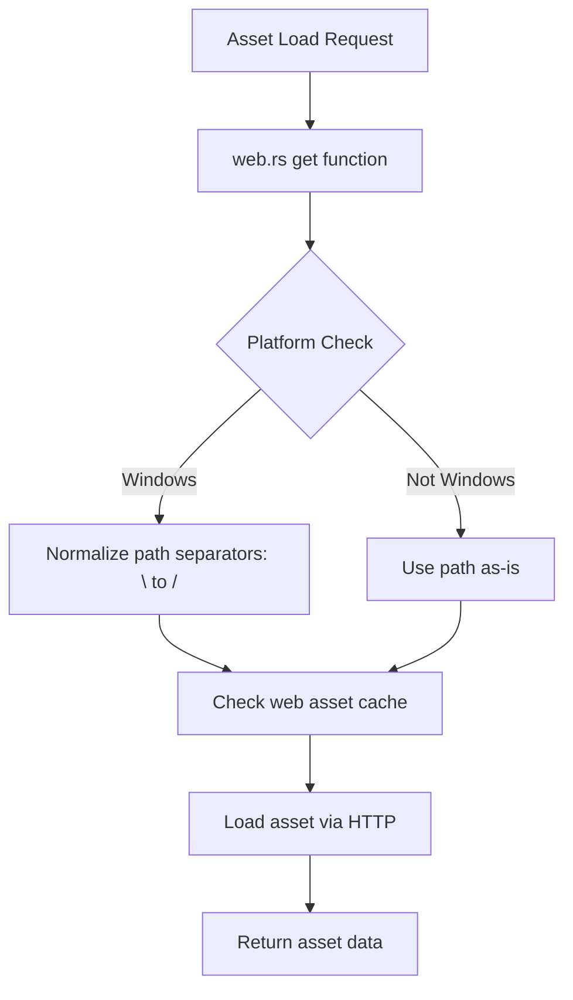

+++
title = "#22983 Fix web assets path on windows"
date = "2026-02-16T00:00:00"
draft = false
template = "pull_request_page.html"
in_search_index = true

[taxonomies]
list_display = ["show"]

[extra]
current_language = "en"
available_languages = {"en" = { name = "English", url = "/pull_request/bevy/2026-02/pr-22983-en-20260216" }, "zh-cn" = { name = "中文", url = "/pull_request/bevy/2026-02/pr-22983-zh-cn-20260216" }}
labels = ["D-Trivial", "A-Assets", "O-Windows"]
+++

# Title
Fix web assets path on windows

## Basic Information
- **Title**: Fix web assets path on windows
- **PR Link**: https://github.com/bevyengine/bevy/pull/22983
- **Author**: IceSentry
- **Status**: MERGED
- **Labels**: D-Trivial, A-Assets, O-Windows, S-Ready-For-Final-Review
- **Created**: 2026-02-16T16:58:04Z
- **Merged**: 2026-02-16T19:24:39Z
- **Merged By**: mockersf

## Description Translation
# Objective

- Web assets sometimes fail on windows because it can end up with mixed forward and back slashes.

## Solution

- Normalize the path to always use forward slash

## Testing

- I tested it with bevy_city from #22973 and it fixed all the web assets issue I had

## The Story of This Pull Request

This PR addresses a specific cross-platform compatibility issue in the Bevy game engine's asset loading system when targeting web platforms from Windows. The problem occurs because Windows uses backslashes (`\`) as path separators, while web URLs and some web APIs expect forward slashes (`/`). When Bevy constructs asset paths on Windows for web targets, it could produce mixed or incorrect path separators, causing asset loading failures.

The issue was identified when testing the `bevy_city` example (PR #22973) on Windows for web deployment. The developer found that web assets were failing to load due to path separator inconsistencies. This is a common problem in cross-platform development where file system paths need to be converted to URL paths for web environments.

The solution is straightforward and minimal: add path normalization for Windows when building for web targets. The implementation adds three lines of code in the `crates/bevy_asset/src/io/web.rs` file. The key insight is that we only need this normalization on Windows (`#[cfg(target_os = "windows")]`), and we use Rust's standard library constant `std::path::MAIN_SEPARATOR` to identify the platform-specific separator and replace it with forward slashes.

The fix is applied in the `get` function, which is responsible for reading assets in web environments. This function takes a `PathBuf` and converts it to a string path for use with web APIs. On Windows, after this conversion, we normalize the separators before the path is used for cache lookups or HTTP requests.

The implementation is efficient because:
1. It only runs on Windows (no overhead on other platforms)
2. It uses a simple string replacement operation
3. It happens early in the asset loading pipeline, ensuring consistent paths throughout

This fix demonstrates good cross-platform programming practices: addressing platform-specific issues with targeted conditional compilation, using standard library constants for platform detection, and making minimal changes to solve the problem without introducing unnecessary complexity.

## Visual Representation



## Key Files Changed

**File: `crates/bevy_asset/src/io/web.rs`**

This file contains the web-specific implementation of Bevy's asset I/O system. The change adds Windows-specific path normalization to ensure consistent forward slashes in web asset paths.

**Change Details:**
The modification adds a conditional compilation block that only runs on Windows. It replaces the platform-specific main separator with forward slashes in the string representation of the asset path.

```rust
// Before (lines around the change):
async fn get(path: PathBuf) -> Result<Box<dyn Reader>, AssetReaderError> {
    let str_path = path.to_str().ok_or_else(|| {
        AssetReaderError::NotFound(PathBuf::from(
            "Could not convert path to a valid UTF-8 string",
        ))
    })?;

    #[cfg(all(not(target_arch = "wasm32"), feature = "web_asset_cache"))]
    if let Some(data) = web_asset_cache::try_load_from_cache(str_path).await? {
        return Ok(Box::new(VecReader::new(data)));
    }

// After:
async fn get(path: PathBuf) -> Result<Box<dyn Reader>, AssetReaderError> {
    let str_path = path.to_str().ok_or_else(|| {
        AssetReaderError::NotFound(PathBuf::from(
            "Could not convert path to a valid UTF-8 string",
        ))
    })?;

    #[cfg(target_os = "windows")]
    let str_path = &str_path.replace(std::path::MAIN_SEPARATOR, "/");

    #[cfg(all(not(target_arch = "wasm32"), feature = "web_asset_cache"))]
    if let Some(data) = web_asset_cache::try_load_from_cache(str_path).await? {
        return Ok(Box::new(VecReader::new(data)));
    }
```

**Why this change works:**
1. On Windows, `std::path::MAIN_SEPARATOR` is `\`, so the replacement converts all backslashes to forward slashes
2. The normalization happens after converting the `PathBuf` to a string but before using it for cache lookups or HTTP requests
3. This ensures that all subsequent code receives a consistently formatted path

## Further Reading

1. **Rust Conditional Compilation**: The `#[cfg(...)]` attribute used for platform-specific code
   - Rust Book: https://doc.rust-lang.org/reference/conditional-compilation.html

2. **Bevy Asset System**: Understanding how Bevy handles asset loading across different platforms
   - Bevy Assets Guide: https://bevyengine.org/learn/books/assets/

3. **Cross-platform Path Handling**: Common challenges and patterns for handling file paths across different operating systems
   - Rust `std::path` module: https://doc.rust-lang.org/std/path/index.html

4. **WebAssembly and File Systems**: How web applications handle file paths differently from native applications
   - MDN Web Docs: https://developer.mozilla.org/en-US/docs/WebAssembly

5. **Related Bevy PR #22973**: The `bevy_city` example that helped identify this issue
   - PR Link: https://github.com/bevyengine/bevy/pull/22973