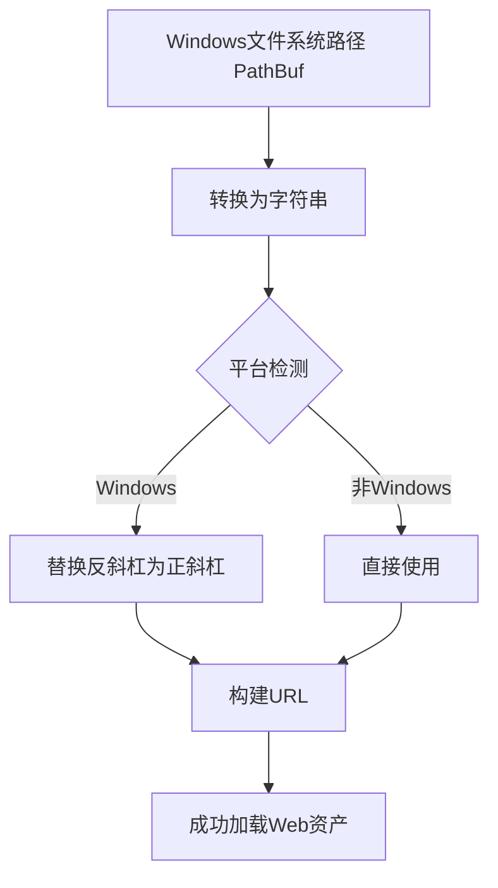

+++
title = "#22983 Fix web assets path on windows"
date = "2026-02-16T00:00:00"
draft = false
template = "pull_request_page.html"
in_search_index = false

[extra]
current_language = "zh-cn"
available_languages = {"en" = { name = "English", url = "/pull_request/bevy/2026-02/pr-22983-en-20260216" }, "zh-cn" = { name = "中文", url = "/pull_request/bevy/2026-02/pr-22983-zh-cn-20260216" }}
+++

# Title

## 基本信息
- **标题**: Fix web assets path on windows
- **PR链接**: https://github.com/bevyengine/bevy/pull/22983
- **作者**: IceSentry
- **状态**: 已合并
- **标签**: D-Trivial, A-Assets, O-Windows, S-Ready-For-Final-Review
- **创建时间**: 2026-02-16T16:58:04Z
- **合并时间**: 2026-02-16T19:24:39Z
- **合并者**: mockersf

## 描述翻译
Windows 系统上的 web 资产有时会失败，因为路径可能同时包含正斜杠和反斜杠。

解决方案：
- 将路径规范化，始终使用正斜杠

测试：
- 使用 #22973 中的 bevy_city 进行测试，修复了所有遇到的 web 资产问题

## 本次 PR 的技术分析

这个 PR 解决了 Windows 平台上 Bevy 引擎 web 资产加载的一个特定问题。问题本质上是平台间文件路径表示的差异导致的兼容性问题。

在 Windows 系统上，文件系统路径使用反斜杠（`\`）作为分隔符，而 web URL 使用正斜杠（`/`）。当 Bevy 在 WebAssembly 环境中运行（例如通过 wasm 构建部署到浏览器）时，资产加载需要将文件系统路径转换为 URL 路径。如果路径字符串中混用了两种分隔符，就会导致 URL 解析失败。

具体来看，问题出现在 `crates/bevy_asset/src/io/web.rs` 文件的 `get` 函数中。这个函数负责异步读取资产，接收一个 `PathBuf` 参数，需要将其转换为字符串路径用于构建 URL。在 Windows 上，当 `PathBuf` 转换为字符串时，分隔符会被保留为反斜杠，这会与 web URL 的路径结构冲突。

解决方案非常简单但针对性强：仅在 Windows 目标平台下，在将路径转换为字符串后，使用 `std::path::MAIN_SEPARATOR` 获取当前平台的主分隔符，然后将其替换为正斜杠。这种条件编译确保了解决方案只在需要时应用，避免影响其他平台。

```rust
#[cfg(target_os = "windows")]
let str_path = &str_path.replace(std::path::MAIN_SEPARATOR, "/");
```

这个改动有几个技术细节值得注意：

1. **条件编译**：使用 `#[cfg(target_os = "windows")]` 属性确保代码只在 Windows 平台编译，这保持了跨平台代码的整洁性。

2. **使用标准库常量**：`std::path::MAIN_SEPARATOR` 是 Rust 标准库提供的常量，表示当前平台的主路径分隔符。在 Windows 上是 `\`，在 Unix-like 系统上是 `/`。使用这个常量而不是硬编码 `\` 更符合 Rust 的惯用写法。

3. **替换操作的位置**：替换操作发生在路径已经转换为字符串之后，但在使用该字符串构建 URL 之前。这是正确的位置，因为此时我们需要修改的是用于 URL 的字符串表示，而不是原始的 `PathBuf`。

这个 PR 的技术难度被标记为 "Trivial"（简单），这很准确，因为解决方案只有三行代码。然而，识别这个问题的根本原因需要理解跨平台开发的细微差别：文件系统路径与 URL 路径的不同约定。

从架构角度看，这个修复位于资产 I/O 层的 web 实现中，这是合理的，因为问题是特定于 web 资产加载场景的。如果未来需要更全面的路径规范化，可以考虑在更早的阶段处理，但对于当前问题，这个局部解决方案是合适的。

作者使用 bevy_city 项目进行了测试，确认修复了所有 web 资产问题，这提供了实际验证。测试方法也合理，因为该问题最可能在复杂的、包含嵌套目录结构的项目中显现。

值得注意的是，这个 PR 的合并速度很快（创建到合并约 2.5 小时），反映了核心团队对这类基础兼容性问题的重视程度。

## 可视化表示



## 关键文件更改

### `crates/bevy_asset/src/io/web.rs` (+3/-0)

这个文件是 Bevy 资产系统中 web I/O 实现的核心。改动在 `get` 函数中，该函数负责异步读取资产。

**更改内容**：在 Windows 平台上，将路径字符串中的平台分隔符替换为正斜杠。

**代码片段**：
```rust
// 在函数 get(path: PathBuf) 中
let str_path = path.to_str().ok_or_else(|| {
    AssetReaderError::NotFound(PathBuf::from(
        "Could not convert path to a valid UTF-8 string",
    ))
})?;

#[cfg(target_os = "windows")]
let str_path = &str_path.replace(std::path::MAIN_SEPARATOR, "/");

// 继续使用 str_path 构建 URL...
```

**技术解释**：
- `path.to_str()`：将 `PathBuf` 转换为 UTF-8 字符串，失败时返回 `AssetReaderError::NotFound`
- `#[cfg(target_os = "windows")]`：条件编译指令，确保替换操作只在 Windows 平台进行
- `str_path.replace(std::path::MAIN_SEPARATOR, "/")`：将字符串中的所有平台主分隔符替换为正斜杠

**与 PR 目标的关系**：这个三行改动直接解决了问题中描述的混合斜杠问题，确保了 Windows 上的 web 资产路径使用正确的 URL 格式。

## 延伸阅读

1. **Rust 条件编译**：Rust 官方文档中的条件编译章节，了解 `#[cfg]` 属性的使用
2. **std::path 模块**：Rust 标准库中路径处理的详细文档，包括 `MAIN_SEPARATOR` 常量
3. **Bevy 资产系统**：Bevy 官方文档中关于资产加载和 I/O 系统的部分，了解整体架构
4. **WebAssembly 与文件路径**：关于在 wasm 环境中处理跨平台文件路径挑战的技术文章
5. **URL 路径规范**：RFC 3986 中关于 URL 路径格式的规范说明

# Full Code Diff
diff --git a/crates/bevy_asset/src/io/web.rs b/crates/bevy_asset/src/io/web.rs
index 63f3dced90065..eb3e568357363 100644
--- a/crates/bevy_asset/src/io/web.rs
+++ b/crates/bevy_asset/src/io/web.rs
@@ -133,6 +133,9 @@ async fn get(path: PathBuf) -> Result<Box<dyn Reader>, AssetReaderError> {
         )
     })?;
 
+    #[cfg(target_os = "windows")]
+    let str_path = &str_path.replace(std::path::MAIN_SEPARATOR, "/");
+
     #[cfg(all(not(target_arch = "wasm32"), feature = "web_asset_cache"))]
     if let Some(data) = web_asset_cache::try_load_from_cache(str_path).await? {
         return Ok(Box::new(VecReader::new(data)));