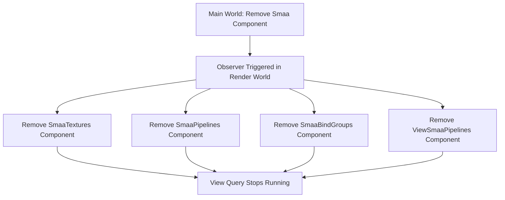

+++
title = "#22985 Fix SMAA resources not being cleaned up"
date = "2026-02-22T00:00:00"
draft = false
template = "pull_request_page.html"
in_search_index = true

[taxonomies]
list_display = ["show"]

[extra]
current_language = "en"
available_languages = {"en" = { name = "English", url = "/pull_request/bevy/2026-02/pr-22985-en-20260222" }, "zh-cn" = { name = "中文", url = "/pull_request/bevy/2026-02/pr-22985-zh-cn-20260222" }}
labels = ["C-Bug", "A-Rendering", "D-Straightforward"]
+++

# Fix SMAA resources not being cleaned up

## Basic Information
- **Title**: Fix SMAA resources not being cleaned up
- **PR Link**: https://github.com/bevyengine/bevy/pull/22985
- **Author**: kristoff3r
- **Status**: MERGED
- **Labels**: C-Bug, A-Rendering, S-Ready-For-Final-Review, D-Straightforward
- **Created**: 2026-02-16T20:34:39Z
- **Merged**: 2026-02-22T20:35:44Z
- **Merged By**: alice-i-cecile

## Description
# Objective

Fixes #22963

## Solution

Remove derived resources for SMAA in the render world when the `Smaa` component is removed, so the view query doesn't keep running.

As a follow-up, we should add something equivalent to this as an option to the `ExtractComponent` macro.

## Testing

Check that the problem with `cargo run --example anti_aliasing` and moving between AA modes.

## The Story of This Pull Request

The problem started with issue #22963, where developers noticed that when switching between anti-aliasing modes in Bevy, specifically when removing the SMAA (Subpixel Morphological Anti-Aliasing) component, the associated GPU resources weren't being properly cleaned up. This caused the view query to continue running unnecessarily, which could lead to performance issues and resource leaks over time.

In the Bevy architecture, anti-aliasing implementations like SMAA work by creating derived resources in the render world when a component is extracted from the main world. When a `Smaa` component is added to an entity, the system extracts it to the render world and creates several associated resources: `SmaaTextures`, `SmaaPipelines`, `SmaaBindGroups`, and `ViewSmaaPipelines`. These are stored as components on the same entity in the render world.

The issue occurred because while Bevy's `ExtractComponent` system handles the extraction of components from the main world to the render world, it doesn't automatically handle cleanup when those components are removed. When a developer would switch from SMAA to another anti-aliasing method (like MSAA or TAA), the `Smaa` component would be removed, but its derived resources in the render world would persist.

The solution implemented in this PR is straightforward: add an observer that triggers when the `Smaa` component is removed, and use that event to clean up the associated resources. The implementation uses Bevy's observer system, which allows systems to react to specific events like component removal.

```rust
// TODO: remove this manual cleanup when ExtractComponent gets support
// for cleanup of derived components
render_app.add_observer(|event: On<Remove, Smaa>, mut commands: Commands| {
    commands.entity(event.entity).remove::<(
        SmaaTextures,
        SmaaPipelines,
        SmaaBindGroups,
        ViewSmaaPipelines,
    )>();
});
```

This observer pattern is effective because it cleanly separates the concern of resource cleanup from the main logic of the anti-aliasing system. When the `Smaa` component is removed via `commands.entity(entity).remove::<Smaa>()`, the observer automatically triggers and removes all four associated resource components from the same entity in the render world.

However, there was a technical hurdle to overcome. The observer needed to be added to the render app, which is a `SubApp` rather than a regular `App`. The `SubApp` struct didn't have an `add_observer` method, so the PR also needed to add this method to expose the same functionality available on the main `App`.

```rust
/// See [`App::add_observer`].
pub fn add_observer<M>(&mut self, observer: impl IntoObserver<M>) -> &mut Self {
    self.world_mut().add_observer(observer);
    self
}
```

This addition is minimal and follows the existing pattern in Bevy's API design. It simply delegates to the underlying world's `add_observer` method, maintaining consistency with how other methods are exposed on `SubApp`.

The PR author noted that this solution is a temporary workaround. The proper long-term solution would be to enhance the `ExtractComponent` macro to support cleanup of derived components automatically. This would eliminate the need for manual observer setup in each plugin that uses component extraction with derived resources.

Testing the fix was straightforward: developers could run the anti_aliasing example (`cargo run --example anti_aliasing`) and switch between different anti-aliasing modes without experiencing the resource leak. The view query would properly stop running for entities that no longer had the SMAA component, improving performance and preventing GPU memory leaks.

From an architectural perspective, this PR highlights an important pattern in Bevy's ECS: the need for symmetric operations when working with component extraction. If a system creates resources when a component is added, it should also clean them up when that component is removed. The observer system provides a clean way to implement this symmetry without tightly coupling the creation and cleanup logic.

The implementation is efficient because observers in Bevy are optimized for event-driven patterns and don't add overhead to systems that aren't listening for the specific events. The cleanup happens only when needed, precisely when components are removed.

## Visual Representation



## Key Files Changed

1. **`crates/bevy_anti_alias/src/smaa/mod.rs`** (+13/-0)
   - Added an observer to clean up SMAA-derived resources when the `Smaa` component is removed
   - The observer removes four components: `SmaaTextures`, `SmaaPipelines`, `SmaaBindGroups`, and `ViewSmaaPipelines`

```rust
// File: crates/bevy_anti_alias/src/smaa/mod.rs
// Added to SmaaPlugin implementation:
// TODO: remove this manual cleanup when ExtractComponent gets support
// for cleanup of derived components
render_app.add_observer(|event: On<Remove, Smaa>, mut commands: Commands| {
    commands.entity(event.entity).remove::<(
        SmaaTextures,
        SmaaPipelines,
        SmaaBindGroups,
        ViewSmaaPipelines,
    )>();
});
```

2. **`crates/bevy_app/src/sub_app.rs`** (+7/-0)
   - Added `add_observer` method to `SubApp` to expose observer functionality in sub-apps (like the render app)
   - This enables the SMAA plugin to add observers to the render app

```rust
// File: crates/bevy_app/src/sub_app.rs
// Added method:
/// See [`App::add_observer`].
pub fn add_observer<M>(&mut self, observer: impl IntoObserver<M>) -> &mut Self {
    self.world_mut().add_observer(observer);
    self
}
```

## Further Reading

- [Bevy Observer Documentation](https://docs.rs/bevy_ecs/latest/bevy_ecs/observer/index.html) - Official documentation for Bevy's observer system
- [Bevy ExtractComponent Macro](https://docs.rs/bevy_render/latest/bevy_render/macro.ExtractComponent.html) - Documentation for the component extraction system
- [SMAA: Subpixel Morphological Antialiasing](https://www.iryoku.com/smaa/) - Technical paper on the SMAA algorithm
- [Bevy Render Graph Architecture](https://bevyengine.org/learn/quick-start/getting-started/systems/) - Overview of Bevy's render architecture including sub-apps