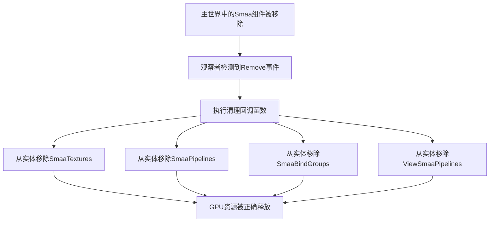

+++
title = "#22985 Fix SMAA resources not being cleaned up"
date = "2026-02-22T00:00:00"
draft = false
template = "pull_request_page.html"
in_search_index = false

[extra]
current_language = "zh-cn"
available_languages = {"en" = { name = "English", url = "/pull_request/bevy/2026-02/pr-22985-en-20260222" }, "zh-cn" = { name = "中文", url = "/pull_request/bevy/2026-02/pr-22985-zh-cn-20260222" }}
+++

# 修复SMAA资源未清理的问题

## 基本信息
- **标题**: Fix SMAA resources not being cleaned up
- **PR链接**: https://github.com/bevyengine/bevy/pull/22985
- **作者**: kristoff3r
- **状态**: 已合并
- **标签**: C-Bug, A-Rendering, S-Ready-For-Final-Review, D-Straightforward
- **创建时间**: 2026-02-16T20:34:39Z
- **合并时间**: 2026-02-22T20:35:44Z
- **合并者**: alice-i-cecile

## 描述翻译

### 目标
修复 #22963

### 解决方案
当 `Smaa` 组件被移除时，在渲染世界(render world)中移除SMAA的派生资源，这样视图查询(view query)就不会继续运行。

作为后续工作，我们应该在 `ExtractComponent` 宏中添加一个等效选项来实现这个功能。

### 测试
使用 `cargo run --example anti_aliasing` 并在不同的AA模式(anti-aliasing modes)之间切换来检查问题是否解决。

## 本次PR的技术分析

这个PR解决了一个资源泄漏问题，当SMAA（亚像素形态抗锯齿）组件从实体(entity)中被移除时，相关的GPU资源没有被正确清理。问题出现在SMAA插件在渲染世界(render world)中创建了派生资源(derived resources)，但当主世界(main world)中的`Smaa`组件被移除时，这些资源没有被自动清理。

问题的核心在于Bevy当前的`ExtractComponent`系统架构限制。当组件从主世界提取到渲染世界时，渲染世界中会创建相应的派生资源（如纹理、管线、绑定组等）。然而，当原组件被移除时，没有机制自动清理这些派生资源，导致视图查询持续运行并浪费资源。

开发者在`SmaaPlugin`中实现了一个临时解决方案，通过添加观察者(observer)来监听`Smaa`组件的移除事件。当检测到移除事件时，观察者会执行清理操作，从实体中移除四个相关的派生组件：

1. `SmaaTextures` - SMAA纹理资源
2. `SmaaPipelines` - SMAA渲染管线
3. `SmaaBindGroups` - SMAA绑定组
4. `ViewSmaaPipelines` - 视图特定的SMAA管线

这个实现使用Bevy的观察者系统(observer system)，这是一种事件驱动的架构模式。观察者会在特定事件发生时执行回调函数，这里是当`Smaa`组件被移除时。回调函数通过`Commands`系统发出组件移除指令，这是Bevy中标准的实体修改方式。

在技术实现上，开发者需要先确保`SubApp`支持添加观察者。因此，他们在`sub_app.rs`中添加了`add_observer`方法，这个方法只是将调用转发给底层的`World`。这是必要的，因为SMAA插件在渲染应用(render app)中运行，而渲染应用是主应用的一个子应用(sub-app)。

代码中的TODO注释指出了这是一个临时解决方案，理想的长期解决方案是在`ExtractComponent`宏中内置对派生组件清理的支持。这样可以避免每个需要清理资源的插件都要实现自定义的清理逻辑。

从性能角度看，这个修复防止了资源泄漏和冗余的视图查询执行，当SMAA被禁用或切换抗锯齿模式时，这能释放GPU内存并减少CPU开销。对于频繁切换抗锯齿设置的应用，这个优化尤其重要。

这个修复也展示了Bevy的观察者系统在实际应用中的使用模式。观察者提供了一种响应式的方式来处理组件生命周期事件，而不需要复杂的查询系统或自定义调度逻辑。

## 视觉表示



## 主要文件更改

### 1. `crates/bevy_anti_alias/src/smaa/mod.rs`

**更改描述**：添加了观察者来监听SMAA组件的移除事件，并在事件发生时清理相关的渲染资源。

**关键代码**：
```rust
// 新增的观察者代码
render_app.add_observer(|event: On<Remove, Smaa>, mut commands: Commands| {
    commands.entity(event.entity).remove::<(
        SmaaTextures,
        SmaaPipelines,
        SmaaBindGroups,
        ViewSmaaPipelines,
    )>();
});
```

**关联性**：这是修复的核心实现，通过观察者模式响应组件移除事件并执行资源清理。

### 2. `crates/bevy_app/src/sub_app.rs`

**更改描述**：为`SubApp`添加了`add_observer`方法，使子应用也能使用观察者系统。

**关键代码**：
```rust
/// See [`App::add_observer`].
pub fn add_observer<M>(&mut self, observer: impl IntoObserver<M>) -> &mut Self {
    self.world_mut().add_observer(observer);
    self
}
```

**关联性**：这个更改是必要的，因为SMAA插件运行在渲染应用（一个子应用）中，需要能够注册观察者来监听组件事件。

## 完整代码差异

```diff
diff --git a/crates/bevy_anti_alias/src/smaa/mod.rs b/crates/bevy_anti_alias/src/smaa/mod.rs
index f04b484a12c0c..bb496e9cabc2a 100644
--- a/crates/bevy_anti_alias/src/smaa/mod.rs
+++ b/crates/bevy_anti_alias/src/smaa/mod.rs
@@ -41,6 +41,8 @@ use bevy_derive::{Deref, DerefMut};
 use bevy_ecs::{
     component::Component,
     entity::Entity,
+    lifecycle::Remove,
+    observer::On,
     query::With,
     reflect::ReflectComponent,
     resource::Resource,
@@ -329,6 +331,17 @@ impl Plugin for SmaaPlugin {
             return;
         };
 
+        // TODO: remove this manual cleanup when ExtractComponent gets support
+        // for cleanup of derived components
+        render_app.add_observer(|event: On<Remove, Smaa>, mut commands: Commands| {
+            commands.entity(event.entity).remove::<(
+                SmaaTextures,
+                SmaaPipelines,
+                SmaaBindGroups,
+                ViewSmaaPipelines,
+            )>();
+        });
+
         render_app
             .insert_resource(smaa_luts)
             .init_resource::<SmaaSpecializedRenderPipelines>()
diff --git a/crates/bevy_app/src/sub_app.rs b/crates/bevy_app/src/sub_app.rs
index b229da2ef59e6..7790fbf9c7683 100644
--- a/crates/bevy_app/src/sub_app.rs
+++ b/crates/bevy_app/src/sub_app.rs
@@ -2,6 +2,7 @@ use crate::{App, AppLabel, InternedAppLabel, Plugin, Plugins, PluginsState};
 use alloc::{boxed::Box, string::String, vec::Vec};
 use bevy_ecs::{
     message::MessageRegistry,
+    observer::IntoObserver,
     prelude::*,
     schedule::{
         InternedScheduleLabel, InternedSystemSet, ScheduleBuildSettings, ScheduleCleanupPolicy,
@@ -359,6 +360,12 @@ impl SubApp {
         self
     }
 
+    /// See [`App::add_observer`].
+    pub fn add_observer<M>(&mut self, observer: impl IntoObserver<M>) -> &mut Self {
+        self.world_mut().add_observer(observer);
+        self
+    }
+
     /// See [`App::add_message`].
     pub fn add_message<T>(&mut self) -> &mut Self
     where
```

## 进一步阅读

1. **Bevy观察者系统文档**：了解Bevy中观察者模式的使用方法和最佳实践
2. **ECS架构中的资源管理**：学习实体组件系统(Entity Component System)中资源生命周期的管理策略
3. **渲染世界的设计模式**：了解Bevy中主世界与渲染世界分离的架构设计
4. **ExtractComponent系统**：深入研究Bevy的组件提取机制及其局限性
5. **GPU资源管理**：学习现代图形API中资源分配和释放的最佳实践