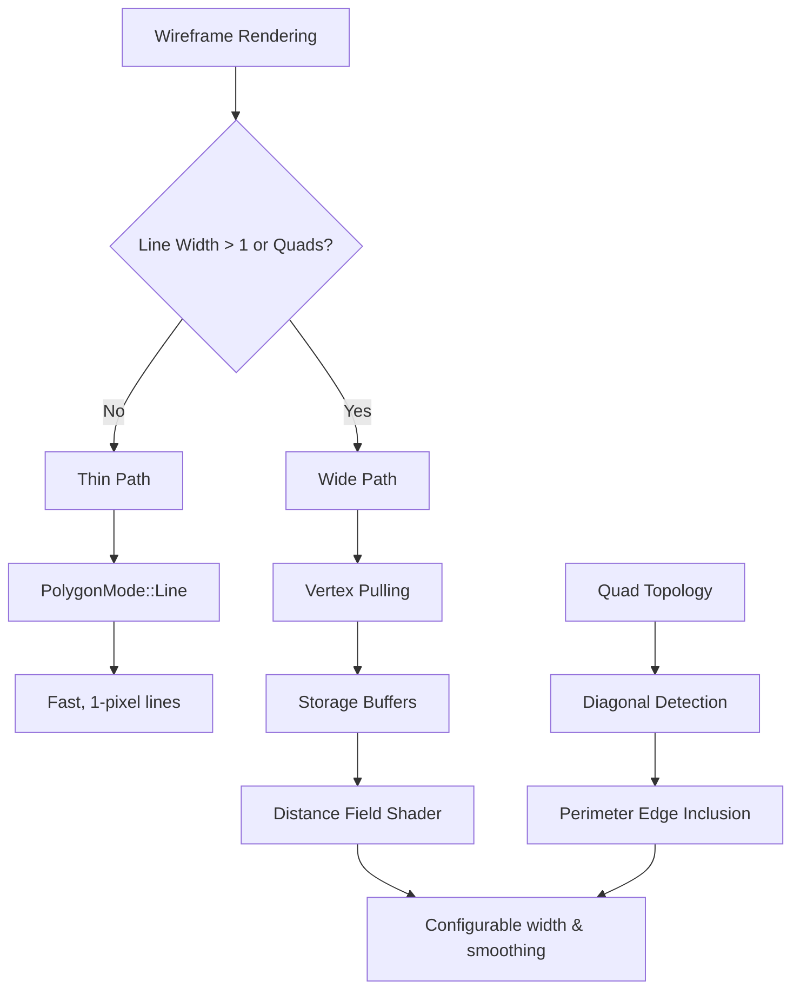

+++
title = "#22986 Add line width and quad support for wireframes."
date = "2026-02-18T00:00:00"
draft = false
template = "pull_request_page.html"
in_search_index = true

[taxonomies]
list_display = ["show"]

[extra]
current_language = "en"
available_languages = {"en" = { name = "English", url = "/pull_request/bevy/2026-02/pr-22986-en-20260218" }, "zh-cn" = { name = "中文", url = "/pull_request/bevy/2026-02/pr-22986-zh-cn-20260218" }}
labels = ["A-Rendering", "D-Modest"]
+++

# Title

## Basic Information
- **Title**: Add line width and quad support for wireframes.
- **PR Link**: https://github.com/bevyengine/bevy/pull/22986
- **Author**: tychedelia
- **Status**: MERGED
- **Labels**: A-Rendering, S-Ready-For-Final-Review, D-Modest
- **Created**: 2026-02-17T00:17:26Z
- **Merged**: 2026-02-18T00:18:00Z
- **Merged By**: alice-i-cecile

## Description Translation

Adds support for line width (stroke) and quad topology for wireframes.

The triangle line fast path stays the same, but we add a new "wide" draw function path that uses a specialized vertex shader in order to do the following via vertex pulling from the appropriate mesh slab:
- Compute screen-space altitudes for our edges.
- Find and suppress diagonals when quad topology is enabled.

Doing this in the vertex shader allows us to avoid needing to de-dupe on the CPU or spend additional bandwidth uploading a mesh copy at the expense of a bit of extra shading.

Right now, we have to break batches on the mesh when in the "wide" path, meaning we don't get full advantage of MDI, but this is mostly because we don't have a great way to support per-draw data. This could be fixed in the future.

## Examples:


## The Story of This Pull Request

### The Problem and Context

Wireframe rendering in Bevy had two main limitations: it only supported 1-pixel wide lines and always rendered triangle edges, even when meshes were composed of quads. This was fine for basic debugging, but for artistic or visualization purposes, users needed thicker lines and the ability to suppress internal diagonals when rendering quad-based meshes.

The existing implementation used a simple approach: it rendered wireframes using `PolygonMode::Line`, which is fast but limited by the hardware's line rendering capabilities (typically 1 pixel maximum width). To support wider lines or quad topology, the renderer would need to either generate geometry for the thickened lines or use a shader-based distance field approach.

The challenge was to implement these features without introducing excessive CPU overhead or memory bandwidth. Traditional approaches might involve:
- CPU-side edge deduplication for quad topology
- Generating new geometry for thick lines
- Uploading additional mesh data to the GPU

### The Solution Approach

The developer chose a shader-based approach using vertex pulling from mesh storage buffers. This allowed the GPU to handle both line width calculation and quad detection without CPU intervention. The solution maintains two rendering paths:

1. **Thin path** (existing): For line width ≤ 1 and triangle topology, uses the original `PolygonMode::Line` approach
2. **Wide path** (new): For line width > 1 or quad topology, uses a custom vertex shader that pulls vertex data from storage buffers

The key insight was to compute screen-space edge distances in the vertex shader using the altitude-based distance field technique described in Baerentzen et al.'s "Single-Pass Wireframe Rendering" (SIGGRAPH 2006). For quad topology, the shader detects shared diagonals between adjacent triangles and suppresses them while including all perimeter edges.

### The Implementation

The implementation required changes across the wireframe rendering system:

**Shader Architecture**: The existing `wireframe.wgsl` shader was extended with a new `WIREFRAME_WIDE` path. When enabled, this path:
- Uses storage buffers for vertex and index data instead of traditional vertex buffers
- Computes screen-space positions and edge altitudes in the vertex shader
- For quad topology, identifies diagonal edges and includes perimeter edges from adjacent triangles
- Uses a distance field in the fragment shader to render lines with configurable width and smoothing

**Rust-side Changes**: The wireframe system was updated to support the new wide path:
- Added `WireframeLineWidth` and `WireframeTopology` components
- Extended `WireframeConfig`, `WireframeMaterial`, and `RenderWireframeMaterial` to store line width and topology settings
- Created `WireframeWideBindGroups` to manage storage buffer bind groups for vertex pulling
- Added new render commands: `DrawWireframe3dWide`, `SetWireframe3dWideImmediates`, `SetWireframe3dWideBindGroup`, and `DrawWireframeMeshPulled`
- Modified pipeline specialization to create separate pipelines for thin and wide paths

**Batch Management**: The wide path requires per-mesh bind groups because each mesh has different vertex pull parameters. This forces batch breaking by mesh, which reduces the effectiveness of multi-draw indirect (MDI). The developer noted this as a trade-off that could be improved with better per-draw data support in the future.

### Technical Insights

**Vertex Pulling Pattern**: Instead of using traditional vertex buffers, the wide path uses storage buffers (`storage_buffer_read_only::<u32>`) and computes vertex positions manually in the shader. This allows the same shader to work with any mesh layout without needing to know the vertex format at compile time.

**Altitude-Based Distance Field**: The shader computes the altitude (perpendicular distance) from each vertex to the opposite edge in screen space. These altitudes are interpolated across the triangle, and the fragment shader takes the minimum distance to determine how close a pixel is to any edge. This creates a smooth distance field that can be used to render lines of arbitrary width.

**Quad Detection Algorithm**: For quad topology, the shader assumes quads are represented as two triangles. It identifies the diagonal edge by checking which vertices are shared between adjacent triangles. The diagonal is suppressed by setting its distance to a large value, while the other triangle's perimeter edges are included by computing distances to those edges.

**Performance Considerations**: The wide path does more work in the vertex shader and uses storage buffer reads, which are slower than traditional vertex buffer fetches. However, it avoids CPU-side edge processing and duplicate geometry generation. The batch breaking issue is noted as a current limitation that could be addressed with future engine improvements.

### The Impact

This PR significantly expands Bevy's wireframe rendering capabilities. Users can now:
- Render wireframes with configurable line width (in screen-space pixels)
- Choose between triangle and quad topology for edge rendering
- Get smooth anti-aliased edges through the distance field approach

The implementation is backward compatible - existing wireframe rendering continues to use the fast path. The new features are opt-in through the `WireframeLineWidth` and `WireframeTopology` components.

The example was updated to demonstrate the new capabilities, showing how to create thick wireframes and use quad topology to suppress diagonal lines in cube rendering.

## Visual Representation



## Key Files Changed

### 1. `crates/bevy_pbr/src/render/wireframe.wgsl` (+255/-4)

This file contains the shader implementation for both thin and wide wireframe paths.

**Key changes:**
- Added `WIREFRAME_WIDE` shader define to toggle between paths
- Implemented vertex pulling from storage buffers for the wide path
- Added altitude-based distance field calculation for edge rendering
- Implemented quad topology support with diagonal suppression

**Code snippet (distance field calculation):**
```wgsl
// altitudes: h_i = 2 * area / opposite_edge_length
// the altitude-based distance field follows Baerentzen et al., "Single-Pass
// Wireframe Rendering" (SIGGRAPH 2006) and the NVIDIA "Solid Wireframe"
// whitepaper (2007).
let h0 = area2 / max(len12, 0.001);
let h1 = area2 / max(len20, 0.001);
let h2 = area2 / max(len01, 0.001);
```

### 2. `crates/bevy_pbr/src/wireframe.rs` (+716/-68)

This is the main Rust implementation file for wireframe rendering.

**Key changes:**
- Added `WireframeLineWidth` and `WireframeTopology` components
- Extended data structures to store line width and topology settings
- Implemented `WireframeWideBindGroups` for managing storage buffer bindings
- Added new render commands for the wide path
- Modified pipeline specialization to support both thin and wide paths

**Code snippet (new pipeline key structure):**
```rust
#[derive(Clone, Copy, Debug, PartialEq, Eq, Hash)]
pub struct WireframePipelineKey {
    pub mesh_key: MeshPipelineKey,
    pub wide: bool,
    pub quads: bool,
    pub line_mode: bool,
}
```

**Code snippet (wide path draw command):**
```rust
/// Draw wireframes using vertex pulling for wide lines or quad topology.
pub type DrawWireframe3dWide = (
    SetItemPipeline,
    SetMeshViewBindGroup<0>,
    SetMeshViewBindingArrayBindGroup<1>,
    SetMeshBindGroup<2>,
    SetWireframe3dWideBindGroup,
    SetWireframe3dWideImmediates,
    DrawWireframeMeshPulled,
);
```

### 3. `examples/3d/wireframe.rs` (+55/-7)

Updated example to demonstrate new features.

**Key changes:**
- Added a purple cube with quad topology and 3-pixel line width
- Added controls for changing line width and toggling topology
- Updated UI to show current settings

**Code snippet (new cube with wide wireframe):**
```rust
// Purple cube: wireframe with explicit Quads topology override
commands.spawn((
    Mesh3d(meshes.add(Cuboid::default())),
    MeshMaterial3d(materials.add(Color::from(PURPLE))),
    Transform::from_xyz(1.5, 0.5, 1.5),
    Wireframe,
    WireframeColor {
        color: YELLOW.into(),
    },
    WireframeLineWidth { width: 3.0 },
    WireframeTopology::Quads,
));
```

### 4. `examples/large_scenes/bevy_city/src/main.rs` (+1/-0)

Minor update to use default wireframe configuration.

**Code snippet:**
```rust
.insert_resource(WireframeConfig {
    global: false,
    default_color: WHITE.into(),
    ..default()
})
```

## Further Reading

1. **Baerentzen, J. A., & Aanæs, H. (2005). Single-pass wireframe rendering.** SIGGRAPH 2006 paper that introduced the altitude-based distance field technique used in this implementation.

2. **NVIDIA Solid Wireframe Whitepaper (2007).** Practical implementation guide for GPU-based wireframe rendering with thickness.

3. **WebGPU Storage Buffers Documentation.** Understanding the vertex pulling pattern used in the wide path: https://www.w3.org/TR/webgpu/#buffer-usage

4. **Bevy Render Graph Documentation.** For understanding how the wireframe system integrates into Bevy's rendering architecture: https://bevyengine.org/learn/quick-start/rendering/render-graph/

5. **Distance Field Rendering Techniques.** General background on signed distance fields and their applications in real-time graphics.