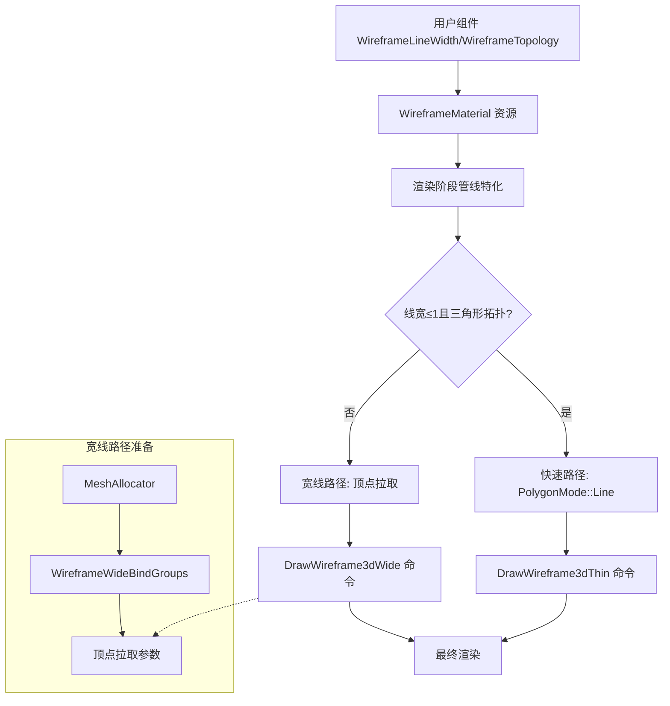

+++
title = "#22986 Add line width and quad support for wireframes."
date = "2026-02-18T00:00:00"
draft = false
template = "pull_request_page.html"
in_search_index = false

[extra]
current_language = "zh-cn"
available_languages = {"en" = { name = "English", url = "/pull_request/bevy/2026-02/pr-22986-en-20260218" }, "zh-cn" = { name = "中文", url = "/pull_request/bevy/2026-02/pr-22986-zh-cn-20260218" }}
+++

# Add line width and quad support for wireframes.

## 基本信息
- **标题**: Add line width and quad support for wireframes.
- **PR链接**: https://github.com/bevyengine/bevy/pull/22986
- **作者**: tychedelia
- **状态**: 已合并
- **标签**: A-Rendering, S-Ready-For-Final-Review, D-Modest
- **创建时间**: 2026-02-17T00:17:26Z
- **合并时间**: 2026-02-18T00:18:00Z
- **合并者**: alice-i-cecile

## 描述翻译
为线框（wireframe）添加了线宽（stroke）和四边形（quad）拓扑支持。

三角形线的快速路径保持不变，但我们添加了一个新的"宽"绘制函数路径，该路径使用专门的顶点着色器从相应的网格片段中通过顶点拉取（vertex pulling）来执行以下操作：
- 为我们的边计算屏幕空间的高度（altitudes）。
- 当启用四边形拓扑时，查找并抑制对角线（diagonals）。

在顶点着色器中执行此操作允许我们避免在CPU上进行去重或花费额外的带宽上传网格副本，代价是稍微增加一些着色计算。

目前，在"宽"路径中，我们必须在网格上中断批次（break batches），这意味着我们无法充分利用MDI（Multi Draw Indirect）的优势，但这主要是因为我们没有很好的方法来支持每个绘制（per-draw）的数据。这在将来可以修复。

## 示例：


## 本PR的故事

### 问题与背景
Bevy的线框渲染功能一直有一个限制：线宽始终为1像素，并且仅限于显示三角形拓扑的边。对于需要更粗轮廓（例如技术图解、艺术风格化渲染）或希望看到四边形拓扑（quad topology，这是3D建模中常见的结构）的开发者来说，这是一个明显的功能缺失。

现有的实现简单地将网格渲染为`PolygonMode::Line`，虽然高效，但无法控制线宽。更重要的是，当网格由四边形组成时（通常是两个三角形组成的四边形），两条对角线都会显示出来，造成了视觉上的混乱。

### 解决方案
开发者采取了一种混合方案：
1. **保留快速路径**：对于线宽≤1像素且使用三角形拓扑的情况，继续使用原有的`PolygonMode::Line`快速渲染路径。
2. **新增宽线路径**：对于需要宽线（>1像素）或四边形拓扑的情况，使用全新的"宽线"渲染路径。

关键的设计决策是**在顶点着色器中处理所有复杂逻辑**，而不是在CPU端。这样做的优点是避免了：
- CPU端复杂的几何处理和数据去重
- 额外的带宽开销（不需要上传修改后的网格数据）
- 代码复杂度的增加（逻辑集中在着色器中）

缺点是需要在着色器中执行更多计算，但对于现代GPU来说，这是可接受的性能开销。

### 实现细节

#### 着色器的架构变化
`wireframe.wgsl`着色器文件被完全重构，现在包含两个主要的渲染路径：

```wgsl
// 新增的宽线路径，支持线宽和四边形拓扑
#ifdef WIREFRAME_WIDE
    // 复杂的顶点着色器，计算距离场并处理四边形拓扑
    fn vertex() -> WireframeVertexOutput { ... }
    
    // 片段着色器，根据距离场渲染可变宽度的线
    fn fragment(in: WireframeVertexOutput) -> @location(0) vec4<f32> { ... }
#else
    // 原有的快速路径，仅设置颜色
    fn fragment(in: VertexOutput) -> @location(0) vec4<f32> { ... }
#endif
```

**宽线路径的技术核心**：
1. **距离场渲染**：基于Baerentzen等人2006年的"Single-Pass Wireframe Rendering"和NVIDIA的"Solid Wireframe"白皮书，使用三角形高度（altitudes）构建屏幕空间的距离场。
2. **四边形拓扑检测**：通过检查共享边来识别四边形，并抑制对角线。
3. **顶点拉取（Vertex Pulling）**：直接从存储缓冲区读取顶点数据，避免了传统的顶点输入布局。

#### Rust代码的组织调整
`wireframe.rs`文件进行了大规模重构：

1. **新增组件类型**：
   ```rust
   #[derive(Component, Debug, Clone, Reflect)]
   pub struct WireframeLineWidth {
       pub width: f32,
   }
   
   #[derive(Component, Debug, Clone, Copy, Default, PartialEq, Eq, Hash, Reflect)]
   pub enum WireframeTopology {
       #[default]
       Triangles,
       Quads,
   }
   ```

2. **重构渲染管线**：
   - 新增`Wireframe3dWide`绘制命令，包含专门的绑定组和立即数据设置
   - 新增`DrawWireframeMeshPulled`渲染命令，处理顶点拉取的绘制逻辑
   - 重构管线特化（specialization）系统，支持宽线和窄线管线的切换

3. **数据流优化**：
   - 新增`WireframeWideBindGroups`资源，管理每个网格的顶点拉取参数
   - 扩展`WireframeMaterial`以包含线宽和拓扑信息
   - 更新所有相关系统以处理新的组件变化

#### 性能权衡
开发者在实现中做出了几个重要的性能权衡：

1. **顶点拉取 vs 传统顶点输入**：使用顶点拉取可以在着色器中灵活访问顶点数据，但可能不如传统顶点输入高效。然而，这避免了为宽线路径创建专门的顶点布局。

2. **批处理中断**：目前宽线路径必须为每个网格中断批次，因为每个网格需要不同的顶点拉取参数。这在注释中被标记为未来的优化点。

3. **计算开销**：在顶点着色器中计算屏幕空间距离和四边形检测增加了计算量，但避免了CPU端的复杂处理和额外的数据传输。

### 技术洞察
这个PR展示了几个高级渲染技术：

1. **基于距离场的线框渲染**：通过计算每个片元到最近的边的距离，可以轻松实现可变线宽和抗锯齿。距离场渲染是一种强大的技术，也用于其他渲染效果如轮廓线（outline）。

2. **四边形拓扑检测**：着色器中的检测算法巧妙地比较两个相邻三角形的索引，识别共享边和额外顶点。这种方法不需要任何额外的网格元数据。

3. **立即数据（Immediates）的使用**：通过`var<immediate>`将线宽、颜色等参数直接传递给着色器，避免了额外的绑定组设置。

4. **混合渲染管线策略**：根据线宽和拓扑需求在两种完全不同的渲染方法之间切换，这在渲染引擎设计中是一种常见的模式。

### 影响与启示
这个PR为Bevy的线框渲染系统带来了显著的功能增强：

1. **更丰富的艺术表现**：开发者现在可以创建粗线框、艺术风格的线框渲染效果。
2. **更好的建模工具支持**：四边形拓扑的显示使线框更适合作为建模工具的预览。
3. **渐进式改进的典范**：通过保留原有的快速路径，确保了向后兼容性和性能不受影响。
4. **为未来扩展奠定基础**：实现的架构允许未来添加更多线框效果，如虚线、渐变线宽等。

从工程角度看，这个PR展示了如何在现有渲染系统中优雅地添加新功能，同时保持代码的组织性和可维护性。

## 视觉表示



## 关键文件更改

### `crates/bevy_pbr/src/wireframe.rs` (+716/-68)
这是PR中改动最大的文件，包含了所有的逻辑实现。

**主要变化**：
1. 新增`WireframeLineWidth`和`WireframeTopology`组件
2. 重构管线系统以支持宽线/窄线两种路径
3. 添加顶点拉取（vertex pulling）的基础设施

**关键代码片段**：
```rust
// 新增：管线键现在包含宽线和拓扑信息
#[derive(Clone, Copy, Debug, PartialEq, Eq, Hash)]
pub struct WireframePipelineKey {
    pub mesh_key: MeshPipelineKey,
    pub wide: bool,
    pub quads: bool,
    pub line_mode: bool,
}

// 新增：宽线路径的绘制命令
pub type DrawWireframe3dWide = (
    SetItemPipeline,
    SetMeshViewBindGroup<0>,
    SetMeshViewBindingArrayBindGroup<1>,
    SetMeshBindGroup<2>,
    SetWireframe3dWideBindGroup,
    SetWireframe3dWideImmediates,
    DrawWireframeMeshPulled,
);
```

### `crates/bevy_pbr/src/render/wireframe.wgsl` (+255/-4)
着色器文件完全重构，添加了宽线渲染路径。

**关键代码片段**：
```wgsl
#ifdef WIREFRAME_WIDE
// 计算点到无限直线的垂直距离
fn point_line_distance(p: vec2<f32>, a: vec2<f32>, b: vec2<f32>) -> f32 {
    let edge = b - a;
    let len = length(edge);
    if len < 0.001 {
        return 1e6;
    }
    return abs(edge.x * (p.y - a.y) - edge.y * (p.x - a.x)) / len;
}

// 片段着色器：基于距离场的线宽和抗锯齿
@fragment
fn fragment(in: WireframeVertexOutput) -> @location(0) vec4<f32> {
    let d = min(min(in.edge_distance.x, in.edge_distance.y),
               min(in.edge_distance.z, in.edge_distance.w));
    
    let width = immediates.line_width;
    let smoothing = immediates.smoothing;
    
    let effective_width = max(width, 1.0);
    let alpha_scale = min(width, 1.0);
    
    let half_width = effective_width * 0.5;
    
    let alpha = (1.0 - smoothstep(half_width, half_width + smoothing, d))
              * alpha_scale
              * immediates.color.a;
    
    if alpha < 0.01 {
        discard;
    }
    
    return vec4<f32>(immediates.color.rgb, alpha);
}
#endif
```

### `examples/3d/wireframe.rs` (+55/-7)
更新了示例以展示新功能。

**关键代码片段**：
```rust
// 添加了控制线宽和拓扑的示例实体
commands.spawn((
    Mesh3d(meshes.add(Cuboid::default())),
    MeshMaterial3d(materials.add(Color::from(PURPLE))),
    Transform::from_xyz(1.5, 0.5, 1.5),
    Wireframe,
    WireframeColor {
        color: YELLOW.into(),
    },
    WireframeLineWidth { width: 3.0 },  // 3像素宽的线框
    WireframeTopology::Quads,           // 使用四边形拓扑
));

// 添加了新的控制键
if keyboard_input.just_pressed(KeyCode::KeyV) {
    for mut width in &mut wireframe_widths {
        width.width = match width.width as u32 {
            0..=2 => 3.0,
            3..=4 => 5.0,
            5..=7 => 10.0,
            _ => 2.0,
        };
    }
}
```

### `examples/large_scenes/bevy_city/src/main.rs` (+1/-0)
简单更新以使用新的`WireframeConfig`默认值。

## 进一步阅读

1. **Single-Pass Wireframe Rendering** (SIGGRAPH 2006) - 本实现基于此论文的距离场方法
2. **NVIDIA Solid Wireframe Whitepaper** (2007) - 商业实现参考
3. **Bevy渲染管线文档** - 了解Bevy的渲染架构
4. **WGSL着色语言规范** - 理解顶点拉取和存储缓冲区的使用
5. **基于距离场的渲染技术** - 更多关于距离场在实时渲染中的应用

## 完整代码差异
（已在上述分析中涵盖关键部分）