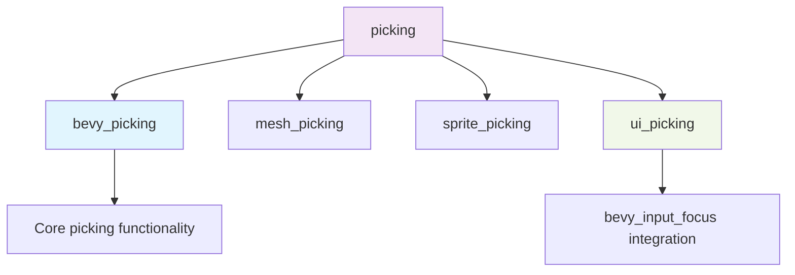

+++
title = "#22990 add bevy_picking back"
date = "2026-02-17T00:00:00"
draft = false
template = "pull_request_page.html"
in_search_index = true

[taxonomies]
list_display = ["show"]

[extra]
current_language = "en"
available_languages = {"en" = { name = "English", url = "/pull_request/bevy/2026-02/pr-22990-en-20260217" }, "zh-cn" = { name = "中文", url = "/pull_request/bevy/2026-02/pr-22990-zh-cn-20260217" }}
labels = ["C-Usability", "P-Regression", "A-Picking"]
+++

# Title
add bevy_picking back

## Basic Information
- **Title**: add bevy_picking back
- **PR Link**: https://github.com/bevyengine/bevy/pull/22990
- **Author**: atlv24
- **Status**: MERGED
- **Labels**: C-Usability, S-Ready-For-Final-Review, P-Regression, A-Picking
- **Created**: 2026-02-17T04:39:05Z
- **Merged**: 2026-02-17T19:56:27Z
- **Merged By**: alice-i-cecile

## Description Translation

# Objective

- #22933 removed the `bevy_picking` feature because it had the same description as `picking` yet a different purpose. I believe this different purpose is worth preserving and the fix is to document them more adequately instead. The rest of the PR was good, i agree with making it not enable `bevy_input_focus` when its enabled. Furthermore, I would be in favor of a `picking_input_focus` feature.

## Solution

- Restore `bevy_picking` feature
- Adjust docs

## Testing

- ci

## The Story of This Pull Request

This pull request addresses a regression introduced in PR #22933, which removed the `bevy_picking` feature due to confusion about its purpose overlapping with the existing `picking` feature. The author correctly identified that these features serve distinct roles in the codebase and that the proper solution was to clarify their documentation rather than remove functionality.

The core issue stemmed from how Bevy organizes its cargo features. The `picking` feature is a "collection" feature that aggregates multiple picking-related features to provide a complete picking solution with all backends. In contrast, `bevy_picking` is a lower-level feature that provides the foundational picking functionality without any specific backend implementations. This distinction is important for users who want to use picking functionality without automatically pulling in all the backend implementations.

Looking at the changes, the fix involved three key modifications:

First, in the root `Cargo.toml`, the `picking` feature collection was updated to explicitly include `bevy_picking` as a dependency. This ensures that when users enable the high-level `picking` feature, they get the core picking functionality along with all the backends. Simultaneously, the `bevy_picking` feature was restored as an individual feature that users can enable independently.

Second, the internal workspace's `Cargo.toml` was updated to define the `bevy_picking` feature, which simply depends on the `bevy_picking` crate. This maintains consistency between the workspace and published crate features.

Third, documentation was updated in two places: `docs/cargo_features.md` was modified to clarify the difference between the features, and the migration guide was rewritten to accurately describe the change in functionality rather than documenting a removal. The migration guide now explains that `bevy_picking` no longer enables `bevy_input_focus` picking functionality, which makes sense because `bevy_input_focus` is inherently a UI-related feature. This separation allows users to enable picking without making assumptions about which backend will be used.

The engineering decision here demonstrates good feature design practices. By separating core functionality from backend implementations, users have more control over their dependency tree. This is particularly valuable for:
- Users building custom picking backends who don't need the standard mesh, sprite, and UI picking implementations
- Users concerned about binary size who want to include only the picking functionality they actually use
- Framework developers who want to provide picking capabilities without committing to specific implementation details

The author's suggestion about a potential `picking_input_focus` feature is worth noting as a future improvement. Currently, if users want the input focus picking functionality without `bevy_ui`, they need to manually add a dependency on `bevy_input_focus` and enable its optional `bevy_picking` feature. A dedicated `picking_input_focus` feature could simplify this use case.

This PR represents a thoughtful correction to an overly aggressive simplification. It preserves important flexibility in the feature system while providing clearer documentation to prevent future confusion. The changes are minimal and focused, addressing the regression without introducing unnecessary complexity.

## Visual Representation



## Key Files Changed

### 1. `Cargo.toml` (+5/-2)
The root Cargo.toml file was updated to restore the `bevy_picking` feature and adjust the `picking` feature collection.

**Key changes:**
```toml
# Before:
# COLLECTION: Enables picking functionality.
picking = ["mesh_picking", "sprite_picking", "ui_picking"]

# After:
# COLLECTION: Enables picking with all backends.
picking = ["bevy_picking", "mesh_picking", "sprite_picking", "ui_picking"]

# New feature added:
# Provides picking functionality without any backend
bevy_picking = ["bevy_internal/bevy_picking"]
```

### 2. `crates/bevy_internal/Cargo.toml` (+3/-0)
The internal workspace Cargo.toml was updated to define the `bevy_picking` feature.

**Key changes:**
```toml
# Added:
# Provides picking functionality without any backend
bevy_picking = ["dep:bevy_picking"]
```

### 3. `docs/cargo_features.md` (+2/-1)
The cargo features documentation was updated to clarify the distinction between features.

**Key changes:**
```markdown
# Before:
|picking|Enables picking functionality. **Feature set:** `mesh_picking`, `sprite_picking`, `ui_picking`.|

# After:
|picking|Enables picking with all backends. **Feature set:** `bevy_picking`, `mesh_picking`, `sprite_picking`, `ui_picking`.|

# Added to individual features list:
|bevy_picking|Provides picking functionality without any backend|
```

### 4. `release-content/migration-guides/bevy_picking_feature.md` (+7/-5)
The migration guide was completely rewritten to reflect the actual change rather than documenting a removal.

**Key changes:**
```markdown
# Before:
title: "`bevy_picking` feature flag removed"
pull_requests: [22933]

The `bevy/bevy_picking` feature flag has been removed. This previously enabled picking functionality in `bevy_input_focus`,
allowing users to select elements to focus using their mouse.

This is now exposed as part of the existing `bevy/bevy_ui_picking` feature, which is itself part of the `ui` feature collection.
In most cases, you should add the `ui` feature collection to your project if you are using `bevy_ui`.

If you want to enable `bevy_input_focus`'s picking functionality, but do *not* want to use `bevy_ui`, add a separate dependency to the same version of `bevy_input_focus` in your project and enable the optional `bevy_picking` feature there.

# After:
title: "`bevy_picking` feature flag no longer includes `bevy_input_focus`"
pull_requests: [22933, 22990]

The `bevy/bevy_picking` feature flag no longer enables `bevy_input_focus` picking functionality.
For context, `bevy_input_focus` is inherently a `bevy_ui` related feature, allowing users to select UI elements to focus using their mouse.

Instead, this functionality is now tied to the existing `bevy/ui_picking` feature, which is itself part of the `ui` feature collection.
In most cases, you should add the `ui` feature collection to your project if you are using `bevy_ui`.

If you want to enable `bevy_input_focus`'s picking functionality, but do *not* want to use `bevy_ui`, add a separate dependency to the same version of `bevy_input_focus` in your project and enable the optional `bevy_picking` feature there.

This change means it now possible to enable `bevy_picking` without any assumptions about which backend in particular will be used.
```

## Further Reading

1. **Cargo Features Documentation**: [The Cargo Book - Features](https://doc.rust-lang.org/cargo/reference/features.html)
2. **Bevy Feature Organization**: [Bevy's Cargo Features Documentation](https://github.com/bevyengine/bevy/blob/main/docs/cargo_features.md)
3. **Feature Design Patterns**: [The Rust Edition Guide - Feature Best Practices](https://doc.rust-lang.org/edition-guide/rust-2021/default-cargo-resolver.html#feature-resolver)
4. **Previous PR #22933**: [Remove bevy_picking feature](https://github.com/bevyengine/bevy/pull/22933) - Understanding the context of the regression

# Full Code Diff
<details>
<summary>View full diff</summary>

```diff
diff --git a/Cargo.toml b/Cargo.toml
index 6a29986917ebd..0a94b7d974452 100644
--- a/Cargo.toml
+++ b/Cargo.toml
@@ -179,8 +179,8 @@ audio = ["bevy_audio", "vorbis"]
 # COLLECTION: Features used to compose Bevy scenes.
 scene = ["bevy_scene"]
 
-# COLLECTION: Enables picking functionality.
-picking = ["mesh_picking", "sprite_picking", "ui_picking"]
+# COLLECTION: Enables picking with all backends.
+picking = ["bevy_picking", "mesh_picking", "sprite_picking", "ui_picking"]
 
 # COLLECTION: The core pieces that most apps need. This serves as a baseline feature set for other higher level feature collections (such as "2d" and "3d"). It is also useful as a baseline feature set for scenarios like headless apps that require no rendering (ex: command line tools, servers, etc).
 default_app = [
@@ -325,6 +325,9 @@ bevy_gltf = ["bevy_internal/bevy_gltf"]
 # Adds PBR rendering
 bevy_pbr = ["bevy_internal/bevy_pbr"]
 
+# Provides picking functionality without any backend
+bevy_picking = ["bevy_internal/bevy_picking"]
+
 # Provides rendering functionality
 bevy_render = ["bevy_internal/bevy_render"]
 
diff --git a/crates/bevy_internal/Cargo.toml b/crates/bevy_internal/Cargo.toml
index 89b8cc14fd9ac..549911c8ddeae 100644
--- a/crates/bevy_internal/Cargo.toml
+++ b/crates/bevy_internal/Cargo.toml
@@ -330,6 +330,9 @@ pan_camera = ["bevy_camera_controller/pan_camera"]
 # Enable support for the Bevy Remote Protocol
 bevy_remote = ["dep:bevy_remote", "serialize"]
 
+# Provides picking functionality without any backend
+bevy_picking = ["dep:bevy_picking"]
+
 # Provides a mesh picking backend
 mesh_picking = ["bevy_picking", "bevy_picking/mesh_picking"]
 
diff --git a/docs/cargo_features.md b/docs/cargo_features.md
index abc5c9ac0f861..473dc06e007e2 100644
--- a/docs/cargo_features.md
+++ b/docs/cargo_features.md
@@ -39,7 +39,7 @@ collections to build your own "profile" equivalent, without needing to manually
 |dev|Enable this feature during development to improve the development experience. This adds features like asset hot-reloading and debugging tools. This should not be enabled for published apps! **Feature set:** `debug`, `bevy_dev_tools`, `file_watcher`.|
 |audio|Features used to build audio Bevy apps. **Feature set:** `bevy_audio`, `vorbis`.|
 |scene|Features used to compose Bevy scenes. **Feature set:** `bevy_scene`.|
-|picking|Enables picking functionality. **Feature set:** `mesh_picking`, `sprite_picking`, `ui_picking`.|
+|picking|Enables picking with all backends. **Feature set:** `bevy_picking`, `mesh_picking`, `sprite_picking`, `ui_picking`.|
 |default_app|The core pieces that most apps need. This serves as a baseline feature set for other higher level feature collections (such as "2d" and "3d"). It is also useful as a baseline feature set for scenarios like headless apps that require no rendering (ex: command line tools, servers, etc). **Feature set:** `async_executor`, `bevy_asset`, `bevy_input_focus`, `bevy_log`, `bevy_state`, `bevy_window`, `custom_cursor`, `reflect_auto_register`.|
 |default_platform|These are platform support features, such as OS support/features, windowing and input backends, etc. **Feature set:** `std`, `android-game-activity`, `android_shared_stdcxx`, `bevy_gilrs`, `bevy_winit`, `default_font`, `multi_threaded`, `webgl2`, `x11`, `wayland`, `sysinfo_plugin`.|
 |common_api|Default scene definition features. Note that this does not include an actual renderer, such as bevy_render (Bevy's default render backend). **Feature set:** `bevy_animation`, `bevy_camera`, `bevy_color`, `bevy_gizmos`, `bevy_image`, `bevy_mesh`, `bevy_shader`, `bevy_material`, `bevy_text`, `hdr`, `png`.|
@@ -88,6 +88,7 @@ This is the complete `bevy` cargo feature list, without "profiles" or "collectio
 |bevy_mesh|Provides a mesh format and some primitive meshing routines.|
 |bevy_mikktspace|Provides vertex tangent generation for use with bevy_mesh.|
 |bevy_pbr|Adds PBR rendering|
+|bevy_picking|Provides picking functionality without any backend|
 |bevy_post_process|Provides post process effects such as depth of field, bloom, chromatic aberration.|
 |bevy_remote|Enable the Bevy Remote Protocol|
 |bevy_render|Provides rendering functionality|
diff --git a/release-content/migration-guides/bevy_picking_feature.md b/release-content/migration-guides/bevy_picking_feature.md
index 401701b28183b..0f75b8e71366f 100644
--- a/release-content/migration-guides/bevy_picking_feature.md
+++ b/release-content/migration-guides/bevy_picking_feature.md
@@ -1,12 +1,14 @@
 ---
-title: "`bevy_picking` feature flag removed"
-pull_requests: [22933]
+title: "`bevy_picking` feature flag no longer includes `bevy_input_focus`"
+pull_requests: [22933, 22990]
 ---
 
-The `bevy/bevy_picking` feature flag has been removed. This previously enabled picking functionality in `bevy_input_focus`,
-allowing users to select elements to focus using their mouse.
+The `bevy/bevy_picking` feature flag no longer enables `bevy_input_focus` picking functionality.
+For context, `bevy_input_focus` is inherently a `bevy_ui` related feature, allowing users to select UI elements to focus using their mouse.
 
-This is now exposed as part of the existing `bevy/bevy_ui_picking` feature, which is itself part of the `ui` feature collection.
+Instead, this functionality is now tied to the existing `bevy/ui_picking` feature, which is itself part of the `ui` feature collection.
 In most cases, you should add the `ui` feature collection to your project if you are using `bevy_ui`.
 
 If you want to enable `bevy_input_focus`'s picking functionality, but do *not* want to use `bevy_ui`, add a separate dependency to the same version of `bevy_input_focus` in your project and enable the optional `bevy_picking` feature there.
+
+This change means it now possible to enable `bevy_picking` without any assumptions about which backend in particular will be used.
```

</details>