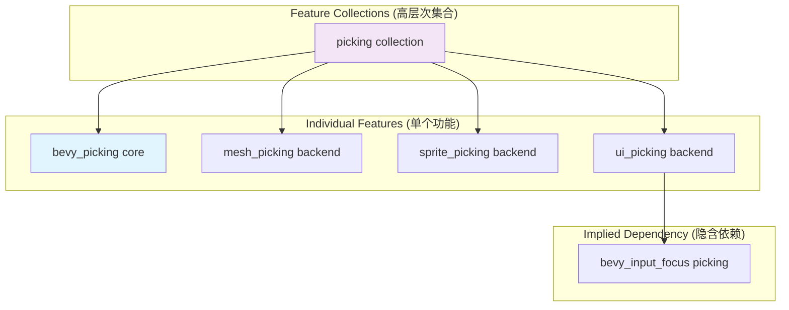

+++
title = "#22990 add bevy_picking back"
date = "2026-02-17T00:00:00"
draft = false
template = "pull_request_page.html"
in_search_index = false

[extra]
current_language = "zh-cn"
available_languages = {"en" = { name = "English", url = "/pull_request/bevy/2026-02/pr-22990-en-20260217" }, "zh-cn" = { name = "中文", url = "/pull_request/bevy/2026-02/pr-22990-zh-cn-20260217" }}
labels = ["C-Usability", "P-Regression", "A-Picking"]
+++

# Title

## Basic Information
- **Title**: add bevy_picking back
- **PR Link**: https://github.com/bevyengine/bevy/pull/22990
- **Author**: atlv24
- **Status**: MERGED
- **Labels**: C-Usability, S-Ready-For-Final-Review, P-Regression, A-Picking
- **Created**: 2026-02-17T04:39:05Z
- **Merged**: 2026-02-17T19:56:27Z
- **Merged By**: alice-i-cecile

## Description Translation
PR #22933 移除了 `bevy_picking` 功能标志（feature），因为它与 `picking` 功能集合（feature collection）有着相同的描述，但目的却不同。我认为这个不同的目的是值得保留的，修正的方法应该是提供更充分的文档，而不是直接移除该功能。这个PR的其他部分是好的，我同意当启用 `picking` 功能集合时，不应再自动启用 `bevy_input_focus`。此外，我倾向于支持增加一个 `picking_input_focus` 功能。

### 解决方案
- 恢复 `bevy_picking` 功能
- 调整文档

### 测试
- ci

## The Story of This Pull Request

这个 PR 是对 PR #22933 所做更改的一次校正。PR #22933 原本的意图是清理功能标志的命名和依赖关系。它发现 `bevy_picking` 功能与 `picking` 功能集合的文档描述相同，但逻辑上却不是一个层级的组件。`picking` 是一个功能集合，旨在启用所有拣选后端（picking backend），而 `bevy_picking` 是拣选系统的核心功能包（core crate），不包含任何具体的后端实现（如针对 mesh、sprite 或 UI 的拣选）。由于这个混淆，PR #22933 决定直接删除 `bevy_picking` 功能。

然而，这种做法带来了一个问题。在 Bevy 的模块化架构中，开发者可能需要单独依赖拣选系统的核心功能（即 `bevy_picking` crate），而不启用任何具体的拣选后端。例如，一个项目可能希望使用自定义的拣选系统，或者只依赖核心功能来构建自己的解决方案。删除 `bevy_picking` 功能标志会剥夺开发者这种选择权，强制他们必须通过 `picking` 集合来启用拣选功能，这可能会引入不必要的依赖。

因此，PR #22990 的作者 `atlv24` 提出了不同的解决方案：保留 `bevy_picking` 功能，但通过改进文档来清晰地说明 `bevy_picking` 和 `picking` 集合之间的区别。同时，他也支持了 PR #22933 中的另一项正确修改：即 `picking` 集合不应该再自动启用 `bevy_input_focus` 的拣选功能，因为这个功能本质上是与 `bevy_ui` 相关的。这个责任被转移给了 `ui_picking` 后端，而 `ui_picking` 本身是 `ui` 功能集合的一部分。

这个修复的核心是一个简单的工程原则：当一个功能存在合理的、独立的用例时，应该通过清晰的文档和命名来管理它，而不是直接移除它。实现上，PR #22990 主要进行了三处修改：

1.  **恢复功能定义**：在根目录的 `Cargo.toml` 和 `crates/bevy_internal/Cargo.toml` 中重新添加了 `bevy_picking` 功能，使其指向内部的 `bevy_picking` crate。
2.  **修正依赖链**：更新了 `picking` 功能集合的定义，将其从 `["mesh_picking", "sprite_picking", "ui_picking"]` 改为 `["bevy_picking", "mesh_picking", "sprite_picking", "ui_picking"]`。这明确表明 `picking` 集合首先包含核心功能，然后才是各个后端。这是一个重要的澄清，说明了组件间的逻辑关系。
3.  **更新文档**：同步更新了 `docs/cargo_features.md` 中的功能列表和描述，以及迁移指南 `release-content/migration-guides/bevy_picking_feature.md`。迁移指南的标题和内容被重写，准确反映了 PR #22933 和 PR #22990 共同带来的最终状态：`bevy_picking` 功能不再包含 `bevy_input_focus`，并且开发者现在可以独立启用 `bevy_picking` 而不绑定任何后端。

从技术角度看，这个 PR 展示了在管理大型项目的功能标志时需要注意的细微差别。功能标志不仅关乎编译时的依赖包含，也关乎为用户提供的灵活性和清晰的抽象层次。`bevy_picking` 作为核心抽象层，`mesh_picking` 等作为具体实现层，这种分离是良好的架构设计，应该通过功能标志暴露出来。

最终，这个修复使 Bevy 的拣选系统功能标志结构更加合理和灵活：开发者可以选择仅使用核心功能 (`bevy_picking`)，也可以方便地使用全功能集合 (`picking`)，并且对 `bevy_input_focus` 的依赖关系也变得更加明确和合理。

## Visual Representation



## Key Files Changed

1.  **`Cargo.toml`**
    - **目的**：在项目根目录重新定义 `bevy_picking` 功能，并修正 `picking` 功能集合的构成。
    - **关键修改**:
        ```toml
        # 修改前 (picking集合):
        picking = ["mesh_picking", "sprite_picking", "ui_picking"]
        
        # 修改后 (picking集合):
        picking = ["bevy_picking", "mesh_picking", "sprite_picking", "ui_picking"]
        
        # 新增 (bevy_picking功能):
        bevy_picking = ["bevy_internal/bevy_picking"]
        ```
    - **关系**：这是实现 `bevy_picking` 功能恢复和明确 `picking` 集合层级结构的主要位置。

2.  **`crates/bevy_internal/Cargo.toml`**
    - **目的**：在内部 crate 的依赖图中重新引入 `bevy_picking` 功能。
    - **关键修改**:
        ```toml
        # 新增:
        bevy_picking = ["dep:bevy_picking"]
        ```
    - **关系**：将根目录定义的 `bevy_picking` 功能映射到具体的内部依赖 (`dep:bevy_picking`)。

3.  **`docs/cargo_features.md`**
    - **目的**：更新功能文档，以反映 `bevy_picking` 功能的恢复和 `picking` 集合定义的变更。
    - **关键修改**:
        ```markdown
        # 修改前:
        |picking|Enables picking functionality. **Feature set:** `mesh_picking`, `sprite_picking`, `ui_picking`.|
        
        # 修改后:
        |picking|Enables picking with all backends. **Feature set:** `bevy_picking`, `mesh_picking`, `sprite_picking`, `ui_picking`.|
        
        # 在下面的功能列表中添加了新的一行:
        |bevy_picking|Provides picking functionality without any backend|
        ```
    - **关系**：确保公共文档与代码实现保持一致，帮助开发者理解各功能的用途和区别。

4.  **`release-content/migration-guides/bevy_picking_feature.md`**
    - **目的**：重写迁移指南，准确描述 PR #22933 和 PR #22990 带来的最终变更，而不是最初不完整的状态。
    - **关键修改**:
        ```markdown
        # 标题和PR引用更新:
        ---
        title: "`bevy_picking` feature flag no longer includes `bevy_input_focus`"
        pull_requests: [22933, 22990] # 增加了当前PR 22990
        ---
        
        # 内容被完全重写，更准确地解释了:
        # 1. bevy_picking 功能仍然存在。
        # 2. 它不再自动启用 bevy_input_focus。
        # 3. 这个变更使得可以独立启用核心拣选功能。
        ```
    - **关系**：提供准确的升级指导，避免开发者因阅读过时的迁移说明而产生困惑。

## Further Reading
1.  **Cargo Features 官方文档**：理解 Rust 中功能标志（features）的工作原理是管理像 Bevy 这样大型项目依赖的基础。([Rust Cargo Book: Features](https://doc.rust-lang.org/cargo/reference/features.html))
2.  **Bevy 官方文档 - Cargo Features**：本 PR 修改的文档本身是了解 Bevy 功能组织结构的最佳起点。([Bevy: Cargo Features](https://bevyengine.org/learn/quick-start/features/))
3.  **PR #22933**：了解本次修复的背景和前因，有助于理解整个决策过程。([GitHub PR #22933](https://github.com/bevyengine/bevy/pull/22933))
4.  **Bevy Picking Crate 文档**：深入了解 `bevy_picking` crate 本身提供的 API 和功能。([docs.rs: bevy_picking](https://docs.rs/bevy_picking/latest/bevy_picking/))